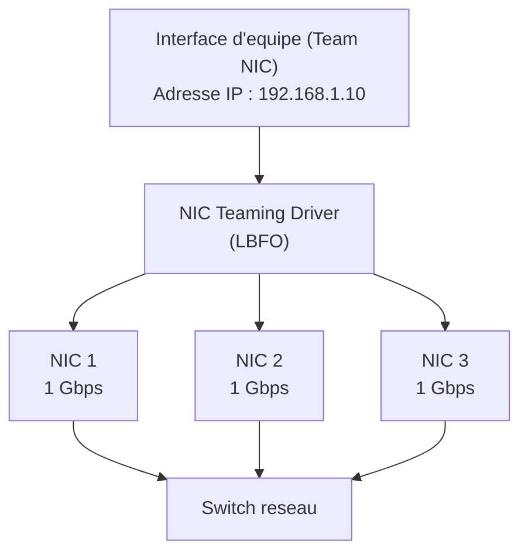
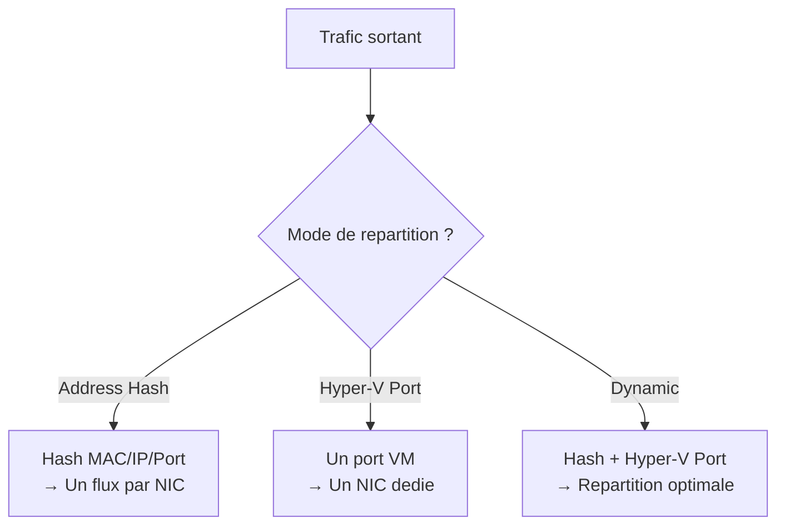

# NIC Teaming

## Introduction

Le **NIC Teaming** (ou association de cartes reseau) permet de regrouper plusieurs interfaces reseau physiques en une seule interface logique. Cette technique offre deux avantages majeurs : la **tolerance de panne** (si une carte tombe en panne, les autres prennent le relais) et l'**agregation de bande passante** (la capacite totale est la somme des cartes membres).

!!! info "NIC Teaming vs Switch Embedded Teaming (SET)"

    Windows Server 2022 propose deux technologies :

    - **NIC Teaming (LBFO)** : solution historique, compatible avec tous les scenarios
    - **Switch Embedded Teaming (SET)** : integre au commutateur virtuel Hyper-V, recommande pour les hotes Hyper-V avec SDN

    Cette page traite du NIC Teaming LBFO. SET est prefere dans les architectures Hyper-V modernes.

!!! warning "Depreciation de LBFO"

    Microsoft a annonce la depreciation progressive de NIC Teaming LBFO dans les futures versions de Windows Server. Pour les nouvelles architectures Hyper-V, il est recommande d'utiliser SET (Switch Embedded Teaming).

---

## Concepts fondamentaux

### Architecture



### Terminologie

| Terme                  | Description                                                 |
|------------------------|-------------------------------------------------------------|
| **Team NIC**           | Interface logique creee par le regroupement                 |
| **Membre d'equipe**    | Interface physique faisant partie du team                   |
| **Mode de team**       | Algorithme de cooperation entre les membres                 |
| **Mode de repartition**| Algorithme de distribution du trafic entre les membres      |
| **Adaptateur en veille** | Membre reserve au basculement uniquement                  |

---

## Modes de teaming

### Switch Independent (independant du commutateur)

Dans ce mode, le commutateur reseau n'a pas connaissance du teaming. Chaque interface physique fonctionne de maniere independante vis-a-vis du switch.

| Propriete            | Detail                                               |
|----------------------|------------------------------------------------------|
| Configuration switch | Aucune configuration necessaire sur le commutateur   |
| Compatibilite        | Tous les commutateurs, y compris de marques differentes |
| Connexion multi-switch | Supporte (membres sur des switches differents)     |
| Cas d'utilisation     | Haute disponibilite multi-switch, environnements heterogenes |

!!! tip "Mode par defaut"

    Switch Independent est le mode recommande pour la plupart des scenarios car il ne necessite aucune configuration cote commutateur et permet la connexion a plusieurs switches pour une meilleure resilience.

### LACP (Link Aggregation Control Protocol - IEEE 802.1ax)

LACP negocie dynamiquement l'agregation de liens entre le serveur et le commutateur. Les deux extremites doivent supporter LACP.

| Propriete            | Detail                                               |
|----------------------|------------------------------------------------------|
| Configuration switch | LACP doit etre configure sur les ports du commutateur |
| Negociation          | Dynamique (detection automatique des membres)         |
| Norme                | IEEE 802.1ax (anciennement 802.3ad)                   |
| Avantage             | Agregation reelle de bande passante                   |
| Limitation           | Tous les membres doivent etre sur le meme switch      |

### Static Teaming (obsolete)

Mode historique ou les liens sont configures statiquement des deux cotes. Remplace par LACP dans la pratique.

| Propriete            | Detail                                               |
|----------------------|------------------------------------------------------|
| Configuration        | Configuration manuelle des deux cotes                 |
| Avantage             | Simple                                               |
| Inconvenient         | Pas de detection dynamique de panne de lien           |
| Recommandation       | Utiliser LACP a la place                             |

---

## Modes de repartition de charge

Le mode de repartition determine comment le trafic sortant est distribue entre les membres de l'equipe :

### Address Hash (hachage d'adresse)

| Propriete         | Detail                                                   |
|-------------------|----------------------------------------------------------|
| Algorithme        | Hash base sur les adresses MAC, IP ou les ports TCP/UDP  |
| Repartition       | Chaque flux est envoye par un seul membre                |
| Avantage          | Bonne repartition sur les flux multiples                 |
| Configuration     | Options : Transport Ports, IP Addresses, MAC Addresses   |

### Hyper-V Port

| Propriete         | Detail                                                   |
|-------------------|----------------------------------------------------------|
| Algorithme        | Repartition basee sur le port du commutateur virtuel     |
| Usage             | Hotes Hyper-V uniquement                                 |
| Avantage          | Chaque VM obtient une bande passante dediee              |

### Dynamic (recommande)

| Propriete         | Detail                                                   |
|-------------------|----------------------------------------------------------|
| Algorithme        | Combine le hash de flux sortant et Hyper-V Port          |
| Avantage          | Meilleure repartition globale, adapte dynamiquement      |
| Recommandation    | Mode par defaut et recommande                            |



---

## Configuration via PowerShell

### Creer une equipe NIC

```powershell
# List available network adapters (candidates for teaming)
Get-NetAdapter | Select-Object Name, InterfaceDescription, Status, LinkSpeed

# Create a new NIC team (Switch Independent + Dynamic load balancing)
New-NetLbfoTeam -Name "Team-Production" `
    -TeamMembers "Ethernet1", "Ethernet2" `
    -TeamingMode SwitchIndependent `
    -LoadBalancingAlgorithm Dynamic `
    -Confirm:$false

# Verify the team creation
Get-NetLbfoTeam
```

### Creer une equipe avec LACP

```powershell
# Create a LACP team (requires switch-side configuration)
New-NetLbfoTeam -Name "Team-LACP" `
    -TeamMembers "Ethernet1", "Ethernet2", "Ethernet3" `
    -TeamingMode LACP `
    -LoadBalancingAlgorithm Dynamic `
    -Confirm:$false
```

### Configurer un adaptateur en veille (standby)

```powershell
# Set one adapter as standby (failover only, not used for active traffic)
Set-NetLbfoTeamMember -Name "Ethernet3" -AdministrativeMode Standby

# Verify member status
Get-NetLbfoTeamMember | Select-Object Name, Team, AdministrativeMode, OperationalStatus
```

### Ajouter/supprimer des membres

```powershell
# Add a new member to an existing team
Add-NetLbfoTeamMember -Name "Ethernet4" -Team "Team-Production"

# Remove a member from a team
Remove-NetLbfoTeamMember -Name "Ethernet4" -Team "Team-Production" -Confirm:$false
```

### Configurer l'adresse IP de l'equipe

```powershell
# Assign a static IP to the team interface
New-NetIPAddress -InterfaceAlias "Team-Production" `
    -IPAddress "192.168.1.10" `
    -PrefixLength 24 `
    -DefaultGateway "192.168.1.1"

# Configure DNS
Set-DnsClientServerAddress -InterfaceAlias "Team-Production" `
    -ServerAddresses "192.168.1.1", "192.168.1.2"
```

---

## Team VLAN (interfaces d'equipe multiples)

Le NIC Teaming permet de creer plusieurs interfaces logiques sur une meme equipe, chacune associee a un VLAN different :

```powershell
# Add a VLAN interface to the team (VLAN 100 for servers)
Add-NetLbfoTeamNic -Team "Team-Production" `
    -VlanID 100 `
    -Name "Team-VLAN100-Servers"

# Add another VLAN interface (VLAN 200 for management)
Add-NetLbfoTeamNic -Team "Team-Production" `
    -VlanID 200 `
    -Name "Team-VLAN200-Mgmt"

# Assign IPs to each VLAN interface
New-NetIPAddress -InterfaceAlias "Team-VLAN100-Servers" `
    -IPAddress "10.0.100.10" -PrefixLength 24

New-NetIPAddress -InterfaceAlias "Team-VLAN200-Mgmt" `
    -IPAddress "10.0.200.10" -PrefixLength 24

# List all team NICs
Get-NetLbfoTeamNic -Team "Team-Production"
```

---

## Surveillance et diagnostics

### Verifier l'etat de l'equipe

```powershell
# Display team status
Get-NetLbfoTeam | Select-Object Name, Status, TeamingMode, LoadBalancingAlgorithm

# Display member status
Get-NetLbfoTeamMember | Select-Object Name, Team, AdministrativeMode, OperationalStatus, ReceiveLinkSpeed

# Display team NIC interfaces
Get-NetLbfoTeamNic | Select-Object Name, Team, VlanID, Primary
```

### Simuler une panne

```powershell
# Disable one member to test failover
Disable-NetAdapter -Name "Ethernet1" -Confirm:$false

# Check team status (should show degraded but functional)
Get-NetLbfoTeam | Select-Object Name, Status
Get-NetLbfoTeamMember | Select-Object Name, OperationalStatus

# Re-enable the adapter
Enable-NetAdapter -Name "Ethernet1"
```

### Evenements de journalisation

```powershell
# Display NIC Teaming events
Get-WinEvent -LogName "Microsoft-Windows-Networking-LbfoProvider/Operational" -MaxEvents 20 |
    Select-Object TimeCreated, LevelDisplayName, Message
```

---

## Supprimer une equipe

```powershell
# Remove a NIC team (releases all members)
Remove-NetLbfoTeam -Name "Team-Production" -Confirm:$false

# Verify the adapters are released
Get-NetAdapter | Select-Object Name, Status
```

---

## Switch Embedded Teaming (SET) - Alternative Hyper-V

Pour les hotes Hyper-V, SET est l'alternative recommandee au NIC Teaming LBFO :

```powershell
# Create a Hyper-V virtual switch with SET (Switch Embedded Teaming)
New-VMSwitch -Name "SET-Production" `
    -NetAdapterName "Ethernet1", "Ethernet2" `
    -EnableEmbeddedTeaming $true `
    -AllowManagementOS $true `
    -MinimumBandwidthMode Weight

# Verify SET configuration
Get-VMSwitch -Name "SET-Production" | Select-Object Name, EmbeddedTeamingEnabled
Get-VMSwitchTeam -Name "SET-Production"
```

| Critere               | NIC Teaming LBFO         | SET (Hyper-V)              |
|-----------------------|--------------------------|----------------------------|
| Hyper-V requis        | Non                      | Oui                        |
| Nombre max de membres | 32                       | 8                          |
| Modes                 | Switch Independent, LACP | Switch Independent, LACP   |
| SDN compatible        | Non                      | Oui                        |
| Statut                | Deprecie                 | Actif, recommande          |

---

## Points cles a retenir

| Concept                  | Detail                                                      |
|--------------------------|-------------------------------------------------------------|
| Objectifs                | Tolerance de panne + agregation de bande passante           |
| Switch Independent       | Pas de config switch, multi-switch possible (recommande)    |
| LACP                     | Negociation dynamique, necessite config cote switch          |
| Repartition Dynamic      | Mode de load balancing recommande                           |
| Adaptateur en veille     | Reserve au basculement uniquement                           |
| VLAN                     | Plusieurs interfaces VLAN sur une meme equipe               |
| SET                      | Alternative recommandee pour les hotes Hyper-V              |

---

## Pour aller plus loin

- Configurer le routage : voir la page [Routage](routage.md)
- Gerer les adresses IP a grande echelle : voir la page [IPAM](ipam.md)
- Configurer les interfaces reseau : voir la page [Configuration des interfaces](../tcpip/configuration-interfaces.md)
