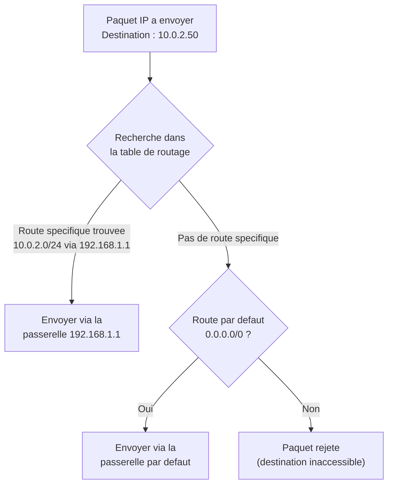
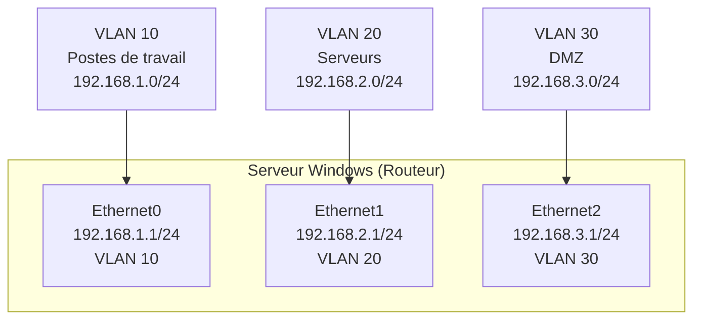
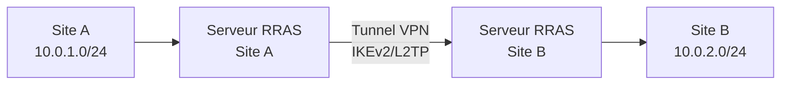

<!--
  Copyright 2026 Julien Bombled

  Licensed under the Apache License, Version 2.0 (the "License");
  you may not use this file except in compliance with the License.
  You may obtain a copy of the License at

      http://www.apache.org/licenses/LICENSE-2.0

  Unless required by applicable law or agreed to in writing, software
  distributed under the License is distributed on an "AS IS" BASIS,
  WITHOUT WARRANTIES OR CONDITIONS OF ANY KIND, either express or implied.
  See the License for the specific language governing permissions and
  limitations under the License.
-->

# Routage sous Windows Server

<span class="level-intermediate">Intermediaire</span> · Temps estime : 25 minutes

---

## Introduction

Windows Server 2022 peut fonctionner comme un **routeur** logiciel, acheminant le trafic IP entre differents sous-reseaux. Que ce soit via de simples routes statiques ou via le service RRAS (Routing and Remote Access Service), Windows Server offre des fonctionnalites de routage adaptees aux environnements lab, PME ou pour des besoins specifiques comme les liens inter-VLAN.

!!! info "Cas d'utilisation"

    - **Environnements lab** : routage entre sous-reseaux de test
    - **Liens inter-VLAN** : routage entre VLAN sans materiel dedie
    - **Passerelles VPN** : combinaison routage + VPN site-a-site
    - **Segments isoles** : routage controle entre DMZ et LAN interne

---

!!! example "Analogie"

    Le routage IP fonctionne exactement comme le **tri postal dans un centre de distribution**. Chaque paquet (lettre) porte une adresse de destination. Le routeur (le centre de tri) consulte sa table de routage (le repertoire des codes postaux) pour determiner vers quel bureau de poste local (interface reseau) envoyer le paquet. Si aucune correspondance n'est trouvee, le paquet est envoye via la route par defaut (le bureau central) qui saura le rediriger.

## Concepts fondamentaux

### Table de routage

Chaque machine Windows possede une **table de routage** qui determine comment les paquets IP sont achemines. Chaque entree de la table contient :

| Champ               | Description                                              |
|---------------------|----------------------------------------------------------|
| **Destination**     | Reseau ou hote de destination (ex : 10.0.2.0/24)        |
| **Masque**          | Masque de sous-reseau de la destination                  |
| **Passerelle**      | Adresse IP du prochain saut (next hop)                   |
| **Interface**       | Interface reseau locale utilisee pour acheminer le paquet |
| **Metrique**        | Cout du chemin (plus la metrique est basse, plus la route est prioritaire) |

### Processus de routage



### Types de routes

| Type                  | Description                                              |
|-----------------------|----------------------------------------------------------|
| **Route directe**     | Reseau directement connecte a une interface du serveur   |
| **Route statique**    | Ajoutee manuellement par l'administrateur                |
| **Route par defaut**  | Route "catch-all" (0.0.0.0/0) vers la passerelle par defaut |

---

## Afficher la table de routage

### Via PowerShell

```powershell
# Display the complete IPv4 routing table
Get-NetRoute -AddressFamily IPv4 | Format-Table -AutoSize

# Display routes in a readable format
Get-NetRoute -AddressFamily IPv4 |
    Select-Object DestinationPrefix, NextHop, RouteMetric, InterfaceAlias |
    Sort-Object DestinationPrefix |
    Format-Table -AutoSize

# Display only the default route
Get-NetRoute -DestinationPrefix "0.0.0.0/0"

# Display routes for a specific interface
Get-NetRoute -InterfaceAlias "Ethernet0" -AddressFamily IPv4
```

Resultat :

```text
DestinationPrefix  NextHop      RouteMetric InterfaceAlias
-----------------  -------      ----------- --------------
0.0.0.0/0          10.0.0.1              10 Ethernet0
10.0.0.0/24        0.0.0.0              256 Ethernet0
10.0.1.0/24        0.0.0.0              256 Ethernet1
10.0.2.0/24        10.0.0.1              20 Ethernet0
127.0.0.0/8        0.0.0.0              256 Loopback Pseudo-Interface 1
```

### Via la commande classique

```powershell
# Traditional route table display
route print

# Display only IPv4 routes
route print -4
```

---

## Gestion des routes statiques

### Ajouter une route statique

```powershell
# Add a persistent static route via PowerShell
New-NetRoute -DestinationPrefix "10.0.2.0/24" `
    -NextHop "192.168.1.1" `
    -InterfaceAlias "Ethernet0" `
    -RouteMetric 10

# Add a route to a specific host (/32)
New-NetRoute -DestinationPrefix "10.0.3.50/32" `
    -NextHop "192.168.1.1" `
    -InterfaceAlias "Ethernet0"
```

### Via la commande route

```powershell
# Add a persistent static route (-p for persistent across reboots)
route -p add 10.0.2.0 mask 255.255.255.0 192.168.1.1

# Add a route with a specific metric
route -p add 10.0.3.0 mask 255.255.255.0 192.168.1.1 metric 20

# Add a route with a specific interface (use interface index from route print)
route -p add 10.0.4.0 mask 255.255.255.0 192.168.1.1 if 12
```

### Modifier une route

```powershell
# Modify an existing route (PowerShell)
Set-NetRoute -DestinationPrefix "10.0.2.0/24" `
    -NextHop "192.168.1.254" `
    -InterfaceAlias "Ethernet0"

# Modify via route command
route change 10.0.2.0 mask 255.255.255.0 192.168.1.254
```

### Supprimer une route

```powershell
# Remove a static route (PowerShell)
Remove-NetRoute -DestinationPrefix "10.0.2.0/24" -Confirm:$false

# Remove via route command
route delete 10.0.2.0
```

---

## Activer le routage IP (IP Forwarding)

Par defaut, Windows Server **ne route pas** le trafic entre ses interfaces. Il faut activer le transfert IP (IP Forwarding) pour que le serveur fonctionne comme un routeur.

### Methode 1 : PowerShell (par interface)

```powershell
# Enable IP forwarding on a specific interface
Set-NetIPInterface -InterfaceAlias "Ethernet0" -Forwarding Enabled
Set-NetIPInterface -InterfaceAlias "Ethernet1" -Forwarding Enabled

# Verify forwarding status
Get-NetIPInterface | Select-Object InterfaceAlias, AddressFamily, Forwarding |
    Where-Object AddressFamily -eq "IPv4" |
    Format-Table -AutoSize
```

Resultat :

```text
InterfaceAlias                 AddressFamily Forwarding
--------------                 ------------- ----------
Ethernet0                               IPv4    Enabled
Ethernet1                               IPv4    Enabled
Loopback Pseudo-Interface 1             IPv4   Disabled
```

### Methode 2 : Registre (global)

```powershell
# Enable IP forwarding globally via registry
Set-ItemProperty -Path "HKLM:\SYSTEM\CurrentControlSet\Services\Tcpip\Parameters" `
    -Name "IPEnableRouter" -Value 1

# A reboot is required for this change to take effect
Restart-Computer -Force
```

### Methode 3 : RRAS (recommande pour le routage avance)

```powershell
# Install the Routing role
Install-WindowsFeature Routing -IncludeManagementTools

# Enable and configure routing via RRAS
Install-RemoteAccess -VpnType RoutingOnly

# Verify RRAS status
Get-RemoteAccess
```

---

## Routage via RRAS

Le service RRAS offre des fonctionnalites de routage avancees au-dela du simple transfert IP.

### Installation et configuration

```powershell
# Install RRAS routing feature
Install-WindowsFeature RemoteAccess, Routing -IncludeManagementTools

# Configure RRAS for routing only
Install-RemoteAccess -VpnType RoutingOnly

# Verify RRAS is running
Get-Service RemoteAccess | Select-Object Name, Status
```

Resultat :

```text
Name          Status
----          ------
RemoteAccess  Running
```

### Console de gestion RRAS

```powershell
# Launch the RRAS management console
rrasmgmt.msc
```

Dans la console RRAS :

1. Clic droit sur le serveur > **Configurer et activer le routage et l'acces distant**
2. Selectionner **Configuration personnalisee**
3. Cocher **Routage LAN**
4. Demarrer le service

### Routes statiques via RRAS

```powershell
# Add a static route via RRAS (netsh)
netsh routing ip add persistentroute dest=10.0.2.0 mask=255.255.255.0 name="Ethernet0" nhop=192.168.1.1

# Display RRAS routing table
netsh routing ip show rtmroutes
```

---

## Exemple pratique : routeur inter-VLAN

### Scenario

Un serveur Windows avec trois interfaces connectees a trois VLAN differents doit router le trafic entre eux.



### Configuration

```powershell
# Step 1: Configure IP addresses on each interface
New-NetIPAddress -InterfaceAlias "Ethernet0" -IPAddress "192.168.1.1" -PrefixLength 24
New-NetIPAddress -InterfaceAlias "Ethernet1" -IPAddress "192.168.2.1" -PrefixLength 24
New-NetIPAddress -InterfaceAlias "Ethernet2" -IPAddress "192.168.3.1" -PrefixLength 24

# Step 2: Enable IP forwarding on all interfaces
Set-NetIPInterface -InterfaceAlias "Ethernet0" -Forwarding Enabled
Set-NetIPInterface -InterfaceAlias "Ethernet1" -Forwarding Enabled
Set-NetIPInterface -InterfaceAlias "Ethernet2" -Forwarding Enabled

# Step 3: Verify forwarding is enabled
Get-NetIPInterface -AddressFamily IPv4 |
    Select-Object InterfaceAlias, Forwarding |
    Format-Table -AutoSize

# Step 4: No static routes needed here, as all subnets are directly connected
# But we can add a default route to an upstream gateway
New-NetRoute -DestinationPrefix "0.0.0.0/0" `
    -NextHop "192.168.1.254" `
    -InterfaceAlias "Ethernet0"
```

### Configurer les postes clients

Sur chaque poste de chaque VLAN, configurer la passerelle par defaut vers l'interface du serveur routeur correspondante :

| VLAN    | Passerelle par defaut |
|---------|----------------------|
| VLAN 10 | 192.168.1.1          |
| VLAN 20 | 192.168.2.1          |
| VLAN 30 | 192.168.3.1          |

---

## Routage VPN site-a-site

RRAS permet egalement le routage entre sites via un tunnel VPN :



```powershell
# Add a demand-dial interface for site-to-site VPN (via RRAS console)
# Then add a static route to the remote site via the VPN interface
New-NetRoute -DestinationPrefix "10.0.2.0/24" `
    -InterfaceAlias "VPN-SiteB" `
    -NextHop "0.0.0.0"
```

---

## Diagnostics de routage

### Verifier la connectivite

```powershell
# Ping a host on a remote subnet
Test-Connection -ComputerName "10.0.2.50" -Count 4

# Traceroute to see the path taken
Test-Connection -ComputerName "10.0.2.50" -Traceroute

# Test a specific port through the route
Test-NetConnection -ComputerName "10.0.2.50" -Port 445
```

Resultat :

```text
Source      Destination  Bytes  Time(ms)
------      -----------  -----  --------
SRV-01      10.0.2.50    32     2
SRV-01      10.0.2.50    32     1
SRV-01      10.0.2.50    32     1
SRV-01      10.0.2.50    32     1

Hop  Hostname       Address
---  --------       -------
  1  SRV-RTR01      10.0.0.1
  2  10.0.2.50      10.0.2.50

ComputerName     : 10.0.2.50
RemotePort       : 445
TcpTestSucceeded : True
```

### Verifier le routage

```powershell
# Display the routing table
Get-NetRoute -AddressFamily IPv4 | Format-Table DestinationPrefix, NextHop, RouteMetric, InterfaceAlias -AutoSize

# Verify IP forwarding is enabled
Get-NetIPInterface -AddressFamily IPv4 | Select-Object InterfaceAlias, Forwarding

# Check if RRAS service is running
Get-Service RemoteAccess

# Display RRAS routing protocols
netsh routing ip show protocol
```

### Capturer le trafic reseau

```powershell
# Start a packet capture (built-in network trace)
netsh trace start capture=yes tracefile=C:\Temp\nettrace.etl

# Reproduce the issue, then stop the capture
netsh trace stop

# The .etl file can be analyzed with Microsoft Network Monitor or Wireshark (after conversion)
```

---

## Comparaison : route PowerShell vs route.exe vs netsh

| Action                 | PowerShell                           | route.exe                           | netsh routing ip                    |
|------------------------|--------------------------------------|--------------------------------------|--------------------------------------|
| Afficher les routes    | `Get-NetRoute`                       | `route print`                        | `netsh routing ip show rtmroutes`    |
| Ajouter une route      | `New-NetRoute`                       | `route -p add`                       | `netsh routing ip add persistentroute` |
| Modifier une route     | `Set-NetRoute`                       | `route change`                       | -                                    |
| Supprimer une route    | `Remove-NetRoute`                    | `route delete`                       | `netsh routing ip delete persistentroute` |
| Persistance            | Par defaut (persistant)              | Avec `-p` uniquement                 | Persistant                           |

!!! tip "Recommandation"

    Utiliser `New-NetRoute` / `Get-NetRoute` de PowerShell pour la gestion courante. Les routes creees via PowerShell sont persistantes par defaut (survivent au redemarrage).

---

## Points cles a retenir

| Concept              | Detail                                                        |
|----------------------|---------------------------------------------------------------|
| IP Forwarding        | Doit etre active pour que le serveur route le trafic          |
| Routes statiques     | `New-NetRoute` (PowerShell) ou `route -p add`                |
| RRAS                 | Service complet pour le routage avance et les VPN site-a-site |
| Table de routage     | Route la plus specifique est toujours prioritaire             |
| Metrique             | Plus la metrique est basse, plus la route est preferee        |
| Diagnostics          | `Test-Connection -Traceroute` pour suivre le chemin des paquets |

---

!!! example "Scenario pratique"

    **Contexte** : Nathalie, administratrice reseau, doit configurer `SRV-RTR01` (10.0.0.1) comme routeur entre le VLAN Serveurs (10.0.0.0/24) et le VLAN DMZ (10.0.2.0/24) dans le domaine `lab.local`. Le serveur dispose de deux interfaces reseau.

    **Solution** :

    ```powershell
    # Step 1: Configure IP on each interface
    New-NetIPAddress -InterfaceAlias "Ethernet0" -IPAddress "10.0.0.1" -PrefixLength 24
    New-NetIPAddress -InterfaceAlias "Ethernet1" -IPAddress "10.0.2.1" -PrefixLength 24

    # Step 2: Enable IP forwarding
    Set-NetIPInterface -InterfaceAlias "Ethernet0" -Forwarding Enabled
    Set-NetIPInterface -InterfaceAlias "Ethernet1" -Forwarding Enabled

    # Step 3: Verify
    Get-NetIPInterface -AddressFamily IPv4 |
        Select-Object InterfaceAlias, Forwarding | Format-Table -AutoSize
    ```

    ```text
    InterfaceAlias Forwarding
    -------------- ----------
    Ethernet0         Enabled
    Ethernet1         Enabled
    ```

    ```powershell
    # Step 4: Test routing from a machine in VLAN Servers vers DMZ
    Test-Connection -ComputerName "10.0.2.50" -Count 2 -Source "10.0.0.15"
    ```

    ```text
    Source    Destination  Bytes  Time(ms)
    ------   -----------  -----  --------
    SRV-01   10.0.2.50    32     1
    SRV-01   10.0.2.50    32     1
    ```

    ```powershell
    # Step 5: Verify route on client machines (default gateway should point to SRV-RTR01)
    Get-NetRoute -DestinationPrefix "0.0.0.0/0"
    ```

    ```text
    DestinationPrefix  NextHop   InterfaceAlias RouteMetric
    -----------------  -------   -------------- -----------
    0.0.0.0/0          10.0.0.1  Ethernet0               10
    ```

    Le routage entre les deux VLAN est operationnel.

!!! danger "Erreurs courantes"

    - **Oublier d'activer IP Forwarding** : par defaut, Windows Server ne route pas le trafic entre ses interfaces. Sans `Set-NetIPInterface -Forwarding Enabled`, les paquets ne traverseront pas le serveur.
    - **Ne pas configurer la passerelle par defaut sur les clients** : les postes de chaque sous-reseau doivent avoir comme passerelle l'adresse IP du serveur routeur sur leur interface locale.
    - **Creer des routes non persistantes** : la commande `route add` (sans `-p`) cree des routes qui disparaissent au redemarrage. Utiliser `route -p add` ou `New-NetRoute` (persistant par defaut).
    - **Confondre metrique et priorite** : une metrique basse signifie une priorite haute. Si deux routes vers la meme destination existent avec des metriques differentes, celle avec la metrique la plus basse sera utilisee.
    - **Ignorer le pare-feu lors du routage** : meme si le routage fonctionne, le pare-feu Windows peut bloquer le trafic en transit. Verifier que les regles de pare-feu autorisent le trafic entre les sous-reseaux.

## Pour aller plus loin

- Configurer un serveur VPN : voir la page [Serveur VPN (RRAS)](../acces-distant/vpn-server.md)
- Configurer le NIC Teaming : voir la page [NIC Teaming](nic-teaming.md)
- Gerer l'espace d'adressage : voir la page [IPAM](ipam.md)
- Configurer les interfaces : voir la page [Configuration des interfaces](../tcpip/configuration-interfaces.md)

