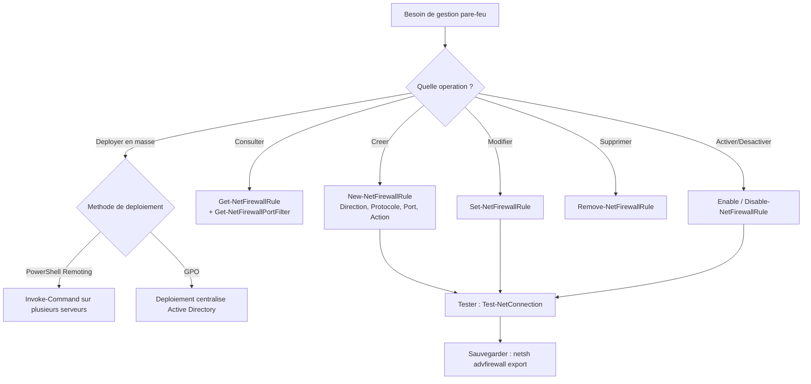

# Gestion du pare-feu via PowerShell

## Introduction

Le module PowerShell **NetSecurity** fournit un ensemble complet de cmdlets pour gerer le Pare-feu Windows avec securite avancee (WFAS). Cette approche est la methode privilegiee pour l'automatisation, la gestion a distance et les deployements reproductibles.

!!! tip "Avantages de PowerShell"

    - Automatisation et scriptabilite
    - Gestion a distance via PowerShell Remoting
    - Reproductibilite (infrastructure as code)
    - Deployement en masse sur plusieurs serveurs

---

## Workflow de gestion des regles de pare-feu



## Cmdlets principales

### Vue d'ensemble du module NetSecurity

```powershell
# List all available firewall cmdlets
Get-Command -Module NetSecurity | Select-Object Name | Sort-Object Name
```

### Cmdlets les plus utilisees

| Cmdlet                          | Description                                    |
|---------------------------------|------------------------------------------------|
| `Get-NetFirewallRule`           | Afficher les regles existantes                 |
| `New-NetFirewallRule`           | Creer une nouvelle regle                       |
| `Set-NetFirewallRule`           | Modifier une regle existante                   |
| `Remove-NetFirewallRule`        | Supprimer une regle                            |
| `Enable-NetFirewallRule`        | Activer une regle desactivee                   |
| `Disable-NetFirewallRule`       | Desactiver une regle sans la supprimer         |
| `Get-NetFirewallProfile`        | Afficher la configuration des profils          |
| `Set-NetFirewallProfile`        | Modifier la configuration d'un profil          |
| `Get-NetFirewallPortFilter`     | Afficher les filtres de port d'une regle       |
| `Get-NetFirewallAddressFilter`  | Afficher les filtres d'adresse d'une regle     |
| `Get-NetFirewallApplicationFilter` | Afficher le filtre de programme d'une regle |

---

## Creer des regles (New-NetFirewallRule)

### Regle entrante par port

```powershell
# Allow inbound HTTPS traffic
New-NetFirewallRule -DisplayName "Allow HTTPS Inbound" `
    -Direction Inbound `
    -Protocol TCP `
    -LocalPort 443 `
    -Action Allow `
    -Profile Domain, Private `
    -Description "Allow HTTPS web traffic on port 443"
```

### Regle entrante par programme

```powershell
# Allow inbound traffic for a specific application
New-NetFirewallRule -DisplayName "Allow MyApp Inbound" `
    -Direction Inbound `
    -Program "C:\Apps\MyApp\myapp.exe" `
    -Action Allow `
    -Profile Domain
```

### Regle avec restriction d'adresse source

```powershell
# Allow RDP only from the admin subnet
New-NetFirewallRule -DisplayName "Allow RDP Admin Subnet" `
    -Direction Inbound `
    -Protocol TCP `
    -LocalPort 3389 `
    -RemoteAddress "10.0.1.0/24" `
    -Action Allow `
    -Profile Domain `
    -Description "RDP access restricted to admin subnet 10.0.1.0/24"
```

### Regle pour un service Windows specifique

```powershell
# Allow SQL Server service on its default port
New-NetFirewallRule -DisplayName "Allow SQL Server" `
    -Direction Inbound `
    -Protocol TCP `
    -LocalPort 1433 `
    -Service "MSSQLSERVER" `
    -Action Allow `
    -Profile Domain
```

### Regle sortante de blocage

```powershell
# Block outbound SMB traffic to the Internet
New-NetFirewallRule -DisplayName "Block SMB Outbound Internet" `
    -Direction Outbound `
    -Protocol TCP `
    -RemotePort 445 `
    -RemoteAddress "0.0.0.0/0" `
    -Action Block `
    -Profile Domain, Private, Public `
    -Description "Prevent SMB traffic from leaving the network"
```

### Regle ICMP (ping)

```powershell
# Allow inbound ICMPv4 Echo Request (ping)
New-NetFirewallRule -DisplayName "Allow ICMPv4 Echo Request" `
    -Direction Inbound `
    -Protocol ICMPv4 `
    -IcmpType 8 `
    -Action Allow `
    -Profile Domain, Private
```

### Regle avec plages de ports

```powershell
# Allow a range of ports for RPC dynamic ports
New-NetFirewallRule -DisplayName "Allow RPC Dynamic Ports" `
    -Direction Inbound `
    -Protocol TCP `
    -LocalPort 49152-65535 `
    -Action Allow `
    -Profile Domain
```

---

## Consulter les regles (Get-NetFirewallRule)

### Lister les regles

```powershell
# List all enabled inbound rules
Get-NetFirewallRule -Direction Inbound -Enabled True |
    Select-Object DisplayName, Action, Profile |
    Sort-Object DisplayName |
    Format-Table -AutoSize

# List all rules (enabled and disabled)
Get-NetFirewallRule | Measure-Object
```

### Rechercher une regle specifique

```powershell
# Find rules by display name (supports wildcards)
Get-NetFirewallRule -DisplayName "*HTTPS*"

# Find rules by group
Get-NetFirewallRule -Group "Remote Desktop"

# Find blocking rules
Get-NetFirewallRule -Action Block -Enabled True |
    Select-Object DisplayName, Direction, Profile
```

### Obtenir les details complets d'une regle

```powershell
# Display full details including port and address filters
$rule = Get-NetFirewallRule -DisplayName "Allow HTTPS Inbound"

# General properties
$rule | Format-List *

# Port filter
$rule | Get-NetFirewallPortFilter

# Address filter
$rule | Get-NetFirewallAddressFilter

# Application filter
$rule | Get-NetFirewallApplicationFilter

# Combined view
Get-NetFirewallRule -DisplayName "Allow HTTPS Inbound" |
    ForEach-Object {
        $portFilter = $_ | Get-NetFirewallPortFilter
        $addrFilter = $_ | Get-NetFirewallAddressFilter
        [PSCustomObject]@{
            Name           = $_.DisplayName
            Direction      = $_.Direction
            Action         = $_.Action
            Protocol       = $portFilter.Protocol
            LocalPort      = $portFilter.LocalPort
            RemoteAddress  = $addrFilter.RemoteAddress
            Profile        = $_.Profile
            Enabled        = $_.Enabled
        }
    }
```

---

## Modifier des regles (Set-NetFirewallRule)

```powershell
# Change the action of an existing rule
Set-NetFirewallRule -DisplayName "Allow HTTPS Inbound" -Action Block

# Change the profile assignment
Set-NetFirewallRule -DisplayName "Allow HTTPS Inbound" -Profile Domain

# Update the description
Set-NetFirewallRule -DisplayName "Allow HTTPS Inbound" `
    -Description "Updated: HTTPS web traffic rule"

# Rename a rule
Get-NetFirewallRule -DisplayName "Allow HTTPS Inbound" |
    Set-NetFirewallRule -NewDisplayName "Allow HTTPS (Web Server)"
```

---

## Activer, desactiver et supprimer des regles

```powershell
# Disable a rule (keep it for later re-use)
Disable-NetFirewallRule -DisplayName "Allow HTTPS Inbound"

# Enable a previously disabled rule
Enable-NetFirewallRule -DisplayName "Allow HTTPS Inbound"

# Remove a rule permanently
Remove-NetFirewallRule -DisplayName "Allow HTTPS Inbound"

# Remove all rules matching a pattern
Remove-NetFirewallRule -DisplayName "Allow MyApp*" -Confirm:$false
```

!!! tip "Desactiver plutot que supprimer"

    Il est generalement preferable de **desactiver** une regle plutot que de la supprimer. Cela facilite le retour arriere en cas de probleme.

---

## Gestion des profils

```powershell
# Display all profile settings
Get-NetFirewallProfile | Format-Table Name, Enabled, DefaultInboundAction, DefaultOutboundAction -AutoSize

# Enable the firewall on all profiles
Set-NetFirewallProfile -All -Enabled True

# Configure the Domain profile
Set-NetFirewallProfile -Profile Domain `
    -DefaultInboundAction Block `
    -DefaultOutboundAction Allow `
    -LogBlocked True `
    -LogFileName "%SystemRoot%\System32\LogFiles\Firewall\domain-fw.log" `
    -LogMaxSizeKilobytes 4096

# Configure the Public profile (most restrictive)
Set-NetFirewallProfile -Profile Public `
    -DefaultInboundAction Block `
    -DefaultOutboundAction Block `
    -NotifyOnListen False `
    -AllowLocalFirewallRules False
```

---

## Export et import de regles

### Exporter la configuration complete

```powershell
# Export all firewall rules and settings using netsh
netsh advfirewall export "C:\Backup\firewall-config.wfw"

# Export rules to CSV for documentation
Get-NetFirewallRule -Enabled True | ForEach-Object {
    $portFilter = $_ | Get-NetFirewallPortFilter
    $addrFilter = $_ | Get-NetFirewallAddressFilter
    [PSCustomObject]@{
        DisplayName   = $_.DisplayName
        Direction     = $_.Direction
        Action        = $_.Action
        Protocol      = $portFilter.Protocol
        LocalPort     = $portFilter.LocalPort
        RemotePort    = $portFilter.RemotePort
        RemoteAddress = $addrFilter.RemoteAddress
        Profile       = $_.Profile
        Enabled       = $_.Enabled
    }
} | Export-Csv -Path "C:\Backup\firewall-rules.csv" -NoTypeInformation
```

### Importer la configuration

```powershell
# Import firewall rules from a backup file
netsh advfirewall import "C:\Backup\firewall-config.wfw"
```

### Copier des regles vers un serveur distant

```powershell
# Create the same rule on multiple remote servers
$servers = @("SRV-WEB01", "SRV-WEB02", "SRV-WEB03")

Invoke-Command -ComputerName $servers -ScriptBlock {
    New-NetFirewallRule -DisplayName "Allow HTTPS Inbound" `
        -Direction Inbound `
        -Protocol TCP `
        -LocalPort 443 `
        -Action Allow `
        -Profile Domain, Private
}
```

---

## Deploiement via GPO

Les regles de pare-feu peuvent etre deploiees de maniere centralisee via les strategies de groupe (GPO) dans un environnement Active Directory.

### Configuration GPO

1. Ouvrir **gpedit.msc** ou la **console de gestion des strategies de groupe** (gpmc.msc)
2. Naviguer vers **Configuration ordinateur > Strategies > Parametres Windows > Parametres de securite > Pare-feu Windows avec fonctionnalites avancees**
3. Configurer les profils et creer des regles

### Gestion des regles locales vs GPO

```powershell
# Check if local rules are merged with GPO rules
Get-NetFirewallProfile | Select-Object Name, AllowLocalFirewallRules

# Disable local rules (GPO rules only)
Set-NetFirewallProfile -Profile Domain -AllowLocalFirewallRules False

# Allow local rules to be merged with GPO rules
Set-NetFirewallProfile -Profile Domain -AllowLocalFirewallRules True
```

!!! warning "Priorite GPO"

    Lorsqu'une GPO definit `AllowLocalFirewallRules = False`, toutes les regles creees localement sur le serveur sont ignorees. Seules les regles de la GPO s'appliquent.

---

## Script complet : securisation d'un serveur web

```powershell
# --- Web Server Firewall Hardening Script ---

# Step 1: Reset to default state
netsh advfirewall reset

# Step 2: Configure profiles
Set-NetFirewallProfile -Profile Domain `
    -Enabled True `
    -DefaultInboundAction Block `
    -DefaultOutboundAction Allow `
    -LogBlocked True `
    -LogFileName "%SystemRoot%\System32\LogFiles\Firewall\domain-fw.log"

Set-NetFirewallProfile -Profile Public, Private `
    -Enabled True `
    -DefaultInboundAction Block `
    -DefaultOutboundAction Allow `
    -LogBlocked True

# Step 3: Allow essential inbound services
# HTTP
New-NetFirewallRule -DisplayName "Allow HTTP Inbound" `
    -Direction Inbound -Protocol TCP -LocalPort 80 `
    -Action Allow -Profile Domain, Private

# HTTPS
New-NetFirewallRule -DisplayName "Allow HTTPS Inbound" `
    -Direction Inbound -Protocol TCP -LocalPort 443 `
    -Action Allow -Profile Domain, Private

# RDP from admin subnet only
New-NetFirewallRule -DisplayName "Allow RDP Admin Only" `
    -Direction Inbound -Protocol TCP -LocalPort 3389 `
    -RemoteAddress "10.0.1.0/24" `
    -Action Allow -Profile Domain

# WinRM from admin subnet only
New-NetFirewallRule -DisplayName "Allow WinRM Admin Only" `
    -Direction Inbound -Protocol TCP -LocalPort 5985, 5986 `
    -RemoteAddress "10.0.1.0/24" `
    -Action Allow -Profile Domain

# ICMP (ping) from internal networks
New-NetFirewallRule -DisplayName "Allow ICMP Echo" `
    -Direction Inbound -Protocol ICMPv4 -IcmpType 8 `
    -Action Allow -Profile Domain, Private

# Step 4: Verify applied rules
Get-NetFirewallRule -Enabled True -Direction Inbound |
    Select-Object DisplayName, Action, Profile |
    Sort-Object DisplayName |
    Format-Table -AutoSize
```

---

## Commandes de diagnostic

```powershell
# Show firewall state summary
netsh advfirewall show allprofiles state

# Show currently active rules count per direction
$inbound = (Get-NetFirewallRule -Direction Inbound -Enabled True).Count
$outbound = (Get-NetFirewallRule -Direction Outbound -Enabled True).Count
Write-Output "Active inbound rules: $inbound"
Write-Output "Active outbound rules: $outbound"

# Find rules that may be blocking a specific port
Get-NetFirewallRule -Enabled True | Where-Object {
    ($_ | Get-NetFirewallPortFilter).LocalPort -contains "443"
} | Select-Object DisplayName, Direction, Action

# Test connectivity after rule changes
Test-NetConnection -ComputerName "192.168.1.10" -Port 443
```

---

## Points cles a retenir

| Concept              | Detail                                                        |
|----------------------|---------------------------------------------------------------|
| Module               | `NetSecurity` : ensemble complet de cmdlets pare-feu          |
| Creation             | `New-NetFirewallRule` avec direction, protocole, port, action |
| Consultation         | `Get-NetFirewallRule` + filtres (port, adresse, application)  |
| Export/Import        | `netsh advfirewall export/import` pour sauvegarder            |
| Gestion a distance   | `Invoke-Command` pour deployer sur plusieurs serveurs         |
| GPO                  | Deploiement centralise avec priorite sur les regles locales   |

---

## Pour aller plus loin

- Comprendre les concepts du WFAS : voir la page [Concepts WFAS](wfas-concepts.md)
- Types de regles et bonnes pratiques : voir la page [Regles entrantes et sortantes](regles-entrantes-sortantes.md)
- Configuration des profils : voir la page [Profils reseau](profils-reseau.md)
