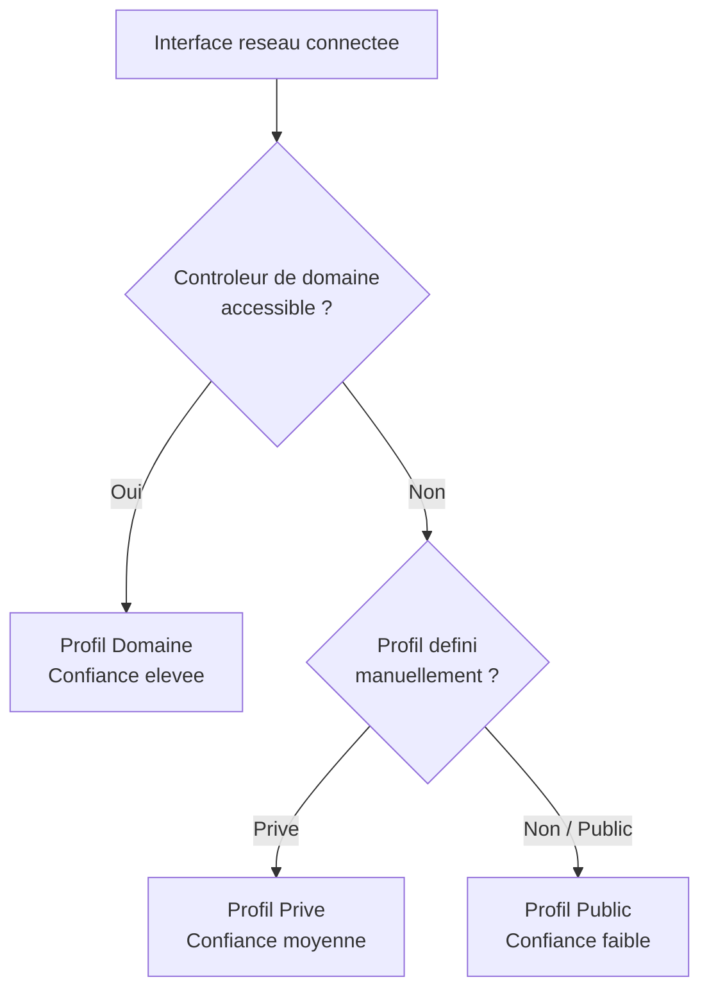

# Profils reseau du pare-feu

## Introduction

Le Pare-feu Windows avec securite avancee (WFAS) utilise des **profils reseau** pour adapter automatiquement son comportement selon le type de reseau auquel le serveur est connecte. Chaque interface reseau se voit attribuer un profil, et les regles de pare-feu peuvent etre configurees pour s'appliquer a un ou plusieurs profils.

!!! info "Trois profils distincts"

    Windows Server 2022 distingue trois profils reseau : **Domaine**, **Prive** et **Public**. Chaque profil possede sa propre configuration de pare-feu (regles actives, comportement par defaut, journalisation).

---

## Les trois profils

### Profil Domaine

Le profil **Domaine** est active lorsque le serveur est connecte a un reseau ou il peut authentifier un controleur de domaine Active Directory.

| Propriete                | Valeur typique                              |
|--------------------------|---------------------------------------------|
| Conditions d'activation  | Detection d'un controleur de domaine AD DS  |
| Niveau de confiance      | Eleve (reseau d'entreprise)                 |
| Usage typique            | Serveurs joints au domaine en LAN           |
| Regles par defaut        | Plus permissif (services AD, replication)   |

### Profil Prive

Le profil **Prive** est attribue manuellement par un administrateur a un reseau de confiance qui n'est pas un domaine AD.

| Propriete                | Valeur typique                              |
|--------------------------|---------------------------------------------|
| Conditions d'activation  | Attribution manuelle par l'administrateur    |
| Niveau de confiance      | Moyen (reseau de confiance sans AD)         |
| Usage typique            | Reseau lab, reseau domestique               |
| Regles par defaut        | Intermediaire                               |

### Profil Public

Le profil **Public** est le profil par defaut pour tout reseau non identifie. C'est le profil le plus restrictif.

| Propriete                | Valeur typique                              |
|--------------------------|---------------------------------------------|
| Conditions d'activation  | Tout reseau non identifie (par defaut)      |
| Niveau de confiance      | Faible (reseau non fiable)                  |
| Usage typique            | Connexion directe a Internet, Wi-Fi public  |
| Regles par defaut        | Tres restrictif                             |



---

## Detection automatique du profil

### Mecanisme NLA (Network Location Awareness)

Le service **NLA** (Network Location Awareness) determine automatiquement le profil a appliquer a chaque interface reseau en suivant cette logique :

1. **Verification du domaine** : le service NLA tente de contacter un controleur de domaine via LDAP. Si la reponse est positive, le profil **Domaine** est attribue.
2. **Verification de la categorie** : si aucun controleur de domaine n'est accessible, Windows consulte la categorie reseau enregistree (Prive ou Public).
3. **Attribution par defaut** : si aucune categorie n'est definie, le profil **Public** est applique.

```powershell
# Display the current network profile for each interface
Get-NetConnectionProfile | Select-Object InterfaceAlias, NetworkCategory, IPv4Connectivity

# Check the NLA service status
Get-Service NlaSvc | Select-Object Name, Status, StartType
```

!!! warning "Problemes courants de detection"

    Si un serveur joint au domaine ne detecte pas le profil Domaine, verifiez :

    - La connectivite reseau vers un controleur de domaine
    - Le service NLA (NlaSvc) est bien demarre
    - La resolution DNS du nom de domaine fonctionne
    - Le pare-feu ne bloque pas les ports AD (LDAP 389, Kerberos 88)

---

## Modifier le profil d'une interface

### Changer la categorie reseau

```powershell
# Set the network profile to Private for a specific interface
Set-NetConnectionProfile -InterfaceAlias "Ethernet0" -NetworkCategory Private

# Set the network profile to Public
Set-NetConnectionProfile -InterfaceAlias "Ethernet0" -NetworkCategory Public
```

!!! info "Limitation"

    Le profil **Domaine** ne peut pas etre attribue manuellement. Il est automatiquement detecte par le service NLA lorsqu'un controleur de domaine est accessible. Si le profil Domaine n'est pas detecte alors qu'il devrait l'etre, c'est un probleme de connectivite ou de DNS a investiguer.

### Forcer la detection via le registre

En cas de probleme persistant, on peut influencer la detection du profil via le registre :

```powershell
# List registered network profiles in the registry
Get-ChildItem "HKLM:\SOFTWARE\Microsoft\Windows NT\CurrentVersion\NetworkList\Profiles"

# Display details of each profile
Get-ChildItem "HKLM:\SOFTWARE\Microsoft\Windows NT\CurrentVersion\NetworkList\Profiles" |
    ForEach-Object {
        $props = Get-ItemProperty $_.PSPath
        [PSCustomObject]@{
            ProfileName = $props.ProfileName
            Category    = switch ($props.Category) { 0 {"Public"} 1 {"Private"} 2 {"Domain"} }
        }
    }
```

---

## Configuration par profil

Chaque profil possede sa propre configuration independante :

### Parametres configurables par profil

| Parametre                   | Description                                              |
|-----------------------------|----------------------------------------------------------|
| Etat du pare-feu            | Active ou desactive le pare-feu pour ce profil           |
| Action par defaut entrante  | Autoriser ou Bloquer                                     |
| Action par defaut sortante  | Autoriser ou Bloquer                                     |
| Notifications de blocage    | Afficher ou masquer les notifications                    |
| Journalisation              | Activer le log des connexions autorisees/bloquees        |
| Regles locales              | Autoriser ou ignorer les regles de pare-feu locales      |

### Afficher la configuration de tous les profils

```powershell
# Display complete profile configuration
Get-NetFirewallProfile | Format-Table Name, Enabled, DefaultInboundAction, DefaultOutboundAction, LogAllowed, LogBlocked -AutoSize

# Display detailed configuration for a specific profile
Get-NetFirewallProfile -Profile Domain | Format-List *
```

### Configurer un profil specifique

```powershell
# Configure the Public profile to be more restrictive
Set-NetFirewallProfile -Profile Public `
    -Enabled True `
    -DefaultInboundAction Block `
    -DefaultOutboundAction Block `
    -LogBlocked True `
    -LogAllowed False `
    -LogFileName "%SystemRoot%\System32\LogFiles\Firewall\public-fw.log" `
    -LogMaxSizeKilobytes 4096

# Configure the Domain profile
Set-NetFirewallProfile -Profile Domain `
    -Enabled True `
    -DefaultInboundAction Block `
    -DefaultOutboundAction Allow `
    -NotifyOnListen True
```

### Desactiver le pare-feu pour un profil (non recommande)

```powershell
# Disable the firewall for the Private profile only
Set-NetFirewallProfile -Profile Private -Enabled False

# Re-enable it
Set-NetFirewallProfile -Profile Private -Enabled True
```

!!! danger "Ne pas desactiver le pare-feu"

    Desactiver completement le pare-feu, meme temporairement, expose le serveur a des risques. Preferez creer des regles d'autorisation specifiques pour les flux necessaires.

---

## Appliquer des regles a des profils specifiques

Les regles de pare-feu peuvent cibler un ou plusieurs profils :

```powershell
# Create a rule that applies only to the Domain profile
New-NetFirewallRule -DisplayName "Allow SQL Inbound (Domain Only)" `
    -Direction Inbound `
    -Protocol TCP `
    -LocalPort 1433 `
    -Action Allow `
    -Profile Domain

# Create a rule for Domain and Private profiles
New-NetFirewallRule -DisplayName "Allow SMB Inbound (Trusted)" `
    -Direction Inbound `
    -Protocol TCP `
    -LocalPort 445 `
    -Action Allow `
    -Profile Domain, Private

# Block RDP on the Public profile
New-NetFirewallRule -DisplayName "Block RDP Public" `
    -Direction Inbound `
    -Protocol TCP `
    -LocalPort 3389 `
    -Action Block `
    -Profile Public
```

### Lister les regles par profil

```powershell
# List all enabled rules for the Domain profile
Get-NetFirewallRule -Enabled True | Where-Object {
    $_.Profile -match "Domain"
} | Select-Object DisplayName, Direction, Action | Sort-Object DisplayName
```

---

## Profils et interfaces multiples

Un serveur peut avoir plusieurs interfaces reseau, chacune avec un profil different. Le WFAS applique les regles en fonction du profil de chaque interface.

| Interface    | Reseau              | Profil detecte |
|-------------|---------------------|----------------|
| Ethernet0   | LAN entreprise (AD) | Domaine        |
| Ethernet1   | DMZ                 | Public         |
| Ethernet2   | Reseau de gestion   | Prive          |

```powershell
# Display profile assignment per interface
Get-NetConnectionProfile | Select-Object InterfaceAlias, Name, NetworkCategory |
    Format-Table -AutoSize
```

!!! tip "Strategie multi-interfaces"

    Pour un serveur multi-reseau (ex : serveur en DMZ avec une patte interne et une patte externe), configurez des regles differentes par profil. Le trafic entrant depuis la DMZ (profil Public) sera soumis a des regles plus restrictives que le trafic provenant du LAN interne (profil Domaine).

---

## Depannage des profils

### Le profil Domaine n'est pas detecte

```powershell
# Step 1: Check NLA service
Get-Service NlaSvc

# Step 2: Verify DNS resolution of the domain
Resolve-DnsName "contoso.local"

# Step 3: Test connectivity to a domain controller
Test-Connection -ComputerName "DC01" -Count 2

# Step 4: Verify LDAP connectivity
Test-NetConnection -ComputerName "DC01" -Port 389

# Step 5: Restart the NLA service (may trigger re-detection)
Restart-Service NlaSvc

# Step 6: Check the detected profile after restart
Get-NetConnectionProfile
```

### Forcer la re-evaluation du profil

```powershell
# Restart the NLA service to trigger network profile re-evaluation
Restart-Service NlaSvc -Force

# Alternatively, disable/enable the network adapter
Disable-NetAdapter -Name "Ethernet0" -Confirm:$false
Start-Sleep -Seconds 5
Enable-NetAdapter -Name "Ethernet0"
```

---

## Points cles a retenir

| Concept                  | Detail                                                      |
|--------------------------|-------------------------------------------------------------|
| Trois profils            | Domaine (AD), Prive (confiance), Public (restrictif)        |
| Detection automatique    | Le service NLA determine le profil selon la connectivite AD  |
| Profil par defaut        | Public (le plus restrictif)                                 |
| Configuration independante | Chaque profil a ses propres regles et parametres           |
| Multi-interfaces         | Chaque interface peut avoir un profil different             |
| Profil Domaine           | Attribue automatiquement, ne peut pas etre force manuellement|

---

## Pour aller plus loin

- Comprendre les concepts du WFAS : voir la page [Concepts WFAS](wfas-concepts.md)
- Creer des regles de pare-feu : voir la page [Regles entrantes et sortantes](regles-entrantes-sortantes.md)
- Automatiser via PowerShell : voir la page [Gestion PowerShell](gestion-powershell.md)
