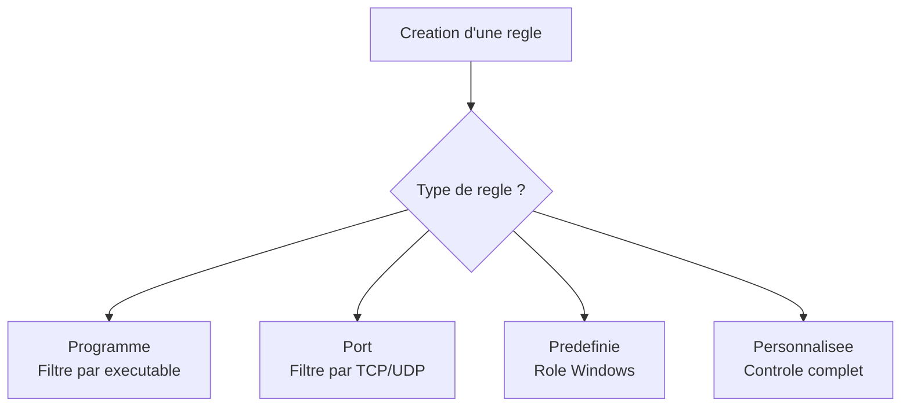

# Regles entrantes et sortantes

## Introduction

Les regles du Pare-feu Windows avec securite avancee (WFAS) definissent quels flux reseau sont autorises ou bloques. Chaque regle s'applique au trafic **entrant** (vers le serveur) ou **sortant** (depuis le serveur) et peut filtrer selon de multiples criteres : programme, port, protocole, adresse IP, interface reseau ou service Windows.

!!! info "Rappel"

    Par defaut, le trafic entrant est **bloque** et le trafic sortant est **autorise**. On cree donc principalement des regles entrantes pour ouvrir les ports necessaires aux services heberges.

---

## Types de regles

Le WFAS propose quatre types de regles lors de la creation via l'assistant :

### 1. Regle de programme

Autorise ou bloque le trafic pour un **executable specifique**, quel que soit le port utilise.

```
Exemple : Autoriser tout le trafic pour C:\Program Files\MonApp\app.exe
```

!!! tip "Quand utiliser"

    Ideal pour les applications qui utilisent des ports dynamiques ou dont les ports ne sont pas connus a l'avance.

### 2. Regle de port

Autorise ou bloque le trafic sur un **port TCP ou UDP specifique**.

```
Exemple : Autoriser le trafic TCP entrant sur le port 443 (HTTPS)
```

### 3. Regle predefinie

Utilise un ensemble de regles preconfigures pour les **roles et fonctionnalites Windows** (Bureau a distance, Partage de fichiers, etc.).

```
Exemple : Activer le groupe "Bureau a distance" (ports TCP 3389)
```

### 4. Regle personnalisee

Offre un controle complet sur tous les parametres de filtrage : programme, port, protocole, adresses source/destination, interfaces.

```
Exemple : Autoriser TCP 1433 uniquement depuis le sous-reseau 10.0.1.0/24
           vers le service MSSQLSERVER
```



---

## Proprietes d'une regle

Chaque regle possede plusieurs proprietes configurables :

### Onglet General

| Propriete     | Description                                       |
|---------------|---------------------------------------------------|
| Nom           | Nom descriptif de la regle                        |
| Description   | Documentation optionnelle                         |
| Active        | Active ou desactive la regle                      |
| Action        | Autoriser, Bloquer, ou Autoriser si securise (IPsec) |

### Onglet Programmes et services

| Propriete     | Description                                       |
|---------------|---------------------------------------------------|
| Programme     | Chemin vers l'executable ou "Tous les programmes" |
| Service       | Restreindre a un service Windows specifique       |

### Onglet Protocoles et ports

| Propriete       | Description                                     |
|-----------------|-------------------------------------------------|
| Type de protocole | TCP, UDP, ICMPv4, ICMPv6, ou tout              |
| Port local      | Port(s) sur le serveur                          |
| Port distant    | Port(s) sur le client distant                   |

### Onglet Etendue (scope)

| Propriete            | Description                                  |
|----------------------|----------------------------------------------|
| Adresses IP locales  | Interfaces locales concernees                |
| Adresses IP distantes| Sous-reseaux ou hotes sources/destinations   |

### Onglet Avance

| Propriete     | Description                                       |
|---------------|---------------------------------------------------|
| Profils       | Domaine, Prive, Public (selection multiple)       |
| Types d'interface | Tout, LAN, Sans fil, Acces distant             |
| Traversee de peripherique de perimetre | Autoriser ou bloquer |

---

## Creer des regles via la console graphique

### Regle entrante pour un service web (HTTPS)

1. Ouvrir **wf.msc**
2. Cliquer sur **Regles de trafic entrant** > **Nouvelle regle...**
3. Selectionner **Port** > Suivant
4. Choisir **TCP**, saisir **443** > Suivant
5. Selectionner **Autoriser la connexion** > Suivant
6. Cocher les profils souhaites (Domaine, Prive) > Suivant
7. Nommer la regle (ex : "Allow HTTPS Inbound") > Terminer

### Regle entrante pour Bureau a distance

1. Ouvrir **wf.msc**
2. **Regles de trafic entrant** > **Nouvelle regle...**
3. Selectionner **Predefinie** > **Bureau a distance** > Suivant
4. Selectionner les regles du groupe > Suivant
5. Choisir **Autoriser la connexion** > Terminer

### Regle personnalisee avec restriction d'adresse source

1. Ouvrir **wf.msc**
2. **Regles de trafic entrant** > **Nouvelle regle...**
3. Selectionner **Personnalisee** > Suivant
4. **Programmes** : Tous les programmes > Suivant
5. **Protocole** : TCP, Port local : 3389 > Suivant
6. **Etendue** : Adresses distantes > "Ces adresses IP" > Ajouter 10.0.1.0/24 > Suivant
7. **Action** : Autoriser la connexion > Suivant
8. **Profils** : Domaine uniquement > Suivant
9. **Nom** : "RDP - Admin Subnet Only" > Terminer

---

## Regles de trafic sortant

Bien que le trafic sortant soit autorise par defaut, il est parfois necessaire de le restreindre pour des serveurs sensibles.

### Scenarios d'utilisation

| Scenario                         | Justification                                    |
|----------------------------------|--------------------------------------------------|
| Serveur en DMZ                   | Limiter les connexions sortantes au strict necessaire |
| Serveur de base de donnees      | Empecher les connexions sortantes vers Internet  |
| Conformite reglementaire         | Tracer et controler tous les flux                |
| Protection contre l'exfiltration | Bloquer les canaux de fuite de donnees           |

### Modifier le comportement par defaut sortant

!!! danger "Impact important"

    Passer le trafic sortant en mode "Bloquer" sur un serveur de production peut interrompre de nombreux services (mises a jour, DNS, authentification Kerberos, replication AD...). Testez toujours en environnement lab avant.

```powershell
# Change default outbound action to Block for Domain profile
Set-NetFirewallProfile -Profile Domain -DefaultOutboundAction Block

# Verify the change
Get-NetFirewallProfile -Profile Domain | Select-Object Name, DefaultOutboundAction
```

Apres avoir active le blocage sortant par defaut, il faut creer des regles sortantes pour chaque flux necessaire :

```powershell
# Allow DNS resolution (TCP/UDP 53)
New-NetFirewallRule -DisplayName "Allow DNS Outbound" `
    -Direction Outbound -Protocol UDP -RemotePort 53 -Action Allow

New-NetFirewallRule -DisplayName "Allow DNS Outbound TCP" `
    -Direction Outbound -Protocol TCP -RemotePort 53 -Action Allow

# Allow HTTPS outbound (for Windows Update, etc.)
New-NetFirewallRule -DisplayName "Allow HTTPS Outbound" `
    -Direction Outbound -Protocol TCP -RemotePort 443 -Action Allow
```

---

## Gestion des regles predefinies

Windows Server inclut des groupes de regles predefinies pour les roles et fonctionnalites courants.

### Lister les groupes disponibles

```powershell
# List all predefined rule groups
Get-NetFirewallRule | Select-Object -Unique Group | Where-Object { $_.Group -ne "" } | Sort-Object Group
```

### Groupes les plus courants

| Groupe predefini                         | Service / Role                        |
|------------------------------------------|---------------------------------------|
| File and Printer Sharing                 | Partage de fichiers et d'imprimantes  |
| Remote Desktop                           | Bureau a distance (RDP)               |
| Windows Remote Management               | WinRM / PowerShell Remoting           |
| Core Networking                          | Protocoles reseau de base (ICMP, etc.)|
| Active Directory Domain Services         | Services AD DS                        |
| DNS Service                              | Serveur DNS                           |
| DHCP Server                              | Serveur DHCP                          |
| Hyper-V                                  | Virtualisation                        |

### Activer un groupe de regles

```powershell
# Enable all rules in the "Remote Desktop" group
Enable-NetFirewallRule -Group "Remote Desktop"

# Enable WinRM rules
Enable-NetFirewallRule -Group "Windows Remote Management"
```

---

## Bonnes pratiques

!!! tip "Recommandations de securite"

    - **Principe du moindre privilege** : n'ouvrir que les ports strictement necessaires
    - **Restreindre les sources** : utiliser les filtres d'adresse IP source quand c'est possible
    - **Nommer clairement** : utiliser des noms descriptifs incluant le service et le contexte
    - **Documenter** : remplir le champ description de chaque regle
    - **Desactiver plutot que supprimer** : desactiver les regles inutiles pour pouvoir les reactiver facilement
    - **Tester** : verifier chaque regle avec `Test-NetConnection` apres creation

### Convention de nommage suggeree

```
[Action]-[Direction]-[Service]-[Detail]
```

Exemples :

- `Allow-In-HTTPS-WebServer`
- `Allow-In-RDP-AdminSubnet`
- `Block-Out-SMB-Internet`
- `Allow-In-SQL-AppServer`

---

## Verification et test

```powershell
# Verify that a port is reachable after creating a rule
Test-NetConnection -ComputerName "192.168.1.10" -Port 443

# List all enabled inbound rules
Get-NetFirewallRule -Direction Inbound -Enabled True |
    Select-Object DisplayName, Action, Profile |
    Sort-Object DisplayName

# Display details of a specific rule
Get-NetFirewallRule -DisplayName "Allow HTTPS Inbound" | Format-List *

# Display port filter associated with a rule
Get-NetFirewallRule -DisplayName "Allow HTTPS Inbound" | Get-NetFirewallPortFilter
```

---

## Points cles a retenir

| Concept              | Detail                                                        |
|----------------------|---------------------------------------------------------------|
| 4 types de regles    | Programme, Port, Predefinie, Personnalisee                    |
| Entrant par defaut   | Bloque (creer des regles d'autorisation)                      |
| Sortant par defaut   | Autorise (creer des regles de blocage si necessaire)          |
| Priorite             | Blocage > Autorisation > Defaut du profil                    |
| Predefinies          | Groupes de regles pour les roles Windows Server               |
| Bonnes pratiques     | Moindre privilege, restriction par source, nommage clair      |

---

## Pour aller plus loin

- Comprendre les concepts du WFAS : voir la page [Concepts WFAS](wfas-concepts.md)
- Configurer les profils reseau : voir la page [Profils reseau](profils-reseau.md)
- Automatiser avec PowerShell : voir la page [Gestion PowerShell](gestion-powershell.md)
