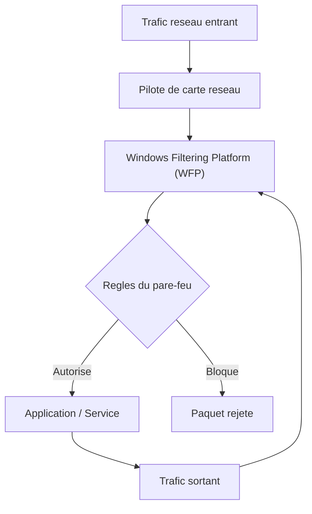
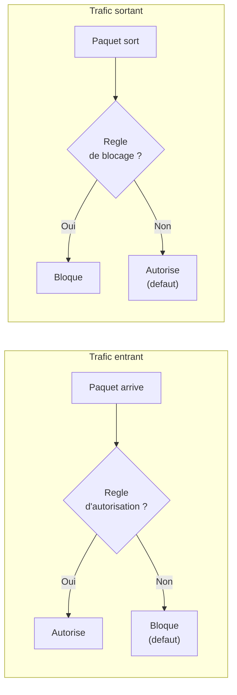
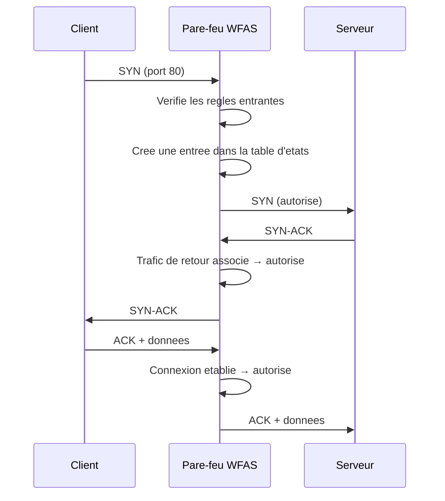

# Pare-feu Windows avec securite avancee (WFAS)

## Introduction

Le **Pare-feu Windows avec securite avancee** (Windows Firewall with Advanced Security, WFAS) est le pare-feu logiciel integre a Windows Server 2022. Il filtre le trafic reseau entrant et sortant en fonction de regles configurables, et offre des fonctionnalites avancees comme l'inspection avec etat, le filtrage par application et les regles de securite de connexion (IPsec).

!!! info "Role dans la defense en profondeur"

    Le WFAS constitue une couche essentielle de la strategie de defense en profondeur. Meme derriere un pare-feu materiel perimetrique, le pare-feu Windows protege chaque serveur individuellement contre les mouvements lateraux d'un attaquant qui aurait deja penetre le reseau.

---

!!! example "Analogie"

    Imaginez le pare-feu comme le **portier d'un immeuble de bureaux**. Par defaut, il bloque toute personne qui tente d'entrer (trafic entrant) sauf celles figurant sur la liste des visiteurs autorises (regles d'autorisation). En revanche, les employes sont libres de sortir a tout moment (trafic sortant autorise). Le portier tient un registre des allers-retours (table d'etats) pour laisser rentrer automatiquement quelqu'un qui etait sorti il y a quelques minutes.

## Architecture du WFAS

Le WFAS fonctionne au niveau de la couche reseau du systeme d'exploitation et filtre le trafic avant qu'il n'atteigne les applications.



### Composants principaux

| Composant                        | Description                                                  |
|----------------------------------|--------------------------------------------------------------|
| **Windows Filtering Platform (WFP)** | Moteur de filtrage sous-jacent au WFAS                   |
| **Regles de trafic entrant**     | Filtrent les connexions entrantes vers le serveur            |
| **Regles de trafic sortant**     | Filtrent les connexions sortantes du serveur                 |
| **Regles de securite de connexion** | Configurent l'authentification et le chiffrement IPsec    |
| **Profils de pare-feu**          | Domaine, Prive, Public (configuration distincte par profil)  |
| **Surveillance**                 | Journalisation et suivi des regles actives                   |

---

## Comportement par defaut

Le WFAS applique un comportement par defaut different pour le trafic entrant et sortant :

| Direction       | Comportement par defaut        | Explication                                |
|-----------------|--------------------------------|--------------------------------------------|
| **Entrant**     | Bloquer (Block)                | Tout trafic entrant est bloque sauf s'il correspond a une regle d'autorisation |
| **Sortant**     | Autoriser (Allow)              | Tout trafic sortant est autorise sauf s'il correspond a une regle de blocage   |



!!! warning "Regles de blocage prioritaires"

    Les regles de blocage explicites ont **toujours priorite** sur les regles d'autorisation, sauf si la regle d'autorisation a l'option "Remplacer les regles de blocage" activee (reserve aux regles de securite de connexion authentifiees).

### Ordre de traitement des regles

Le WFAS evalue les regles dans l'ordre de priorite suivant :

1. **Regles de renforcement de service Windows** (les plus prioritaires)
2. **Regles de securite de connexion** (IPsec)
3. **Regles de blocage authentifie** (bypass)
4. **Regles de blocage** explicites
5. **Regles d'autorisation** explicites
6. **Comportement par defaut** du profil (le moins prioritaire)

---

## Inspection avec etat (Stateful Inspection)

Le WFAS est un pare-feu a **inspection avec etat** (stateful firewall). Il maintient une table d'etats qui enregistre chaque connexion active et autorise automatiquement le trafic de retour associe.

### Fonctionnement



### Avantages de l'inspection avec etat

| Avantage                   | Description                                              |
|----------------------------|----------------------------------------------------------|
| Securite renforcee         | Seul le trafic de retour legitime est autorise            |
| Simplicite                 | Pas besoin de creer des regles explicites pour le retour  |
| Performance                | Filtrage rapide pour les connexions etablies              |
| Protection contre le spoofing | Verification de la coherence des paquets de retour    |

!!! tip "Consequence pratique"

    Lorsque vous creez une regle entrante pour autoriser un service (ex : port TCP 443), vous n'avez **pas besoin** de creer une regle sortante correspondante pour le trafic de reponse. Le mecanisme avec etat s'en charge automatiquement.

---

## Regles de securite de connexion (IPsec)

Les **regles de securite de connexion** (Connection Security Rules) sont un aspect avance du WFAS. Elles permettent d'exiger l'authentification et/ou le chiffrement du trafic entre deux machines a l'aide d'IPsec.

### Types de regles de securite de connexion

| Type            | Description                                                  |
|-----------------|--------------------------------------------------------------|
| Isolation       | Restreint la connexion selon l'appartenance au domaine AD    |
| Exemption       | Exclut certains hotes de l'obligation d'authentification     |
| Serveur a serveur | Authentification entre deux groupes de machines specifiques |
| Tunnel          | Etablit un tunnel IPsec entre deux points                    |
| Personnalise    | Combinaison flexible des options precedentes                 |

```powershell
# List active connection security rules
Get-NetIPsecRule | Select-Object DisplayName, Enabled, InboundSecurity, OutboundSecurity

# Display IPsec security associations (active connections)
Get-NetIPsecMainModeSA
Get-NetIPsecQuickModeSA
```

Resultat :

```text
DisplayName                    Enabled InboundSecurity OutboundSecurity
-----------                    ------- --------------- ----------------
Isolation Domain Rule          True    Require         Request
Server-to-Server DC-01 to DB   True    Require         Require
```

---

## Console de gestion WFAS

### Acces a la console

La console de gestion se lance de plusieurs facons :

```powershell
# Launch the WFAS management console
wf.msc
```

Resultat :

```text
# (La console MMC du Pare-feu Windows avec securite avancee s'ouvre)
```

Ou depuis le **Gestionnaire de serveur** > **Outils** > **Pare-feu Windows avec fonctionnalites avancees de securite**.

### Structure de la console

La console MMC du WFAS est organisee en sections :

| Section                             | Contenu                                          |
|-------------------------------------|--------------------------------------------------|
| **Regles de trafic entrant**        | Regles filtrant les connexions entrantes         |
| **Regles de trafic sortant**        | Regles filtrant les connexions sortantes         |
| **Regles de securite de connexion** | Regles IPsec                                     |
| **Surveillance**                    | Profil actif, regles appliquees, SA IPsec        |

### Verifier l'etat du pare-feu

```powershell
# Display firewall status for all profiles
Get-NetFirewallProfile | Select-Object Name, Enabled, DefaultInboundAction, DefaultOutboundAction

# Display firewall status summary
netsh advfirewall show allprofiles
```

Resultat :

```text
Name    Enabled DefaultInboundAction DefaultOutboundAction
----    ------- -------------------- ---------------------
Domain     True                Block                 Allow
Private    True                Block                 Allow
Public     True                Block                 Allow
```

---

## Journalisation

Le WFAS peut journaliser les connexions autorisees et bloquees dans un fichier log.

```powershell
# Enable logging for the Domain profile
Set-NetFirewallProfile -Profile Domain `
    -LogFileName "%SystemRoot%\System32\LogFiles\Firewall\pfirewall.log" `
    -LogMaxSizeKilobytes 4096 `
    -LogAllowed True `
    -LogBlocked True

# Display current logging configuration
Get-NetFirewallProfile | Select-Object Name, LogFileName, LogMaxSizeKilobytes, LogAllowed, LogBlocked
```

Resultat :

```text
Name    LogFileName                                              LogMaxSizeKilobytes LogAllowed LogBlocked
----    -----------                                              ------------------- ---------- ----------
Domain  C:\Windows\System32\LogFiles\Firewall\pfirewall.log                    4096       True       True
Private C:\Windows\System32\LogFiles\Firewall\pfirewall.log                    4096      False       True
Public  C:\Windows\System32\LogFiles\Firewall\pfirewall.log                    4096      False       True
```

Le fichier de journalisation par defaut est situe a :

```
%SystemRoot%\System32\LogFiles\Firewall\pfirewall.log
```

!!! tip "Diagnostics"

    Activer la journalisation des connexions bloquees est essentiel lors du deploiement initial d'un serveur. Cela permet d'identifier les flux necessaires qui n'ont pas encore ete autorises.

---

## WFAS et strategie de groupe (GPO)

Dans un environnement Active Directory, le WFAS peut etre gere de facon centralisee via les **strategies de groupe** (GPO).

| Approche               | Avantage                                       |
|-------------------------|-------------------------------------------------|
| Configuration locale    | Rapide, adaptee aux tests et aux serveurs isoles |
| GPO de domaine          | Gestion centralisee, coherence sur tous les serveurs |
| GPO fusionnee           | Combine les regles locales et les regles GPO     |

!!! warning "Priorite des GPO"

    Les regles definies par GPO prennent precedence sur les regles locales. Si une GPO definit "Ne pas autoriser les exceptions locales", les regles creees localement sur le serveur seront ignorees.

---

## Points cles a retenir

| Concept                    | Detail                                                      |
|----------------------------|-------------------------------------------------------------|
| Comportement par defaut    | Entrant = bloquer, Sortant = autoriser                      |
| Inspection avec etat       | Le trafic de retour est autorise automatiquement             |
| Profils                    | Domaine, Prive, Public (configuration independante)          |
| Priorite des regles        | Blocage > Autorisation > Defaut du profil                   |
| IPsec                      | Regles de securite de connexion pour l'authentification      |
| GPO                        | Gestion centralisee en environnement Active Directory        |

---

!!! example "Scenario pratique"

    **Contexte** : Sophie, administratrice systeme, vient de deployer un nouveau serveur web `SRV-WEB01` dans le domaine `lab.local`. Les utilisateurs signalent qu'ils ne peuvent pas acceder au site heberge sur le port 443.

    **Diagnostic** :

    ```powershell
    # Step 1: Verify firewall status on SRV-WEB01
    Get-NetFirewallProfile | Select-Object Name, Enabled, DefaultInboundAction
    ```

    ```text
    Name    Enabled DefaultInboundAction
    ----    ------- --------------------
    Domain     True                Block
    Private    True                Block
    Public     True                Block
    ```

    Le pare-feu est actif avec le trafic entrant bloque par defaut. Il faut verifier si une regle autorise le port 443.

    ```powershell
    # Step 2: Check for a rule allowing inbound HTTPS
    Get-NetFirewallRule -Direction Inbound -Enabled True | Where-Object {
        ($_ | Get-NetFirewallPortFilter).LocalPort -contains "443"
    } | Select-Object DisplayName, Action
    ```

    ```text
    # (Aucun resultat : pas de regle pour le port 443)
    ```

    **Solution** :

    ```powershell
    # Step 3: Create the missing HTTPS inbound rule
    New-NetFirewallRule -DisplayName "Allow HTTPS Inbound" `
        -Direction Inbound -Protocol TCP -LocalPort 443 `
        -Action Allow -Profile Domain, Private

    # Step 4: Verify from a poste client
    Test-NetConnection -ComputerName SRV-WEB01.lab.local -Port 443
    ```

    ```text
    ComputerName     : SRV-WEB01.lab.local
    RemoteAddress    : 10.0.0.20
    RemotePort       : 443
    TcpTestSucceeded : True
    ```

    Le site web est maintenant accessible.

!!! danger "Erreurs courantes"

    - **Desactiver completement le pare-feu pour "debugger"** : cette pratique expose le serveur a des attaques. Utilisez plutot la journalisation (`-LogBlocked True`) pour identifier les flux bloques.
    - **Oublier que les profils sont independants** : une regle creee pour le profil Domaine ne s'applique pas au profil Public. Si l'interface reseau bascule sur le profil Public (probleme NLA), les regles Domaine ne s'appliquent plus.
    - **Ignorer l'ordre de priorite des regles** : les regles de blocage explicites priment toujours sur les regles d'autorisation. Si un flux reste bloque malgre une regle d'autorisation, verifiez qu'il n'y a pas de regle de blocage en amont.
    - **Ne pas activer la journalisation lors du deploiement** : sans log, il est impossible de savoir quels flux sont bloques. Activez toujours la journalisation lors de la mise en service d'un nouveau serveur.
    - **Confondre regles de trafic et regles de securite de connexion** : les regles de securite de connexion (IPsec) ne filtrent pas le trafic, elles ajoutent authentification et chiffrement. Il faut toujours des regles de trafic en complement.

## Pour aller plus loin

- Creer et gerer des regles : voir la page [Regles entrantes et sortantes](regles-entrantes-sortantes.md)
- Comprendre les profils reseau : voir la page [Profils reseau](profils-reseau.md)
- Gerer le pare-feu via PowerShell : voir la page [Gestion PowerShell](gestion-powershell.md)
