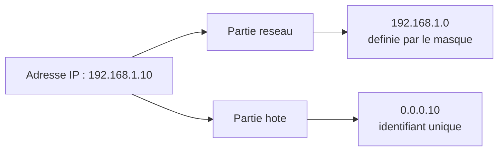

<!--
  Copyright 2026 Julien Bombled

  Licensed under the Apache License, Version 2.0 (the "License");
  you may not use this file except in compliance with the License.
  You may obtain a copy of the License at

      http://www.apache.org/licenses/LICENSE-2.0

  Unless required by applicable law or agreed to in writing, software
  distributed under the License is distributed on an "AS IS" BASIS,
  WITHOUT WARRANTIES OR CONDITIONS OF ANY KIND, either express or implied.
  See the License for the specific language governing permissions and
  limitations under the License.
-->

# Adressage IPv4

<span class="level-beginner">Debutant</span> · Temps estime : 25 minutes

---

## Introduction

L'adressage IPv4 (Internet Protocol version 4) constitue le socle fondamental de toute communication reseau TCP/IP. Chaque equipement connecte a un reseau IP possede au moins une adresse IPv4, un identifiant numerique unique sur 32 bits qui permet l'acheminement des paquets entre source et destination.

!!! info "Contexte Windows Server 2022"

    Malgre l'adoption progressive d'IPv6, IPv4 reste le protocole dominant dans les infrastructures Windows Server. La maitrise de l'adressage IPv4 est indispensable pour configurer les interfaces reseau, le DHCP, le DNS et les regles de pare-feu.

---

## Structure d'une adresse IPv4

!!! example "Analogie"

    Une adresse IPv4 fonctionne exactement comme une adresse postale. La **partie reseau** correspond a la ville et la rue (identifie le quartier), tandis que la **partie hote** correspond au numero de maison (identifie le destinataire precis). Le **masque de sous-reseau** joue le role du code postal : il indique ou finit le nom de la ville et ou commence le numero de rue.

Une adresse IPv4 est composee de **32 bits** (4 octets), representee en notation decimale pointee :

```
192.168.1.10
```

Chaque octet peut prendre une valeur de **0 a 255** (soit 2^8 possibilites).

### Decomposition binaire

| Octet       | Decimal | Binaire    |
|-------------|---------|------------|
| 1er octet   | 192     | `11000000` |
| 2eme octet  | 168     | `10101000` |
| 3eme octet  | 1       | `00000001` |
| 4eme octet  | 10      | `00001010` |

L'adresse complete en binaire :

```
11000000.10101000.00000001.00001010
```

### Conversion decimal vers binaire

Pour convertir un octet decimal en binaire, on utilise la methode des divisions successives par 2 ou la methode des puissances de 2 :

| Position | 7   | 6  | 5  | 4  | 3 | 2 | 1 | 0 |
|----------|-----|----|----|----|---|---|---|---|
| Valeur   | 128 | 64 | 32 | 16 | 8 | 4 | 2 | 1 |

!!! tip "Methode rapide"

    Pour convertir 192 en binaire : 192 = 128 + 64 = `11000000`. On "allume" les bits correspondant aux valeurs dont la somme donne le nombre cible.

---

## Partie reseau et partie hote

Toute adresse IPv4 se decompose en deux parties :

- **Partie reseau (Network ID)** : identifie le reseau auquel appartient l'hote
- **Partie hote (Host ID)** : identifie un equipement specifique au sein de ce reseau

Le **masque de sous-reseau** determine la frontiere entre ces deux parties.



---

## Classes d'adresses (historique)

Le systeme de classes, defini a l'origine d'IPv4, repartit les adresses en cinq categories selon les premiers bits de l'adresse :

| Classe | Premiers bits | Plage du 1er octet | Masque par defaut | Nb reseaux | Nb hotes/reseau |
|--------|---------------|---------------------|-------------------|------------|-----------------|
| A      | `0`           | 1 - 126             | 255.0.0.0 (/8)    | 126        | ~16,7 millions  |
| B      | `10`          | 128 - 191           | 255.255.0.0 (/16) | 16 384     | 65 534          |
| C      | `110`         | 192 - 223           | 255.255.255.0 (/24) | ~2,1 millions | 254        |
| D      | `1110`        | 224 - 239           | Multicast          | -          | -               |
| E      | `1111`        | 240 - 255           | Experimental       | -          | -               |

!!! warning "Approche obsolete"

    Le systeme de classes est considere comme obsolete depuis l'adoption du CIDR (Classless Inter-Domain Routing) en 1993. Neanmoins, il reste frequemment mentionne dans les examens de certification et permet de comprendre l'historique de l'adressage IP.

### Adresses speciales

| Adresse              | Utilisation                                      |
|----------------------|--------------------------------------------------|
| `0.0.0.0`           | Route par defaut / adresse non definie           |
| `127.0.0.0/8`       | Loopback (boucle locale, typiquement 127.0.0.1)  |
| `169.254.0.0/16`    | APIPA (adresses automatiques sans DHCP)          |
| `255.255.255.255`   | Broadcast limite (diffusion sur le reseau local) |

---

## Plages d'adresses privees (RFC 1918)

La RFC 1918 definit trois plages d'adresses reservees aux reseaux prives, non routables sur Internet :

| Classe | Plage                         | Notation CIDR    | Nombre d'adresses |
|--------|-------------------------------|------------------|--------------------|
| A      | 10.0.0.0 - 10.255.255.255    | 10.0.0.0/8       | 16 777 216         |
| B      | 172.16.0.0 - 172.31.255.255  | 172.16.0.0/12    | 1 048 576          |
| C      | 192.168.0.0 - 192.168.255.255| 192.168.0.0/16   | 65 536             |

!!! info "Utilisation en entreprise"

    En environnement Windows Server, on utilise quasi exclusivement des adresses privees RFC 1918. Le reseau 10.0.0.0/8 est privilegie dans les grandes entreprises car il offre une grande flexibilite de decoupe en sous-reseaux. Le reseau 192.168.x.0/24 est plus courant dans les PME et les labs.

### Verifier l'adresse IP sous Windows Server

```powershell
# Display all IP addresses configured on the server
Get-NetIPAddress -AddressFamily IPv4

# Display configuration details of a specific interface
Get-NetIPConfiguration -InterfaceAlias "Ethernet0"
```

Resultat :

```text
IPAddress         : 10.0.0.10
InterfaceIndex    : 4
InterfaceAlias    : Ethernet0
AddressFamily     : IPv4
Type              : Unicast
PrefixLength      : 24
PrefixOrigin      : Manual
SuffixOrigin      : Manual
AddressState      : Preferred

InterfaceAlias          : Ethernet0
InterfaceIndex          : 4
IPv4Address             : 10.0.0.10
IPv4DefaultGateway      : 10.0.0.1
DNSServer               : 10.0.0.1, 10.0.0.2
```

---

## Notation CIDR

!!! example "Analogie"

    Le CIDR est comparable a un systeme de decoupage de terrain. Au lieu d'avoir uniquement des parcelles de taille fixe (petit jardin, terrain moyen, grand domaine), le CIDR permet de decouper un terrain a la taille exacte dont on a besoin. Le suffixe `/n` indique combien de metres de cloture delimitent la partie commune (reseau) par rapport a la partie privee (hotes).

La notation **CIDR** (Classless Inter-Domain Routing), definie dans la RFC 4632, remplace le systeme de classes et permet un decoupage plus flexible de l'espace d'adressage.

La notation CIDR ajoute un suffixe `/n` a l'adresse, ou `n` represente le nombre de bits a 1 dans le masque de sous-reseau.

### Correspondance masque / CIDR

| Notation CIDR | Masque              | Bits reseau | Bits hote | Nb hotes utilisables |
|---------------|---------------------|-------------|-----------|----------------------|
| /8            | 255.0.0.0           | 8           | 24        | 16 777 214           |
| /16           | 255.255.0.0         | 16          | 16        | 65 534               |
| /24           | 255.255.255.0       | 24          | 8         | 254                  |
| /25           | 255.255.255.128     | 25          | 7         | 126                  |
| /26           | 255.255.255.192     | 26          | 6         | 62                   |
| /27           | 255.255.255.224     | 27          | 5         | 30                   |
| /28           | 255.255.255.240     | 28          | 4         | 14                   |
| /29           | 255.255.255.248     | 29          | 3         | 6                    |
| /30           | 255.255.255.252     | 30          | 2         | 2                    |
| /31           | 255.255.255.254     | 31          | 1         | 2 (point a point)    |
| /32           | 255.255.255.255     | 32          | 0         | 1 (hote unique)      |

!!! tip "Formule rapide"

    Nombre d'hotes utilisables = 2^(32 - n) - 2, ou `n` est le prefixe CIDR. On soustrait 2 pour l'adresse reseau et l'adresse de broadcast.

---

## Le masque de sous-reseau en detail

Le masque de sous-reseau est une suite de 32 bits composee d'une serie ininterrompue de **1** (partie reseau) suivie d'une serie ininterrompue de **0** (partie hote).

### Operation AND logique

Pour determiner l'adresse reseau a partir d'une adresse IP et de son masque, on applique un **AND logique** bit a bit :

```
Adresse IP :   192.168.1.10    = 11000000.10101000.00000001.00001010
Masque :       255.255.255.0   = 11111111.11111111.11111111.00000000
               ─────────────────────────────────────────────────────
Adresse reseau: 192.168.1.0    = 11000000.10101000.00000001.00000000
```

### Adresse de broadcast

L'adresse de broadcast est obtenue en mettant tous les bits de la partie hote a **1** :

```
Adresse reseau: 192.168.1.0    = 11000000.10101000.00000001.00000000
Broadcast :     192.168.1.255  = 11000000.10101000.00000001.11111111
```

### Verifier le masque avec PowerShell

```powershell
# Display prefix length (CIDR notation) for all IPv4 addresses
Get-NetIPAddress -AddressFamily IPv4 | Select-Object InterfaceAlias, IPAddress, PrefixLength

# Calculate network address using .NET
$ip = [System.Net.IPAddress]::Parse("192.168.1.10")
$mask = [System.Net.IPAddress]::Parse("255.255.255.0")
$networkBytes = @()
for ($i = 0; $i -lt 4; $i++) {
    $networkBytes += $ip.GetAddressBytes()[$i] -band $mask.GetAddressBytes()[$i]
}
$networkAddress = [System.Net.IPAddress]::new($networkBytes)
Write-Output "Network address: $networkAddress"
```

Resultat :

```text
InterfaceAlias IPAddress    PrefixLength
-------------- ---------    ------------
Ethernet0      10.0.0.10    24
Loopback       127.0.0.1    8

Network address: 192.168.1.0
```

---

## APIPA (Automatic Private IP Addressing)

Lorsqu'un client Windows ne parvient pas a contacter un serveur DHCP, il s'attribue automatiquement une adresse dans la plage **169.254.0.0/16** (APIPA). Ce mecanisme permet une connectivite locale minimale mais ne fournit ni passerelle, ni DNS.

```powershell
# Check if an interface is using an APIPA address
Get-NetIPAddress -AddressFamily IPv4 | Where-Object {
    $_.IPAddress -like "169.254.*"
} | Select-Object InterfaceAlias, IPAddress
```

Resultat :

```text
InterfaceAlias  IPAddress
--------------  ---------
Ethernet0       169.254.15.201
```

!!! danger "Diagnostic"

    Une adresse APIPA sur un serveur indique un probleme de communication DHCP. Verifiez la connectivite physique, le VLAN et la disponibilite du serveur DHCP.

---

## Scenario pratique

!!! example "Scenario pratique"

    **Contexte** : Antoine, technicien reseau junior, deploie un nouveau serveur SRV-01 dans le lab. Il lui attribue l'adresse `10.0.0.50/24` mais le serveur ne communique pas avec le controleur de domaine DC-01 (`10.0.1.10/24`).

    **Diagnostic** :

    1. Antoine verifie la configuration IP du serveur :

        ```powershell
        Get-NetIPConfiguration -InterfaceAlias "Ethernet0"
        ```

        Resultat :

        ```text
        InterfaceAlias          : Ethernet0
        IPv4Address             : 10.0.0.50
        IPv4DefaultGateway      : 10.0.0.1
        DNSServer               : 10.0.0.1
        ```

    2. Il tente un ping vers DC-01 :

        ```powershell
        Test-Connection -ComputerName 10.0.1.10 -Count 2
        ```

        Resultat :

        ```text
        Test-Connection : Testing connection to computer '10.0.1.10' failed:
        Error due to lack of resources
        ```

    3. SRV-01 est en `10.0.0.0/24` et DC-01 en `10.0.1.0/24` : ce sont **deux sous-reseaux differents**. Pour communiquer, il faut passer par une passerelle (routeur).

    4. Antoine verifie que la passerelle `10.0.0.1` route bien vers `10.0.1.0/24` :

        ```powershell
        Test-Connection -ComputerName 10.0.0.1 -Count 2
        ```

        Resultat :

        ```text
        Source        Destination    IPV4Address    Bytes    Time(ms)
        ------        -----------    -----------    -----    --------
        SRV-01        10.0.0.1       10.0.0.1       32       1
        SRV-01        10.0.0.1       10.0.0.1       32       1
        ```

    5. La passerelle est joignable. Le probleme vient du routeur qui n'a pas de route vers `10.0.1.0/24`. Apres ajout de la route sur le routeur, la communication fonctionne.

    **Resolution** : deux machines dans des sous-reseaux differents necessitent un routeur configure avec les routes appropriees. Verifiez toujours que les adresses IP et les masques placent les machines dans le meme sous-reseau ou qu'un routeur interconnecte les sous-reseaux.

---

## Erreurs courantes

!!! danger "Erreurs courantes"

    1. **Confondre masque et passerelle** : le masque de sous-reseau n'est pas une adresse de destination. Il sert uniquement a determiner la frontiere entre la partie reseau et la partie hote.

    2. **Utiliser un masque incorrect** : attribuer un `/16` au lieu d'un `/24` place des centaines de machines dans le meme domaine de broadcast, degradant les performances reseau.

    3. **Oublier les deux adresses reservees** : dans un sous-reseau, la premiere adresse (adresse reseau) et la derniere (broadcast) ne sont pas attribuables a des hotes. Un `/24` offre 254 adresses utilisables, pas 256.

    4. **Ignorer les adresses APIPA** : une adresse en `169.254.x.x` sur un serveur indique un echec DHCP. Ce n'est pas une configuration valide, c'est un symptome a investiguer immediatement.

    5. **Ne pas documenter le plan d'adressage** : sans plan d'adressage ecrit, les doublons d'adresses IP et les conflits de sous-reseaux deviennent inevitables quand l'infrastructure grandit.

---

## Points cles a retenir

| Concept                 | Detail                                                        |
|-------------------------|---------------------------------------------------------------|
| Taille adresse IPv4     | 32 bits (4 octets), notation decimale pointee                 |
| Masque de sous-reseau   | Separe la partie reseau de la partie hote                     |
| RFC 1918                | 10.0.0.0/8, 172.16.0.0/12, 192.168.0.0/16                   |
| CIDR                    | Notation /n remplacant le systeme de classes                  |
| APIPA                   | 169.254.0.0/16 en cas d'echec DHCP                           |
| Nombre d'hotes          | 2^(32-n) - 2 pour un prefixe /n                              |

---

## Pour aller plus loin

- Pratiquer le calcul de sous-reseaux avec des exercices concrets : voir la page [Sous-reseaux](sous-reseaux.md)
- Comprendre les fondamentaux d'IPv6 : voir la page [IPv6 Fondamentaux](ipv6-fondamentaux.md)
- Configurer les interfaces reseau sur Windows Server : voir la page [Configuration des interfaces](configuration-interfaces.md)

