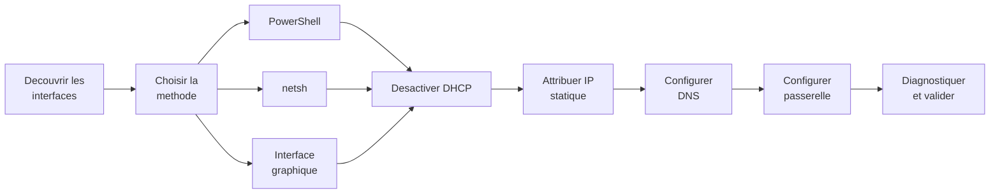

# Configuration des interfaces reseau

## Introduction

!!! example "Analogie"

    Configurer une interface reseau est comme brancher et regler un telephone fixe. Il faut d'abord verifier que la prise murale fonctionne (l'adaptateur est connecte), puis attribuer un numero de telephone (adresse IP), indiquer le standard (passerelle par defaut) et renseigner l'annuaire a consulter (serveurs DNS). Sans ces quatre elements, le telephone ne peut ni recevoir ni passer d'appels.

La configuration correcte des interfaces reseau (NIC - Network Interface Card) est une etape fondamentale dans la mise en place d'un serveur Windows. Que ce soit pour attribuer une adresse IP statique, configurer les serveurs DNS ou modifier les proprietes d'une carte reseau, Windows Server 2022 offre plusieurs approches : PowerShell, `netsh` et l'interface graphique.

!!! tip "Bonne pratique"

    Sur un serveur, il est recommande d'utiliser une adresse IP **statique** plutot que DHCP. Cela garantit la stabilite des services (DNS, AD DS, DHCP) qui dependent d'une adresse fixe.

---

## Decouvrir les interfaces disponibles

### Lister les cartes reseau

```powershell
# List all network adapters with their status
Get-NetAdapter | Select-Object Name, InterfaceDescription, Status, LinkSpeed

# List only connected adapters
Get-NetAdapter | Where-Object Status -eq "Up"
```

Resultat :

```text
Name       InterfaceDescription                Status  LinkSpeed
----       --------------------                ------  ---------
Ethernet0  Intel(R) 82574L Gigabit Network     Up      1 Gbps
Ethernet1  Intel(R) 82574L Gigabit Network #2  Down    0 bps
```

### Afficher la configuration IP actuelle

```powershell
# Display complete IP configuration for all interfaces
Get-NetIPConfiguration

# Display IP configuration for a specific interface
Get-NetIPConfiguration -InterfaceAlias "Ethernet0"

# Detailed view with DNS and gateway
Get-NetIPConfiguration -InterfaceAlias "Ethernet0" -Detailed
```

Resultat :

```text
InterfaceAlias       : Ethernet0
InterfaceIndex       : 4
InterfaceDescription : Intel(R) 82574L Gigabit Network Connection
NetProfile.Name      : lab.local
IPv4Address          : 10.0.0.10
IPv4DefaultGateway   : 10.0.0.1
DNSServer            : 10.0.0.1, 10.0.0.2
```

### Equivalent classique

```powershell
# Traditional command (still functional)
ipconfig /all
```

---



## Configuration via PowerShell (recommande)

### Attribuer une adresse IPv4 statique

```powershell
# Remove existing DHCP address first (if applicable)
Remove-NetIPAddress -InterfaceAlias "Ethernet0" -Confirm:$false

# Disable DHCP on the interface
Set-NetIPInterface -InterfaceAlias "Ethernet0" -Dhcp Disabled

# Assign a static IPv4 address
New-NetIPAddress -InterfaceAlias "Ethernet0" `
    -IPAddress "192.168.1.10" `
    -PrefixLength 24 `
    -DefaultGateway "192.168.1.1"
```

### Configurer les serveurs DNS

```powershell
# Set primary and secondary DNS servers
Set-DnsClientServerAddress -InterfaceAlias "Ethernet0" `
    -ServerAddresses "192.168.1.1", "8.8.8.8"

# Verify DNS configuration
Get-DnsClientServerAddress -InterfaceAlias "Ethernet0" -AddressFamily IPv4
```

Resultat :

```text
InterfaceAlias               Interface AddressFamily ServerAddresses
--------------               --------- ------------- ---------------
Ethernet0                            4 IPv4          {10.0.0.1, 8.8.8.8}
```

### Modifier une adresse existante

```powershell
# Change an existing IP address
Set-NetIPAddress -InterfaceAlias "Ethernet0" `
    -IPAddress "192.168.1.10" `
    -PrefixLength 24

# Change the default gateway
Remove-NetRoute -InterfaceAlias "Ethernet0" -DestinationPrefix "0.0.0.0/0" -Confirm:$false
New-NetRoute -InterfaceAlias "Ethernet0" `
    -DestinationPrefix "0.0.0.0/0" `
    -NextHop "192.168.1.254"
```

### Revenir en DHCP

```powershell
# Re-enable DHCP on the interface
Set-NetIPInterface -InterfaceAlias "Ethernet0" -Dhcp Enabled

# Reset DNS to automatic (DHCP-provided)
Set-DnsClientServerAddress -InterfaceAlias "Ethernet0" -ResetServerAddresses

# Force DHCP renewal
Invoke-Command -ScriptBlock {
    ipconfig /release
    ipconfig /renew
}
```

---

## Cmdlets PowerShell essentielles

### Get-NetIPAddress

```powershell
# Display all IPv4 addresses
Get-NetIPAddress -AddressFamily IPv4

# Display addresses for a specific interface
Get-NetIPAddress -InterfaceAlias "Ethernet0"

# Filter to show only manual (static) addresses
Get-NetIPAddress -AddressFamily IPv4 -PrefixOrigin Manual
```

Resultat :

```text
IPAddress         InterfaceAlias AddressFamily PrefixLength PrefixOrigin
---------         -------------- ------------- ------------ ------------
10.0.0.10         Ethernet0      IPv4          24           Manual
127.0.0.1         Loopback...    IPv4          8            WellKnown
```

### New-NetIPAddress

```powershell
# Add an additional IP address to an interface (IP aliasing)
New-NetIPAddress -InterfaceAlias "Ethernet0" `
    -IPAddress "192.168.1.20" `
    -PrefixLength 24

# Add an IPv6 address
New-NetIPAddress -InterfaceAlias "Ethernet0" `
    -IPAddress "2001:db8:1::10" `
    -PrefixLength 64
```

### Set-NetIPAddress

```powershell
# Modify an existing address (change prefix length only)
Set-NetIPAddress -InterfaceAlias "Ethernet0" `
    -IPAddress "192.168.1.10" `
    -PrefixLength 25
```

### Remove-NetIPAddress

```powershell
# Remove a specific IP address
Remove-NetIPAddress -InterfaceAlias "Ethernet0" `
    -IPAddress "192.168.1.20" `
    -Confirm:$false
```

---

## Gestion des proprietes de la carte reseau

### Renommer une interface

```powershell
# Rename a network adapter
Rename-NetAdapter -Name "Ethernet0" -NewName "LAN-Production"

# Verify the rename
Get-NetAdapter -Name "LAN-Production"
```

Resultat :

```text
Name            InterfaceDescription                Status  LinkSpeed
----            --------------------                ------  ---------
LAN-Production  Intel(R) 82574L Gigabit Network     Up      1 Gbps
```

### Activer/desactiver une interface

```powershell
# Disable a network adapter
Disable-NetAdapter -Name "Ethernet0" -Confirm:$false

# Enable a network adapter
Enable-NetAdapter -Name "Ethernet0"
```

### Configurer les proprietes avancees

```powershell
# Display advanced properties of an adapter
Get-NetAdapterAdvancedProperty -Name "Ethernet0"

# Configure Jumbo Frames (example: 9014 bytes)
Set-NetAdapterAdvancedProperty -Name "Ethernet0" `
    -DisplayName "Jumbo Packet" -DisplayValue "9014"

# Configure VLAN ID
Set-NetAdapterAdvancedProperty -Name "Ethernet0" `
    -DisplayName "VLAN ID" -DisplayValue "100"

# Configure speed and duplex
Set-NetAdapterAdvancedProperty -Name "Ethernet0" `
    -DisplayName "Speed & Duplex" -DisplayValue "1.0 Gbps Full Duplex"
```

---

## Configuration via netsh

La commande `netsh` reste disponible et est parfois necessaire dans des scripts de compatibilite ou des environnements Server Core sans PowerShell complet.

### Afficher la configuration

```powershell
# Display IPv4 interface configuration
netsh interface ipv4 show config

# Display configuration for a specific interface
netsh interface ipv4 show config name="Ethernet0"

# Display all interfaces
netsh interface show interface
```

Resultat :

```text
Configuration for interface "Ethernet0"
    DHCP enabled:                         No
    IP Address:                           10.0.0.10
    Subnet Prefix:                        10.0.0.0/24 (mask 255.255.255.0)
    Default Gateway:                      10.0.0.1
    Gateway Metric:                       0
    InterfaceMetric:                      25
    Statically Configured DNS Servers:    10.0.0.1
                                          10.0.0.2
    Register with which suffix:           Primary Only
    Statically Configured WINS Servers:   None
```

### Configurer une adresse statique

```powershell
# Set a static IP address
netsh interface ipv4 set address name="Ethernet0" static 192.168.1.10 255.255.255.0 192.168.1.1

# Set DNS servers
netsh interface ipv4 set dns name="Ethernet0" static 192.168.1.1 primary
netsh interface ipv4 add dns name="Ethernet0" 8.8.8.8 index=2
```

### Revenir en DHCP

```powershell
# Switch back to DHCP
netsh interface ipv4 set address name="Ethernet0" dhcp
netsh interface ipv4 set dns name="Ethernet0" dhcp
```

### Equivalences PowerShell / netsh

| Action                     | PowerShell                                        | netsh                                                  |
|----------------------------|---------------------------------------------------|--------------------------------------------------------|
| Afficher config IP         | `Get-NetIPConfiguration`                          | `netsh interface ipv4 show config`                     |
| Adresse statique           | `New-NetIPAddress`                                | `netsh interface ipv4 set address`                     |
| Configurer DNS             | `Set-DnsClientServerAddress`                      | `netsh interface ipv4 set dns`                         |
| Activer DHCP               | `Set-NetIPInterface -Dhcp Enabled`                | `netsh interface ipv4 set address dhcp`                |
| Lister interfaces          | `Get-NetAdapter`                                  | `netsh interface show interface`                       |

---

## Configuration via l'interface graphique

Pour les environnements avec interface Desktop Experience, la configuration se fait via le panneau **Connexions reseau** :

1. Ouvrir **Parametres reseau** : `ncpa.cpl` ou **Panneau de configuration > Reseau et Internet > Connexions reseau**
2. Clic droit sur l'interface > **Proprietes**
3. Selectionner **Protocole Internet version 4 (TCP/IPv4)** > **Proprietes**
4. Choisir **Utiliser l'adresse IP suivante** et renseigner :
    - Adresse IP
    - Masque de sous-reseau
    - Passerelle par defaut
5. Renseigner les serveurs DNS prefere et auxiliaire
6. Cliquer sur **OK** pour valider

!!! info "Server Core"

    Sur une installation Server Core (sans interface graphique), seules les commandes PowerShell et netsh sont disponibles. L'utilitaire `sconfig` offre egalement un menu simplifie pour la configuration reseau de base.

### Utiliser sconfig (Server Core)

```powershell
# Launch the Server Configuration tool
sconfig
```

Le menu **8) Parametres reseau** de `sconfig` permet de :

- Selectionner une interface
- Configurer une adresse statique ou DHCP
- Definir les serveurs DNS

---

## Diagnostics reseau

### Tests de connectivite

```powershell
# Ping a remote host
Test-Connection -ComputerName "192.168.1.1" -Count 4

# Traceroute
Test-Connection -ComputerName "8.8.8.8" -Traceroute

# Test DNS resolution
Resolve-DnsName -Name "www.microsoft.com"

# Test a specific TCP port
Test-NetConnection -ComputerName "192.168.1.1" -Port 443
```

Resultat :

```text
Source        Destination     IPV4Address      Bytes    Time(ms)
------        -----------     -----------      -----    --------
SRV-01        10.0.0.1        10.0.0.1         32       1
SRV-01        10.0.0.1        10.0.0.1         32       1
SRV-01        10.0.0.1        10.0.0.1         32       1
SRV-01        10.0.0.1        10.0.0.1         32       1

ComputerName     : 10.0.0.1
RemoteAddress    : 10.0.0.1
RemotePort       : 443
InterfaceAlias   : Ethernet0
TcpTestSucceeded : True
```

### Verifier la table de routage

```powershell
# Display the IPv4 routing table
Get-NetRoute -AddressFamily IPv4 | Format-Table -AutoSize

# Display only the default gateway
Get-NetRoute -DestinationPrefix "0.0.0.0/0"
```

### Diagnostiquer les problemes de DNS

```powershell
# Display current DNS cache
Get-DnsClientCache | Select-Object -First 20

# Flush DNS cache
Clear-DnsClientCache

# Verify DNS server configuration
Get-DnsClientServerAddress -AddressFamily IPv4
```

Resultat :

```text
InterfaceAlias               Interface AddressFamily ServerAddresses
--------------               --------- ------------- ---------------
Ethernet0                            4 IPv4          {10.0.0.1, 10.0.0.2}
Loopback Pseudo-Interface 1         1 IPv4          {}
```

---

## Script complet de configuration

Exemple d'un script PowerShell pour configurer entierement une interface reseau de serveur :

```powershell
# --- Server Network Configuration Script ---

# Configuration variables
$interfaceName = "Ethernet0"
$newName = "LAN-Production"
$ipAddress = "192.168.1.10"
$prefixLength = 24
$gateway = "192.168.1.1"
$dnsServers = @("192.168.1.1", "192.168.1.2")

# Rename the interface
Rename-NetAdapter -Name $interfaceName -NewName $newName

# Disable DHCP
Set-NetIPInterface -InterfaceAlias $newName -Dhcp Disabled

# Remove any existing IP configuration
Remove-NetIPAddress -InterfaceAlias $newName -Confirm:$false -ErrorAction SilentlyContinue
Remove-NetRoute -InterfaceAlias $newName -Confirm:$false -ErrorAction SilentlyContinue

# Assign static IP address and default gateway
New-NetIPAddress -InterfaceAlias $newName `
    -IPAddress $ipAddress `
    -PrefixLength $prefixLength `
    -DefaultGateway $gateway

# Configure DNS servers
Set-DnsClientServerAddress -InterfaceAlias $newName -ServerAddresses $dnsServers

# Verify final configuration
Get-NetIPConfiguration -InterfaceAlias $newName
```

Resultat :

```text
InterfaceAlias       : LAN-Production
InterfaceIndex       : 4
InterfaceDescription : Intel(R) 82574L Gigabit Network Connection
NetProfile.Name      : lab.local
IPv4Address          : 192.168.1.10
IPv4DefaultGateway   : 192.168.1.1
DNSServer            : 192.168.1.1, 192.168.1.2
```

---

## Scenario pratique

!!! example "Scenario pratique"

    **Contexte** : Fatima, administratrice systeme, deploie un nouveau serveur de fichiers SRV-FILE dans le lab. Le serveur est installe en mode Server Core (sans interface graphique). Elle doit configurer l'interface reseau avec une adresse statique.

    **Etapes** :

    1. Fatima se connecte en console et liste les interfaces disponibles :

        ```powershell
        Get-NetAdapter | Select-Object Name, Status, LinkSpeed
        ```

        Resultat :

        ```text
        Name       Status LinkSpeed
        ----       ------ ---------
        Ethernet0  Up     1 Gbps
        Ethernet1  Down   0 bps
        ```

    2. Elle renomme l'interface pour plus de clarte :

        ```powershell
        Rename-NetAdapter -Name "Ethernet0" -NewName "LAN-Serveurs"
        ```

    3. Elle desactive DHCP et attribue l'adresse statique :

        ```powershell
        Set-NetIPInterface -InterfaceAlias "LAN-Serveurs" -Dhcp Disabled
        New-NetIPAddress -InterfaceAlias "LAN-Serveurs" `
            -IPAddress "10.0.0.20" -PrefixLength 24 -DefaultGateway "10.0.0.1"
        ```

    4. Elle configure les serveurs DNS (DC-01 et DC-02) :

        ```powershell
        Set-DnsClientServerAddress -InterfaceAlias "LAN-Serveurs" `
            -ServerAddresses "10.0.0.10", "10.0.0.11"
        ```

    5. Elle verifie la configuration complete :

        ```powershell
        Get-NetIPConfiguration -InterfaceAlias "LAN-Serveurs"
        ```

        Resultat :

        ```text
        InterfaceAlias       : LAN-Serveurs
        InterfaceIndex       : 4
        IPv4Address          : 10.0.0.20
        IPv4DefaultGateway   : 10.0.0.1
        DNSServer            : 10.0.0.10, 10.0.0.11
        ```

    6. Elle teste la connectivite vers le controleur de domaine :

        ```powershell
        Test-Connection -ComputerName DC-01 -Count 2
        ```

        Resultat :

        ```text
        Source   Destination IPV4Address Bytes Time(ms)
        ------   ----------- ----------- ----- --------
        SRV-FILE DC-01       10.0.0.10   32    1
        SRV-FILE DC-01       10.0.0.10   32    1
        ```

    **Resolution** : la configuration est complete et fonctionnelle. Le serveur peut maintenant etre joint au domaine `lab.local`.

---

## Erreurs courantes

!!! danger "Erreurs courantes"

    1. **Oublier de desactiver DHCP avant d'attribuer une IP statique** : sur certaines configurations, `New-NetIPAddress` peut echouer ou cohabiter avec une adresse DHCP, causant des conflits. Desactivez toujours DHCP d'abord avec `Set-NetIPInterface -Dhcp Disabled`.

    2. **Configurer les DNS en pointant vers soi-meme en premier** : un serveur membre ne doit pas pointer vers lui-meme en premier DNS. Il doit pointer vers un controleur de domaine. Seuls les DC pointent vers eux-memes, et uniquement en deuxieme position.

    3. **Oublier la passerelle par defaut** : sans passerelle, le serveur ne peut communiquer qu'avec les machines de son propre sous-reseau. Tout trafic inter-sous-reseaux ou Internet echouera silencieusement.

    4. **Ne pas renommer les interfaces** : sur un serveur avec plusieurs cartes reseau (NIC teaming, separation LAN/SAN), laisser les noms par defaut (Ethernet0, Ethernet1) rend le depannage tres confus. Renommez-les selon leur role (`LAN-Production`, `iSCSI-Storage`, `Heartbeat`).

    5. **Confondre netsh et PowerShell** : melanger les deux approches dans un meme script peut causer des conflits. Choisissez l'une ou l'autre methode et restez coherent. PowerShell est recommande pour Windows Server 2022.

---

## Points cles a retenir

| Concept               | Detail                                                        |
|-----------------------|---------------------------------------------------------------|
| Adresse statique      | Recommandee pour tous les serveurs                            |
| PowerShell            | Methode privilegiee : `New-NetIPAddress`, `Set-DnsClientServerAddress` |
| netsh                 | Alternative pour la compatibilite et Server Core              |
| sconfig               | Menu simplifie pour Server Core                               |
| Diagnostics           | `Test-Connection`, `Test-NetConnection`, `Resolve-DnsName`    |
| Renommage             | Renommer les interfaces pour la clarte (`Rename-NetAdapter`)  |

---

## Pour aller plus loin

- Comprendre l'adressage IPv4 : voir la page [Adressage IPv4](adressage-ipv4.md)
- Decoupage en sous-reseaux : voir la page [Sous-reseaux](sous-reseaux.md)
- Configurer IPv6 : voir la page [IPv6 Fondamentaux](ipv6-fondamentaux.md)
- Gestion du pare-feu : voir la section [Pare-feu Windows](../pare-feu/wfas-concepts.md)
