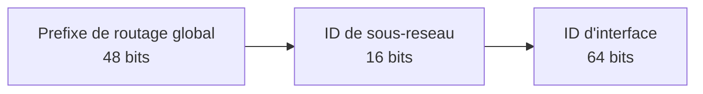
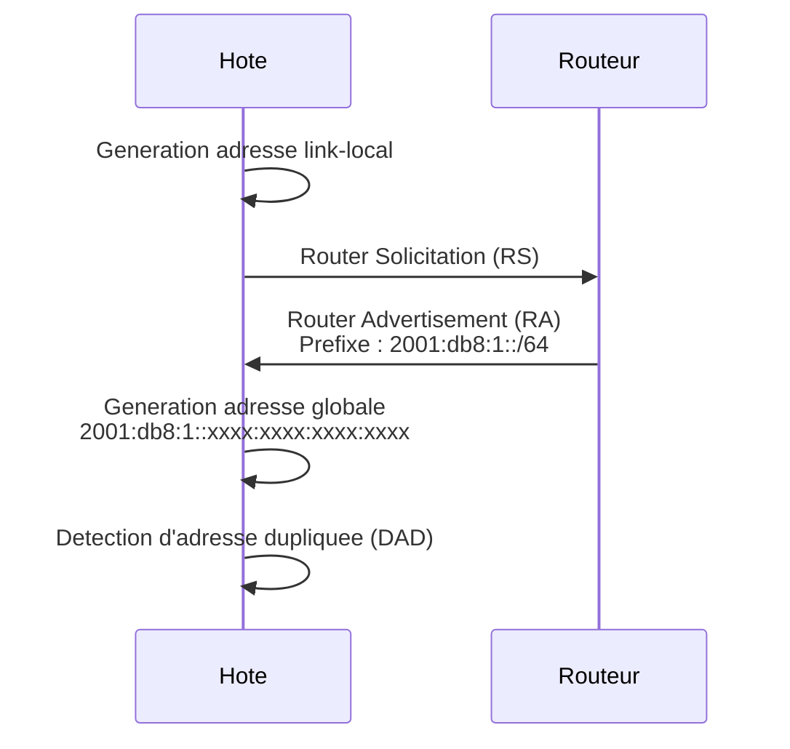
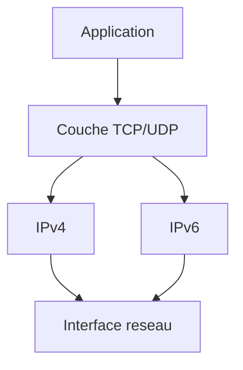

# IPv6 - Fondamentaux

## Introduction

IPv6 (Internet Protocol version 6) est le successeur d'IPv4, concu pour repondre a l'epuisement de l'espace d'adressage IPv4. Avec des adresses sur **128 bits** (contre 32 pour IPv4), IPv6 offre un espace d'adressage quasi illimite de 2^128 adresses (environ 3,4 x 10^38).

!!! info "IPv6 et Windows Server 2022"

    Windows Server 2022 prend en charge nativement IPv6, et le protocole est active par defaut. Microsoft recommande de ne pas desactiver IPv6, car certains composants Windows (notamment DirectAccess, WinRM et certains services de clustering) en dependent.

---

## Format d'une adresse IPv6

!!! example "Analogie"

    Si IPv4 est un annuaire telephonique a 10 chiffres qui arrive a saturation, IPv6 est un annuaire a 39 chiffres. C'est comme passer d'un systeme de numerotation de ville (suffisant pour un pays) a un systeme de numerotation galactique (suffisant pour attribuer une adresse a chaque grain de sable sur Terre). La notation hexadecimale permet de condenser cette immense adresse en un format lisible.

Une adresse IPv6 est composee de **128 bits**, representee en **notation hexadecimale** sous forme de 8 groupes de 4 caracteres hexadecimaux, separes par des deux-points :

```
2001:0db8:85a3:0000:0000:8a2e:0370:7334
```

### Regles de simplification

**Regle 1** : supprimer les zeros en tete de chaque groupe

```
2001:0db8:85a3:0000:0000:8a2e:0370:7334
     ↓
2001:db8:85a3:0:0:8a2e:370:7334
```

**Regle 2** : remplacer une suite consecutive de groupes a zero par `::`  (une seule fois)

```
2001:db8:85a3:0:0:8a2e:370:7334
     ↓
2001:db8:85a3::8a2e:370:7334
```

!!! warning "Attention"

    La notation `::` ne peut etre utilisee qu'**une seule fois** dans une adresse. Sinon il serait impossible de determiner le nombre de groupes remplaces.

### Exemples de simplification

| Adresse complete                              | Adresse simplifiee         |
|-----------------------------------------------|----------------------------|
| `2001:0db8:0000:0000:0000:0000:0000:0001`    | `2001:db8::1`              |
| `fe80:0000:0000:0000:020c:29ff:fe12:3456`    | `fe80::20c:29ff:fe12:3456` |
| `0000:0000:0000:0000:0000:0000:0000:0001`    | `::1` (loopback)           |
| `0000:0000:0000:0000:0000:0000:0000:0000`    | `::` (adresse non definie) |

---

## Structure d'une adresse IPv6

Une adresse IPv6 unicast globale se decompose generalement en trois parties :



| Partie                    | Taille    | Description                                    |
|---------------------------|-----------|------------------------------------------------|
| Prefixe de routage global | 48 bits   | Attribue par le fournisseur (FAI/RIR)          |
| ID de sous-reseau         | 16 bits   | Permet 65 536 sous-reseaux                     |
| ID d'interface            | 64 bits   | Identifie l'hote dans le sous-reseau           |

Le prefixe standard pour les reseaux locaux est **/64**, ce qui laisse 64 bits pour l'identifiant d'interface.

---

## Types d'adresses IPv6

### Unicast

Les adresses unicast identifient une interface unique. Un paquet envoye a une adresse unicast est delivre a cette seule interface.

| Type                    | Prefixe          | Description                                          |
|-------------------------|------------------|------------------------------------------------------|
| Global Unicast (GUA)    | `2000::/3`       | Equivalent des adresses publiques IPv4, routables sur Internet |
| Link-Local              | `fe80::/10`      | Communication locale au lien, non routable            |
| Unique Local (ULA)      | `fc00::/7`       | Equivalent des adresses privees RFC 1918              |
| Loopback                | `::1/128`        | Equivalent de 127.0.0.1 en IPv4                       |
| Non definie             | `::/128`         | Equivalent de 0.0.0.0 en IPv4                         |

#### Adresses Link-Local

Les adresses **link-local** (`fe80::/10`) sont automatiquement attribuees a chaque interface IPv6. Elles permettent la communication entre voisins sur le meme segment reseau et sont essentielles pour le fonctionnement de protocoles comme NDP (Neighbor Discovery Protocol).

```powershell
# Display link-local addresses on all interfaces
Get-NetIPAddress -AddressFamily IPv6 | Where-Object {
    $_.IPAddress -like "fe80::*"
} | Select-Object InterfaceAlias, IPAddress
```

Resultat :

```text
InterfaceAlias  IPAddress
--------------  ---------
Ethernet0       fe80::20c:29ff:fe4a:8b12%4
Loopback        fe80::1%1
```

!!! info "Identifiant de zone"

    Sous Windows, les adresses link-local sont suivies d'un identifiant de zone (ex : `fe80::1%12`). Le `%12` represente l'index de l'interface et permet au systeme de savoir par quelle interface envoyer le paquet.

### Multicast

Les adresses multicast (prefixe `ff00::/8`) permettent d'envoyer un paquet a un groupe de recepteurs. IPv6 n'utilise pas de broadcast comme IPv4.

| Adresse multicast       | Portee     | Description                              |
|-------------------------|------------|------------------------------------------|
| `ff01::1`               | Node       | Toutes les interfaces du noeud           |
| `ff02::1`               | Link       | Tous les noeuds du lien                  |
| `ff02::2`               | Link       | Tous les routeurs du lien                |
| `ff02::1:ff00:0/104`    | Link       | Multicast de noeud sollicite (NDP)       |

### Anycast

Une adresse **anycast** est attribuee a plusieurs interfaces. Un paquet envoye a une adresse anycast est delivre a l'interface la **plus proche** (au sens du routage). Utile pour la repartition de charge et la redondance de services (DNS par exemple).

---

## Mecanisme d'auto-configuration (SLAAC)

!!! example "Analogie"

    SLAAC fonctionne comme un quartier ou chaque nouveau resident choisit lui-meme son numero de maison. Le maire (routeur) annonce simplement le nom de la rue (prefixe reseau), et le resident genere son propre numero unique (identifiant d'interface). Pas besoin de bureau d'attribution centralisee (serveur DHCP).

IPv6 permet l'auto-configuration d'adresse sans serveur DHCP grace au mecanisme **SLAAC** (Stateless Address Autoconfiguration) :

1. L'hote genere une adresse link-local
2. Il envoie un message **Router Solicitation** (RS)
3. Le routeur repond avec un **Router Advertisement** (RA) contenant le prefixe reseau
4. L'hote combine le prefixe avec un identifiant d'interface (genere via EUI-64 ou aleatoire)



!!! tip "EUI-64 vs adresses aleatoires"

    Windows Server genere par defaut des identifiants d'interface **aleatoires** (RFC 7217) plutot que des identifiants EUI-64 bases sur l'adresse MAC, pour des raisons de confidentialite.

---

## IPv6 sous Windows Server 2022

### Verifier la configuration IPv6

```powershell
# Display all IPv6 addresses
Get-NetIPAddress -AddressFamily IPv6

# Display IPv6 configuration for a specific interface
Get-NetIPAddress -InterfaceAlias "Ethernet0" -AddressFamily IPv6

# Display IPv6 routing table
Get-NetRoute -AddressFamily IPv6

# Test connectivity with IPv6
Test-Connection -ComputerName "::1" -Count 4
```

Resultat :

```text
IPAddress         : fe80::20c:29ff:fe4a:8b12%4
InterfaceIndex    : 4
InterfaceAlias    : Ethernet0
AddressFamily     : IPv6
Type              : Unicast
PrefixLength      : 64
PrefixOrigin      : WellKnown
SuffixOrigin      : Link
AddressState      : Preferred

IPAddress         : ::1
InterfaceIndex    : 1
InterfaceAlias    : Loopback Pseudo-Interface 1
AddressFamily     : IPv6
Type              : Unicast
PrefixLength      : 128
```

### Configurer une adresse IPv6 statique

```powershell
# Assign a static IPv6 address to an interface
New-NetIPAddress -InterfaceAlias "Ethernet0" `
    -IPAddress "2001:db8:1::10" `
    -PrefixLength 64 `
    -DefaultGateway "2001:db8:1::1"

# Configure DNS servers for IPv6
Set-DnsClientServerAddress -InterfaceAlias "Ethernet0" `
    -ServerAddresses "2001:db8:1::53", "2001:db8:2::53"
```

### Desactiver IPv6 (non recommande)

```powershell
# Disable IPv6 on a specific interface (not recommended by Microsoft)
Disable-NetAdapterBinding -Name "Ethernet0" -ComponentID "ms_tcpip6"

# Re-enable IPv6 on the interface
Enable-NetAdapterBinding -Name "Ethernet0" -ComponentID "ms_tcpip6"

# Check IPv6 binding status
Get-NetAdapterBinding -Name "Ethernet0" -ComponentID "ms_tcpip6"
```

Resultat :

```text
Name       DisplayName                        ComponentID   Enabled
----       -----------                        -----------   -------
Ethernet0  Internet Protocol Version 6 (TCP/  ms_tcpip6     False
```

!!! danger "Desactiver IPv6 peut causer des problemes"

    Microsoft deconseille fortement la desactivation d'IPv6. Certains composants Windows Server en dependent, notamment le clustering de basculement, Exchange Server et les technologies d'acces distant. Si IPv6 n'est pas necessaire sur le reseau, il est preferable de privilegier IPv4 via les regles de prefixe plutot que de desactiver IPv6.

---

## Double pile (Dual Stack)

Le mecanisme de **double pile** permet a un hote de fonctionner simultanement avec IPv4 et IPv6. C'est la methode de transition recommandee par Microsoft et l'IETF.



Windows Server 2022 fonctionne en mode double pile par defaut. Les applications peuvent utiliser l'un ou l'autre protocole selon la disponibilite et les regles de prefixe configurees.

```powershell
# Display prefix policies (determines IPv4 vs IPv6 preference)
Get-NetPrefixPolicy

# Verify dual-stack configuration
Get-NetIPAddress | Select-Object InterfaceAlias, AddressFamily, IPAddress | Sort-Object InterfaceAlias
```

Resultat :

```text
InterfaceAlias  AddressFamily IPAddress
--------------  ------------- ---------
Ethernet0       IPv4          10.0.0.10
Ethernet0       IPv6          fe80::20c:29ff:fe4a:8b12%4
Loopback...     IPv4          127.0.0.1
Loopback...     IPv6          ::1
```

---

## Technologies de transition

Plusieurs mecanismes facilitent la coexistence et la migration d'IPv4 vers IPv6 :

| Technologie | Description                                              | Statut                   |
|-------------|----------------------------------------------------------|--------------------------|
| Dual Stack  | Les deux protocoles fonctionnent en parallele             | Recommande               |
| 6to4        | Encapsulation IPv6 dans IPv4 (prefixe 2002::/16)         | Obsolete (RFC 7526)      |
| Teredo      | Tunnel IPv6 dans UDP/IPv4 (prefixe 2001:0::/32)          | En fin de vie            |
| ISATAP      | IPv6 au sein de reseaux IPv4 intra-site                   | Obsolete                 |
| NAT64/DNS64 | Traduction d'adresses entre IPv6 et IPv4                  | Utilise pour la transition|

!!! warning "Technologies obsoletes"

    Les technologies 6to4, Teredo et ISATAP sont considerees comme obsoletes. Microsoft les a progressivement desactivees dans les versions recentes de Windows. Pour les nouveaux deployements, il convient d'utiliser la double pile ou des mecanismes de tunnelling modernes.

---

## Comparaison IPv4 / IPv6

| Caracteristique      | IPv4                  | IPv6                        |
|----------------------|-----------------------|-----------------------------|
| Taille d'adresse     | 32 bits               | 128 bits                    |
| Notation             | Decimale pointee      | Hexadecimale avec `:`       |
| Espace d'adressage   | ~4,3 milliards        | ~3,4 x 10^38               |
| Configuration        | DHCP ou manuelle      | SLAAC, DHCPv6 ou manuelle   |
| Broadcast            | Oui                   | Non (remplace par multicast) |
| IPsec                | Optionnel             | Integre nativement          |
| Fragmentation        | Routeur et hote       | Hote uniquement             |
| En-tete              | Variable (20-60 octets)| Fixe (40 octets)           |

---

## Scenario pratique

!!! example "Scenario pratique"

    **Contexte** : Lucas, administrateur systeme, deploie un cluster de basculement (Failover Cluster) sur deux serveurs Windows Server 2022. Apres l'installation, le cluster refuse de se valider avec l'erreur "Network communication failure". Les serveurs communiquent pourtant parfaitement en IPv4.

    **Diagnostic** :

    1. Lucas verifie la configuration IPv6 sur SRV-01 :

        ```powershell
        Get-NetAdapterBinding -Name "Ethernet0" -ComponentID "ms_tcpip6"
        ```

        Resultat :

        ```text
        Name       DisplayName                        ComponentID   Enabled
        ----       -----------                        -----------   -------
        Ethernet0  Internet Protocol Version 6 (TCP/  ms_tcpip6     False
        ```

    2. IPv6 est desactive. Or, le clustering de basculement Windows requiert IPv6 pour certaines communications internes.

    3. Lucas reactive IPv6 sur les deux serveurs :

        ```powershell
        Enable-NetAdapterBinding -Name "Ethernet0" -ComponentID "ms_tcpip6"
        ```

    4. Il verifie que les adresses link-local sont generees :

        ```powershell
        Get-NetIPAddress -InterfaceAlias "Ethernet0" -AddressFamily IPv6 |
            Where-Object { $_.IPAddress -like "fe80::*" }
        ```

        Resultat :

        ```text
        IPAddress         : fe80::20c:29ff:fe4a:8b12%4
        InterfaceAlias    : Ethernet0
        AddressFamily     : IPv6
        PrefixLength      : 64
        AddressState      : Preferred
        ```

    5. Apres reactivation d'IPv6 sur les deux noeuds, la validation du cluster passe avec succes.

    **Resolution** : desactiver IPv6 est deconseille par Microsoft car certains composants (clustering, DirectAccess, WinRM) en dependent. Si IPv6 n'est pas utilise sur le reseau, il suffit de laisser les adresses link-local s'auto-configurer sans attribuer d'adresses globales.

---

## Erreurs courantes

!!! danger "Erreurs courantes"

    1. **Desactiver IPv6 systematiquement** : c'est un reflexe frequent mais dangereux. Microsoft deconseille la desactivation d'IPv6. Certains services (clustering, DirectAccess) en ont besoin. Laissez IPv6 actif meme si vous ne l'utilisez pas.

    2. **Utiliser `::` deux fois dans une adresse** : la notation `::` ne peut apparaitre qu'une seule fois. `2001::db8::1` est invalide car le systeme ne peut pas determiner combien de groupes chaque `::` remplace.

    3. **Oublier l'identifiant de zone** : sous Windows, les adresses link-local necessitent un identifiant de zone (`%4`) pour preciser l'interface. Un ping vers `fe80::1` sans `%4` echouera si plusieurs interfaces sont presentes.

    4. **Confondre ULA et GUA** : les adresses ULA (`fc00::/7`) sont l'equivalent des adresses privees et ne sont pas routables sur Internet. Les GUA (`2000::/3`) sont les adresses publiques routables. Deployer des ULA en pensant avoir une connectivite Internet ne fonctionnera pas.

    5. **Ignorer SLAAC et configurer tout manuellement** : SLAAC est un mecanisme puissant qui simplifie la gestion. Attribuer des adresses IPv6 statiques a chaque poste est rarement necessaire (sauf pour les serveurs et equipements d'infrastructure).

---

## Points cles a retenir

| Concept           | Detail                                                         |
|-------------------|----------------------------------------------------------------|
| Format            | 128 bits, 8 groupes de 4 hex separes par `:`                  |
| Link-local        | `fe80::/10`, attribuee automatiquement, non routable           |
| GUA               | `2000::/3`, equivalent des adresses publiques IPv4             |
| SLAAC             | Auto-configuration sans serveur DHCP                           |
| Double pile       | Mode par defaut sous Windows Server 2022                       |
| Ne pas desactiver | IPv6 est necessaire pour certains composants Windows           |

---

## Pour aller plus loin

- Reviser les fondamentaux IPv4 : voir la page [Adressage IPv4](adressage-ipv4.md)
- Configurer les interfaces reseau : voir la page [Configuration des interfaces](configuration-interfaces.md)
- Comprendre le subnetting : voir la page [Sous-reseaux](sous-reseaux.md)
