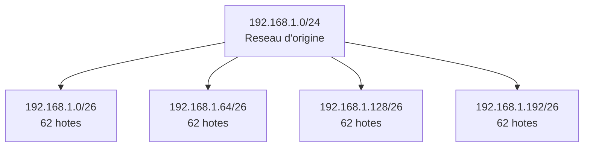
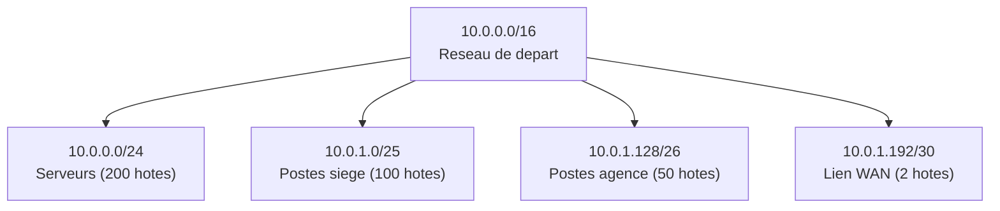

<!--
  Copyright 2026 Julien Bombled

  Licensed under the Apache License, Version 2.0 (the "License");
  you may not use this file except in compliance with the License.
  You may obtain a copy of the License at

      http://www.apache.org/licenses/LICENSE-2.0

  Unless required by applicable law or agreed to in writing, software
  distributed under the License is distributed on an "AS IS" BASIS,
  WITHOUT WARRANTIES OR CONDITIONS OF ANY KIND, either express or implied.
  See the License for the specific language governing permissions and
  limitations under the License.
-->
---
title: "Sous-reseaux (Subnetting)"
description: "Maitriser le decoupage en sous-reseaux : calculs, VLSM, determination des plages reseau/broadcast/hotes et exercices pratiques."
tags:
  - reseau
  - subnetting
  - vlsm
  - ipv4
---

# Sous-reseaux (Subnetting)

<span class="level-intermediate">Intermediaire</span> · Temps estime : 35 minutes

---

## Introduction

!!! example "Analogie"

    Le subnetting est comparable au decoupage d'un grand open space en bureaux individuels avec des cloisons. L'open space (le reseau d'origine) est divise en espaces plus petits (sous-reseaux), chacun avec sa propre porte d'entree (adresse reseau) et son propre interphone (broadcast). Les cloisons (le masque) definissent la taille de chaque bureau.

Le **subnetting** (decoupage en sous-reseaux) consiste a diviser un reseau IP en segments plus petits. Cette technique est essentielle en administration reseau pour optimiser l'utilisation de l'espace d'adressage, ameliorer la securite par segmentation et reduire le trafic de broadcast.

!!! info "Pourquoi decouper en sous-reseaux ?"

    - **Optimisation** : eviter le gaspillage d'adresses IP
    - **Securite** : isoler les segments reseau (serveurs, postes, DMZ)
    - **Performance** : limiter la taille des domaines de broadcast
    - **Organisation** : structurer logiquement l'infrastructure (sites, services, etages)

---

## Rappel : masque de sous-reseau

Le masque de sous-reseau definit la frontiere entre la partie reseau et la partie hote d'une adresse IP.

| Notation CIDR | Masque en decimal     | Masque en binaire                         |
|---------------|-----------------------|-------------------------------------------|
| /24           | 255.255.255.0         | 11111111.11111111.11111111.`00000000`     |
| /25           | 255.255.255.128       | 11111111.11111111.11111111.`10000000`     |
| /26           | 255.255.255.192       | 11111111.11111111.11111111.`11000000`     |
| /27           | 255.255.255.224       | 11111111.11111111.11111111.`11100000`     |
| /28           | 255.255.255.240       | 11111111.11111111.11111111.`11110000`     |

Les bits entre crochets representent les bits "empruntes" a la partie hote pour creer des sous-reseaux.

---

## Methodologie de calcul

### Etape 1 : determiner le nombre de bits a emprunter

La formule fondamentale :

- **Nombre de sous-reseaux** = 2^s (ou `s` = nombre de bits empruntes)
- **Nombre d'hotes par sous-reseau** = 2^h - 2 (ou `h` = bits restants pour la partie hote)

### Etape 2 : calculer le nouveau masque

On ajoute les bits empruntes au masque d'origine.

### Etape 3 : determiner la taille des blocs

La **taille du bloc** (ou "pas d'incrementation") = 2^h (nombre de bits hote restants).

!!! tip "Raccourci pratique"

    Taille du bloc = 256 - valeur du dernier octet significatif du masque. Par exemple, pour un masque /26 (255.255.255.192) : 256 - 192 = 64. Chaque sous-reseau contient donc 64 adresses.

---

## Exemple complet : decouper 192.168.1.0/24

### Objectif : creer 4 sous-reseaux

**Etape 1** : combien de bits emprunter ?

- Il faut 4 sous-reseaux : 2^s >= 4, donc s = 2 bits

**Etape 2** : nouveau masque

- Masque d'origine : /24 (255.255.255.0)
- Nouveau masque : /24 + 2 = /26 (255.255.255.192)

**Etape 3** : taille du bloc

- Bits hote restants : 32 - 26 = 6
- Taille du bloc : 2^6 = 64

**Resultat :**

| Sous-reseau | Adresse reseau  | Premiere hote   | Derniere hote   | Broadcast       |
|-------------|-----------------|-----------------|-----------------|-----------------|
| 1           | 192.168.1.0     | 192.168.1.1     | 192.168.1.62    | 192.168.1.63    |
| 2           | 192.168.1.64    | 192.168.1.65    | 192.168.1.126   | 192.168.1.127   |
| 3           | 192.168.1.128   | 192.168.1.129   | 192.168.1.190   | 192.168.1.191   |
| 4           | 192.168.1.192   | 192.168.1.193   | 192.168.1.254   | 192.168.1.255   |

Chaque sous-reseau offre **62 adresses hotes** utilisables (64 - 2).



---

## Determiner les informations d'un sous-reseau

Pour une adresse donnee, par exemple **192.168.1.150/26**, voici comment trouver les informations essentielles :

### Methode pas a pas

1. **Masque** : /26 = 255.255.255.192
2. **Taille du bloc** : 256 - 192 = 64
3. **Adresse reseau** : dans quel multiple de 64 tombe le 150 ? 64 x 2 = 128, 64 x 3 = 192. Donc : **192.168.1.128**
4. **Broadcast** : adresse reseau + taille du bloc - 1 = 128 + 64 - 1 = **192.168.1.191**
5. **Premiere hote** : adresse reseau + 1 = **192.168.1.129**
6. **Derniere hote** : broadcast - 1 = **192.168.1.190**

### Verification avec PowerShell

```powershell
# Function to compute subnet details from an IP and prefix length
function Get-SubnetInfo {
    param (
        [string]$IPAddress,
        [int]$PrefixLength
    )

    $ip = [System.Net.IPAddress]::Parse($IPAddress)
    $ipBytes = $ip.GetAddressBytes()

    # Build the subnet mask
    $maskBits = ('1' * $PrefixLength).PadRight(32, '0')
    $maskBytes = @()
    for ($i = 0; $i -lt 4; $i++) {
        $maskBytes += [Convert]::ToByte($maskBits.Substring($i * 8, 8), 2)
    }

    # Calculate network address
    $networkBytes = @()
    for ($i = 0; $i -lt 4; $i++) {
        $networkBytes += ($ipBytes[$i] -band $maskBytes[$i])
    }

    # Calculate broadcast address
    $broadcastBytes = @()
    for ($i = 0; $i -lt 4; $i++) {
        $broadcastBytes += ($networkBytes[$i] -bor (255 - $maskBytes[$i]))
    }

    $network = ($networkBytes -join '.')
    $broadcast = ($broadcastBytes -join '.')
    $hostBits = 32 - $PrefixLength
    $totalHosts = [Math]::Pow(2, $hostBits) - 2

    [PSCustomObject]@{
        IPAddress      = $IPAddress
        PrefixLength   = $PrefixLength
        SubnetMask     = ($maskBytes -join '.')
        NetworkAddress = $network
        Broadcast      = $broadcast
        UsableHosts    = $totalHosts
    }
}

# Usage
Get-SubnetInfo -IPAddress "192.168.1.150" -PrefixLength 26
```

Resultat :

```text
IPAddress      : 192.168.1.150
PrefixLength   : 26
SubnetMask     : 255.255.255.192
NetworkAddress : 192.168.1.128
Broadcast      : 192.168.1.191
UsableHosts    : 62
```

---

## VLSM (Variable Length Subnet Masking)

!!! example "Analogie"

    Avec le subnetting classique, on decoupe un terrain en parcelles egales, meme si certaines ne sont pas utilisees. Le VLSM est comme un architecte qui adapte la taille de chaque piece a son usage : une grande salle de reunion pour 200 personnes, un bureau moyen pour 50, et un petit local technique pour 2. On ne gaspille pas d'espace.

Le **VLSM** permet d'utiliser des masques de longueur differente au sein d'un meme reseau. Contrairement au subnetting classique (ou tous les sous-reseaux ont la meme taille), le VLSM adapte la taille de chaque sous-reseau au nombre reel d'hotes necessaires.

### Principe



### Methode de calcul VLSM

1. **Lister les besoins** par ordre decroissant de taille
2. **Attribuer le plus grand sous-reseau** en premier
3. **Utiliser l'espace restant** pour les sous-reseaux suivants
4. **Verifier** qu'il n'y a pas de chevauchement

### Exemple pratique

Reseau de depart : **10.0.0.0/24** (256 adresses)

| Besoin             | Hotes requis | Prefixe | Adresses allouees | Sous-reseau attribue  |
|--------------------|-------------|---------|-------------------|-----------------------|
| LAN Serveurs       | 100         | /25     | 128               | 10.0.0.0/25           |
| LAN Postes         | 50          | /26     | 64                | 10.0.0.128/26         |
| LAN Imprimantes    | 20          | /27     | 32                | 10.0.0.192/27         |
| Lien WAN point-a-point | 2      | /30     | 4                 | 10.0.0.224/30         |
| Espace restant     | -           | -       | 28                | 10.0.0.228 - 10.0.0.255 |

!!! warning "Ordre d'allocation"

    Toujours commencer par le sous-reseau le plus grand. Si on commence par les petits, on risque de fragmenter l'espace et de ne plus pouvoir allouer les gros blocs contigus.

---

## Exercices pratiques

### Exercice 1 : calcul simple

**Enonce** : le reseau 172.16.0.0/16 doit etre decoupe en 32 sous-reseaux de taille egale.

??? success "Solution"

    - Bits a emprunter : 2^s >= 32, donc s = 5
    - Nouveau masque : /16 + 5 = **/21** (255.255.248.0)
    - Taille du bloc : 2^(32-21) = 2048 adresses par sous-reseau
    - Hotes utilisables : 2048 - 2 = **2046 par sous-reseau**
    - Premier sous-reseau : 172.16.0.0/21 (172.16.0.1 - 172.16.7.254)
    - Deuxieme sous-reseau : 172.16.8.0/21 (172.16.8.1 - 172.16.15.254)
    - Et ainsi de suite par pas de 8 dans le 3eme octet

### Exercice 2 : identification de sous-reseau

**Enonce** : a quel sous-reseau appartient l'hote 10.45.67.200/20 ?

??? success "Solution"

    - Masque /20 = 255.255.240.0
    - Taille du bloc sur le 3eme octet : 256 - 240 = 16
    - 67 / 16 = 4.1875 => 4 x 16 = 64
    - Adresse reseau : **10.45.64.0/20**
    - Broadcast : 10.45.64.0 + 16 (sur le 3eme octet) - 1 = **10.45.79.255**
    - Plage hotes : 10.45.64.1 - 10.45.79.254

### Exercice 3 : VLSM

**Enonce** : decouper 192.168.10.0/24 pour les besoins suivants :

- VLAN Serveurs : 60 hotes
- VLAN Postes : 25 hotes
- VLAN VoIP : 12 hotes
- Lien inter-routeurs : 2 hotes

??? success "Solution"

    **1. VLAN Serveurs (60 hotes)**

    - 2^h - 2 >= 60, donc h = 6, prefixe = /26 (62 hotes)
    - Sous-reseau : **192.168.10.0/26** (192.168.10.1 - 192.168.10.62)

    **2. VLAN Postes (25 hotes)**

    - 2^h - 2 >= 25, donc h = 5, prefixe = /27 (30 hotes)
    - Sous-reseau : **192.168.10.64/27** (192.168.10.65 - 192.168.10.94)

    **3. VLAN VoIP (12 hotes)**

    - 2^h - 2 >= 12, donc h = 4, prefixe = /28 (14 hotes)
    - Sous-reseau : **192.168.10.96/28** (192.168.10.97 - 192.168.10.110)

    **4. Lien inter-routeurs (2 hotes)**

    - 2^h - 2 >= 2, donc h = 2, prefixe = /30 (2 hotes)
    - Sous-reseau : **192.168.10.112/30** (192.168.10.113 - 192.168.10.114)

    **Espace restant** : 192.168.10.116 - 192.168.10.255 (disponible pour de futurs besoins)

---

## Resume des formules

| Formule                                    | Description                              |
|--------------------------------------------|------------------------------------------|
| 2^s                                        | Nombre de sous-reseaux (s = bits empruntes) |
| 2^h - 2                                   | Nombre d'hotes utilisables (h = bits hote)  |
| 256 - valeur du dernier octet du masque    | Taille du bloc (pas d'incrementation)    |
| IP AND masque                              | Adresse reseau                           |
| Adresse reseau + taille du bloc - 1        | Adresse de broadcast                     |

---

## Scenario pratique

!!! example "Scenario pratique"

    **Contexte** : Emilie, administratrice reseau, doit planifier le plan d'adressage du nouveau site de Lyon. Le siege lui a attribue le reseau `10.0.10.0/24`. Elle doit heberger trois segments : serveurs (10 machines), postes utilisateurs (80 machines) et un lien VPN inter-sites (2 adresses).

    **Analyse VLSM** (par ordre decroissant de taille) :

    1. **Postes utilisateurs** (80 hotes) :
        - 2^h - 2 >= 80, donc h = 7, prefixe = /25 (126 hotes)
        - Sous-reseau : `10.0.10.0/25` (10.0.10.1 - 10.0.10.126)

    2. **Serveurs** (10 hotes) :
        - 2^h - 2 >= 10, donc h = 4, prefixe = /28 (14 hotes)
        - Sous-reseau : `10.0.10.128/28` (10.0.10.129 - 10.0.10.142)

    3. **Lien VPN** (2 hotes) :
        - 2^h - 2 >= 2, donc h = 2, prefixe = /30 (2 hotes)
        - Sous-reseau : `10.0.10.144/30` (10.0.10.145 - 10.0.10.146)

    **Verification avec PowerShell** :

    ```powershell
    Get-SubnetInfo -IPAddress "10.0.10.0" -PrefixLength 25
    Get-SubnetInfo -IPAddress "10.0.10.128" -PrefixLength 28
    Get-SubnetInfo -IPAddress "10.0.10.144" -PrefixLength 30
    ```

    Resultat :

    ```text
    IPAddress      PrefixLength SubnetMask        NetworkAddress Broadcast      UsableHosts
    ---------      ------------ ----------        -------------- ---------      -----------
    10.0.10.0      25           255.255.255.128   10.0.10.0      10.0.10.127    126
    10.0.10.128    28           255.255.255.240   10.0.10.128    10.0.10.143    14
    10.0.10.144    30           255.255.255.252   10.0.10.144    10.0.10.147    2
    ```

    **Espace restant** : `10.0.10.148` a `10.0.10.255` (disponible pour de futures extensions).

---

## Erreurs courantes

!!! danger "Erreurs courantes"

    1. **Oublier de soustraire 2 pour les hotes** : un /24 offre 256 adresses mais seulement **254** utilisables (adresse reseau + broadcast). Dimensionner un sous-reseau /26 pour 64 machines echouera car seules 62 sont disponibles.

    2. **Commencer le VLSM par le plus petit besoin** : allouer d'abord les petits sous-reseaux fragmente l'espace d'adressage et peut empecher l'allocation des gros blocs contigus. Toujours commencer par le plus grand besoin.

    3. **Creer des sous-reseaux qui se chevauchent** : en VLSM, chaque nouveau sous-reseau doit commencer apres la fin du precedent. Un chevauchement cause des conflits de routage imprevisibles.

    4. **Confondre la taille du bloc et le nombre d'hotes** : pour un /26, la taille du bloc est 64 mais le nombre d'hotes utilisables est 62. Ce sont deux valeurs distinctes.

    5. **Ne pas prevoir de marge de croissance** : dimensionner un sous-reseau au plus juste (exactement le nombre d'hotes actuels) ne laisse aucune place pour l'evolution. Prevoyez au moins 20 a 30% de marge.

---

## Points cles a retenir

| Concept      | Detail                                                                |
|--------------|-----------------------------------------------------------------------|
| Subnetting   | Diviser un reseau en sous-reseaux de taille egale                     |
| VLSM         | Sous-reseaux de tailles variables adaptes aux besoins reels           |
| Taille bloc  | 256 - dernier octet du masque = nombre d'adresses par sous-reseau     |
| Hotes utiles | Toujours soustraire 2 (reseau + broadcast)                           |
| Ordre VLSM   | Commencer par le plus gros besoin pour eviter la fragmentation        |

---

## Pour aller plus loin

- Reviser les fondamentaux de l'adressage : voir la page [Adressage IPv4](adressage-ipv4.md)
- Comprendre IPv6 et ses prefixes : voir la page [IPv6 Fondamentaux](ipv6-fondamentaux.md)
- Configurer les adresses sur les interfaces : voir la page [Configuration des interfaces](configuration-interfaces.md)

