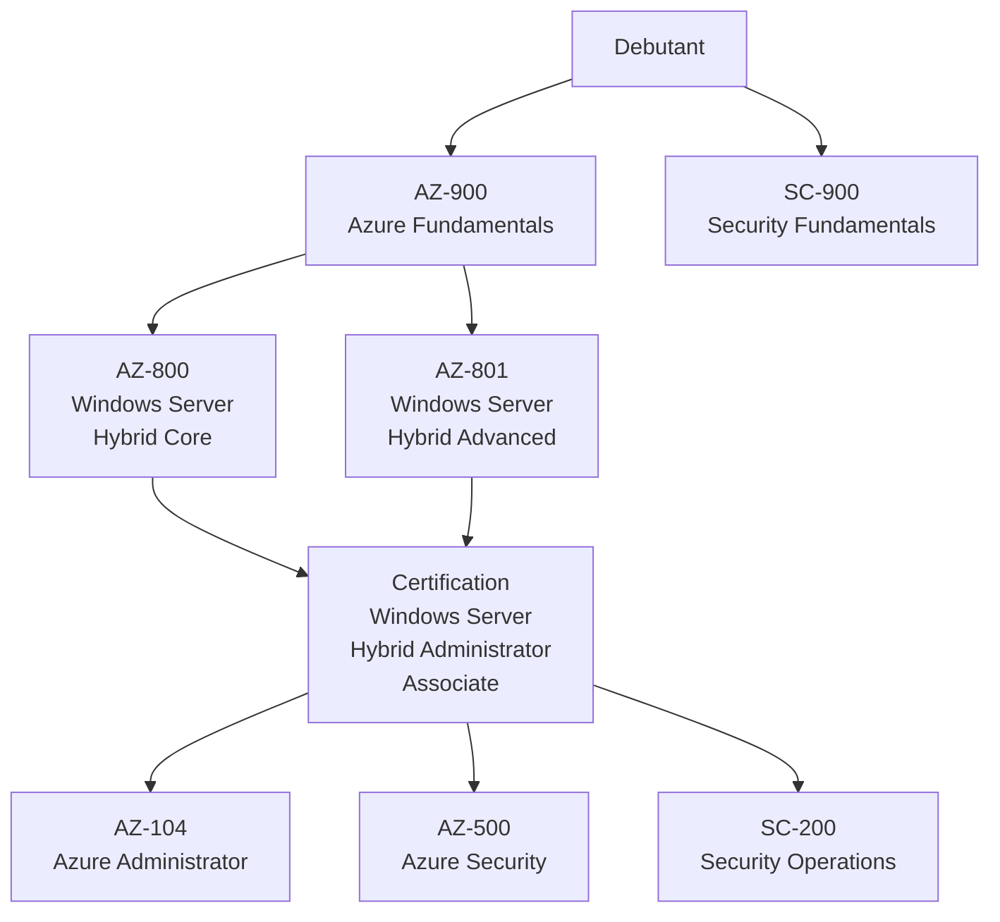

<!--
  Copyright 2026 Julien Bombled

  Licensed under the Apache License, Version 2.0 (the "License");
  you may not use this file except in compliance with the License.
  You may obtain a copy of the License at

      http://www.apache.org/licenses/LICENSE-2.0

  Unless required by applicable law or agreed to in writing, software
  distributed under the License is distributed on an "AS IS" BASIS,
  WITHOUT WARRANTIES OR CONDITIONS OF ANY KIND, either express or implied.
  See the License for the specific language governing permissions and
  limitations under the License.
-->

# Certifications Microsoft

Reference · Temps estime : 10 minutes

---

Guide des certifications Microsoft pertinentes pour les administrateurs Windows Server.

## Vue d'ensemble du parcours

!!! info "Certification Windows Server Hybrid Administrator Associate"

    Cette certification necessite de reussir **les deux examens** AZ-800 et AZ-801.
    C'est la certification de reference pour les administrateurs Windows Server modernes.

## Certifications Fundamentals (niveau debutant)

### AZ-900 : Azure Fundamentals

| Parametre | Detail |
|-----------|--------|
| **Niveau** | Debutant |
| **Prerequis** | Aucun |
| **Format** | 40-60 questions, 85 minutes |
| **Score minimal** | 700/1000 |
| **Prix** | ~165 EUR |

**Competences evaluees :**

| Domaine | Poids |
|---------|-------|
| Concepts du cloud | 25-30% |
| Architecture et services Azure | 35-40% |
| Gestion et gouvernance Azure | 30-35% |

!!! tip "Recommandation"

    Meme si AZ-900 n'est pas obligatoire avant AZ-800/AZ-801, elle est fortement recommandee
    pour maitriser les concepts cloud utilises dans les examens avances.

**Ressources de preparation :**

- [Parcours Microsoft Learn AZ-900](https://learn.microsoft.com/fr-fr/credentials/certifications/azure-fundamentals/)
- [Microsoft Virtual Training Days](https://events.microsoft.com/en-us/mvtd) (gratuit, inclut un voucher d'examen)

---

### SC-900 : Security, Compliance, and Identity Fundamentals

| Parametre | Detail |
|-----------|--------|
| **Niveau** | Debutant |
| **Prerequis** | Aucun |
| **Format** | 40-60 questions, 65 minutes |
| **Score minimal** | 700/1000 |
| **Prix** | ~165 EUR |

**Competences evaluees :**

| Domaine | Poids |
|---------|-------|
| Concepts de securite, conformite et identite | 10-15% |
| Microsoft Entra | 25-30% |
| Solutions de securite Microsoft | 25-30% |
| Solutions de conformite Microsoft | 25-30% |

## Certifications Associate (niveau intermediaire)

### AZ-800 : Administering Windows Server Hybrid Core Infrastructure

| Parametre | Detail |
|-----------|--------|
| **Niveau** | Intermediaire |
| **Prerequis recommandes** | Experience Windows Server, bases Azure |
| **Format** | 40-60 questions + labs possibles, 120 minutes |
| **Score minimal** | 700/1000 |
| **Prix** | ~165 EUR |

**Competences evaluees :**

| Domaine | Poids | Themes |
|---------|-------|--------|
| Deployer et gerer AD DS | 30-35% | Installation DC, gestion des objets, sites et replication, Azure AD Connect |
| Gerer les serveurs Windows | 25-30% | Server Core, installation de roles, GPO, administration a distance (WinRM, WAC) |
| Faciliter la gestion hybride | 10-15% | Azure Arc, Azure AD, Azure Policy |
| Gerer les machines virtuelles et conteneurs | 25-30% | Hyper-V, VMs, conteneurs Windows, Azure Migrate |

!!! tip "Correspondance avec WinOpsLab"

    La majorite du contenu AZ-800 est couvert dans les sections suivantes :

    - [Active Directory](../active-directory/index.md) : AD DS, sites, replication
    - [Fondamentaux](../fondamentaux/index.md) : Installation, Server Core, roles
    - [GPO](../active-directory/gpo/index.md) : Strategies de groupe
    - [Virtualisation](../virtualisation/index.md) : Hyper-V
    - [Gestion moderne](../gestion-moderne/index.md) : WAC, Azure Arc, Azure AD Connect

---

### AZ-801 : Configuring Windows Server Hybrid Advanced Services

| Parametre | Detail |
|-----------|--------|
| **Niveau** | Intermediaire |
| **Prerequis recommandes** | AZ-800 ou experience equivalente |
| **Format** | 40-60 questions + labs possibles, 120 minutes |
| **Score minimal** | 700/1000 |
| **Prix** | ~165 EUR |

**Competences evaluees :**

| Domaine | Poids | Themes |
|---------|-------|--------|
| Securiser l'infrastructure Windows Server | 25-30% | CA/PKI, durcissement, JEA, credentials, SMB, BitLocker |
| Haute disponibilite | 30-35% | Failover Clustering, Storage Spaces Direct, sauvegarde, reprise d'activite |
| Reprise d'activite | 10-15% | Azure Backup, Azure Site Recovery, Hyper-V Replica |
| Supervision et depannage | 20-25% | Event Viewer, Performance Monitor, Azure Monitor, depannage reseau et AD |

!!! tip "Correspondance avec WinOpsLab"

    Le contenu AZ-801 est couvert dans :

    - [Securite](../securite/index.md) : PKI, durcissement, LAPS
    - [Haute disponibilite](../haute-disponibilite/index.md) : Clustering, sauvegarde
    - [Supervision](../supervision/index.md) : Monitoring, logs, depannage
    - [Gestion moderne](../gestion-moderne/index.md) : Azure Backup, Azure Monitor

---

### AZ-104 : Azure Administrator Associate

| Parametre | Detail |
|-----------|--------|
| **Niveau** | Intermediaire |
| **Prerequis recommandes** | AZ-900, experience Azure |
| **Format** | 40-60 questions + labs, 120 minutes |
| **Score minimal** | 700/1000 |
| **Prix** | ~165 EUR |

**Competences evaluees :**

| Domaine | Poids |
|---------|-------|
| Gestion des identites et de la gouvernance | 20-25% |
| Implementation et gestion du stockage | 15-20% |
| Deploiement et gestion des ressources de calcul | 20-25% |
| Implementation et gestion du reseau virtuel | 15-20% |
| Supervision et maintien des ressources Azure | 10-15% |

!!! info "Complementarite"

    AZ-104 est complementaire a AZ-800/AZ-801 pour les administrateurs gerant
    des environnements hybrides. Elle approfondit la partie Azure.

## Certifications specialisees

### AZ-500 : Azure Security Technologies

| Parametre | Detail |
|-----------|--------|
| **Niveau** | Intermediaire |
| **Focus** | Securite cloud et hybride |
| **Prix** | ~165 EUR |

Pertinente pour les administrateurs souhaitant se specialiser en securite des environnements Azure et hybrides (Microsoft Defender, Sentinel, Key Vault, identites).

---

### SC-200 : Security Operations Analyst

| Parametre | Detail |
|-----------|--------|
| **Niveau** | Intermediaire |
| **Focus** | Operations de securite (SOC) |
| **Prix** | ~165 EUR |

Couvre Microsoft Sentinel, Microsoft Defender (XDR, Endpoint, Cloud Apps), et l'investigation des incidents de securite.

## Conseils de preparation

### Methodologie recommandee

| Etape | Action | Duree estimee |
|-------|--------|---------------|
| 1 | Parcourir le plan de l'examen sur Microsoft Learn | 1 jour |
| 2 | Suivre les parcours d'apprentissage Microsoft Learn | 2-4 semaines |
| 3 | Pratiquer dans un lab (WinOpsLab) | 2-3 semaines |
| 4 | Completer avec des formations video (Pluralsight, YouTube) | 1-2 semaines |
| 5 | S'entrainer avec des tests blancs | 1-2 semaines |
| 6 | Reviser les points faibles identifies | 1 semaine |

### Ressources de preparation

| Type | Ressources |
|------|-----------|
| **Gratuit** | Microsoft Learn, Microsoft Virtual Training Days, YouTube (John Savill) |
| **Payant** | Pluralsight, CBT Nuggets, Whizlabs (tests blancs), MeasureUp (tests officiels) |
| **Pratique** | WinOpsLab (ce site), Azure Free Account, Microsoft Learn Sandbox |

### Types de questions

| Type | Description |
|------|-------------|
| **QCM classique** | Une seule bonne reponse parmi 4 |
| **QCM multiple** | Plusieurs bonnes reponses a selectionner |
| **Glisser-deposer** | Ordonner des etapes ou associer des elements |
| **Etude de cas** | Scenario complet avec plusieurs questions |
| **Lab interactif** | Realiser des taches dans un environnement Azure reel |

!!! warning "Attention aux labs"

    Les examens AZ-800 et AZ-801 peuvent inclure des **labs pratiques** dans un
    environnement reel. Bien maitriser les commandes PowerShell et les consoles
    d'administration est indispensable.

### Gestion du temps le jour de l'examen

| Phase | Conseil |
|-------|---------|
| **Avant** | Se connecter 15 minutes en avance, verifier l'environnement |
| **Debut** | Lire toutes les questions de l'etude de cas avant de repondre |
| **Pendant** | Marquer les questions difficiles et y revenir |
| **Labs** | Commencer par les labs (ils prennent du temps et ne permettent pas de revenir) |
| **Fin** | Revoir les questions marquees si le temps le permet |

## Renouvellement des certifications

!!! info "Politique de renouvellement"

    Les certifications role-based (Associate, Expert) doivent etre renouvelees
    **tous les ans** via une evaluation gratuite sur Microsoft Learn.
    Les certifications Fundamentals n'expirent pas.

| Type | Validite | Renouvellement |
|------|----------|----------------|
| Fundamentals | Illimitee | Aucun |
| Associate | 1 an | Evaluation en ligne gratuite |
| Expert | 1 an | Evaluation en ligne gratuite |

## Points cles a retenir

- La certification **Windows Server Hybrid Administrator** (AZ-800 + AZ-801) est la reference du metier
- Commencer par **AZ-900** pour poser les bases cloud avant les examens avances
- La **pratique en lab** est indispensable, surtout pour les questions avec labs interactifs
- **Microsoft Learn** propose des parcours gratuits et complets pour chaque examen
- Les certifications doivent etre **renouvelees annuellement** (gratuitement en ligne)
- Le parcours ideal : AZ-900 > AZ-800 + AZ-801 > AZ-104 ou AZ-500 selon la specialisation

## Pour aller plus loin

- [Liens utiles](liens-utiles.md)
- [Commandes essentielles](commandes-essentielles.md)
- [Glossaire des termes](glossaire.md)

