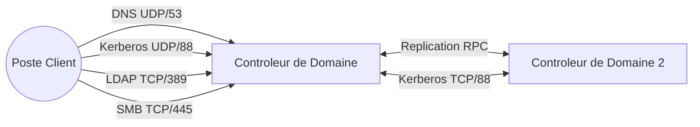

<!--
  Copyright 2026 Julien Bombled

  Licensed under the Apache License, Version 2.0 (the "License");
  you may not use this file except in compliance with the License.
  You may obtain a copy of the License at

      http://www.apache.org/licenses/LICENSE-2.0

  Unless required by applicable law or agreed to in writing, software
  distributed under the License is distributed on an "AS IS" BASIS,
  WITHOUT WARRANTIES OR CONDITIONS OF ANY KIND, either express or implied.
  See the License for the specific language governing permissions and
  limitations under the License.
-->

# Memento : Ports Active Directory

<span class="level-beginner">Reference</span> · Temps estime : 10 minutes

---

Cette fiche de reference liste les ports reseau indispensables au bon fonctionnement d'une infrastructure Active Directory.

## Flux de communication



## Tableau des ports essentiels

| Port | Protocole | Service | Description | Critique ? |
| :---: | :---: | :--- | :--- | :---: |
| **53** | TCP/UDP | **DNS** | Resolution de noms et localisation des services (SRV). | ✅ |
| **88** | TCP/UDP | **Kerberos** | Authentification des utilisateurs et ordinateurs. | ✅ |
| **135** | TCP | **RPC Endpoint Mapper** | Initialisation des connexions RPC (Replication, DCOM). | ✅ |
| **389** | TCP/UDP | **LDAP** | Annuaire (Lightweight Directory Access Protocol). | ✅ |
| **445** | TCP | **SMB / CIFS** | Acces aux fichiers (SYSVOL, scripts de connexion) et RPC nommes. | ✅ |
| **464** | TCP/UDP | **Kerberos Change Password** | Changement et reinitialisation de mot de passe. | ⚠️ |
| **636** | TCP | **LDAPS** | LDAP securise via SSL/TLS. | ⚠️ |
| **3268** | TCP | **Global Catalog** | LDAP pour le Catalogue Global (forets multi-domaines). | ⚠️ |
| **3269** | TCP | **Global Catalog SSL** | Catalogue Global securise. | ⚠️ |
| **49152+**| TCP | **RPC Dynamic Ports** | Plage de ports dynamiques pour la replication AD et les outils d'admin. | ✅ |

## Commandes de verification rapide

### Tester un port depuis un client (PowerShell)

```powershell
# Tester le port LDAP (389)
Test-NetConnection -ComputerName "DC-01" -Port 389

# Tester le port Kerberos (88)
Test-NetConnection -ComputerName "DC-01" -Port 88
```

Resultat :

```text
ComputerName     : DC-01
RemoteAddress    : 10.0.0.10
RemotePort       : 389
TcpTestSucceeded : True

ComputerName     : DC-01
RemoteAddress    : 10.0.0.10
RemotePort       : 88
TcpTestSucceeded : True
```

### Lister les ports en ecoute sur le DC

```powershell
# Afficher les ports d'ecoute locaux lies aux processus
Get-NetTCPConnection -State Listen | Sort-Object LocalPort | Select-Object LocalPort, OwningProcess
```

Resultat (extrait) :

```text
LocalPort OwningProcess
--------- -------------
       53          2584
       88          1028
      135           964
      389          1028
      445             4
      464          1028
      636          1028
     3268          1028
     3269          1028
     5985             4
     9389          3612
```
