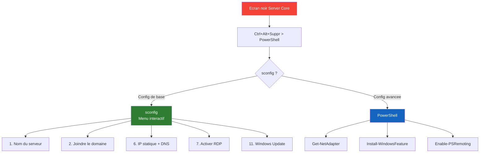

<!--
  Copyright 2026 Julien Bombled

  Licensed under the Apache License, Version 2.0 (the "License");
  you may not use this file except in compliance with the License.
  You may obtain a copy of the License at

      http://www.apache.org/licenses/LICENSE-2.0

  Unless required by applicable law or agreed to in writing, software
  distributed under the License is distributed on an "AS IS" BASIS,
  WITHOUT WARRANTIES OR CONDITIONS OF ANY KIND, either express or implied.
  See the License for the specific language governing permissions and
  limitations under the License.
-->
---
title: Memento Server Core
description: Guide de survie pour administrer Windows Server Core sans interface graphique. Commandes essentielles et sconfig.
tags:
  - server-core
  - powershell
  - cheat-sheet
  - administration
---

# Memento : Survivre en Server Core

<span class="level-beginner">Essentiel</span> · Temps estime : 15 minutes

---

Windows Server Core est le mode d'installation recommande par Microsoft : pas de Bureau, pas de souris, juste une invite de commande. C'est plus securise, plus leger, mais plus intimidant.

## L'outil magique : sconfig

Si vous ne devez retenir qu'une commande, c'est celle-la. Elle lance un menu textuel pour configurer 90% des besoins de base.

```powershell
sconfig
```

**Ce que vous pouvez faire avec :**
*   Changer le nom du serveur
*   Joindre un domaine
*   Configurer l'IP statique et les DNS
*   Activer le Bureau a distance (RDP)
*   Installer les mises a jour Windows Update

---



## Commandes PowerShell essentielles

### Reseau

| Action | Commande |
| :--- | :--- |
| **Lister les cartes** | `Get-NetAdapter` |
| **Voir les IP** | `Get-NetIPAddress` |
| **Changer l'IP** | `New-NetIPAddress -InterfaceIndex 2 -IPAddress 10.0.0.10 -PrefixLength 24 -DefaultGateway 10.0.0.1` |
| **Changer les DNS** | `Set-DnsClientServerAddress -InterfaceIndex 2 -ServerAddresses 10.0.0.10, 8.8.8.8` |
| **Desactiver IPv6** | `Disable-NetAdapterBinding -Name "Ethernet" -ComponentID ms_tcpip6` |

### Pare-feu

| Action | Commande |
| :--- | :--- |
| **Voir l'etat** | `Get-NetFirewallProfile` |
| **Desactiver tout (Lab)** | `Set-NetFirewallProfile -Profile Domain,Public,Private -Enabled False` |
| **Autoriser le Ping** | `Set-NetFirewallRule -Name "FPS-ICMP4-ERQ-In" -Enabled True` |

### Gestion de fichiers

| Action | Commande |
| :--- | :--- |
| **Creer un dossier** | `New-Item -Path "C:\Partage" -ItemType Directory` |
| **Creer un partage SMB** | `New-SmbShare -Name "Docs" -Path "C:\Partage" -FullAccess "Tout le monde"` |
| **Telecharger un fichier** | `Invoke-WebRequest -Uri "https://site.com/file.zip" -OutFile "C:\file.zip"` |

### Administration a distance

Si vous etes bloque, gerez le serveur depuis votre poste Windows 10/11 avec les outils RSAT ou Windows Admin Center. Pour autoriser la gestion a distance :

```powershell
Enable-PSRemoting -Force
```

Ensuite, depuis votre poste d'admin :
```powershell
Enter-PSSession -ComputerName SRV-CORE-01 -Credential (Get-Credential)
```

## Depannage

**Le serveur a un ecran noir ?**
Appuyez sur `Ctrl + Alt + Suppr` > `Gestionnaire des taches` > `Fichier` > `Executer` > `powershell.exe` (ou `cmd.exe`).

**Comment redemarrer ?**
```powershell
Restart-Computer -Force
```

**Comment arreter ?**
```powershell
Stop-Computer -Force
```
