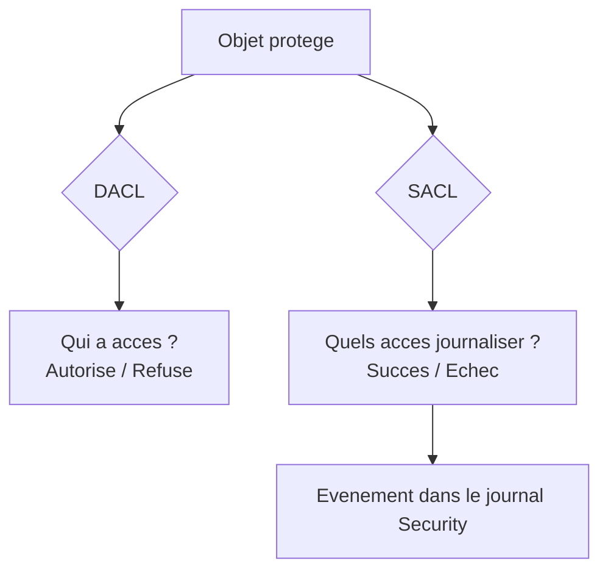

<!--
  Copyright 2026 Julien Bombled

  Licensed under the Apache License, Version 2.0 (the "License");
  you may not use this file except in compliance with the License.
  You may obtain a copy of the License at

      http://www.apache.org/licenses/LICENSE-2.0

  Unless required by applicable law or agreed to in writing, software
  distributed under the License is distributed on an "AS IS" BASIS,
  WITHOUT WARRANTIES OR CONDITIONS OF ANY KIND, either express or implied.
  See the License for the specific language governing permissions and
  limitations under the License.
-->

# Audit avance

<span class="level-advanced">Avance</span> · Temps estime : 40 minutes

L'audit avance va au-dela des evenements de connexion et de gestion de comptes. Il permet de tracer les acces aux fichiers, aux objets Active Directory et aux cles de registre grace aux SACL (System Access Control Lists).

---

## Comprendre les SACL

!!! example "Analogie"

    Une SACL fonctionne comme un detecteur de mouvement place a l'entree d'une piece sensible. La DACL, c'est la serrure qui decide qui peut entrer ou non. La SACL, c'est la camera qui enregistre chaque passage, que la personne soit autorisee ou non. Sans camera (SACL), meme si quelqu'un entre illegitimement, vous n'en aurez aucune trace.

Une **SACL** (System Access Control List) est une liste de controle d'acces definie sur un objet (fichier, dossier, objet AD, cle de registre) qui specifie quels acces doivent etre journalises.



### Difference entre DACL et SACL

| Liste | Role | Resultat |
|-------|------|----------|
| **DACL** | Definit les permissions (autoriser/refuser) | Acces accorde ou refuse |
| **SACL** | Definit les acces a auditer | Evenement journalise dans Security |

!!! tip "Prerequis"

    Pour que les SACL generent des evenements, l'**audit d'acces aux objets** doit etre active dans la politique d'audit :

    ```
    Computer Configuration > Policies > Windows Settings
      > Security Settings > Advanced Audit Policy Configuration
        > Object Access
          > Audit File System : Success, Failure
          > Audit Registry : Failure
    ```

---

## Audit d'acces aux fichiers

### Etape 1 : activer l'audit Object Access

```powershell
# Enable file system auditing via auditpol
auditpol /set /subcategory:"File System" /success:enable /failure:enable

# Verify the setting
auditpol /get /subcategory:"File System"
```

### Etape 2 : configurer la SACL sur le dossier cible

```powershell
# Add an audit rule on a folder (audit Everyone for delete and write operations)
$folderPath = "D:\Partage\Confidentiel"

$acl = Get-Acl -Path $folderPath -Audit

# Create audit rule: who, what, inheritance, propagation, type
$auditRule = New-Object System.Security.AccessControl.FileSystemAuditRule(
    "Everyone",                          # Principal to audit
    "Delete,Write,ChangePermissions",    # Operations to audit
    "ContainerInherit,ObjectInherit",    # Inheritance flags
    "None",                              # Propagation flags
    "Success,Failure"                    # Audit type
)

$acl.AddAuditRule($auditRule)
Set-Acl -Path $folderPath -AclObject $acl

# Verify the SACL
(Get-Acl -Path $folderPath -Audit).Audit | Format-Table -AutoSize
```

Resultat :

```text
FileSystemRights  AuditFlags  IdentityReference  IsInherited  InheritanceFlags
----------------  ----------  -----------------  -----------  ----------------
Delete, Write,    Success,    Everyone           False        ContainerInherit,
ChangePermissions Failure                                     ObjectInherit
```

### Etape 3 : analyser les evenements generes

Les acces aux fichiers generent l'Event ID **4663** (tentative d'acces a un objet) :

```powershell
# Query file access audit events
Get-WinEvent -FilterHashtable @{
    LogName = 'Security'
    Id = 4663
} -MaxEvents 20 |
    ForEach-Object {
        $xml = [xml]$_.ToXml()
        [PSCustomObject]@{
            Time       = $_.TimeCreated
            Account    = $xml.Event.EventData.Data | Where-Object { $_.Name -eq 'SubjectUserName' } | Select-Object -ExpandProperty '#text'
            ObjectName = $xml.Event.EventData.Data | Where-Object { $_.Name -eq 'ObjectName' } | Select-Object -ExpandProperty '#text'
            AccessMask = $xml.Event.EventData.Data | Where-Object { $_.Name -eq 'AccessMask' } | Select-Object -ExpandProperty '#text'
            ProcessName= $xml.Event.EventData.Data | Where-Object { $_.Name -eq 'ProcessName' } | Select-Object -ExpandProperty '#text'
        }
    } | Format-Table -AutoSize
```

Resultat :

```text
Time                  Account       ObjectName                           AccessMask  ProcessName
----                  -------       ----------                           ----------  -----------
2025-02-20 14:22:10   jdupont       D:\Partage\Confidentiel\budget.xlsx  0x2         C:\Program Files\...\EXCEL.EXE
2025-02-20 14:20:05   mlambert      D:\Partage\Confidentiel\RH\          0x10000     C:\Windows\explorer.exe
2025-02-20 14:18:32   svc-backup    D:\Partage\Confidentiel\             0x1         C:\Windows\system32\robocopy.exe
```

### Event IDs lies a l'acces fichiers

| Event ID | Description |
|----------|-------------|
| **4656** | Handle demande sur un objet |
| **4658** | Handle ferme |
| **4660** | Objet supprime |
| **4663** | Tentative d'acces a un objet |
| **4670** | Permissions d'un objet modifiees |

### Masques d'acces courants

| Access Mask | Signification |
|-------------|---------------|
| `0x1` | ReadData / ListDirectory |
| `0x2` | WriteData / AddFile |
| `0x4` | AppendData / AddSubdirectory |
| `0x10000` | Delete |
| `0x40000` | WriteDACL (modification des permissions) |
| `0x80000` | WriteOwner (prise de propriete) |

---

## Audit des objets Active Directory

### Etape 1 : activer l'audit Directory Service

```powershell
# Enable DS Access auditing
auditpol /set /subcategory:"Directory Service Access" /success:enable /failure:enable
auditpol /set /subcategory:"Directory Service Changes" /success:enable
```

Resultat :

```text
The command was successfully executed.
The command was successfully executed.
```

### Etape 2 : configurer la SACL sur les objets AD

Via ADSI Edit ou la console Active Directory Users and Computers (onglet Securite > Avance > Audit) :

```powershell
# Example: add audit entry on an OU using PowerShell
Import-Module ActiveDirectory

$ouDN = "OU=Admins,DC=lab,DC=local"
$acl = Get-Acl -Path "AD:\$ouDN" -Audit

# Audit modifications by Everyone on user objects
$identityRef = New-Object System.Security.Principal.SecurityIdentifier("S-1-1-0")  # Everyone
$adRight = [System.DirectoryServices.ActiveDirectoryRights]::WriteProperty
$auditFlags = [System.Security.AccessControl.AuditFlags]::Success
$inheritanceType = [System.DirectoryServices.ActiveDirectorySecurityInheritance]::Descendents

# GUID for User object class
$userObjectGuid = [Guid]"bf967aba-0de6-11d0-a285-00aa003049e2"

$auditRule = New-Object System.DirectoryServices.ActiveDirectoryAuditRule(
    $identityRef,
    $adRight,
    $auditFlags,
    $inheritanceType,
    $userObjectGuid
)

$acl.AddAuditRule($auditRule)
Set-Acl -Path "AD:\$ouDN" -AclObject $acl
```

### Event IDs Active Directory

| Event ID | Description |
|----------|-------------|
| **4662** | Operation effectuee sur un objet AD |
| **5136** | Attribut d'objet AD modifie |
| **5137** | Objet AD cree |
| **5138** | Objet AD restaure (undelete) |
| **5139** | Objet AD deplace |
| **5141** | Objet AD supprime |

### Analyser les modifications AD

```powershell
# Query AD object modifications (Event 5136)
Get-WinEvent -FilterHashtable @{
    LogName = 'Security'
    Id = 5136
} -MaxEvents 20 |
    ForEach-Object {
        $xml = [xml]$_.ToXml()
        [PSCustomObject]@{
            Time          = $_.TimeCreated
            ChangedBy     = $xml.Event.EventData.Data | Where-Object { $_.Name -eq 'SubjectUserName' } | Select-Object -ExpandProperty '#text'
            ObjectDN      = $xml.Event.EventData.Data | Where-Object { $_.Name -eq 'ObjectDN' } | Select-Object -ExpandProperty '#text'
            AttributeName = $xml.Event.EventData.Data | Where-Object { $_.Name -eq 'AttributeLDAPDisplayName' } | Select-Object -ExpandProperty '#text'
            OldValue      = $xml.Event.EventData.Data | Where-Object { $_.Name -eq 'AttributeValue' -and $_.InnerXml -match 'Old' } | Select-Object -ExpandProperty '#text'
            NewValue      = $xml.Event.EventData.Data | Where-Object { $_.Name -eq 'AttributeValue' } | Select-Object -First 1 -ExpandProperty '#text'
        }
    } | Format-Table -AutoSize
```

Resultat :

```text
Time                  ChangedBy     ObjectDN                                      AttributeName     NewValue
----                  ---------     --------                                      -------------     --------
2025-02-20 10:15:32   T0-jdupont    CN=jmartin,OU=Users,DC=lab,DC=local          description       Comptabilite
2025-02-20 09:45:10   T0-mlambert   CN=svc-app,OU=Services,DC=lab,DC=local       userAccountControl 512
2025-02-19 16:30:22   T0-jdupont    CN=GPO-Security,CN=Policies,...              gPCMachineExt...  [{35378...
```

---

## Scenarios de detection

### Detection de suppression de fichiers

```powershell
# Detect file deletions in a monitored folder
Get-WinEvent -FilterHashtable @{
    LogName = 'Security'
    Id = 4660
} -MaxEvents 50 |
    ForEach-Object {
        $xml = [xml]$_.ToXml()
        [PSCustomObject]@{
            Time    = $_.TimeCreated
            Account = $xml.Event.EventData.Data | Where-Object { $_.Name -eq 'SubjectUserName' } | Select-Object -ExpandProperty '#text'
            Object  = $xml.Event.EventData.Data | Where-Object { $_.Name -eq 'ObjectName' } | Select-Object -ExpandProperty '#text'
        }
    } | Format-Table -AutoSize
```

### Detection de modification de permissions

```powershell
# Detect permission changes on objects (Event 4670)
Get-WinEvent -FilterHashtable @{
    LogName = 'Security'
    Id = 4670
} -MaxEvents 20 |
    ForEach-Object {
        $xml = [xml]$_.ToXml()
        [PSCustomObject]@{
            Time       = $_.TimeCreated
            Account    = $xml.Event.EventData.Data | Where-Object { $_.Name -eq 'SubjectUserName' } | Select-Object -ExpandProperty '#text'
            ObjectName = $xml.Event.EventData.Data | Where-Object { $_.Name -eq 'ObjectName' } | Select-Object -ExpandProperty '#text'
            OldSD      = $xml.Event.EventData.Data | Where-Object { $_.Name -eq 'OldSd' } | Select-Object -ExpandProperty '#text'
            NewSD      = $xml.Event.EventData.Data | Where-Object { $_.Name -eq 'NewSd' } | Select-Object -ExpandProperty '#text'
        }
    } | Format-Table -AutoSize
```

### Detection d'ajout a Domain Admins

```powershell
# Detect additions to the Domain Admins group specifically
Get-WinEvent -FilterHashtable @{
    LogName = 'Security'
    Id = @(4728, 4756)
} -MaxEvents 50 -ErrorAction SilentlyContinue |
    ForEach-Object {
        $xml = [xml]$_.ToXml()
        $groupName = $xml.Event.EventData.Data | Where-Object { $_.Name -eq 'TargetUserName' } | Select-Object -ExpandProperty '#text'
        if ($groupName -match "Domain Admins|Enterprise Admins|Schema Admins") {
            [PSCustomObject]@{
                Time        = $_.TimeCreated
                GroupName   = $groupName
                MemberAdded = $xml.Event.EventData.Data | Where-Object { $_.Name -eq 'MemberName' } | Select-Object -ExpandProperty '#text'
                ChangedBy   = $xml.Event.EventData.Data | Where-Object { $_.Name -eq 'SubjectUserName' } | Select-Object -ExpandProperty '#text'
            }
        }
    } | Format-Table -AutoSize
```

---

## Audit du registre

### Configurer une SACL sur une cle de registre

```powershell
# Enable registry auditing
auditpol /set /subcategory:"Registry" /success:enable /failure:enable

# Add audit rule on a sensitive registry key
$regPath = "HKLM:\SYSTEM\CurrentControlSet\Services"
$acl = Get-Acl -Path $regPath -Audit

$auditRule = New-Object System.Security.AccessControl.RegistryAuditRule(
    "Everyone",
    "SetValue,Delete",
    "ContainerInherit",
    "None",
    "Success,Failure"
)

$acl.AddAuditRule($auditRule)
Set-Acl -Path $regPath -AclObject $acl
```

---

## Volume des evenements et optimisation

!!! warning "Attention au bruit"

    L'audit d'acces aux objets peut generer un **volume enorme** d'evenements. Recommandations :

    - N'auditez que les dossiers/objets **sensibles** (pas la racine C:\)
    - Ciblez les operations **critiques** (Delete, Write, ChangePermissions), pas Read
    - Utilisez des **groupes specifiques** plutot que Everyone quand possible
    - Dimensionnez le journal Security en consequence (4 Go minimum)
    - Centralisez les evenements dans un **SIEM** pour l'analyse

---

## Scenario pratique

!!! example "Scenario pratique"

    **Contexte** : Valerie, responsable conformite, doit mettre en place un audit sur le dossier partage `D:\Partage\Direction` sur le serveur `SRV-01` (10.0.0.11) suite a la disparition suspecte de documents financiers. Le directeur soupconne qu'un employe a supprime des fichiers intentionnellement.

    **Mise en place de l'audit** :

    ```powershell
    # 1. Enable file system auditing
    auditpol /set /subcategory:"File System" /success:enable /failure:enable

    # 2. Add SACL on the target folder
    $folderPath = "D:\Partage\Direction"
    $acl = Get-Acl -Path $folderPath -Audit
    $auditRule = New-Object System.Security.AccessControl.FileSystemAuditRule(
        "Everyone", "Delete,Write", "ContainerInherit,ObjectInherit", "None", "Success"
    )
    $acl.AddAuditRule($auditRule)
    Set-Acl -Path $folderPath -AclObject $acl
    ```

    **Investigation apres 48h** :

    ```powershell
    # Search for file deletion events in the monitored folder
    Get-WinEvent -FilterHashtable @{
        LogName = 'Security'; Id = 4660
        StartTime = (Get-Date).AddDays(-2)
    } | ForEach-Object {
        $xml = [xml]$_.ToXml()
        $account = $xml.Event.EventData.Data | Where-Object { $_.Name -eq 'SubjectUserName' } | Select-Object -ExpandProperty '#text'
        $object = $xml.Event.EventData.Data | Where-Object { $_.Name -eq 'ObjectName' } | Select-Object -ExpandProperty '#text'
        if ($object -match "Direction") {
            [PSCustomObject]@{ Time = $_.TimeCreated; Account = $account; File = $object }
        }
    }
    ```

    Resultat :

    ```text
    Time                   Account    File
    ----                   -------    ----
    2025-02-19 23:45:12    rmartin    D:\Partage\Direction\Budget_2025_v3.xlsx
    2025-02-19 23:45:08    rmartin    D:\Partage\Direction\Previsions_Q1.docx
    2025-02-19 23:44:55    rmartin    D:\Partage\Direction\Comptes_rendus\CR_CA_fev.docx
    ```

    **Conclusion** : le compte `rmartin` a supprime trois fichiers a 23h45. Valerie transmet les logs au service juridique avec les horodatages precis et l'identite du compte.

---

!!! danger "Erreurs courantes"

    1. **Placer une SACL sur la racine du disque** : auditer `C:\` ou `D:\` genere des millions d'evenements et sature le journal Security en quelques heures. Ciblez uniquement les dossiers sensibles.

    2. **Auditer les acces en lecture (Read) sur des dossiers tres frequentes** : l'acces en lecture genere un volume d'evenements enorme et noie les informations pertinentes. Auditez les operations critiques : Delete, Write, ChangePermissions.

    3. **Oublier d'activer l'audit Object Access dans la politique** : configurer une SACL sur un dossier sans activer `auditpol /set /subcategory:"File System"` ne produit aucun evenement. Les deux etapes sont indissociables.

    4. **Utiliser Everyone comme principal d'audit quand un groupe cible suffit** : sur un dossier accede par 500 utilisateurs, auditer Everyone genere du bruit. Ciblez un groupe specifique si vous suspectez un acces non autorise precis.

---

## Points cles a retenir

- Les **SACL** definissent quels acces sont journalises sur un objet specifique
- L'audit d'**acces aux fichiers** (4663) necessite l'activation de "File System" dans l'audit avance ET une SACL sur le dossier cible
- L'audit **Active Directory** (5136, 5137, 5141) trace les modifications d'attributs, creations et suppressions d'objets
- Le **volume d'evenements** doit etre maitrise en ciblant les objets et operations sensibles uniquement
- Les requetes PowerShell avec `Get-WinEvent` et parsing XML sont les outils essentiels d'analyse
- La centralisation via **SIEM** est incontournable pour l'exploitation operationnelle

---

## Pour aller plus loin

- Politique d'audit (voir la page [Politique d'audit](politique-audit.md))
- Journaux d'evenements et Event IDs cles (voir la page [Journaux d'evenements](journaux-evenements.md))
- Microsoft : Auditing file access
- Microsoft : Monitoring Active Directory for signs of compromise
- MITRE ATT&CK : Data Source - Windows Event Logs

