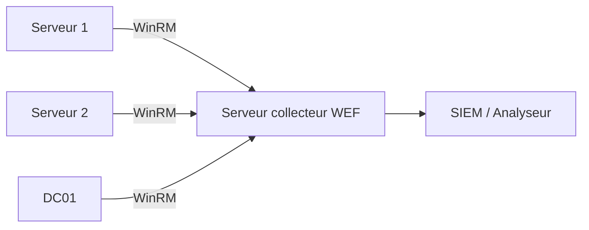

# Journaux d'evenements

!!! info "Niveau : avance | Temps estime : 45 minutes"

Les journaux d'evenements Windows sont la source principale d'information pour la detection d'incidents, l'investigation forensique et la conformite. Maitriser les Event IDs critiques et les requetes PowerShell associees est indispensable pour tout administrateur securite.

---

## Les journaux principaux

| Journal | Chemin | Contenu |
|---------|--------|---------|
| **Security** | `Security` | Authentifications, acces aux objets, modifications de privileges |
| **System** | `System` | Evenements systeme, services, pilotes |
| **Application** | `Application` | Evenements des applications |
| **PowerShell** | `Microsoft-Windows-PowerShell/Operational` | Execution de scripts et commandes |
| **Sysmon** | `Microsoft-Windows-Sysmon/Operational` | Supervision avancee (si installe) |
| **TaskScheduler** | `Microsoft-Windows-TaskScheduler/Operational` | Taches planifiees |

```powershell
# List all available event logs
Get-WinEvent -ListLog * | Where-Object { $_.RecordCount -gt 0 } |
    Select-Object LogName, RecordCount, MaximumSizeInBytes |
    Sort-Object RecordCount -Descending |
    Format-Table -AutoSize
```

---

## Event IDs critiques - Security Log

### Authentification et sessions

| Event ID | Description | Importance |
|----------|-------------|------------|
| **4624** | Ouverture de session reussie | Tracer les acces |
| **4625** | Echec d'ouverture de session | Detection de brute force |
| **4634** | Fermeture de session | Correlation avec 4624 |
| **4648** | Connexion avec identifiants explicites (RunAs) | Surveillance des elevations |
| **4672** | Privileges speciaux assignes a la session | Detection d'acces admin |
| **4776** | Validation de credentials (NTLM) | Detection Pass-the-Hash |

### Types de logon (Event 4624)

| Logon Type | Description | Contexte |
|------------|-------------|----------|
| **2** | Interactive | Connexion physique ou console |
| **3** | Network | Acces partage, impression |
| **4** | Batch | Tache planifiee |
| **5** | Service | Demarrage d'un service |
| **7** | Unlock | Deverrouillage de session |
| **8** | NetworkCleartext | Mot de passe en clair (IIS Basic Auth) |
| **10** | RemoteInteractive | Connexion RDP |
| **11** | CachedInteractive | Credentials mises en cache |

```powershell
# Query successful logons (Event 4624)
Get-WinEvent -FilterHashtable @{
    LogName = 'Security'
    Id = 4624
} -MaxEvents 20 |
    ForEach-Object {
        $xml = [xml]$_.ToXml()
        [PSCustomObject]@{
            Time       = $_.TimeCreated
            Account    = $xml.Event.EventData.Data | Where-Object { $_.Name -eq 'TargetUserName' } | Select-Object -ExpandProperty '#text'
            Domain     = $xml.Event.EventData.Data | Where-Object { $_.Name -eq 'TargetDomainName' } | Select-Object -ExpandProperty '#text'
            LogonType  = $xml.Event.EventData.Data | Where-Object { $_.Name -eq 'LogonType' } | Select-Object -ExpandProperty '#text'
            SourceIP   = $xml.Event.EventData.Data | Where-Object { $_.Name -eq 'IpAddress' } | Select-Object -ExpandProperty '#text'
        }
    } | Format-Table -AutoSize
```

```powershell
# Query failed logons (Event 4625) - Brute force detection
Get-WinEvent -FilterHashtable @{
    LogName = 'Security'
    Id = 4625
} -MaxEvents 50 |
    ForEach-Object {
        $xml = [xml]$_.ToXml()
        [PSCustomObject]@{
            Time     = $_.TimeCreated
            Account  = $xml.Event.EventData.Data | Where-Object { $_.Name -eq 'TargetUserName' } | Select-Object -ExpandProperty '#text'
            SourceIP = $xml.Event.EventData.Data | Where-Object { $_.Name -eq 'IpAddress' } | Select-Object -ExpandProperty '#text'
            Reason   = $xml.Event.EventData.Data | Where-Object { $_.Name -eq 'SubStatus' } | Select-Object -ExpandProperty '#text'
        }
    } | Format-Table -AutoSize
```

### Sous-statuts d'echec de connexion (4625)

| SubStatus | Signification |
|-----------|---------------|
| `0xC0000064` | Compte inexistant |
| `0xC000006A` | Mot de passe incorrect |
| `0xC0000234` | Compte verrouille |
| `0xC0000072` | Compte desactive |
| `0xC000006F` | Connexion hors des heures autorisees |
| `0xC0000070` | Restriction de station de travail |
| `0xC0000193` | Compte expire |

---

### Gestion des comptes

| Event ID | Description | Importance |
|----------|-------------|------------|
| **4720** | Compte utilisateur cree | Surveillance des creations |
| **4722** | Compte utilisateur active | Detection de comptes reactives |
| **4723** | Tentative de changement de mot de passe | Suivi des changements |
| **4724** | Reinitialisation de mot de passe par un admin | Verifier la legitimite |
| **4725** | Compte utilisateur desactive | Suivi du deprovisioning |
| **4726** | Compte utilisateur supprime | Tracer les suppressions |
| **4728** | Membre ajoute a un groupe global de securite | Surveillance des privileges |
| **4732** | Membre ajoute a un groupe local de securite | Surveillance des privileges |
| **4756** | Membre ajoute a un groupe universel de securite | Surveillance des privileges |

```powershell
# Monitor privileged group changes (Domain Admins, Enterprise Admins, etc.)
$privilegedGroupEvents = Get-WinEvent -FilterHashtable @{
    LogName = 'Security'
    Id = @(4728, 4732, 4756)
} -MaxEvents 50 -ErrorAction SilentlyContinue

$privilegedGroupEvents | ForEach-Object {
    $xml = [xml]$_.ToXml()
    [PSCustomObject]@{
        Time      = $_.TimeCreated
        EventId   = $_.Id
        GroupName = $xml.Event.EventData.Data | Where-Object { $_.Name -eq 'TargetUserName' } | Select-Object -ExpandProperty '#text'
        MemberAdded = $xml.Event.EventData.Data | Where-Object { $_.Name -eq 'MemberName' } | Select-Object -ExpandProperty '#text'
        ChangedBy = $xml.Event.EventData.Data | Where-Object { $_.Name -eq 'SubjectUserName' } | Select-Object -ExpandProperty '#text'
    }
} | Format-Table -AutoSize
```

### Autres evenements critiques

| Event ID | Journal | Description |
|----------|---------|-------------|
| **1102** | Security | Journal de securite efface (alerte critique) |
| **4688** | Security | Nouveau processus cree (avec command line logging) |
| **4697** | Security | Service installe sur le systeme |
| **4698** | Security | Tache planifiee creee |
| **4719** | Security | Politique d'audit modifiee |
| **7045** | System | Service installe |
| **7040** | System | Type de demarrage d'un service modifie |

!!! danger "Event 1102 - Journal efface"

    L'effacement du journal de securite (Event 1102) est un indicateur critique de compromission. Un attaquant efface frequemment les journaux pour couvrir ses traces. Cet evenement doit declencher une **alerte immediate**.

```powershell
# Detect Security log clearing (Event 1102)
Get-WinEvent -FilterHashtable @{
    LogName = 'Security'
    Id = 1102
} -ErrorAction SilentlyContinue |
    Select-Object TimeCreated, Message
```

---

## Event IDs cles - System Log

| Event ID | Description |
|----------|-------------|
| **6005** | Demarrage du service Event Log (boot) |
| **6006** | Arret du service Event Log (shutdown) |
| **6008** | Arret inattendu (crash/blue screen) |
| **7045** | Nouveau service installe |
| **1074** | Arret/redemarrage initie par un processus |

```powershell
# Find unexpected shutdowns
Get-WinEvent -FilterHashtable @{
    LogName = 'System'
    Id = @(6008, 1074)
} -MaxEvents 10 |
    Select-Object TimeCreated, Id, Message |
    Format-Table -Wrap
```

---

## Requetes avancees avec XPath

Pour des recherches precises, utilisez des filtres XPath :

```powershell
# Find RDP logons (LogonType 10) from a specific IP range
$xpathQuery = @"
*[System[EventID=4624]]
and
*[EventData[Data[@Name='LogonType']='10']]
and
*[EventData[Data[@Name='IpAddress']='192.168.1.']]
"@

# Using FilterXPath (simplified)
Get-WinEvent -LogName Security -FilterXPath `
    "*[System[EventID=4624] and EventData[Data[@Name='LogonType']='10']]" `
    -MaxEvents 10

# Find failed logons for a specific account
Get-WinEvent -LogName Security -FilterXPath `
    "*[System[EventID=4625] and EventData[Data[@Name='TargetUserName']='Administrator']]" `
    -MaxEvents 20
```

---

## Centralisation avec Windows Event Forwarding

Pour les environnements multi-serveurs, configurez le **Windows Event Forwarding (WEF)** pour centraliser les journaux :



```powershell
# On the collector server: configure the Windows Event Collector service
wecutil qc /q

# Create a subscription for critical security events
wecutil cs "C:\WEF\security-subscription.xml"

# On source servers: configure WinRM
winrm quickconfig -q

# Add the collector to the Event Log Readers local group on source servers
Add-LocalGroupMember -Group "Event Log Readers" -Member "LAB\WEF-Collector$"
```

---

## Points cles a retenir

- Les **Event IDs 4624/4625** (connexions) sont la base de toute surveillance de securite
- Les **Event IDs 4720-4726** (gestion des comptes) permettent de tracer le cycle de vie des comptes
- L'**Event 1102** (journal efface) est un indicateur critique de compromission
- Les **Logon Types** donnent le contexte essentiel : RDP (10), reseau (3), interactif (2)
- Les requetes **PowerShell avec XPath** permettent des recherches precises et performantes
- La **centralisation** via WEF ou SIEM est indispensable en environnement multi-serveurs

---

## Pour aller plus loin

- Audit avance des objets AD et fichiers (voir la page [Audit avance](audit-avance.md))
- Politique d'audit (voir la page [Politique d'audit](politique-audit.md))
- Microsoft : Windows Security Event Log reference
- MITRE ATT&CK : correlations Event ID / techniques d'attaque
