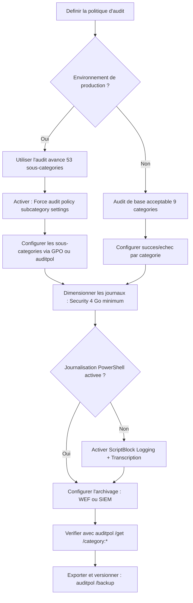

# Politique d'audit

<span class="level-advanced">Avance</span> · Temps estime : 35 minutes

La politique d'audit definit quels evenements de securite sont journalises sur un serveur Windows. Une configuration adaptee permet de detecter les tentatives d'intrusion, les acces non autorises et les modifications critiques.

---

## Arbre de decision pour la politique d'audit



!!! example "Analogie"

    Une politique d'audit est comparable au systeme de cameras de surveillance d'un immeuble. L'audit de base, ce sont 9 cameras couvrant les grandes zones (hall, parking, couloirs). L'audit avance, ce sont 53 cameras couvrant chaque porte, chaque fenetre et chaque armoire forte. Plus vous avez de cameras, plus vous pouvez reconstituer un incident, mais plus vous avez de bandes a stocker et a analyser.

## Audit de base vs audit avance

Windows Server propose deux niveaux de configuration des strategies d'audit :

| Aspect | Audit de base | Audit avance |
|--------|---------------|--------------|
| **Emplacement GPO** | Security Settings > Local Policies > Audit Policy | Security Settings > Advanced Audit Policy Configuration |
| **Granularite** | 9 categories | 53 sous-categories |
| **Precision** | Succes et/ou echec par categorie | Succes et/ou echec par sous-categorie |
| **Recommandation** | Environnements simples | **Recommande pour la production** |

!!! danger "Ne pas melanger les deux"

    Si l'audit avance est configure, il **ecrase** l'audit de base. Ne configurez pas les deux en parallele dans la meme GPO pour eviter des comportements imprevisibles.

### Forcer l'utilisation de l'audit avance

```
Computer Configuration
  > Policies
    > Windows Settings
      > Security Settings
        > Local Policies
          > Security Options
            > Audit: Force audit policy subcategory settings
               (Windows Vista or later) to override audit policy
               category settings : Enabled
```

---

## Les 9 categories d'audit de base

| Categorie | Description |
|-----------|-------------|
| **Account Logon Events** | Authentification Kerberos et NTLM |
| **Account Management** | Creation, modification, suppression de comptes |
| **Directory Service Access** | Acces aux objets Active Directory |
| **Logon Events** | Ouverture et fermeture de session locale/reseau |
| **Object Access** | Acces aux fichiers, registre, objets noyau |
| **Policy Change** | Modification des strategies de securite |
| **Privilege Use** | Utilisation de privileges eleves |
| **Process Tracking** | Creation et arret de processus |
| **System Events** | Demarrage, arret, evenements systeme |

---

## Configuration de l'audit avance

### Sous-categories recommandees

La configuration suivante represente un bon equilibre entre visibilite et volume de journalisation :

#### Account Logon

| Sous-categorie | Succes | Echec |
|----------------|--------|-------|
| Credential Validation | Oui | Oui |
| Kerberos Authentication Service | Oui | Oui |
| Kerberos Service Ticket Operations | Oui | Oui |

#### Account Management

| Sous-categorie | Succes | Echec |
|----------------|--------|-------|
| Computer Account Management | Oui | Oui |
| Security Group Management | Oui | Oui |
| User Account Management | Oui | Oui |

#### Logon/Logoff

| Sous-categorie | Succes | Echec |
|----------------|--------|-------|
| Logon | Oui | Oui |
| Logoff | Oui | Non |
| Special Logon | Oui | Non |
| Account Lockout | - | Oui |

#### Object Access

| Sous-categorie | Succes | Echec |
|----------------|--------|-------|
| File System | Oui | Oui |
| Registry | Non | Oui |
| Removable Storage | Oui | Oui |

#### Policy Change

| Sous-categorie | Succes | Echec |
|----------------|--------|-------|
| Audit Policy Change | Oui | Oui |
| Authentication Policy Change | Oui | Non |
| Authorization Policy Change | Oui | Non |

#### System

| Sous-categorie | Succes | Echec |
|----------------|--------|-------|
| Security State Change | Oui | Oui |
| Security System Extension | Oui | Oui |
| System Integrity | Oui | Oui |

---

## Configuration via GPO

### Creer la GPO d'audit

```powershell
# Create and link the audit GPO
$gpoName = "SEC - Audit Policy"
New-GPO -Name $gpoName
New-GPLink -Name $gpoName -Target "OU=Servers,DC=lab,DC=local" -LinkEnabled Yes
```

### Configuration via auditpol

La commande `auditpol` permet de configurer l'audit avance en ligne de commande :

```powershell
# View current audit policy
auditpol /get /category:*
```

Resultat :

```text
System audit policy
  Category/Subcategory                        Setting
  Account Logon
    Credential Validation                     No Auditing
    Kerberos Authentication Service           No Auditing
    Kerberos Service Ticket Operations        No Auditing
  Logon/Logoff
    Logon                                     No Auditing
    Logoff                                    No Auditing
  Account Management
    User Account Management                   No Auditing
    Security Group Management                 No Auditing
```

```powershell

# Configure recommended audit settings
# Account Logon
auditpol /set /subcategory:"Credential Validation" /success:enable /failure:enable
auditpol /set /subcategory:"Kerberos Authentication Service" /success:enable /failure:enable
auditpol /set /subcategory:"Kerberos Service Ticket Operations" /success:enable /failure:enable

# Account Management
auditpol /set /subcategory:"Computer Account Management" /success:enable /failure:enable
auditpol /set /subcategory:"Security Group Management" /success:enable /failure:enable
auditpol /set /subcategory:"User Account Management" /success:enable /failure:enable

# Logon/Logoff
auditpol /set /subcategory:"Logon" /success:enable /failure:enable
auditpol /set /subcategory:"Logoff" /success:enable
auditpol /set /subcategory:"Special Logon" /success:enable
auditpol /set /subcategory:"Account Lockout" /failure:enable

# Policy Change
auditpol /set /subcategory:"Audit Policy Change" /success:enable /failure:enable
auditpol /set /subcategory:"Authentication Policy Change" /success:enable

# System
auditpol /set /subcategory:"Security State Change" /success:enable /failure:enable
auditpol /set /subcategory:"Security System Extension" /success:enable /failure:enable
```

### Exporter et importer une politique d'audit

```powershell
# Export the current audit policy
auditpol /backup /file:"C:\Temp\audit-policy-backup.csv"

# Import an audit policy on another server
auditpol /restore /file:"C:\Temp\audit-policy-backup.csv"

# Clear all audit settings (to start fresh)
auditpol /clear /y
```

Resultat :

```text
The command was successfully executed.
The command was successfully executed.
```

---

## Configuration de la taille des journaux

Les journaux de securite doivent etre dimensionnes pour eviter l'ecrasement d'evenements importants.

```powershell
# View current Security log configuration
Get-WinEvent -ListLog Security | Select-Object LogName, MaximumSizeInBytes, LogMode

# Set Security log to 4 GB with auto-archive
wevtutil sl Security /ms:4294967296

# Alternatively via PowerShell
Limit-EventLog -LogName Security -MaximumSize 4GB -OverflowAction OverwriteAsNeeded
```

Resultat :

```text
LogName   MaximumSizeInBytes  LogMode
-------   ------------------  -------
Security           20971520   Circular

(taille par defaut : 20 Mo -> a augmenter a 4 Go)
```

### Recommandations de dimensionnement

| Journal | Taille recommandee | Remarque |
|---------|-------------------|----------|
| **Security** | 4 Go minimum | Journal principal d'audit |
| **System** | 1 Go | Evenements systeme |
| **Application** | 1 Go | Evenements applicatifs |
| **PowerShell** | 1 Go | Si ScriptBlock Logging actif |

!!! warning "Retention et archivage"

    Sur un controleur de domaine ou un serveur critique, les journaux peuvent se remplir tres rapidement. Mettez en place un mecanisme d'**archivage automatique** (Windows Event Forwarding, SIEM) pour ne pas perdre d'evenements.

---

## Activer la journalisation PowerShell

La journalisation PowerShell est essentielle pour detecter les activites malveillantes.

```
Computer Configuration
  > Policies
    > Administrative Templates
      > Windows Components
        > Windows PowerShell
          > Turn on Module Logging : Enabled (all modules = *)
          > Turn on PowerShell Script Block Logging : Enabled
          > Turn on PowerShell Transcription : Enabled
            - Transcript output directory : \\server\share\PStranscripts
            - Include invocation headers : Enabled
```

```powershell
# Verify PowerShell logging is active
Get-ItemProperty "HKLM:\SOFTWARE\Policies\Microsoft\Windows\PowerShell\ScriptBlockLogging" -ErrorAction SilentlyContinue
Get-ItemProperty "HKLM:\SOFTWARE\Policies\Microsoft\Windows\PowerShell\Transcription" -ErrorAction SilentlyContinue
```

Resultat :

```text
EnableScriptBlockLogging     : 1
EnableScriptBlockInvocationLogging : 0
PSPath                       : Microsoft.PowerShell.Core\Registry::HKLM:\SOFTWARE\...

EnableTranscripting          : 1
OutputDirectory              : \\SRV-01\PStranscripts
EnableInvocationHeader       : 1
PSPath                       : Microsoft.PowerShell.Core\Registry::HKLM:\SOFTWARE\...
```

---

## Verification de la politique effective

```powershell
# Display the effective audit policy on a server
auditpol /get /category:* /r | ConvertFrom-Csv | Format-Table -AutoSize

# Compare with the recommended baseline
$expected = @{
    "Credential Validation" = "Success and Failure"
    "Logon" = "Success and Failure"
    "Security Group Management" = "Success and Failure"
}

$current = auditpol /get /category:* /r | ConvertFrom-Csv
foreach ($policy in $expected.GetEnumerator()) {
    $match = $current | Where-Object { $_.Subcategory -eq $policy.Key }
    $status = if ($match.'Inclusion Setting' -eq $policy.Value) { "OK" } else { "ECART" }
    Write-Output "$($policy.Key) : $status (attendu: $($policy.Value), actuel: $($match.'Inclusion Setting'))"
}
```

Resultat :

```text
Credential Validation : OK (attendu: Success and Failure, actuel: Success and Failure)
Logon : OK (attendu: Success and Failure, actuel: Success and Failure)
Security Group Management : ECART (attendu: Success and Failure, actuel: Success)
```

---

## Scenario pratique

!!! example "Scenario pratique"

    **Contexte** : Nathalie, responsable securite, est alertee d'une tentative de brute force sur le controleur de domaine `DC-01` (10.0.0.10). Elle doit verifier que la politique d'audit est correctement configuree pour capturer les evenements de connexion echouee.

    **Diagnostic** :

    ```powershell
    # Check current audit policy on DC-01
    Invoke-Command -ComputerName "DC-01" -ScriptBlock {
        auditpol /get /subcategory:"Logon"
        auditpol /get /subcategory:"Credential Validation"
        auditpol /get /subcategory:"Account Lockout"
    }
    ```

    Resultat :

    ```text
    System audit policy
      Subcategory                      Setting
      Logon                            Success
      Credential Validation            Success
      Account Lockout                  No Auditing
    ```

    **Probleme** : l'audit des echecs n'est pas active ! Les tentatives de brute force (Event 4625) ne sont pas enregistrees.

    **Resolution** :

    ```powershell
    Invoke-Command -ComputerName "DC-01" -ScriptBlock {
        auditpol /set /subcategory:"Logon" /success:enable /failure:enable
        auditpol /set /subcategory:"Credential Validation" /success:enable /failure:enable
        auditpol /set /subcategory:"Account Lockout" /failure:enable

        # Verify
        auditpol /get /subcategory:"Logon"
    }
    ```

    Resultat :

    ```text
    System audit policy
      Subcategory                      Setting
      Logon                            Success and Failure
    ```

    Nathalie configure ensuite la GPO d'audit pour appliquer ces parametres de maniere permanente sur tous les controleurs de domaine, et augmente la taille du journal Security a 4 Go.

---

!!! danger "Erreurs courantes"

    1. **Melanger audit de base et audit avance dans la meme GPO** : l'audit avance ecrase l'audit de base. Si vous configurez les deux, les resultats seront imprevisibles. Activez le parametre "Force audit policy subcategory settings" pour eviter ce conflit.

    2. **Laisser la taille du journal Security a 20 Mo (valeur par defaut)** : sur un controleur de domaine ou un serveur critique, 20 Mo se remplissent en quelques heures. Augmentez a 4 Go minimum et configurez l'archivage vers un SIEM.

    3. **Ne pas activer l'audit des echecs** : l'audit des succes seul ne permet pas de detecter les tentatives d'intrusion. Les tentatives de connexion echouees (Event 4625) sont l'indicateur principal d'une attaque par brute force.

    4. **Oublier la journalisation PowerShell** : sans ScriptBlock Logging, un attaquant peut executer des scripts malveillants sans laisser de trace exploitable. Activez Module Logging, ScriptBlock Logging et Transcription.

    5. **Ne pas exporter et versionner la politique d'audit** : utilisez `auditpol /backup` pour sauvegarder la configuration et la stocker dans un systeme de gestion de versions. Cela facilite la detection de modifications non autorisees.

---

## Points cles a retenir

- Privilegier l'**audit avance** (53 sous-categories) a l'audit de base (9 categories)
- Activer le parametre **Force audit policy subcategory settings** pour eviter les conflits
- Configurer l'audit des **connexions**, de la **gestion des comptes** et des **modifications de strategie** au minimum
- Dimensionner les journaux (minimum **4 Go pour Security**) et mettre en place l'archivage
- La **journalisation PowerShell** (ScriptBlock Logging, Transcription) est incontournable pour la detection
- Exporter et versionner la politique d'audit avec `auditpol /backup`

---

## Pour aller plus loin

- Journaux d'evenements et Event IDs cles (voir la page [Journaux d'evenements](journaux-evenements.md))
- Audit avance des objets (voir la page [Audit avance](audit-avance.md))
- Microsoft : Advanced Security Audit Policy settings
- ANSSI : Recommandations de journalisation
