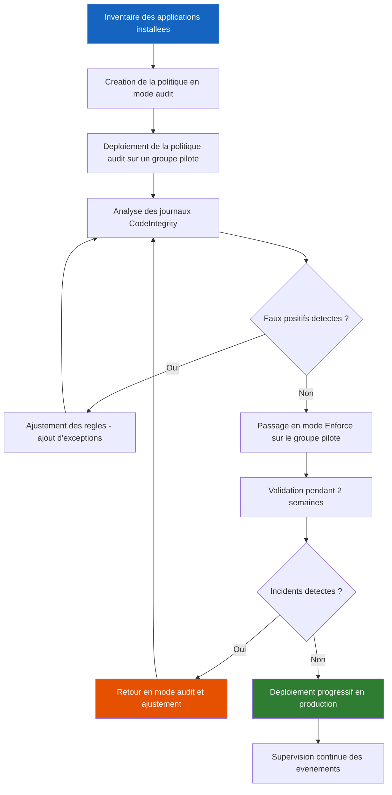

<!--
  Copyright 2026 Julien Bombled

  Licensed under the Apache License, Version 2.0 (the "License");
  you may not use this file except in compliance with the License.
  You may obtain a copy of the License at

      http://www.apache.org/licenses/LICENSE-2.0

  Unless required by applicable law or agreed to in writing, software
  distributed under the License is distributed on an "AS IS" BASIS,
  WITHOUT WARRANTIES OR CONDITIONS OF ANY KIND, either express or implied.
  See the License for the specific language governing permissions and
  limitations under the License.
-->

# AppLocker et WDAC (Windows Defender Application Control)

<span class="level-advanced">Avance</span> · Temps estime : 35 minutes

Le controle des applications est une mesure de durcissement essentielle pour empecher l'execution de logiciels non autorises sur les serveurs. Les ransomwares, les outils de piratage et les applications non approuvees representent des menaces directes que les antivirus traditionnels ne suffisent pas a bloquer. Windows Server 2022 propose deux technologies complementaires : **AppLocker** et **WDAC** (Windows Defender Application Control).

---

## Pourquoi controler les applications ?

!!! example "Analogie"

    Imaginez un aeroport : la securite aeroportuaire fonctionne avec une **liste blanche** (seuls les passagers munis d'un billet et d'une piece d'identite valide peuvent embarquer) plutot qu'une **liste noire** (tenter d'identifier chaque personne malveillante parmi des milliers de voyageurs). Le controle des applications suit la meme logique : au lieu de bloquer les menaces connues une par une (approche antivirus), on autorise uniquement les applications de confiance et on bloque tout le reste.

Sans controle applicatif, un serveur est expose a :

- **Ransomwares** : un executable telecharge via un e-mail ou une cle USB chiffre les donnees
- **Outils de piratage** : Mimikatz, PsExec ou des scripts PowerShell malveillants executes par un attaquant
- **Logiciels non approuves** : des applications installees par les utilisateurs qui introduisent des vulnerabilites
- **Scripts malveillants** : fichiers `.bat`, `.vbs`, `.ps1` telecharges depuis Internet

---

## AppLocker vs WDAC : comparaison

| Critere | AppLocker | WDAC |
|---------|-----------|------|
| **Portee** | Regles par utilisateur ou groupe | Regles au niveau machine (noyau) |
| **Resistance au contournement** | Moyenne (processus utilisateur) | Elevee (enforcement noyau, VBS) |
| **Gestion** | GPO, PowerShell | GPO, PowerShell, MDM (Intune) |
| **Editions Windows** | Enterprise et Education | Toutes les editions (depuis Windows 10 1903+) |
| **Types de fichiers** | EXE, scripts, MSI, DLL, AppX | Pilotes, executables, DLL, scripts |
| **Mode audit** | Oui | Oui |
| **Politiques supplementaires** | Non | Oui (base + supplementaires) |
| **Signature WDAC Signed** | Non | Oui (politiques signees) |
| **Cas d'usage principal** | Controle applicatif utilisateur | Protection renforcee du systeme |

!!! tip "Recommandation"

    AppLocker convient pour un controle applicatif rapide a deployer, gere par GPO. WDAC est preferable pour une protection en profondeur avec enforcement au niveau noyau, notamment sur les serveurs critiques ou Credential Guard est active.

---

## AppLocker

### Types de regles

AppLocker permet de creer des regles pour cinq categories de fichiers :

| Type de regle | Extensions concernees | Description |
|---------------|----------------------|-------------|
| **Regles d'executables** | `.exe`, `.com` | Applications executables |
| **Regles de scripts** | `.ps1`, `.bat`, `.cmd`, `.vbs`, `.js` | Scripts de tous types |
| **Regles Windows Installer** | `.msi`, `.msp`, `.mst` | Paquets d'installation |
| **Regles DLL** | `.dll`, `.ocx` | Bibliotheques dynamiques |
| **Regles d'applications empaquetees** | `.appx`, `.msix` | Applications du Microsoft Store |

### Conditions de regle

Chaque regle peut utiliser l'une des trois conditions suivantes :

| Condition | Description | Exemple |
|-----------|-------------|---------|
| **Editeur (Publisher)** | Base sur la signature numerique de l'editeur | Autoriser tous les executables signes par Microsoft |
| **Chemin (Path)** | Base sur l'emplacement du fichier | Autoriser tout dans `C:\Program Files\` |
| **Hash de fichier** | Base sur le hash cryptographique du fichier | Autoriser un executable specifique par son SHA256 |

!!! info "Priorite des conditions"

    La condition **Editeur** est la plus flexible : elle resiste aux mises a jour (le hash change, pas la signature). La condition **Hash** est la plus stricte mais necessite une mise a jour a chaque nouvelle version. La condition **Chemin** est la moins securisee car un attaquant peut copier un fichier malveillant dans un dossier autorise.

### Regles par defaut

AppLocker fournit des regles par defaut qui autorisent :

- Tous les fichiers dans `%WINDIR%\` (repertoire Windows)
- Tous les fichiers dans `%PROGRAMFILES%\` (Program Files et Program Files (x86))
- Tous les fichiers pour les membres du groupe **Administrators**

```powershell
# Verify the Application Identity service is running (required for AppLocker)
Get-Service -Name AppIDSvc | Select-Object Name, Status, StartType

# Set the service to start automatically
Set-Service -Name AppIDSvc -StartupType Automatic
Start-Service -Name AppIDSvc
```

Resultat :

```text
Name       Status  StartType
----       ------  ---------
AppIDSvc   Running Automatic
```

### Configuration via PowerShell

```powershell
# Generate default AppLocker rules for executables
$defaultRules = Get-AppLockerPolicy -Local -Xml

# Create a new AppLocker policy with default rules
$ruleCollection = @"
<AppLockerPolicy Version="1">
  <RuleCollection Type="Exe" EnforcementMode="AuditOnly">
  </RuleCollection>
</AppLockerPolicy>
"@

# Get the default rules for executable files
Get-AppLockerPolicy -Effective -Xml | Set-Content -Path "C:\Temp\AppLockerPolicy.xml"

# Generate rules from a reference directory (scan installed applications)
Get-AppLockerFileInformation -Directory "C:\Program Files\" -Recurse |
    New-AppLockerPolicy -RuleType Publisher, Hash -User "Everyone" -Optimize |
    Set-AppLockerPolicy -Merge
```

### Deploiement via GPO

Le chemin GPO pour configurer AppLocker :

```
Computer Configuration
  > Policies
    > Windows Settings
      > Security Settings
        > Application Control Policies
          > AppLocker
            > Executable Rules
            > Windows Installer Rules
            > Script Rules
            > Packaged app Rules
            > DLL Rules
```

```powershell
# Export the current AppLocker policy from a reference machine
Get-AppLockerPolicy -Effective -Xml | Out-File -FilePath "C:\Temp\AppLockerPolicy.xml"

# Import an AppLocker policy to a GPO
Set-AppLockerPolicy -XmlPolicy "C:\Temp\AppLockerPolicy.xml" -Merge

# Verify the effective AppLocker policy
Get-AppLockerPolicy -Effective | Select-Object -ExpandProperty RuleCollections
```

Resultat :

```text
PathConditions      : {%WINDIR%\*}
PathExceptions      : {}
PublisherConditions  : {}
HashConditions      : {}
Id                  : a9e18c21-ff73-43ab-b7c4-89129bc2e746
Name                : (Default Rule) All files located in the Windows folder
Description         : Allows members of the Everyone group to run applications
                      that are located in the Windows folder.
UserOrGroupSid      : S-1-1-0
Action              : Allow
RuleType            : Path
EnforcementMode     : AuditOnly
```

### Mode audit AppLocker

!!! warning "Toujours commencer par le mode audit"

    Ne passez **jamais** directement en mode Enforce. Le mode Audit Only genere des evenements dans le journal sans bloquer les applications, ce qui permet d'identifier les faux positifs avant l'enforcement.

```powershell
# Check AppLocker events in the audit log
Get-WinEvent -LogName "Microsoft-Windows-AppLocker/EXE and DLL" -MaxEvents 20 |
    Select-Object TimeCreated, Id, Message |
    Format-Table -AutoSize -Wrap
```

Resultat :

```text
TimeCreated          Id Message
-----------          -- -------
2026-02-18 14:32:01  8003 %OSDRIVE%\USERS\JDUPONT\DOWNLOADS\TOOL.EXE was allowed
                          to run but would have been prevented from running if the
                          AppLocker policy were enforced.
2026-02-18 14:28:45  8003 %OSDRIVE%\TEMP\SCRIPT.PS1 was allowed to run but would
                          have been prevented from running if the AppLocker policy
                          were enforced.
```

Les ID d'evenements AppLocker importants :

| Event ID | Signification |
|----------|--------------|
| **8001** | Application autorisee par une regle |
| **8002** | Application bloquee par une regle |
| **8003** | Application autorisee (serait bloquee en mode Enforce) |
| **8004** | Application bloquee (serait autorisee en mode Enforce) |

---

## WDAC (Windows Defender Application Control)

WDAC offre une protection plus robuste qu'AppLocker car ses politiques sont appliquees au niveau du noyau Windows, rendant le contournement nettement plus difficile.

### Concepts cles

- **Politique d'integrite du code (CI Policy)** : fichier XML definissant les regles d'autorisation
- **Politique de base** : la politique principale appliquee au systeme
- **Politiques supplementaires** : politiques additionnelles qui etendent la politique de base sans la remplacer
- **Mode audit** : journalise les violations sans bloquer
- **Mode enforce** : bloque activement les applications non autorisees

### Workflow de deploiement



### Creation d'une politique WDAC

```powershell
# Create a WDAC policy from a reference machine (scan installed software)
New-CIPolicy -Level Publisher -Fallback Hash `
    -FilePath "C:\Temp\WDACPolicy.xml" `
    -UserPEs `
    -MultiplePolicyFormat

# Review the generated policy
Get-Content "C:\Temp\WDACPolicy.xml" | Select-Object -First 30
```

Resultat :

```text
<?xml version="1.0" encoding="utf-8"?>
<SiPolicy xmlns="urn:schemas-microsoft-com:sipolicy"
          PolicyType="Base Policy">
  <VersionEx>10.0.0.0</VersionEx>
  <PlatformID>{2E07F7E4-194C-4D20-B7C9-6F44A6C5A234}</PlatformID>
  <Rules>
    <Rule>
      <Option>Enabled:Audit Mode</Option>
    </Rule>
    <Rule>
      <Option>Enabled:UMCI</Option>
    </Rule>
  </Rules>
  ...
</SiPolicy>
```

### Niveaux de confiance WDAC

| Niveau | Description | Securite |
|--------|-------------|----------|
| **Publisher** | Editeur + nom du produit + version minimale | Elevee |
| **FilePublisher** | Editeur + nom du fichier + version minimale | Tres elevee |
| **FileName** | Nom interne du fichier (attribut PE) | Moyenne |
| **Hash** | Hash SHA256 du fichier | Maximale (mais fragile aux mises a jour) |
| **FilePath** | Chemin du fichier sur le disque | Faible (contournable) |
| **SignedVersion** | Editeur + version minimale | Elevee |

### Fusion et conversion de politiques

```powershell
# Merge multiple policies into one
Merge-CIPolicy -PolicyPaths "C:\Temp\WDACPolicy.xml", "C:\Temp\SupplementalApps.xml" `
    -OutputFilePath "C:\Temp\MergedPolicy.xml"

# Add a supplemental policy to an existing base policy
$basePolicyId = "{A1B2C3D4-E5F6-7890-ABCD-EF1234567890}"
Set-CIPolicyIdInfo -FilePath "C:\Temp\SupplementalApps.xml" `
    -BasePolicyToSupplementPath "C:\Temp\WDACPolicy.xml" `
    -PolicyName "Supplemental - Line of Business Apps"

# Convert the XML policy to binary format for deployment
ConvertFrom-CIPolicy -XmlFilePath "C:\Temp\MergedPolicy.xml" `
    -BinaryFilePath "C:\Windows\System32\CodeIntegrity\SIPolicy.p7b"
```

Resultat :

```text
C:\Windows\System32\CodeIntegrity\SIPolicy.p7b
```

### Deploiement en mode audit

```powershell
# Ensure the policy is in audit mode before deployment
# Check for the Audit Mode option in the XML
Select-String -Path "C:\Temp\WDACPolicy.xml" -Pattern "Audit Mode"

# Set the policy to audit mode if not already set
Set-RuleOption -FilePath "C:\Temp\WDACPolicy.xml" -Option 3

# Convert and deploy
ConvertFrom-CIPolicy -XmlFilePath "C:\Temp\WDACPolicy.xml" `
    -BinaryFilePath "C:\Windows\System32\CodeIntegrity\SIPolicy.p7b"

# Restart to apply the policy
# Restart-Computer -Force
```

### Passage en mode enforce

```powershell
# Remove the audit mode option to switch to enforce mode
Set-RuleOption -FilePath "C:\Temp\WDACPolicy.xml" -Option 3 -Delete

# Convert the updated policy to binary
ConvertFrom-CIPolicy -XmlFilePath "C:\Temp\WDACPolicy.xml" `
    -BinaryFilePath "C:\Windows\System32\CodeIntegrity\SIPolicy.p7b"

# Apply via GPO path
# Computer Configuration > Administrative Templates > System > Device Guard
#   > Deploy Windows Defender Application Control : Enabled
#   > Code Integrity Policy path : \\domain\SYSVOL\lab.local\Policies\WDAC\SIPolicy.p7b
```

### Analyse des journaux WDAC

```powershell
# Review Code Integrity events (audit and block)
Get-WinEvent -LogName "Microsoft-Windows-CodeIntegrity/Operational" -MaxEvents 20 |
    Where-Object { $_.Id -in @(3076, 3077) } |
    Select-Object TimeCreated, Id, Message |
    Format-Table -AutoSize -Wrap
```

Les ID d'evenements WDAC essentiels :

| Event ID | Signification |
|----------|--------------|
| **3076** | Application aurait ete bloquee (mode audit) |
| **3077** | Application bloquee (mode enforce) |
| **3089** | Signature de fichier verifiee |
| **3099** | Politique chargee avec succes |

---

## Scenario pratique

!!! example "Scenario pratique"

    **Contexte** : Marc, administrateur systeme, doit securiser le serveur de fichiers `SRV-FS01` (10.0.0.20) apres qu'un utilisateur a execute un ransomware depuis un dossier partage. La direction demande un controle strict des applications autorisees a s'executer sur ce serveur.

    **Objectif** : deployer AppLocker pour bloquer l'execution de tout executable en dehors des repertoires systeme et des applications approuvees.

    **Etape 1 : activer le service Application Identity**

    ```powershell
    # Ensure Application Identity service is running
    Set-Service -Name AppIDSvc -StartupType Automatic
    Start-Service -Name AppIDSvc
    Get-Service -Name AppIDSvc
    ```

    Resultat :

    ```text
    Status   Name        DisplayName
    ------   ----        -----------
    Running  AppIDSvc    Application Identity
    ```

    **Etape 2 : generer les regles par defaut et les regles metier**

    ```powershell
    # Generate default rules (allow Windows and Program Files)
    $defaultPolicy = Get-AppLockerPolicy -Local
    $rules = Get-ChildItem "C:\Program Files\FileServer\" -Recurse -Include *.exe |
        Get-AppLockerFileInformation |
        New-AppLockerPolicy -RuleType Publisher, Hash -User "Everyone" -Optimize

    # Set enforcement mode to AuditOnly first
    Set-AppLockerPolicy -PolicyObject $rules -Merge
    ```

    **Etape 3 : analyser les journaux en mode audit**

    ```powershell
    # After 1 week in audit mode, review blocked events
    Get-WinEvent -LogName "Microsoft-Windows-AppLocker/EXE and DLL" |
        Where-Object { $_.Id -eq 8003 } |
        Select-Object TimeCreated, Message |
        Sort-Object TimeCreated -Descending |
        Select-Object -First 10
    ```

    **Etape 4 : passer en mode Enforce apres validation**

    ```powershell
    # Export the current policy
    Get-AppLockerPolicy -Effective -Xml | Out-File "C:\Temp\AppLockerAudit.xml"

    # Modify enforcement mode from AuditOnly to Enabled in the XML
    # Then re-import
    Set-AppLockerPolicy -XmlPolicy "C:\Temp\AppLockerEnforce.xml"

    # Verify enforcement
    Get-AppLockerPolicy -Effective | Select-Object -ExpandProperty RuleCollections |
        Select-Object RuleCollectionType, EnforcementMode
    ```

??? success "Resultat attendu"

    ```text
    RuleCollectionType  EnforcementMode
    ------------------  ---------------
    Exe                 Enabled
    Script              Enabled
    Msi                 Enabled
    ```

    Apres le deploiement, toute tentative d'execution d'un fichier `.exe` en dehors des repertoires autorises est bloquee. L'evenement 8002 est genere dans le journal AppLocker et le fichier ne s'execute pas.

    ```text
    TimeCreated          Id Message
    -----------          -- -------
    2026-02-19 09:14:32  8002 %OSDRIVE%\USERS\JDUPONT\DOWNLOADS\SUSPICIOUS.EXE was
                              prevented from running.
    ```

---

## Erreurs courantes

!!! failure "Erreur 1 : systeme verrouille par absence de regles par defaut"

    **Symptome** : apres activation d'AppLocker en mode Enforce, plus aucun programme ne s'execute, y compris les outils d'administration.

    **Cause** : les regles par defaut (autorisant `%WINDIR%` et `%PROGRAMFILES%`) n'ont pas ete creees avant l'activation de l'enforcement.

    **Solution** : toujours generer les regles par defaut avant de passer en mode Enforce. En cas de verrouillage, demarrer en mode sans echec et supprimer la politique AppLocker via le registre `HKLM:\SOFTWARE\Policies\Microsoft\Windows\SrpV2`.

!!! failure "Erreur 2 : le service Application Identity n'est pas demarre"

    **Symptome** : les regles AppLocker sont configurees dans la GPO mais aucun blocage ne fonctionne. Les evenements ne sont pas generes.

    **Cause** : le service `AppIDSvc` (Application Identity) n'est pas en cours d'execution. Ce service est indispensable au fonctionnement d'AppLocker.

    **Solution** :

    ```powershell
    # Start the Application Identity service and set it to automatic
    Set-Service -Name AppIDSvc -StartupType Automatic
    Start-Service -Name AppIDSvc
    ```

!!! failure "Erreur 3 : WDAC bloque des applications legitimes en production"

    **Symptome** : apres le passage en mode Enforce d'une politique WDAC, des applications metier cessent de fonctionner. Les utilisateurs signalent des erreurs de lancement.

    **Cause** : la phase d'audit n'a pas ete suffisamment longue ou les journaux n'ont pas ete analyses exhaustivement. Certaines applications non signees ou avec des signatures non couvertes par la politique ont ete oubliees.

    **Solution** : revenir en mode audit, analyser les evenements 3076, creer des regles supplementaires pour les applications manquantes, puis redeployer progressivement.

    ```powershell
    # Revert to audit mode
    Set-RuleOption -FilePath "C:\Temp\WDACPolicy.xml" -Option 3
    ConvertFrom-CIPolicy -XmlFilePath "C:\Temp\WDACPolicy.xml" `
        -BinaryFilePath "C:\Windows\System32\CodeIntegrity\SIPolicy.p7b"
    ```

!!! failure "Erreur 4 : regles de chemin trop larges dans AppLocker"

    **Symptome** : un attaquant parvient a executer un malware en le placant dans un repertoire autorise (par exemple `C:\Program Files\`), contournant ainsi les regles AppLocker.

    **Cause** : les regles basees sur le chemin autorisent tout executable situe dans un repertoire donne, sans verifier la legitimite du fichier.

    **Solution** : privilegier les regles basees sur l'**editeur** (Publisher) qui verifient la signature numerique. Combiner avec des regles de hash pour les applications non signees. Restreindre les permissions NTFS sur les repertoires autorises pour empecher les utilisateurs non privilegies d'y ecrire.

!!! failure "Erreur 5 : scripts PowerShell non signes bloques apres activation d'AppLocker"

    **Symptome** : les scripts d'administration PowerShell (`.ps1`) deployes par l'equipe IT sont bloques par AppLocker apres l'activation des regles de scripts.

    **Cause** : les scripts internes ne sont pas signes numeriquement et aucune regle AppLocker ne les autorise (ni par editeur, ni par hash).

    **Solution** : signer les scripts avec un certificat de signature de code emis par l'autorite de certification interne, puis creer une regle AppLocker de type Publisher. Alternativement, ajouter les hash des scripts approuves a la politique.

    ```powershell
    # Sign a PowerShell script with an internal code signing certificate
    $cert = Get-ChildItem Cert:\CurrentUser\My -CodeSigningCert
    Set-AuthenticodeSignature -FilePath "C:\Scripts\Maintenance.ps1" -Certificate $cert

    # Verify the signature
    Get-AuthenticodeSignature -FilePath "C:\Scripts\Maintenance.ps1"
    ```

---

## Points cles a retenir

- **AppLocker** et **WDAC** sont complementaires : AppLocker pour le controle utilisateur, WDAC pour la protection noyau
- Toujours deployer en **mode audit** avant le mode enforce pour eviter les blocages inattendus
- Le service **Application Identity** (`AppIDSvc`) est obligatoire pour le fonctionnement d'AppLocker
- Privilegier les regles basees sur l'**editeur** (Publisher) plutot que sur le chemin pour une meilleure securite
- WDAC supporte les **politiques supplementaires** qui permettent d'ajouter des exceptions sans modifier la politique de base
- La **signature de code** est la meilleure approche pour autoriser les scripts internes dans un environnement controle

---

## Pour aller plus loin

- Bonnes pratiques de durcissement (voir la page [Bonnes pratiques](bonnes-pratiques.md))
- Microsoft Security Baselines (voir la page [Security Baselines](security-baselines.md))
- Concepts des strategies de groupe (voir la page [Concepts GPO](../../active-directory/gpo/concepts-gpo.md))
- Protection des comptes privilegies et Credential Guard (voir la page [Comptes privilegies](comptes-privilegies.md))
- Microsoft : AppLocker documentation officielle
- Microsoft : WDAC design guide
- ANSSI - Recommandations de controle des applications
