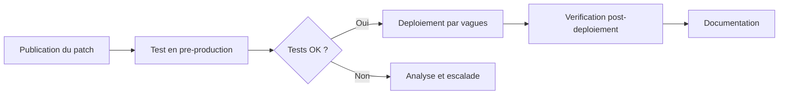

# Bonnes pratiques de durcissement

!!! info "Niveau : avance | Temps estime : 45 minutes"

Le durcissement (hardening) consiste a reduire la surface d'attaque d'un serveur en eliminant les composants, services et configurations inutiles. Sur Windows Server 2022, cette demarche suit des principes eprouves que tout administrateur doit maitriser.

---

## Principe de moindre privilege

Le principe de moindre privilege stipule qu'un utilisateur ou un service ne doit disposer que des droits strictement necessaires a l'execution de sa tache.

### Application aux comptes utilisateurs

- Ne jamais utiliser un compte Domain Admin pour les taches quotidiennes
- Creer des comptes d'administration dedies par niveau de responsabilite
- Limiter les membres des groupes privilegies (Domain Admins, Enterprise Admins, Schema Admins)

```powershell
# List members of the Domain Admins group
Get-ADGroupMember -Identity "Domain Admins" | Select-Object Name, SamAccountName

# List all users with AdminCount=1 (privileged accounts)
Get-ADUser -Filter {AdminCount -eq 1} -Properties AdminCount |
    Select-Object Name, SamAccountName, Enabled
```

### Application aux services

Chaque service Windows tourne sous un compte specifique. Eviter d'utiliser des comptes a privileges eleves pour des services applicatifs.

```powershell
# Audit services running under privileged accounts
Get-WmiObject Win32_Service |
    Where-Object { $_.StartName -match "Admin|SYSTEM" } |
    Select-Object Name, DisplayName, StartName, State |
    Format-Table -AutoSize
```

---

## Desactivation des services inutiles

Un serveur de production ne doit executer que les services requis par son role. Chaque service actif est un vecteur d'attaque potentiel.

### Services frequemment a desactiver

| Service | Nom technique | Raison de la desactivation |
|---------|---------------|---------------------------|
| Xbox Services | `XblAuthManager`, `XblGameSave` | Inutile sur un serveur |
| Fax | `Fax` | Rarement necessaire |
| Print Spooler | `Spooler` | Sauf si role serveur d'impression |
| Windows Search | `WSearch` | Impact performance sur serveur |
| Remote Registry | `RemoteRegistry` | Risque d'acces distant non autorise |
| Bluetooth | `bthserv` | Inutile sur un serveur |

```powershell
# Disable a service and stop it immediately
$servicesToDisable = @('Fax', 'XblAuthManager', 'XblGameSave', 'WSearch')

foreach ($svc in $servicesToDisable) {
    $service = Get-Service -Name $svc -ErrorAction SilentlyContinue
    if ($service) {
        Stop-Service -Name $svc -Force -ErrorAction SilentlyContinue
        Set-Service -Name $svc -StartupType Disabled
        Write-Output "Disabled: $svc"
    }
}
```

!!! warning "Print Spooler et PrintNightmare"

    Le service Print Spooler a ete la cible de la vulnerabilite **PrintNightmare** (CVE-2021-34527). Sur les serveurs qui n'ont pas besoin du role d'impression, desactivez-le systematiquement.

```powershell
# Disable Print Spooler on non-print servers
Stop-Service -Name Spooler -Force
Set-Service -Name Spooler -StartupType Disabled
```

---

## Desactivation de SMBv1

SMBv1 est un protocole obsolete et vulnerable (exploite par WannaCry, NotPetya). Il doit etre desactive sur tous les serveurs modernes.

```powershell
# Check if SMBv1 is enabled
Get-SmbServerConfiguration | Select-Object EnableSMB1Protocol

# Disable SMBv1 server-side
Set-SmbServerConfiguration -EnableSMB1Protocol $false -Force

# Disable SMBv1 client feature
Disable-WindowsOptionalFeature -Online -FeatureName SMB1Protocol -NoRestart

# Verify the change
Get-SmbServerConfiguration | Select-Object EnableSMB1Protocol
```

!!! danger "Compatibilite"

    Certains anciens equipements (copieurs, NAS) necessitent SMBv1. Effectuez un audit avant la desactivation :

    ```powershell
    # Enable SMBv1 audit logging to detect clients using SMBv1
    Set-SmbServerConfiguration -AuditSmb1Access $true -Force
    ```

    Les evenements sont journalises dans `Applications and Services Logs > Microsoft > Windows > SMBServer > Audit`.

---

## Strategie de mises a jour

Les mises a jour de securite sont la premiere ligne de defense contre les vulnerabilites connues.

### Configuration WSUS / Windows Update

```powershell
# Check current Windows Update configuration
Get-ItemProperty -Path "HKLM:\SOFTWARE\Policies\Microsoft\Windows\WindowsUpdate" -ErrorAction SilentlyContinue
Get-ItemProperty -Path "HKLM:\SOFTWARE\Policies\Microsoft\Windows\WindowsUpdate\AU" -ErrorAction SilentlyContinue

# View installed updates
Get-HotFix | Sort-Object InstalledOn -Descending | Select-Object -First 10
```

### Bonnes pratiques de patch management

1. **Tester avant de deployer** : utiliser un environnement de pre-production
2. **Planifier les fenetres de maintenance** : eviter les heures de production
3. **Sauvegarder avant la mise a jour** : snapshot ou backup complet
4. **Prioriser les patchs critiques** : deployer sous 72h les correctifs de severite critique
5. **Documenter chaque cycle** : tracer les mises a jour appliquees et les incidents



---

## Securisation des comptes administrateurs locaux

### Renommer le compte administrateur local

Le compte `Administrator` (RID 500) est une cible connue des attaques par brute force.

```powershell
# Rename the built-in Administrator account
Rename-LocalUser -Name "Administrator" -NewName "SrvLocalAdmin"

# Disable the built-in Guest account
Disable-LocalUser -Name "Guest"
```

!!! tip "Convention de nommage"

    Adoptez un nom non-standard qui ne revele pas la fonction du compte. Evitez `Admin`, `SysAdmin` ou des variantes evidentes.

### Desactiver les comptes inutilises

```powershell
# List local accounts and their status
Get-LocalUser | Select-Object Name, Enabled, LastLogon

# Disable unused accounts
Disable-LocalUser -Name "DefaultAccount"
```

---

## Configuration du pare-feu Windows

Le pare-feu Windows Defender doit rester actif sur tous les profils, meme en environnement Active Directory.

```powershell
# Verify firewall status on all profiles
Get-NetFirewallProfile | Select-Object Name, Enabled

# Ensure all profiles are enabled
Set-NetFirewallProfile -Profile Domain,Public,Private -Enabled True

# List inbound rules that are currently enabled
Get-NetFirewallRule -Direction Inbound -Enabled True |
    Select-Object DisplayName, Profile, Action |
    Sort-Object DisplayName
```

### Regle de base : bloquer par defaut

```powershell
# Set default inbound action to Block on all profiles
Set-NetFirewallProfile -Profile Domain,Public,Private -DefaultInboundAction Block
Set-NetFirewallProfile -Profile Domain,Public,Private -DefaultOutboundAction Allow
```

---

## Desactivation des fonctionnalites inutiles

### Roles et fonctionnalites Windows

```powershell
# List installed roles and features
Get-WindowsFeature | Where-Object { $_.InstallState -eq "Installed" } |
    Select-Object Name, DisplayName

# Remove a feature (example: PowerShell v2 - often used for downgrade attacks)
Remove-WindowsFeature PowerShell-V2
Disable-WindowsOptionalFeature -Online -FeatureName MicrosoftWindowsPowerShellV2Root
```

!!! danger "PowerShell v2"

    PowerShell v2 ne supporte pas la journalisation avancee (ScriptBlock Logging, Transcription). Les attaquants l'utilisent pour echapper a la detection. Desactivez-le systematiquement.

### Protocoles obsoletes

```powershell
# Disable TLS 1.0
New-Item -Path "HKLM:\SYSTEM\CurrentControlSet\Control\SecurityProviders\SCHANNEL\Protocols\TLS 1.0\Server" -Force
Set-ItemProperty -Path "HKLM:\SYSTEM\CurrentControlSet\Control\SecurityProviders\SCHANNEL\Protocols\TLS 1.0\Server" -Name "Enabled" -Value 0 -Type DWord
Set-ItemProperty -Path "HKLM:\SYSTEM\CurrentControlSet\Control\SecurityProviders\SCHANNEL\Protocols\TLS 1.0\Server" -Name "DisabledByDefault" -Value 1 -Type DWord

# Disable TLS 1.1
New-Item -Path "HKLM:\SYSTEM\CurrentControlSet\Control\SecurityProviders\SCHANNEL\Protocols\TLS 1.1\Server" -Force
Set-ItemProperty -Path "HKLM:\SYSTEM\CurrentControlSet\Control\SecurityProviders\SCHANNEL\Protocols\TLS 1.1\Server" -Name "Enabled" -Value 0 -Type DWord
Set-ItemProperty -Path "HKLM:\SYSTEM\CurrentControlSet\Control\SecurityProviders\SCHANNEL\Protocols\TLS 1.1\Server" -Name "DisabledByDefault" -Value 1 -Type DWord
```

---

## Points cles a retenir

- Le durcissement est un processus **continu**, pas un evenement ponctuel
- Appliquer le **principe de moindre privilege** a tous les niveaux (comptes, services, fonctionnalites)
- **SMBv1** et **PowerShell v2** doivent etre desactives systematiquement
- Les **mises a jour de securite** sont non-negociables : un processus de patch management rigoureux est indispensable
- Le **pare-feu Windows** doit rester actif, meme derriere un firewall reseau
- Documenter et auditer regulierement la configuration de securite

---

## Pour aller plus loin

- Microsoft Security Baselines (voir la page [Security Baselines](security-baselines.md))
- CIS Benchmarks pour Windows Server 2022
- ANSSI - Recommandations de securite relatives a Active Directory
- NIST SP 800-123 : Guide to General Server Security
