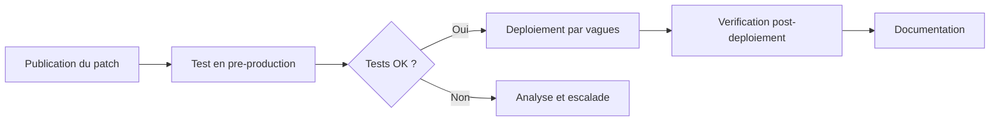

<!--
  Copyright 2026 Julien Bombled

  Licensed under the Apache License, Version 2.0 (the "License");
  you may not use this file except in compliance with the License.
  You may obtain a copy of the License at

      http://www.apache.org/licenses/LICENSE-2.0

  Unless required by applicable law or agreed to in writing, software
  distributed under the License is distributed on an "AS IS" BASIS,
  WITHOUT WARRANTIES OR CONDITIONS OF ANY KIND, either express or implied.
  See the License for the specific language governing permissions and
  limitations under the License.
-->

# Bonnes pratiques de durcissement

<span class="level-advanced">Avance</span> · Temps estime : 45 minutes

Le durcissement (hardening) consiste a reduire la surface d'attaque d'un serveur en eliminant les composants, services et configurations inutiles. Sur Windows Server 2022, cette demarche suit des principes eprouves que tout administrateur doit maitriser.

---

## Principe de moindre privilege

!!! example "Analogie"

    Imaginez un immeuble de bureaux : le gardien a la cle du hall, les employes ont la cle de leur etage, et seul le directeur a le passe general. Si le gardien perd sa cle, seul le hall est compromis. Donner le passe general a tout le monde serait une aberration : c'est exactement le principe de moindre privilege applique a vos serveurs.

Le principe de moindre privilege stipule qu'un utilisateur ou un service ne doit disposer que des droits strictement necessaires a l'execution de sa tache.

### Application aux comptes utilisateurs

- Ne jamais utiliser un compte Domain Admin pour les taches quotidiennes
- Creer des comptes d'administration dedies par niveau de responsabilite
- Limiter les membres des groupes privilegies (Domain Admins, Enterprise Admins, Schema Admins)

```powershell
# List members of the Domain Admins group
Get-ADGroupMember -Identity "Domain Admins" | Select-Object Name, SamAccountName

# List all users with AdminCount=1 (privileged accounts)
Get-ADUser -Filter {AdminCount -eq 1} -Properties AdminCount |
    Select-Object Name, SamAccountName, Enabled
```

Resultat :

```text
Name            SamAccountName
----            --------------
Jean Dupont     T0-jdupont
Marie Lambert   T0-mlambert
Administrateur  Administrator

Name            SamAccountName  Enabled
----            --------------  -------
T0-jdupont      T0-jdupont      True
T0-mlambert     T0-mlambert     True
Administrator   Administrator   True
krbtgt          krbtgt          False
```

### Application aux services

Chaque service Windows tourne sous un compte specifique. Eviter d'utiliser des comptes a privileges eleves pour des services applicatifs.

```powershell
# Audit services running under privileged accounts
Get-WmiObject Win32_Service |
    Where-Object { $_.StartName -match "Admin|SYSTEM" } |
    Select-Object Name, DisplayName, StartName, State |
    Format-Table -AutoSize
```

Resultat :

```text
Name                   DisplayName                          StartName                State
----                   -----------                          ---------                -----
CertSvc                Active Directory Certificate Se...   LocalSystem              Running
ClusSvc                Cluster Service                      LocalSystem              Running
DNS                    DNS Server                           LocalSystem              Running
MSSQLSERVER            SQL Server (MSSQLSERVER)             LocalSystem              Running
Spooler                Print Spooler                        LocalSystem              Running
W3SVC                  World Wide Web Publishing Service    LocalSystem              Running
WinRM                  Windows Remote Management (WS-M...   NT AUTHORITY\NetworkS... Running
```

---

## Desactivation des services inutiles

!!! example "Analogie"

    Un serveur est comme un batiment : chaque porte ouverte est une entree potentielle pour un intrus. Desactiver les services inutiles revient a condamner les portes qui ne servent pas. Moins il y a d'entrees, moins il y a de risques.

Un serveur de production ne doit executer que les services requis par son role. Chaque service actif est un vecteur d'attaque potentiel.

### Services frequemment a desactiver

| Service | Nom technique | Raison de la desactivation |
|---------|---------------|---------------------------|
| Xbox Services | `XblAuthManager`, `XblGameSave` | Inutile sur un serveur |
| Fax | `Fax` | Rarement necessaire |
| Print Spooler | `Spooler` | Sauf si role serveur d'impression |
| Windows Search | `WSearch` | Impact performance sur serveur |
| Remote Registry | `RemoteRegistry` | Risque d'acces distant non autorise |
| Bluetooth | `bthserv` | Inutile sur un serveur |

```powershell
# Disable a service and stop it immediately
$servicesToDisable = @('Fax', 'XblAuthManager', 'XblGameSave', 'WSearch')

foreach ($svc in $servicesToDisable) {
    $service = Get-Service -Name $svc -ErrorAction SilentlyContinue
    if ($service) {
        Stop-Service -Name $svc -Force -ErrorAction SilentlyContinue
        Set-Service -Name $svc -StartupType Disabled
        Write-Output "Disabled: $svc"
    }
}
```

Resultat :

```text
Disabled: Fax
Disabled: XblAuthManager
Disabled: XblGameSave
Disabled: WSearch
```

!!! warning "Print Spooler et PrintNightmare"

    Le service Print Spooler a ete la cible de la vulnerabilite **PrintNightmare** (CVE-2021-34527). Sur les serveurs qui n'ont pas besoin du role d'impression, desactivez-le systematiquement.

```powershell
# Disable Print Spooler on non-print servers
Stop-Service -Name Spooler -Force
Set-Service -Name Spooler -StartupType Disabled
```

Resultat :

```text
WARNING: [SRV-01] Le service 'Print Spooler (Spooler)' a ete arrete.
```

---

## Desactivation de SMBv1

SMBv1 est un protocole obsolete et vulnerable (exploite par WannaCry, NotPetya). Il doit etre desactive sur tous les serveurs modernes.

```powershell
# Check if SMBv1 is enabled
Get-SmbServerConfiguration | Select-Object EnableSMB1Protocol

# Disable SMBv1 server-side
Set-SmbServerConfiguration -EnableSMB1Protocol $false -Force

# Disable SMBv1 client feature
Disable-WindowsOptionalFeature -Online -FeatureName SMB1Protocol -NoRestart

# Verify the change
Get-SmbServerConfiguration | Select-Object EnableSMB1Protocol
```

Resultat :

```text
EnableSMB1Protocol
------------------
                 True

EnableSMB1Protocol
------------------
                False
```

!!! danger "Compatibilite"

    Certains anciens equipements (copieurs, NAS) necessitent SMBv1. Effectuez un audit avant la desactivation :

    ```powershell
    # Enable SMBv1 audit logging to detect clients using SMBv1
    Set-SmbServerConfiguration -AuditSmb1Access $true -Force
    ```

    Les evenements sont journalises dans `Applications and Services Logs > Microsoft > Windows > SMBServer > Audit`.

---

## Strategie de mises a jour

Les mises a jour de securite sont la premiere ligne de defense contre les vulnerabilites connues.

### Configuration WSUS / Windows Update

```powershell
# Check current Windows Update configuration
Get-ItemProperty -Path "HKLM:\SOFTWARE\Policies\Microsoft\Windows\WindowsUpdate" -ErrorAction SilentlyContinue
Get-ItemProperty -Path "HKLM:\SOFTWARE\Policies\Microsoft\Windows\WindowsUpdate\AU" -ErrorAction SilentlyContinue

# View installed updates
Get-HotFix | Sort-Object InstalledOn -Descending | Select-Object -First 10
```

Resultat :

```text
WUServer       : http://wsus.lab.local:8530
WUStatusServer : http://wsus.lab.local:8530

AUOptions         : 4
NoAutoUpdate      : 0
ScheduledInstallDay : 0

Source        Description      HotFixID      InstalledBy          InstalledOn
------        -----------      --------      -----------          -----------
SRV-01        Security Update  KB5034439     NT AUTHORITY\SYSTEM  2025-02-11
SRV-01        Update           KB5034232     NT AUTHORITY\SYSTEM  2025-02-11
SRV-01        Security Update  KB5033920     NT AUTHORITY\SYSTEM  2025-01-14
SRV-01        Security Update  KB5033118     NT AUTHORITY\SYSTEM  2024-12-12
SRV-01        Update           KB5032198     NT AUTHORITY\SYSTEM  2024-11-19
```

### Bonnes pratiques de patch management

1. **Tester avant de deployer** : utiliser un environnement de pre-production
2. **Planifier les fenetres de maintenance** : eviter les heures de production
3. **Sauvegarder avant la mise a jour** : snapshot ou backup complet
4. **Prioriser les patchs critiques** : deployer sous 72h les correctifs de severite critique
5. **Documenter chaque cycle** : tracer les mises a jour appliquees et les incidents



---

## Securisation des comptes administrateurs locaux

### Renommer le compte administrateur local

Le compte `Administrator` (RID 500) est une cible connue des attaques par brute force.

```powershell
# Rename the built-in Administrator account
Rename-LocalUser -Name "Administrator" -NewName "SrvLocalAdmin"

# Disable the built-in Guest account
Disable-LocalUser -Name "Guest"
```

Resultat :

```text
PS C:\> Rename-LocalUser -Name "Administrator" -NewName "SrvLocalAdmin"
PS C:\> Disable-LocalUser -Name "Guest"
```

!!! tip "Convention de nommage"

    Adoptez un nom non-standard qui ne revele pas la fonction du compte. Evitez `Admin`, `SysAdmin` ou des variantes evidentes.

### Desactiver les comptes inutilises

```powershell
# List local accounts and their status
Get-LocalUser | Select-Object Name, Enabled, LastLogon

# Disable unused accounts
Disable-LocalUser -Name "DefaultAccount"
```

Resultat :

```text
Name             Enabled  LastLogon
----             -------  ---------
SrvLocalAdmin    True     2025-02-18 09:32:14
DefaultAccount   False
Guest            False
WDAGUtilityAccount False
```

---

## Configuration du pare-feu Windows

Le pare-feu Windows Defender doit rester actif sur tous les profils, meme en environnement Active Directory.

```powershell
# Verify firewall status on all profiles
Get-NetFirewallProfile | Select-Object Name, Enabled

# Ensure all profiles are enabled
Set-NetFirewallProfile -Profile Domain,Public,Private -Enabled True

# List inbound rules that are currently enabled
Get-NetFirewallRule -Direction Inbound -Enabled True |
    Select-Object DisplayName, Profile, Action |
    Sort-Object DisplayName
```

Resultat :

```text
Name    Enabled
----    -------
Domain     True
Private    True
Public     True

DisplayName                                     Profile  Action
-----------                                     -------  ------
Core Networking - DNS (UDP-Out)                  Any      Allow
Remote Desktop - User Mode (TCP-In)             Domain   Allow
Windows Remote Management (HTTP-In)             Domain   Allow
Windows Remote Management (HTTP-In)             Private  Allow
File and Printer Sharing (Echo Request - ICMPv4) Domain  Allow
```

### Regle de base : bloquer par defaut

```powershell
# Set default inbound action to Block on all profiles
Set-NetFirewallProfile -Profile Domain,Public,Private -DefaultInboundAction Block
Set-NetFirewallProfile -Profile Domain,Public,Private -DefaultOutboundAction Allow
```

Resultat :

```text
PS C:\> Set-NetFirewallProfile -Profile Domain,Public,Private -DefaultInboundAction Block
PS C:\> Set-NetFirewallProfile -Profile Domain,Public,Private -DefaultOutboundAction Allow
```

---

## Desactivation des fonctionnalites inutiles

### Roles et fonctionnalites Windows

```powershell
# List installed roles and features
Get-WindowsFeature | Where-Object { $_.InstallState -eq "Installed" } |
    Select-Object Name, DisplayName

# Remove a feature (example: PowerShell v2 - often used for downgrade attacks)
Remove-WindowsFeature PowerShell-V2
Disable-WindowsOptionalFeature -Online -FeatureName MicrosoftWindowsPowerShellV2Root
```

Resultat :

```text
Display Name                            Name               Install State
------------                            ----               -------------
[X] Active Directory Domain Services    AD-Domain-Services     Installed
[X] DNS Server                          DNS                    Installed
[X] File and Storage Services           FileAndStorage-S...    Installed
[X] Remote Server Administration Tools  RSAT                   Installed
[X] Windows PowerShell                  PowerShellRoot         Installed

Success Restart Needed Exit Code      Feature Result
------- -------------- ---------      --------------
True    No             Success        {Windows PowerShell 2.0 Engine}
```

!!! danger "PowerShell v2"

    PowerShell v2 ne supporte pas la journalisation avancee (ScriptBlock Logging, Transcription). Les attaquants l'utilisent pour echapper a la detection. Desactivez-le systematiquement.

### Protocoles obsoletes

```powershell
# Disable TLS 1.0
New-Item -Path "HKLM:\SYSTEM\CurrentControlSet\Control\SecurityProviders\SCHANNEL\Protocols\TLS 1.0\Server" -Force
Set-ItemProperty -Path "HKLM:\SYSTEM\CurrentControlSet\Control\SecurityProviders\SCHANNEL\Protocols\TLS 1.0\Server" -Name "Enabled" -Value 0 -Type DWord
Set-ItemProperty -Path "HKLM:\SYSTEM\CurrentControlSet\Control\SecurityProviders\SCHANNEL\Protocols\TLS 1.0\Server" -Name "DisabledByDefault" -Value 1 -Type DWord

# Disable TLS 1.1
New-Item -Path "HKLM:\SYSTEM\CurrentControlSet\Control\SecurityProviders\SCHANNEL\Protocols\TLS 1.1\Server" -Force
Set-ItemProperty -Path "HKLM:\SYSTEM\CurrentControlSet\Control\SecurityProviders\SCHANNEL\Protocols\TLS 1.1\Server" -Name "Enabled" -Value 0 -Type DWord
Set-ItemProperty -Path "HKLM:\SYSTEM\CurrentControlSet\Control\SecurityProviders\SCHANNEL\Protocols\TLS 1.1\Server" -Name "DisabledByDefault" -Value 1 -Type DWord
```

---

## Scenario pratique

!!! example "Scenario pratique"

    **Contexte** : Sophie, administratrice systeme chez une PME, constate que le serveur de fichiers `SRV-01` (10.0.0.11) a ete compromis lors d'un audit de securite. L'auditeur signale que SMBv1 est actif, que le compte Administrator n'a pas ete renomme, et que plusieurs services inutiles tournent.

    **Diagnostic** :

    ```powershell
    # Check SMBv1 status
    Get-SmbServerConfiguration | Select-Object EnableSMB1Protocol
    ```

    Resultat :

    ```text
    EnableSMB1Protocol
    ------------------
                  True
    ```

    ```powershell
    # Check local admin account name
    Get-LocalUser | Where-Object { $_.SID -like "*-500" } | Select-Object Name, Enabled
    ```

    Resultat :

    ```text
    Name            Enabled
    ----            -------
    Administrator   True
    ```

    **Remediation** :

    ```powershell
    # 1. Disable SMBv1
    Set-SmbServerConfiguration -EnableSMB1Protocol $false -Force

    # 2. Rename the Administrator account
    Rename-LocalUser -Name "Administrator" -NewName "SrvLocalAdmin"

    # 3. Disable unnecessary services
    $services = @('Fax', 'XblAuthManager', 'XblGameSave', 'WSearch', 'Spooler')
    foreach ($svc in $services) {
        Stop-Service -Name $svc -Force -ErrorAction SilentlyContinue
        Set-Service -Name $svc -StartupType Disabled
    }

    # 4. Disable PowerShell v2
    Disable-WindowsOptionalFeature -Online -FeatureName MicrosoftWindowsPowerShellV2Root -NoRestart

    # 5. Verify all changes
    Get-SmbServerConfiguration | Select-Object EnableSMB1Protocol
    Get-LocalUser | Where-Object { $_.SID -like "*-500" } | Select-Object Name, Enabled
    Get-Service -Name $services | Select-Object Name, Status, StartType
    ```

    Resultat :

    ```text
    EnableSMB1Protocol : False

    Name            Enabled
    ----            -------
    SrvLocalAdmin   True

    Name             Status  StartType
    ----             ------  ---------
    Fax              Stopped  Disabled
    XblAuthManager   Stopped  Disabled
    XblGameSave      Stopped  Disabled
    WSearch          Stopped  Disabled
    Spooler          Stopped  Disabled
    ```

    Sophie documente les changements et planifie un audit mensuel pour verifier la conformite de la configuration.

---

!!! danger "Erreurs courantes"

    1. **Utiliser le compte Domain Admin pour les taches quotidiennes** : ce compte ne doit servir qu'a l'administration du domaine. Creez des comptes dedies pour chaque niveau de responsabilite.

    2. **Desactiver le pare-feu Windows parce qu'un firewall reseau est en place** : le pare-feu Windows protege contre le mouvement lateral au sein du reseau interne. Les deux couches sont complementaires.

    3. **Desactiver SMBv1 sans audit prealable** : certains anciens copieurs ou NAS necessitent SMBv1. Activez d'abord l'audit SMBv1 (`Set-SmbServerConfiguration -AuditSmb1Access $true`) pendant 2 semaines, puis desactivez le protocole.

    4. **Oublier de desactiver PowerShell v2** : les attaquants utilisent `powershell -version 2` pour contourner la journalisation avancee (ScriptBlock Logging). Desactivez systematiquement cette version.

    5. **Appliquer les patchs critiques sans environnement de test** : deployer un correctif directement en production peut causer des regressions. Testez toujours en pre-production, meme sous pression temporelle.

---

## Points cles a retenir

- Le durcissement est un processus **continu**, pas un evenement ponctuel
- Appliquer le **principe de moindre privilege** a tous les niveaux (comptes, services, fonctionnalites)
- **SMBv1** et **PowerShell v2** doivent etre desactives systematiquement
- Les **mises a jour de securite** sont non-negociables : un processus de patch management rigoureux est indispensable
- Le **pare-feu Windows** doit rester actif, meme derriere un firewall reseau
- Documenter et auditer regulierement la configuration de securite

---

## Pour aller plus loin

- Microsoft Security Baselines (voir la page [Security Baselines](security-baselines.md))
- CIS Benchmarks pour Windows Server 2022
- ANSSI - Recommandations de securite relatives a Active Directory
- NIST SP 800-123 : Guide to General Server Security

