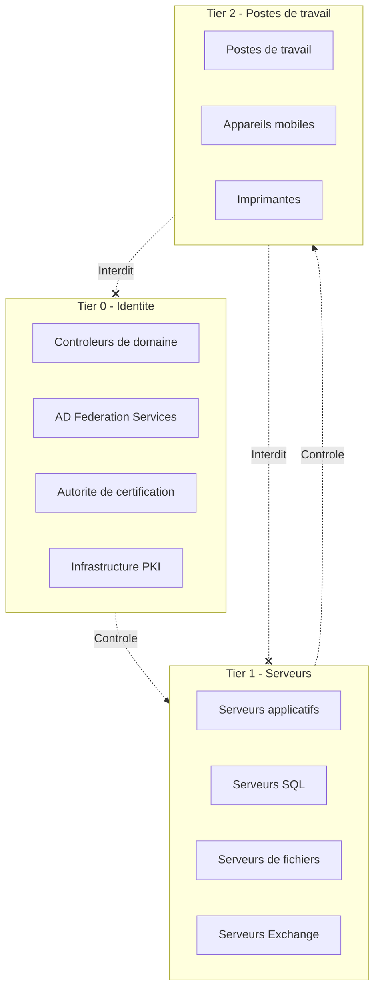
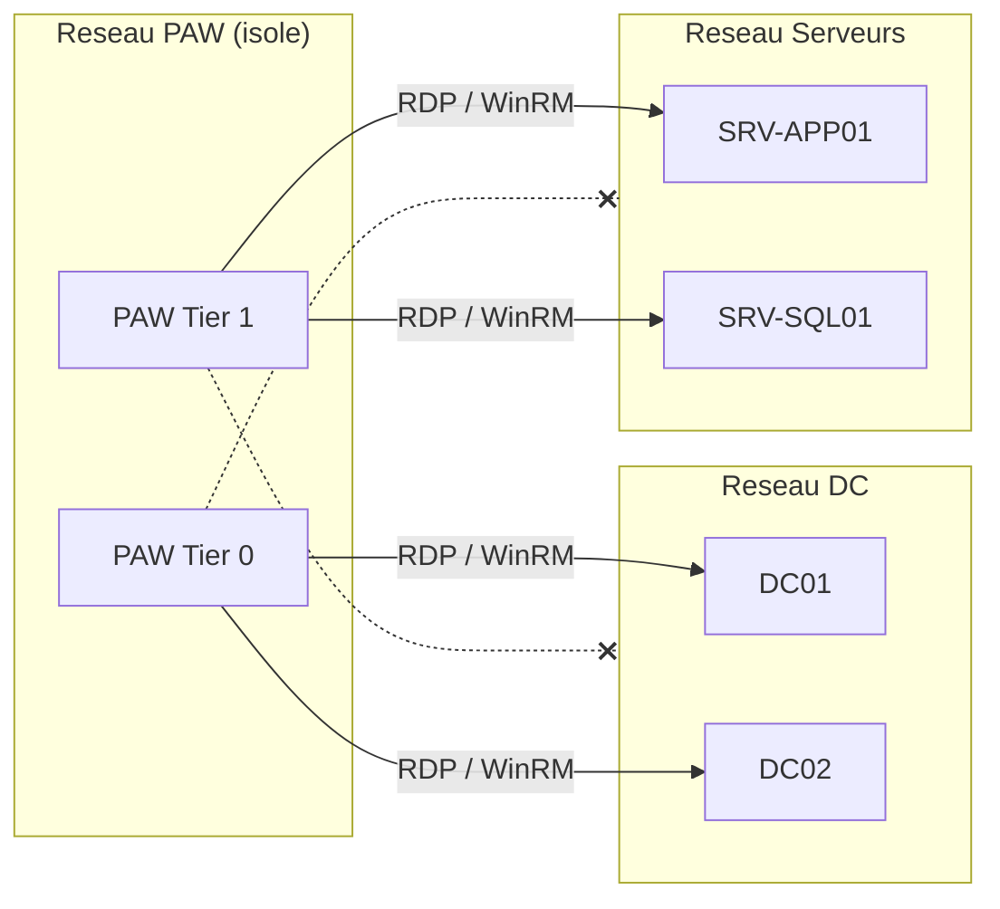

# Protection des comptes privilegies

!!! info "Niveau : avance | Temps estime : 50 minutes"

Les comptes privilegies sont la cible prioritaire des attaquants. Un compte Domain Admin compromis donne un acces total a l'infrastructure. La protection de ces comptes necessite une architecture de securite en couches.

---

## Le modele d'administration en tiers

Le **Tiered Administration Model** (modele en niveaux) segmente l'administration en trois zones de confiance pour limiter la propagation d'une compromission.



### Principes fondamentaux

| Regle | Description |
|-------|-------------|
| **Pas de connexion descendante** | Un admin Tier 0 ne se connecte jamais sur un poste Tier 2 |
| **Pas d'elevation ascendante** | Un admin Tier 2 ne peut pas administrer un serveur Tier 1 |
| **Comptes dedies par tier** | Chaque administrateur possede un compte distinct par niveau |
| **Stations d'administration dediees** | L'administration de chaque tier se fait depuis des postes specifiques |

### Comptes a creer

```powershell
# Create tiered admin accounts for a user
$tiers = @(
    @{ Name = "T0-jdupont"; Tier = "Tier 0"; OU = "OU=Tier0,OU=Admin Accounts,DC=lab,DC=local" },
    @{ Name = "T1-jdupont"; Tier = "Tier 1"; OU = "OU=Tier1,OU=Admin Accounts,DC=lab,DC=local" },
    @{ Name = "T2-jdupont"; Tier = "Tier 2"; OU = "OU=Tier2,OU=Admin Accounts,DC=lab,DC=local" }
)

foreach ($account in $tiers) {
    New-ADUser -Name $account.Name `
        -SamAccountName $account.Name `
        -Path $account.OU `
        -Description "$($account.Tier) admin account" `
        -Enabled $true `
        -AccountPassword (Read-Host -AsSecureString "Password for $($account.Name)")
}
```

### Restrictions de connexion par GPO

Pour chaque tier, configurez les droits de connexion via GPO :

```
# Computer Configuration > Policies > Windows Settings > Security Settings
# > Local Policies > User Rights Assignment

# On Tier 0 systems (Domain Controllers):
# - "Allow log on locally"     : Tier 0 admins only
# - "Deny log on locally"      : Tier 1 and Tier 2 accounts
# - "Deny log on through RDP"  : Tier 1 and Tier 2 accounts

# On Tier 1 systems (Servers):
# - "Allow log on locally"     : Tier 1 admins only
# - "Deny log on locally"      : Tier 0 and Tier 2 accounts

# On Tier 2 systems (Workstations):
# - "Allow log on locally"     : Tier 2 admins and standard users
# - "Deny log on locally"      : Tier 0 and Tier 1 accounts
```

---

## Privileged Access Workstations (PAW)

Une **PAW** est un poste de travail dedie exclusivement a l'administration. Il ne sert ni a la navigation web, ni a la messagerie, ni a aucune autre activite quotidienne.

### Caracteristiques d'une PAW

- **OS durci** : Windows derniere version, baselines de securite appliquees
- **Acces reseau restreint** : uniquement vers les systemes cibles
- **Pas d'acces Internet** : ou via un proxy tres restrictif
- **Pas d'email ni bureautique** : aucune application utilisateur
- **BitLocker actif** : chiffrement integral du disque
- **Credential Guard actif** : protection des identifiants en memoire
- **AppLocker / WDAC** : seuls les outils d'administration sont autorises

### Segmentation reseau pour les PAWs



---

## Groupe Protected Users

Le groupe **Protected Users** est un groupe de securite introduit avec Windows Server 2012 R2 qui applique automatiquement des restrictions de securite aux comptes membres.

### Protections appliquees

| Protection | Detail |
|------------|--------|
| Pas de mise en cache NTLM | Les identifiants NTLM ne sont pas mis en cache |
| Pas de delegation | La delegation Kerberos est refusee |
| Pas de DES/RC4 | Seul AES est autorise pour Kerberos |
| TGT a duree reduite | Duree de vie du TGT limitee a 4 heures (au lieu de 10) |
| Pas de CredSSP | Les identifiants ne transitent pas via CredSSP |

### Configuration

```powershell
# Add an admin account to the Protected Users group
Add-ADGroupMember -Identity "Protected Users" -Members "T0-jdupont"

# Verify membership
Get-ADGroupMember -Identity "Protected Users" | Select-Object Name, SamAccountName

# Check if a specific user is in the group
$user = Get-ADUser "T0-jdupont" -Properties MemberOf
$user.MemberOf | Where-Object { $_ -match "Protected Users" }
```

!!! warning "Impacts operationnels"

    L'ajout au groupe Protected Users peut casser certaines applications :

    - **NTLM requis** : certains outils legacy ne supportent pas Kerberos seul
    - **Delegation necessaire** : les services utilisant la delegation (SQL Server, IIS) ne fonctionneront plus
    - **TGT court** : l'administrateur devra se re-authentifier toutes les 4 heures

    **Testez soigneusement avant le deploiement en production.**

---

## Windows Credential Guard

**Credential Guard** utilise la securite basee sur la virtualisation (VBS) pour isoler les secrets (hashes NTLM, tickets Kerberos TGT) dans un conteneur protege inaccessible meme par le noyau Windows.

### Prerequis

- Processeur 64 bits avec extensions de virtualisation (Intel VT-x / AMD-V)
- UEFI Secure Boot active
- TPM 2.0 recommande
- Windows Server 2016 ou superieur

### Activation via GPO

```
Computer Configuration
  > Administrative Templates
    > System
      > Device Guard
        > Turn On Virtualization Based Security : Enabled
          - Platform Security Level : Secure Boot and DMA Protection
          - Credential Guard Configuration : Enabled with UEFI lock
```

### Activation via PowerShell

```powershell
# Enable Credential Guard via registry
$regPath = "HKLM:\SYSTEM\CurrentControlSet\Control\DeviceGuard"

# Enable Virtualization Based Security
Set-ItemProperty -Path $regPath -Name "EnableVirtualizationBasedSecurity" -Value 1 -Type DWord

# Enable Credential Guard (value 1 = enabled with UEFI lock, value 2 = enabled without lock)
Set-ItemProperty -Path $regPath -Name "RequirePlatformSecurityFeatures" -Value 3 -Type DWord

$lsaCfgPath = "HKLM:\SYSTEM\CurrentControlSet\Control\Lsa"
Set-ItemProperty -Path $lsaCfgPath -Name "LsaCfgFlags" -Value 1 -Type DWord
```

### Verification

```powershell
# Verify Credential Guard status
$devGuard = Get-CimInstance -ClassName Win32_DeviceGuard -Namespace root\Microsoft\Windows\DeviceGuard
$devGuard | Select-Object -Property SecurityServicesRunning, VirtualizationBasedSecurityStatus

# SecurityServicesRunning should include "1" (Credential Guard)
# VirtualizationBasedSecurityStatus: 2 = Running

# Alternative: check via msinfo32
# System Summary > Virtualization-based security > Running
# > Credential Guard > Running
```

!!! danger "UEFI Lock"

    Avec l'option **UEFI lock**, Credential Guard ne peut pas etre desactive a distance. Il faut un acces physique au serveur pour modifier la configuration UEFI. Cela protege contre la desactivation par un attaquant, mais complique les operations de maintenance.

---

## Bonnes pratiques supplementaires

### Strategie de mots de passe pour les comptes privilegies

```powershell
# Create a Fine-Grained Password Policy for Tier 0 admins
New-ADFineGrainedPasswordPolicy -Name "Tier0-PasswordPolicy" `
    -Precedence 10 `
    -MinPasswordLength 20 `
    -PasswordHistoryCount 30 `
    -ComplexityEnabled $true `
    -MaxPasswordAge "60.00:00:00" `
    -MinPasswordAge "1.00:00:00" `
    -LockoutThreshold 5 `
    -LockoutDuration "00:30:00" `
    -LockoutObservationWindow "00:30:00" `
    -ReversibleEncryptionEnabled $false

# Apply the policy to the Tier 0 admin group
Add-ADFineGrainedPasswordPolicy -Identity "Tier0-PasswordPolicy" `
    -Subjects "Tier0-Admins"
```

### Surveiller les comptes privilegies

```powershell
# Monitor changes to privileged groups
$privilegedGroups = @("Domain Admins", "Enterprise Admins", "Schema Admins", "Administrators")

foreach ($group in $privilegedGroups) {
    $members = Get-ADGroupMember -Identity $group
    Write-Output "=== $group ($($members.Count) members) ==="
    $members | Select-Object Name, SamAccountName, objectClass | Format-Table -AutoSize
}
```

---

## Points cles a retenir

- Le **modele en tiers** segmente l'administration pour limiter la propagation des compromissions
- Chaque administrateur doit disposer de **comptes distincts par niveau** (Tier 0, 1, 2)
- Les **PAWs** (Privileged Access Workstations) fournissent un environnement d'administration isole et durci
- Le groupe **Protected Users** applique des restrictions de securite automatiques aux comptes membres
- **Credential Guard** protege les identifiants en memoire grace a la virtualisation (VBS)
- Ces mesures doivent etre **combinees** pour une defense en profondeur efficace

---

## Pour aller plus loin

- Microsoft : Securing Privileged Access (SPA) roadmap
- Microsoft : Privileged Access Workstations deployment guide
- ANSSI : Recommandations pour l'administration securisee des SI
- LAPS pour la gestion des mots de passe locaux (voir la page [LAPS](laps.md))
