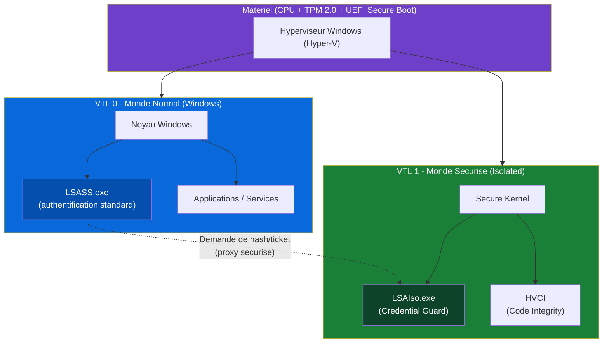

<!--
  Copyright 2026 Julien Bombled

  Licensed under the Apache License, Version 2.0 (the "License");
  you may not use this file except in compliance with the License.
  You may obtain a copy of the License at

      http://www.apache.org/licenses/LICENSE-2.0

  Unless required by applicable law or agreed to in writing, software
  distributed under the License is distributed on an "AS IS" BASIS,
  WITHOUT WARRANTIES OR CONDITIONS OF ANY KIND, either express or implied.
  See the License for the specific language governing permissions and
  limitations under the License.
-->

# Credential Guard et Virtualization-Based Security (VBS)

<span class="level-advanced">Avance</span> · Temps estime : 30 minutes

!!! example "Analogie"

    Imaginez un coffre-fort a l'interieur d'un autre coffre-fort. Le coffre-fort exterieur, c'est le systeme d'exploitation Windows : meme si un cambrioleur y penetre (elevation de privileges, malware), il se retrouve face a un second coffre-fort isole physiquement, protege par un gardien independant (l'hyperviseur). Les secrets d'identite (hashes NTLM, tickets Kerberos TGT) sont enfermes dans ce coffre interieur auquel meme l'administrateur du coffre exterieur n'a pas acces. C'est exactement le principe de Credential Guard : isoler les credentials dans une enclave materielle que le noyau Windows lui-meme ne peut pas atteindre.

---

## Menaces ciblees

Sans Credential Guard, un attaquant ayant obtenu des privileges administrateur sur un serveur peut extraire les identifiants stockes en memoire par le processus LSASS (Local Security Authority Subsystem Service). Les techniques les plus courantes sont :

| Technique | Description | Outil typique |
|-----------|-------------|---------------|
| **Pass-the-Hash (PtH)** | Vol du hash NTLM en memoire pour s'authentifier sans connaitre le mot de passe | mimikatz `sekurlsa::logonpasswords` |
| **Pass-the-Ticket (PtT)** | Vol du ticket Kerberos TGT pour usurper l'identite d'un utilisateur | mimikatz `kerberos::list /export` |
| **Overpass-the-Hash** | Conversion d'un hash NTLM en ticket Kerberos | mimikatz `sekurlsa::pth` |
| **Golden Ticket** | Forge d'un TGT avec le hash du compte krbtgt | mimikatz `kerberos::golden` |

Credential Guard neutralise ces attaques en rendant les secrets inaccessibles au systeme d'exploitation principal.

---

## Architecture VBS (Virtualization-Based Security)

VBS utilise l'hyperviseur Windows (Hyper-V) pour creer un environnement d'execution isole appele **Virtual Secure Mode (VSM)**. Le noyau Windows classique et le noyau securise s'executent dans deux mondes virtuels separes.



**Explication des niveaux de confiance virtuelle (VTL) :**

- **VTL 0 (Virtual Trust Level 0)** : le systeme d'exploitation Windows standard. Meme un processus avec des privileges SYSTEM ne peut pas acceder a la memoire de VTL 1.
- **VTL 1 (Virtual Trust Level 1)** : l'environnement isole. Le processus `LSAIso.exe` (LSA Isolated) stocke et manipule les secrets. Seules des requetes formatees via un canal securise sont acceptees.

---

## Device Guard vs Credential Guard

Ces deux fonctionnalites reposent toutes les deux sur VBS mais protegent des elements differents :

| Critere | Credential Guard | Device Guard (WDAC + HVCI) |
|---------|-----------------|---------------------------|
| **Objectif** | Proteger les identifiants en memoire | Controler les executables autorises |
| **Processus isole** | `LSAIso.exe` | Hypervisor Code Integrity (HVCI) |
| **Protege contre** | Pass-the-Hash, Pass-the-Ticket, mimikatz | Execution de code non signe, malware, drivers malveillants |
| **Prerequis materiels** | Identiques (UEFI, Secure Boot, TPM 2.0) | Identiques |
| **Activation independante** | Oui | Oui |

!!! tip "Recommandation"

    Activez les deux fonctionnalites ensemble pour une defense en profondeur : Credential Guard protege les secrets, Device Guard/HVCI empeche le chargement de code malveillant qui tenterait de contourner les protections.

---

## Prerequis materiels et logiciels

Avant d'activer Credential Guard, verifiez que votre infrastructure repond a ces exigences :

| Prerequis | Detail | Verification |
|-----------|--------|--------------|
| **Firmware UEFI** | Demarrage en mode UEFI (pas Legacy BIOS) | `bcdedit /enum {current}` → `path \EFI\...` |
| **Secure Boot** | Active dans le firmware UEFI | `Confirm-SecureBootUEFI` |
| **TPM 2.0** | Module de plateforme securisee version 2.0 | `Get-Tpm` |
| **Hyper-V** | Hyperviseur requis pour VBS | `Get-WindowsOptionalFeature -Online -FeatureName Microsoft-Hyper-V-Hypervisor` |
| **Architecture 64 bits** | Obligatoire | `[Environment]::Is64BitOperatingSystem` |
| **Windows Server 2016+** | Minimum requis (2022 recommande) | `(Get-ComputerInfo).OsName` |

```powershell
# Comprehensive prerequisite check
$checks = @{
    "UEFI Secure Boot" = try { Confirm-SecureBootUEFI } catch { $false }
    "TPM Present"      = (Get-Tpm).TpmPresent
    "TPM Ready"        = (Get-Tpm).TpmReady
    "64-bit OS"        = [Environment]::Is64BitOperatingSystem
    "Hyper-V Hypervisor" = (Get-WindowsOptionalFeature -Online -FeatureName Microsoft-Hyper-V-Hypervisor).State -eq "Enabled"
}

$checks.GetEnumerator() | ForEach-Object {
    [PSCustomObject]@{
        Prerequisite = $_.Key
        Status       = if ($_.Value) { "OK" } else { "MISSING" }
    }
} | Format-Table -AutoSize
```

Resultat :

```text
Prerequisite         Status
------------         ------
UEFI Secure Boot     OK
TPM Present          OK
TPM Ready            OK
64-bit OS            OK
Hyper-V Hypervisor   OK
```

---

## Activation de Credential Guard

### Methode 1 : via GPO (recommande pour un parc)

```
Computer Configuration
  > Administrative Templates
    > System
      > Device Guard
        > Turn On Virtualization Based Security : Enabled
          - Select Platform Security Level : Secure Boot and DMA Protection
          - Virtualization Based Protection of Code Integrity : Enabled with UEFI lock
          - Credential Guard Configuration : Enabled with UEFI lock
```

!!! warning "UEFI Lock"

    L'option **Enabled with UEFI lock** empeche la desactivation a distance via GPO. Pour desactiver Credential Guard, il faudra intervenir physiquement sur le firmware UEFI de chaque machine. Utilisez **Enabled without lock** en phase de test.

### Methode 2 : via PowerShell / registre

```powershell
# Enable VBS (Virtualization Based Security)
Set-ItemProperty -Path "HKLM:\SYSTEM\CurrentControlSet\Control\DeviceGuard" `
    -Name "EnableVirtualizationBasedSecurity" -Value 1 -Type DWord

# Configure Credential Guard (1 = Enabled with UEFI lock, 2 = Enabled without lock)
Set-ItemProperty -Path "HKLM:\SYSTEM\CurrentControlSet\Control\Lsa" `
    -Name "LsaCfgFlags" -Value 1 -Type DWord

# Enable Secure Boot level for VBS
Set-ItemProperty -Path "HKLM:\SYSTEM\CurrentControlSet\Control\DeviceGuard" `
    -Name "RequirePlatformSecurityFeatures" -Value 3 -Type DWord

# Enable HVCI (Hypervisor Code Integrity)
Set-ItemProperty -Path "HKLM:\SYSTEM\CurrentControlSet\Control\DeviceGuard\Scenarios\HypervisorEnforcedCodeIntegrity" `
    -Name "Enabled" -Value 1 -Type DWord

# Reboot required to apply
Restart-Computer -Force
```

### Methode 3 : via l'outil DG_Readiness_Tool

```powershell
# Download and run the Device Guard and Credential Guard readiness tool
# Check readiness
.\DG_Readiness_Tool.ps1 -Ready

# Enable Credential Guard
.\DG_Readiness_Tool.ps1 -Enable -CG

# Disable Credential Guard (requires physical access if UEFI-locked)
.\DG_Readiness_Tool.ps1 -Disable -CG
```

---

## Verification de l'activation

### Via msinfo32

Ouvrez `msinfo32.exe` et recherchez la section **Securite basee sur la virtualisation** :

- **Services de securite bases sur la virtualisation en cours d'execution** : doit afficher `Credential Guard`
- **Services de securite bases sur la virtualisation configures** : doit afficher `Credential Guard`

### Via PowerShell

```powershell
# Check VBS and Credential Guard status
$deviceGuard = Get-CimInstance -ClassName Win32_DeviceGuard -Namespace root\Microsoft\Windows\DeviceGuard

[PSCustomObject]@{
    "VBS Status"                      = switch ($deviceGuard.VirtualizationBasedSecurityStatus) {
                                            0 { "Disabled" }; 1 { "Enabled but not running" }; 2 { "Running" }
                                        }
    "Credential Guard"                = if ($deviceGuard.SecurityServicesRunning -contains 1) { "Running" } else { "Not running" }
    "HVCI"                            = if ($deviceGuard.SecurityServicesRunning -contains 2) { "Running" } else { "Not running" }
    "Required Security Properties"    = ($deviceGuard.RequiredSecurityProperties -join ", ")
    "Available Security Properties"   = ($deviceGuard.AvailableSecurityProperties -join ", ")
}
```

Resultat :

```text
VBS Status                    : Running
Credential Guard              : Running
HVCI                          : Running
Required Security Properties  : 1, 2
Available Security Properties : 1, 2, 3, 5
```

```powershell
# Alternative quick check using Get-ComputerInfo
Get-ComputerInfo | Select-Object DeviceGuard*
```

Resultat :

```text
DeviceGuardSmartStatus                                       : 2
DeviceGuardRequiredSecurityProperties                        : {BaseVirtualizationSupport, SecureBoot}
DeviceGuardAvailableSecurityProperties                       : {BaseVirtualizationSupport, SecureBoot, DMAProtection, SecureMemoryOverwrite}
DeviceGuardSecurityServicesConfigured                        : {CredentialGuard, HypervisorEnforcedCodeIntegrity}
DeviceGuardSecurityServicesRunning                           : {CredentialGuard, HypervisorEnforcedCodeIntegrity}
DeviceGuardCodeIntegrityPolicyEnforcementStatus              : AuditMode
DeviceGuardUserModeCodeIntegrityPolicyEnforcementStatus      : Off
```

---

## Impact sur les applications

L'activation de Credential Guard modifie le comportement de l'authentification Windows. Certaines fonctionnalites deviennent indisponibles :

| Fonctionnalite impactee | Comportement apres activation | Alternative |
|------------------------|-------------------------------|-------------|
| **NTLMv1** | Bloque (seul NTLMv2 est autorise) | Migrer vers NTLMv2 ou Kerberos |
| **Delegation Kerberos non contrainte** | Bloque | Utiliser la delegation contrainte ou basee sur les ressources |
| **Digest Authentication** | Bloque | Utiliser Kerberos ou NTLM |
| **CredSSP (delegation de credentials)** | Bloque par defaut | Utiliser Remote Credential Guard |
| **DES Kerberos** | Bloque | Utiliser AES 128/256 |
| **MS-CHAPv2** | Bloque | Utiliser EAP-TLS |
| **Identifiants RDP sauvegardes** | Ne fonctionnent plus | Saisir le mot de passe a chaque connexion ou utiliser Remote Credential Guard |

!!! info "Remote Credential Guard"

    Pour les connexions RDP, utilisez **Remote Credential Guard** au lieu de sauvegarder les identifiants. Cette fonctionnalite redirige les demandes Kerberos vers le poste client sans jamais envoyer les credentials au serveur distant :

    ```powershell
    # Connect via RDP with Remote Credential Guard
    mstsc /remoteGuard /v:SRV-DC-01.lab.local
    ```

---

## Scenario pratique

!!! example "Scenario pratique"

    **Contexte :** L'equipe securite de l'entreprise a detecte des traces de mimikatz sur un controleur de domaine lors d'un test d'intrusion. Le RSSI demande le deploiement de Credential Guard sur les 5 controleurs de domaine du parc (DC-01 a DC-05) pour empecher l'extraction des hashes NTLM et tickets Kerberos.

    **Etape 1 : Verification des prerequis sur tous les DC**

    ```powershell
    # Check prerequisites on all domain controllers
    $domainControllers = Get-ADDomainController -Filter * | Select-Object -ExpandProperty HostName

    $results = foreach ($dc in $domainControllers) {
        Invoke-Command -ComputerName $dc -ScriptBlock {
            [PSCustomObject]@{
                ComputerName = $env:COMPUTERNAME
                SecureBoot   = try { Confirm-SecureBootUEFI } catch { $false }
                TPMPresent   = (Get-Tpm).TpmPresent
                TPMReady     = (Get-Tpm).TpmReady
                HyperV       = (Get-WindowsOptionalFeature -Online -FeatureName Microsoft-Hyper-V-Hypervisor).State
                Architecture = [Environment]::Is64BitOperatingSystem
            }
        }
    }
    $results | Format-Table -AutoSize
    ```

    Resultat :

    ```text
    ComputerName  SecureBoot  TPMPresent  TPMReady  HyperV   Architecture
    ------------  ----------  ----------  --------  ------   ------------
    DC-01         True        True        True      Enabled  True
    DC-02         True        True        True      Enabled  True
    DC-03         True        True        True      Enabled  True
    DC-04         False       True        True      Enabled  True
    DC-05         True        True        True      Enabled  True
    ```

    DC-04 n'a pas Secure Boot active. Il faudra intervenir sur son firmware UEFI avant de deployer Credential Guard.

    **Etape 2 : Deploiement via GPO**

    ```powershell
    # Create and link the Credential Guard GPO to the Domain Controllers OU
    $gpoName = "SEC - Credential Guard - DC"
    $dcOU = "OU=Domain Controllers,DC=lab,DC=local"

    # Create the GPO
    New-GPO -Name $gpoName -Comment "Enable Credential Guard on Domain Controllers"

    # Configure VBS and Credential Guard via registry preferences
    # EnableVirtualizationBasedSecurity = 1
    Set-GPRegistryValue -Name $gpoName `
        -Key "HKLM\SYSTEM\CurrentControlSet\Control\DeviceGuard" `
        -ValueName "EnableVirtualizationBasedSecurity" -Type DWord -Value 1

    # Credential Guard with lock (LsaCfgFlags = 2 for without lock during test)
    Set-GPRegistryValue -Name $gpoName `
        -Key "HKLM\SYSTEM\CurrentControlSet\Control\Lsa" `
        -ValueName "LsaCfgFlags" -Type DWord -Value 2

    # Require Secure Boot + DMA Protection
    Set-GPRegistryValue -Name $gpoName `
        -Key "HKLM\SYSTEM\CurrentControlSet\Control\DeviceGuard" `
        -ValueName "RequirePlatformSecurityFeatures" -Type DWord -Value 3

    # Link GPO to the Domain Controllers OU
    New-GPLink -Name $gpoName -Target $dcOU -LinkEnabled Yes
    ```

    **Etape 3 : Redemarrage progressif et verification**

    ```powershell
    # After reboot, verify Credential Guard is running on each DC
    foreach ($dc in $domainControllers) {
        Invoke-Command -ComputerName $dc -ScriptBlock {
            $dg = Get-CimInstance -ClassName Win32_DeviceGuard -Namespace root\Microsoft\Windows\DeviceGuard
            [PSCustomObject]@{
                ComputerName    = $env:COMPUTERNAME
                VBSStatus       = switch ($dg.VirtualizationBasedSecurityStatus) {
                                      0 { "Disabled" }; 1 { "Configured" }; 2 { "Running" }
                                  }
                CredentialGuard = if ($dg.SecurityServicesRunning -contains 1) { "Running" } else { "Not running" }
            }
        }
    } | Format-Table -AutoSize
    ```

    ??? success "Resultat attendu"

        ```text
        ComputerName  VBSStatus  CredentialGuard
        ------------  ---------  ---------------
        DC-01         Running    Running
        DC-02         Running    Running
        DC-03         Running    Running
        DC-04         Running    Running
        DC-05         Running    Running
        ```

        Tous les controleurs de domaine executent Credential Guard. Les hashes NTLM et tickets Kerberos sont desormais isoles dans VTL 1, hors de portee de mimikatz et des attaques Pass-the-Hash.

---

## Erreurs courantes

!!! failure "Erreur 1 : Secure Boot ou UEFI non actif"

    **Symptome :** VBS reste en etat `Configured` mais ne passe jamais a `Running` apres redemarrage. `msinfo32` indique "Securite basee sur la virtualisation : non active".

    **Cause :** Le serveur demarre en mode Legacy BIOS ou Secure Boot est desactive dans le firmware UEFI. VBS exige imperativement un demarrage UEFI avec Secure Boot actif.

    **Solution :** Acceder au firmware UEFI du serveur, activer Secure Boot, et verifier que le mode de demarrage est UEFI (et non CSM/Legacy). Attention : convertir un disque MBR en GPT peut etre necessaire (`mbr2gpt /convert /disk:0`), ce qui implique une planification soigneuse.

!!! failure "Erreur 2 : Drivers incompatibles avec HVCI"

    **Symptome :** Ecran bleu (BSOD) au redemarrage apres activation de Credential Guard, ou peripheriques qui ne fonctionnent plus. Le code d'arret indique `SYSTEM_SERVICE_EXCEPTION` ou `DRIVER_VERIFIER_DETECTED_VIOLATION`.

    **Cause :** Certains drivers anciens ou mal signes ne sont pas compatibles avec Hypervisor-protected Code Integrity (HVCI). HVCI bloque le chargement de drivers qui tentent d'executer du code en memoire non signee.

    **Solution :** Avant le deploiement, executer `DG_Readiness_Tool.ps1 -Ready` pour identifier les drivers incompatibles. Mettre a jour les drivers signales, ou contacter le fournisseur. En cas d'urgence, desactiver HVCI temporairement sans toucher a Credential Guard.

!!! failure "Erreur 3 : Connexion RDP avec identifiants sauvegardes echoue"

    **Symptome :** Les connexions Bureau a distance qui utilisaient des identifiants enregistres dans le Gestionnaire d'identification Windows demandent systematiquement le mot de passe. Les scripts d'automatisation RDP echouent.

    **Cause :** Credential Guard empeche la delegation des identifiants via CredSSP. Les credentials stockes dans le Gestionnaire d'identification ne peuvent plus etre transmis au serveur distant.

    **Solution :** Utiliser **Remote Credential Guard** (`mstsc /remoteGuard`) qui redirige les demandes Kerberos vers le poste client sans exposer les credentials. Pour les scripts, adapter l'authentification pour utiliser Kerberos natif ou des certificats.

!!! failure "Erreur 4 : Applications NTLMv1 cessent de fonctionner"

    **Symptome :** Des applications anciennes (ERP, middleware) qui utilisent NTLMv1 retournent des erreurs d'authentification apres activation de Credential Guard. Les journaux montrent l'Event ID 4776 avec un code d'erreur `0xC000006D`.

    **Cause :** Credential Guard impose NTLMv2 au minimum. Les applications configurees pour utiliser NTLMv1 ne peuvent plus s'authentifier car le protocole est bloque au niveau de l'enclave securisee.

    **Solution :** Identifier les applications dependantes de NTLMv1 en activant l'audit NTLM (`Network security: Restrict NTLM: Audit NTLM authentication in this domain`) AVANT d'activer Credential Guard. Migrer ces applications vers NTLMv2 ou Kerberos. En dernier recours, configurer des exceptions via GPO.

!!! failure "Erreur 5 : Declenchement de la recuperation BitLocker apres activation"

    **Symptome :** Apres activation de Credential Guard et redemarrage, le serveur demande la cle de recuperation BitLocker au lieu de demarrer normalement. Le serveur est bloque a l'ecran de recuperation.

    **Cause :** L'activation de VBS modifie la chaine de demarrage (ajout de l'hyperviseur). BitLocker detecte ce changement comme une tentative de falsification du demarrage securise et declenche la recuperation.

    **Solution :** **Suspendre BitLocker AVANT d'activer Credential Guard** avec `Suspend-BitLocker -MountPoint "C:" -RebootCount 2`. BitLocker se reactivera automatiquement apres les redemarrages necessaires. Conserver les cles de recuperation BitLocker accessibles (AD ou stockage securise) avant toute modification de la chaine de demarrage.

    ```powershell
    # Suspend BitLocker BEFORE enabling Credential Guard
    Suspend-BitLocker -MountPoint "C:" -RebootCount 2

    # Verify BitLocker suspension
    Get-BitLockerVolume -MountPoint "C:" | Select-Object MountPoint, ProtectionStatus
    ```

    Resultat :

    ```text
    MountPoint  ProtectionStatus
    ----------  ----------------
    C:          Off
    ```

---

## Points cles a retenir

- Credential Guard isole les identifiants (hashes NTLM, tickets Kerberos TGT) dans un environnement **VBS (VTL 1)** inaccessible au systeme d'exploitation
- L'activation necessite des **prerequis materiels stricts** : UEFI, Secure Boot, TPM 2.0, support Hyper-V
- **Device Guard** et **Credential Guard** sont complementaires : le premier protege l'integrite du code, le second protege les secrets
- L'impact sur les applications existantes doit etre evalue **avant le deploiement** : NTLMv1, delegation non contrainte et CredSSP sont bloques
- Suspendre **BitLocker** avant l'activation pour eviter un verrouillage au redemarrage
- Utiliser **Remote Credential Guard** (`mstsc /remoteGuard`) pour les connexions RDP securisees

---

## Pour aller plus loin

- [Bonnes pratiques de durcissement](bonnes-pratiques.md) pour les mesures complementaires de hardening
- [LAPS](laps.md) pour la protection des mots de passe administrateur locaux
- [Modele de Tiering](tiering-model.md) pour le cloisonnement des niveaux de privileges
- [Concepts fondamentaux Active Directory](../../active-directory/adds/concepts-fondamentaux.md) pour comprendre les mecanismes d'authentification Kerberos et NTLM
