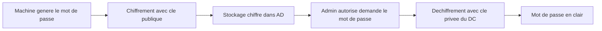

# LAPS - Local Administrator Password Solution

<span class="level-advanced">Avance</span> · Temps estime : 40 minutes

LAPS permet de gerer automatiquement les mots de passe des comptes administrateur locaux de chaque machine du domaine. Chaque ordinateur recoit un mot de passe unique, stocke de maniere securisee dans Active Directory.

---

## Pourquoi LAPS ?

!!! example "Analogie"

    Imaginez un immeuble ou toutes les portes d'appartement utilisent la meme cle. Si un cambrioleur copie une seule cle, il a acces a tous les logements. LAPS, c'est comme donner une serrure unique a chaque porte, avec un gardien de confiance (Active Directory) qui conserve les doubles dans un coffre-fort.

Sans LAPS, les administrateurs deploient souvent le meme mot de passe administrateur local sur toutes les machines. Ce scenario cree un risque majeur :


Avec LAPS :

- Chaque machine a un **mot de passe unique** et **aleatoire**
- Les mots de passe sont **renouveles automatiquement** selon une periodicite configurable
- Les mots de passe sont stockes dans un **attribut protege** d'Active Directory
- Seuls les administrateurs autorises peuvent **lire** les mots de passe

---

## LAPS Legacy vs Windows LAPS

| Fonctionnalite | LAPS Legacy | Windows LAPS |
|----------------|-------------|--------------|
| **Stockage** | Attribut AD en clair (ms-Mcs-AdmPwd) | Attribut AD chiffre ou Azure AD |
| **Chiffrement** | Non | Oui (optionnel) |
| **Support Azure AD** | Non | Oui |
| **Historique des mots de passe** | Non | Oui |
| **Gestion de compte DSRM** | Non | Oui |
| **Interface native** | Non (outils separes) | Integre a Windows |
| **Disponibilite** | Telechargement separe | Integre a Windows Server 2022 (mise a jour avril 2023+) |

!!! tip "Recommandation"

    Pour les nouvelles installations, privilegiez **Windows LAPS** (integre). LAPS Legacy reste pertinent pour la compatibilite avec les anciens systemes.

---

## Installation de LAPS Legacy

### Etape 1 : extension du schema Active Directory

L'extension du schema ajoute deux attributs aux objets ordinateur :

- `ms-Mcs-AdmPwd` : le mot de passe en clair
- `ms-Mcs-AdmPwdExpirationTime` : la date d'expiration

```powershell
# Import the LAPS PowerShell module (after MSI installation on management machine)
Import-Module AdmPwd.PS

# Extend the Active Directory schema (requires Schema Admin privileges)
Update-AdmPwdADSchema
```

Resultat :

```text
Operation            DistinguishedName
---------            -----------------
AddSchemaAttribute   CN=ms-Mcs-AdmPwd,CN=Schema,CN=Configuration,DC=lab,DC=local
AddSchemaAttribute   CN=ms-Mcs-AdmPwdExpirationTime,CN=Schema,CN=Configuration,DC=lab,DC=local
ModifySchemaClass    CN=Computer,CN=Schema,CN=Configuration,DC=lab,DC=local
```

### Etape 2 : configuration des permissions

```powershell
# Allow machines to write their own password to AD
# Apply to the OU containing computer accounts
Set-AdmPwdComputerSelfPermission -OrgUnit "OU=Servers,DC=lab,DC=local"

# Grant read access to a specific admin group
Set-AdmPwdReadPasswordPermission -OrgUnit "OU=Servers,DC=lab,DC=local" `
    -AllowedPrincipals "LAPS-Password-Readers"

# Grant reset permission to a specific admin group
Set-AdmPwdResetPasswordPermission -OrgUnit "OU=Servers,DC=lab,DC=local" `
    -AllowedPrincipals "LAPS-Password-Resetters"

# Verify current permissions
Find-AdmPwdExtendedRights -OrgUnit "OU=Servers,DC=lab,DC=local"
```

Resultat :

```text
Name                    Permission        DistinguishedName
----                    ----------        -----------------
SELF                    SELF permission   OU=Servers,DC=lab,DC=local
LAB\LAPS-Password-Re... Read password    OU=Servers,DC=lab,DC=local
LAB\LAPS-Password-Re... Reset password   OU=Servers,DC=lab,DC=local

ObjectDN                          ExtendedRightHolders
--------                          --------------------
OU=Servers,DC=lab,DC=local        {LAB\LAPS-Password-Readers, LAB\Domain Admins}
```

!!! danger "Securite des permissions"

    Par defaut, tous les utilisateurs ayant les droits `All Extended Rights` sur une OU peuvent lire les mots de passe LAPS. Auditez et restreignez ces droits.

### Etape 3 : deploiement du client LAPS

Le client LAPS (DLL `AdmPwd.dll`) doit etre installe sur chaque machine geree. Deployez-le via GPO, SCCM ou script :

```powershell
# Silent installation of the LAPS client MSI
msiexec /i "LAPS.x64.msi" /quiet /norestart

# Verify installation
Get-ChildItem "C:\Program Files\LAPS\CSE\AdmPwd.dll" -ErrorAction SilentlyContinue
```

### Etape 4 : configuration via GPO

Creez une GPO et configurez les parametres suivants :

```
Computer Configuration
  > Administrative Templates
    > LAPS
      > Enable local admin password management : Enabled
      > Password Settings :
        - Password Complexity : Large letters + small letters + numbers + specials
        - Password Length : 20
        - Password Age (Days) : 30
      > Name of administrator account to manage : (leave default or specify)
      > Do not allow password expiration time longer than required by policy : Enabled
```

---

## Recuperation des mots de passe (LAPS Legacy)

### Via PowerShell

```powershell
# Retrieve the LAPS password for a specific computer
Get-AdmPwdPassword -ComputerName "SRV01" | Select-Object ComputerName, Password, ExpirationTimestamp

# Retrieve passwords for all computers in an OU
Get-ADComputer -Filter * -SearchBase "OU=Servers,DC=lab,DC=local" -Properties ms-Mcs-AdmPwd, ms-Mcs-AdmPwdExpirationTime |
    Select-Object Name,
        @{N='Password';E={$_.'ms-Mcs-AdmPwd'}},
        @{N='Expiration';E={[datetime]::FromFileTime($_.'ms-Mcs-AdmPwdExpirationTime')}}
```

Resultat :

```text
ComputerName  Password                          ExpirationTimestamp
------------  --------                          -------------------
SRV-01        x7$kL9#mQ2pR5vW8                  2025-03-15 14:30:00

Name       Password              Expiration
----       --------              ----------
SRV-01     x7$kL9#mQ2pR5vW8      15/03/2025 14:30:00
SRV-02     Bn4&tY6!hJ8wZ1qF      22/03/2025 09:15:00
DC-01      (acces refuse)
SRV-APP01  pM3@vK7#sD9nL2xR      01/04/2025 11:00:00
```

### Via l'interface graphique

L'outil **LAPS UI** (`AdmPwd.UI.exe`) fournit une interface simple pour rechercher et afficher les mots de passe par nom de machine.

### Forcer la rotation d'un mot de passe

```powershell
# Reset the password expiration to force immediate rotation
Reset-AdmPwdPassword -ComputerName "SRV01"

# Then force a GPO refresh on the target
Invoke-GPUpdate -Computer "SRV01" -Force
```

---

## Windows LAPS (nouvelle generation)

Windows LAPS est integre nativement a Windows Server 2022 (apres la mise a jour d'avril 2023) et Windows 11.

### Configuration du schema

```powershell
# Update the AD schema for Windows LAPS
Update-LapsADSchema

# Grant machines the permission to update their password
Set-LapsADComputerSelfPermission -Identity "OU=Servers,DC=lab,DC=local"

# Grant read permission to an admin group
Set-LapsADReadPasswordPermission -Identity "OU=Servers,DC=lab,DC=local" `
    -AllowedPrincipals "LAPS-Password-Readers"

# Grant reset permission
Set-LapsADResetPasswordPermission -Identity "OU=Servers,DC=lab,DC=local" `
    -AllowedPrincipals "LAPS-Password-Resetters"
```

### Configuration via GPO

```
Computer Configuration
  > Administrative Templates
    > System
      > LAPS
        > Configure password backup directory : Active Directory
        > Password Settings :
          - Password Complexity : Large letters + small letters + numbers + specials
          - Password Length : 20
          - Password Age (Days) : 30
        > Enable password encryption : Enabled
        > Enable password backup for DSRM accounts : Enabled (for DCs)
        > Configure authorized password decryptors : LAPS-Password-Readers
```

### Recuperation (Windows LAPS)

```powershell
# Retrieve the password using the built-in cmdlet
Get-LapsADPassword -Identity "SRV01" -AsPlainText

# View password history (Windows LAPS feature)
Get-LapsADPassword -Identity "SRV01" -AsPlainText -IncludeHistory

# Force password rotation
Reset-LapsPassword -Identity "SRV01"

# Check LAPS status on all computers in an OU
Get-ADComputer -Filter * -SearchBase "OU=Servers,DC=lab,DC=local" |
    ForEach-Object {
        $laps = Get-LapsADPassword -Identity $_.Name -AsPlainText -ErrorAction SilentlyContinue
        [PSCustomObject]@{
            Computer   = $_.Name
            Password   = if ($laps) { $laps.Password } else { "N/A" }
            Expiration = if ($laps) { $laps.ExpirationTimestamp } else { "N/A" }
        }
    } | Format-Table -AutoSize
```

Resultat :

```text
Computer    Password              Expiration
--------    --------              ----------
SRV-01      G8#xL5mP2@wK9nR      2025-03-20 10:00:00
SRV-02      Yt4&bN7!qJ3vF6sD      2025-03-25 16:45:00
SRV-APP01   zW1$hM8#kR5tQ9pL      2025-04-01 08:30:00
DC-01       N/A                    N/A
```

### Chiffrement des mots de passe

Windows LAPS supporte le chiffrement des mots de passe stockes dans AD :



!!! tip "Avantage du chiffrement"

    Avec LAPS Legacy, les mots de passe sont stockes en clair dans l'attribut AD. Avec Windows LAPS, le chiffrement empeche meme un administrateur AD de lire les mots de passe sans etre explicitement autorise.

---

## Audit et supervision

```powershell
# Audit: find computers with expired LAPS passwords
$threshold = (Get-Date).AddDays(-30).ToFileTime()

Get-ADComputer -Filter * -SearchBase "OU=Servers,DC=lab,DC=local" `
    -Properties ms-Mcs-AdmPwdExpirationTime |
    Where-Object { $_.'ms-Mcs-AdmPwdExpirationTime' -lt $threshold } |
    Select-Object Name, @{N='Expiration';E={[datetime]::FromFileTime($_.'ms-Mcs-AdmPwdExpirationTime')}}

# Audit: find computers without LAPS password (not deployed)
Get-ADComputer -Filter * -SearchBase "OU=Servers,DC=lab,DC=local" `
    -Properties ms-Mcs-AdmPwd |
    Where-Object { -not $_.'ms-Mcs-AdmPwd' } |
    Select-Object Name
```

Resultat :

```text
Name            Expiration
----            ----------
SRV-02          12/01/2025 09:15:00

Name
----
SRV-TEST03
SRV-DEV02
```

---

## Scenario pratique

!!! example "Scenario pratique"

    **Contexte** : Caroline, administratrice systeme, doit intervenir en urgence sur le serveur `SRV-02` (10.0.0.12) dont le service applicatif est bloque. Elle doit se connecter avec le compte administrateur local mais ne connait pas le mot de passe (LAPS est deploye).

    **Recuperation du mot de passe** :

    ```powershell
    # Retrieve the LAPS password for SRV-02
    Get-LapsADPassword -Identity "SRV-02" -AsPlainText
    ```

    Resultat :

    ```text
    ComputerName  : SRV-02
    Account       : Administrator
    Password      : Yt4&bN7!qJ3vF6sD
    PasswordUpdateTime : 2025-02-20 10:00:00
    ExpirationTimestamp : 2025-03-25 16:45:00
    Source        : EncryptedPassword
    DecryptionStatus : Success
    AuthorizedDecryptor : LAB\LAPS-Password-Readers
    ```

    Caroline utilise ce mot de passe pour se connecter en local, resout le probleme, puis force la rotation du mot de passe par securite :

    ```powershell
    # Force password rotation after intervention
    Reset-LapsPassword -Identity "SRV-02"
    Invoke-GPUpdate -Computer "SRV-02" -Force
    ```

    Le mot de passe est immediatement regenere et l'ancien ne fonctionne plus.

---

!!! danger "Erreurs courantes"

    1. **Deployer LAPS sans configurer les permissions de lecture** : si aucun groupe n'a le droit de lire les mots de passe, vous ne pourrez plus vous connecter en local sur les machines gerees. Configurez les groupes `LAPS-Password-Readers` AVANT de deployer le client.

    2. **Utiliser LAPS Legacy sans chiffrement sur un reseau non securise** : avec LAPS Legacy, les mots de passe sont stockes en clair dans l'attribut `ms-Mcs-AdmPwd`. Toute personne ayant les droits `All Extended Rights` sur l'OU peut les lire. Migrez vers Windows LAPS pour le chiffrement.

    3. **Oublier d'etendre le schema AD avant le deploiement** : le client LAPS ne peut pas ecrire le mot de passe sans les attributs `ms-Mcs-AdmPwd` et `ms-Mcs-AdmPwdExpirationTime`. L'extension du schema est un prerequis obligatoire.

    4. **Ne pas surveiller les machines sans mot de passe LAPS** : les machines nouvellement jointes au domaine ou celles ou le client n'est pas installe restent vulnerables. Mettez en place un audit regulier pour detecter les machines non couvertes.

---

## Points cles a retenir

- LAPS elimine le risque du **mot de passe administrateur local identique** sur toutes les machines
- Chaque machine obtient un mot de passe **unique, aleatoire et renouvele automatiquement**
- **Windows LAPS** (integre) est la version recommandee : elle apporte le chiffrement et l'historique des mots de passe
- Les permissions de lecture doivent etre **strictement limitees** aux administrateurs autorises
- Le deploiement passe par 4 etapes : schema, permissions, client, GPO
- Auditez regulierement les machines sans mot de passe LAPS ou avec des mots de passe expires

---

## Pour aller plus loin

- Microsoft : Windows LAPS documentation officielle
- Microsoft : Migration de LAPS Legacy vers Windows LAPS
- Guide de protection des comptes privilegies (voir la page [Comptes privilegies](comptes-privilegies.md))
