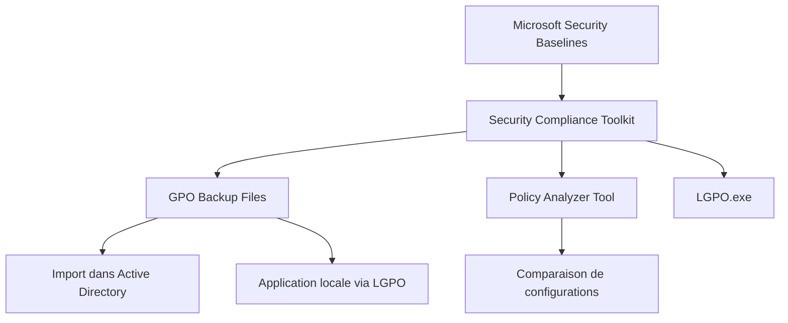

# Microsoft Security Baselines

<span class="level-advanced">Avance</span> · Temps estime : 40 minutes

Les Security Baselines de Microsoft fournissent des configurations de securite recommandees et testees pour Windows Server. Elles permettent d'etablir rapidement un socle de securite coherent a l'echelle de l'entreprise.

---

## Qu'est-ce qu'une Security Baseline ?

!!! example "Analogie"

    Une Security Baseline est comparable au reglement de securite incendie d'un immeuble : elle definit des normes minimales (extincteurs, sorties de secours, alarmes) que tout batiment doit respecter. Vous pouvez ajouter des mesures supplementaires selon vos besoins, mais les normes de base ne sont pas negociables.

Une Security Baseline est un ensemble de parametres de configuration de securite recommandes par Microsoft. Ces parametres couvrent :

- Les **strategies de groupe** (GPO) : politique de mot de passe, verrouillage de compte, audit
- Les **droits utilisateurs** : acces local, acces reseau, droit de debogage
- Les **options de securite** : SMB signing, LDAP signing, NTLMv2
- Les **parametres Windows Defender Firewall**
- Les **configurations d'audit avancees**



---

## Security Compliance Toolkit (SCT)

Le **Security Compliance Toolkit** est l'outil officiel de Microsoft pour gerer les baselines.

### Composants du SCT

| Composant | Description |
|-----------|-------------|
| **Security Baselines** | Fichiers GPO prets a l'importation |
| **Policy Analyzer** | Outil de comparaison de configurations GPO |
| **LGPO.exe** | Outil en ligne de commande pour les politiques locales |
| **Documentation** | Guides et spreadsheets detaillant chaque parametre |

### Telechargement et installation

```powershell
# Download the Security Compliance Toolkit from Microsoft (manual download required)
# URL: https://www.microsoft.com/en-us/download/details.aspx?id=55319

# Typical extraction structure
# C:\SCT\
#   ├── Windows Server 2022 Security Baseline\
#   │   ├── GP Reports\
#   │   ├── GPOs\
#   │   ├── Scripts\
#   │   └── Documentation\
#   ├── PolicyAnalyzer\
#   └── LGPO\
```

---

## Contenu d'une baseline Windows Server 2022

### GPOs fournies

La baseline Windows Server 2022 comprend generalement les GPOs suivantes :

| GPO | Cible |
|-----|-------|
| **MSFT Windows Server 2022 - Domain Security** | Politique du domaine (mots de passe, Kerberos) |
| **MSFT Windows Server 2022 - Member Server** | Serveurs membres du domaine |
| **MSFT Windows Server 2022 - Domain Controller** | Controleurs de domaine |
| **MSFT Windows Server 2022 - Defender Antivirus** | Configuration de Microsoft Defender |
| **MSFT Windows Server 2022 - Credential Guard** | Protection des identifiants |

### Parametres cles

!!! tip "Exemples de parametres configures par la baseline"

    - **Longueur minimale de mot de passe** : 14 caracteres
    - **Historique des mots de passe** : 24 mots de passe retenus
    - **Verrouillage de compte** : 10 tentatives, duree 15 minutes
    - **SMB signing** : requis (Required)
    - **LDAP signing** : requis
    - **NTLMv2** : seule methode autorisee
    - **PowerShell Script Block Logging** : active
    - **Audit des connexions** : succes et echecs

---

## Application via GPO dans Active Directory

### Etape 1 : importer les GPOs

```powershell
# Create a new GPO for the baseline
$gpoName = "SEC - Windows Server 2022 Member Server Baseline"
$gpo = New-GPO -Name $gpoName -Comment "Microsoft Security Baseline for WS2022 Member Servers"

# Import the baseline settings from the SCT backup
# The GUID corresponds to the GPO backup folder name
$backupPath = "C:\SCT\Windows Server 2022 Security Baseline\GPOs"
$backupId = (Get-ChildItem -Path $backupPath -Directory).Name

Import-GPO -BackupId $backupId -Path $backupPath -TargetName $gpoName
```

Resultat :

```text
DisplayName                     : SEC - Windows Server 2022 Member Server Baseline
DomainName                      : lab.local
Owner                           : LAB\Domain Admins
GpoStatus                      : AllSettingsEnabled
Description                     : Microsoft Security Baseline for WS2022 Member Servers

Import-GPO : l'importation a reussi.
Imported 1456 settings from backup {3E4F2C1A-5B6D-4E8F-9A0B-1C2D3E4F5A6B}.
```

### Etape 2 : lier la GPO a l'OU cible

```powershell
# Link GPO to the Servers OU
$ouPath = "OU=Servers,DC=lab,DC=local"
New-GPLink -Name $gpoName -Target $ouPath -LinkEnabled Yes

# Verify the link
Get-GPInheritance -Target $ouPath |
    Select-Object -ExpandProperty GpoLinks |
    Format-Table DisplayName, Enabled, Order
```

Resultat :

```text
GpoId       : {3E4F2C1A-5B6D-4E8F-9A0B-1C2D3E4F5A6B}
DisplayName : SEC - Windows Server 2022 Member Server Baseline
Enabled     : True
Order       : 1
Target      : OU=Servers,DC=lab,DC=local
```

### Etape 3 : forcer l'application et verifier

```powershell
# Force GPO refresh on a target server
Invoke-GPUpdate -Computer "SRV01" -Force

# Generate a GPO result report
gpresult /r /scope:computer

# Generate a detailed HTML report
gpresult /h "C:\Temp\gpresult-srv01.html"
```

Resultat :

```text
Updating policy...

Computer Policy update has completed successfully.
User Policy update has completed successfully.

RSOP data for SRV-01\SRV01$ on SRV-01 : Logging Mode
-------------------------------------------------------
OS Configuration:        Member Server
OS Version:              10.0.20348
Site Name:               Default-First-Site-Name
Roaming Profile:         N/A
Local Profile:           C:\Users\T1-jdupont

Applied Group Policy Objects
-----------------------------
    SEC - Windows Server 2022 Member Server Baseline
    Default Domain Policy
```

!!! warning "Ordre d'application"

    Les GPOs s'appliquent dans l'ordre **LSDOU** : Local, Site, Domain, OU. Assurez-vous que la baseline n'est pas ecrasee par une GPO de priorite superieure. Utilisez `gpresult /r` pour verifier les parametres effectifs.

---

## LGPO.exe : application sur serveur autonome

Pour les serveurs hors domaine (workgroup), utilisez **LGPO.exe** pour appliquer les baselines localement.

```powershell
# Apply a GPO backup to local policy
# Run from the baseline Scripts directory
.\LGPO.exe /g "..\GPOs\{backup-guid}"

# Apply specific security template
.\LGPO.exe /s "GptTmpl.inf"

# Export current local policy for comparison
.\LGPO.exe /b "C:\Temp\LocalPolicyBackup"
```

---

## Policy Analyzer : comparaison de configurations

Policy Analyzer permet de comparer la configuration actuelle d'un serveur avec la baseline recommandee.

### Utilisation

1. Lancer **PolicyAnalyzer.exe**
2. Ajouter la baseline de reference (fichier `.PolicyRules`)
3. Ajouter la configuration actuelle (export GPO ou LGPO)
4. Comparer et analyser les ecarts

### Scenarios de comparaison courants

| Scenario | Utilite |
|----------|---------|
| Baseline vs configuration actuelle | Identifier les ecarts de conformite |
| Baseline v1 vs Baseline v2 | Comprendre les evolutions entre versions |
| Baseline vs configuration personnalisee | Documenter les exceptions |

```powershell
# Export current GPO for comparison with Policy Analyzer
# Backup all GPOs in the domain
$backupFolder = "C:\Temp\GPO-Backup-$(Get-Date -Format 'yyyyMMdd')"
New-Item -ItemType Directory -Path $backupFolder -Force
Backup-GPO -All -Path $backupFolder

# List the backups
Get-ChildItem -Path $backupFolder -Directory | Select-Object Name
```

Resultat :

```text
Name
----
{A1B2C3D4-E5F6-7890-ABCD-EF1234567890}
{B2C3D4E5-F6A7-8901-BCDE-F12345678901}
{C3D4E5F6-A7B8-9012-CDEF-123456789012}
```

---

## Personnalisation des baselines

Les baselines Microsoft sont un point de depart. Certains parametres peuvent necessiter un ajustement selon le contexte.

### Documenter les exceptions

Pour chaque ecart par rapport a la baseline, documentez :

1. **Le parametre modifie** : nom exact et chemin GPO
2. **La raison de l'exception** : besoin applicatif, contrainte technique
3. **Le risque accepte** : impact securite de la deviation
4. **L'approbation** : validation par le responsable securite
5. **La date de revue** : reevaluation periodique

!!! danger "Ne jamais desactiver sans justification"

    Chaque parametre de la baseline existe pour une raison. Desactiver un controle de securite sans documentation ni validation formelle est une faute professionnelle.

### Exemple de tableau d'exceptions

| Parametre | Baseline | Valeur appliquee | Justification | Approbateur | Revue |
|-----------|----------|-------------------|---------------|-------------|-------|
| SMB signing | Required | Enabled (not required) | Application legacy incompatible | RSSI | 2025-06 |
| Min password length | 14 | 12 | Contrainte applicative ERP | RSSI | 2025-03 |

---

## Automatisation de la conformite

```powershell
# Script to verify baseline compliance on a server
# Compare current security settings with expected values

$checks = @(
    @{ Path = "HKLM:\SYSTEM\CurrentControlSet\Services\LanmanServer\Parameters"
       Name = "RequireSecuritySignature"; Expected = 1; Description = "SMB Signing Required" },
    @{ Path = "HKLM:\SYSTEM\CurrentControlSet\Control\Lsa"
       Name = "LmCompatibilityLevel"; Expected = 5; Description = "NTLMv2 Only" },
    @{ Path = "HKLM:\SOFTWARE\Policies\Microsoft\Windows\PowerShell\ScriptBlockLogging"
       Name = "EnableScriptBlockLogging"; Expected = 1; Description = "PS ScriptBlock Logging" }
)

foreach ($check in $checks) {
    $current = Get-ItemProperty -Path $check.Path -Name $check.Name -ErrorAction SilentlyContinue
    $value = $current.($check.Name)
    $status = if ($value -eq $check.Expected) { "CONFORME" } else { "NON-CONFORME (valeur: $value)" }
    Write-Output "$($check.Description): $status"
}
```

Resultat :

```text
SMB Signing Required: CONFORME
NTLMv2 Only: CONFORME
PS ScriptBlock Logging: NON-CONFORME (valeur: )
```

---

## Scenario pratique

!!! example "Scenario pratique"

    **Contexte** : Thomas, ingenieur systeme, doit deployer la Security Baseline Microsoft sur les 15 serveurs membres de l'OU `Servers` du domaine `lab.local`. Apres import, il constate que l'application ERP ne fonctionne plus car elle necessite NTLMv1.

    **Diagnostic** :

    ```powershell
    # Check effective LmCompatibilityLevel on a server
    Invoke-Command -ComputerName "SRV-APP01" -ScriptBlock {
        Get-ItemProperty "HKLM:\SYSTEM\CurrentControlSet\Control\Lsa" -Name LmCompatibilityLevel
    }
    ```

    Resultat :

    ```text
    LmCompatibilityLevel : 5
    PSComputerName       : SRV-APP01
    ```

    La baseline a force NTLMv2 uniquement (valeur 5), mais l'application ERP historique utilise NTLMv1.

    **Resolution** :

    1. Creer une GPO d'exception pour l'OU contenant `SRV-APP01`
    2. Abaisser `LmCompatibilityLevel` a 3 (accepte NTLMv1 et NTLMv2) uniquement sur ce serveur
    3. Documenter l'exception dans le registre des derogations avec une date de revue
    4. Planifier la migration de l'ERP vers un protocole d'authentification moderne

    ```powershell
    # Create exception GPO
    $exceptionGPO = New-GPO -Name "SEC - Baseline Exception - SRV-APP01 NTLMv1"
    New-GPLink -Name $exceptionGPO.DisplayName -Target "OU=ERP,OU=Servers,DC=lab,DC=local" -LinkEnabled Yes
    ```

    Thomas renseigne le tableau d'exceptions avec l'approbation du RSSI et une date de revue a 6 mois.

---

!!! danger "Erreurs courantes"

    1. **Appliquer la baseline directement sur toute l'OU Production** : testez toujours sur un groupe pilote de 2-3 serveurs avant de generaliser. Certaines applications peuvent etre incompatibles avec les parametres de la baseline.

    2. **Melanger audit de base et audit avance** : la baseline configure l'audit avance (53 sous-categories). Si vous avez deja des GPOs avec l'audit de base (9 categories), les resultats seront imprevisibles. Supprimez les anciens parametres d'audit de base.

    3. **Ne pas documenter les exceptions** : chaque deviation de la baseline doit etre justifiee, approuvee par le responsable securite et revisee periodiquement. Une exception sans documentation est un trou de securite invisible.

    4. **Oublier de forcer le rafraichissement GPO** : apres l'import, executez `Invoke-GPUpdate -Force` sur les serveurs cibles, ou attendez le cycle naturel de 90 minutes. Sinon, les parametres ne seront pas appliques.

---

## Points cles a retenir

- Les **Security Baselines** Microsoft offrent un socle de securite valide et teste pour Windows Server 2022
- Le **Security Compliance Toolkit** contient les outils necessaires a l'import, l'application et la comparaison des baselines
- L'application se fait via **GPO** en domaine ou **LGPO.exe** en mode standalone
- **Policy Analyzer** permet de detecter les ecarts entre la configuration actuelle et la baseline de reference
- Toute deviation doit etre **documentee, justifiee et approuvee**
- Les baselines evoluent : rester a jour avec les nouvelles versions

---

## Pour aller plus loin

- Microsoft Security Compliance Toolkit (telechargement officiel)
- CIS Benchmarks pour Windows Server 2022
- ANSSI - Guide de durcissement de Windows Server
- Documentation Microsoft : Security Baselines for Windows Server
