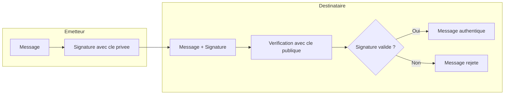
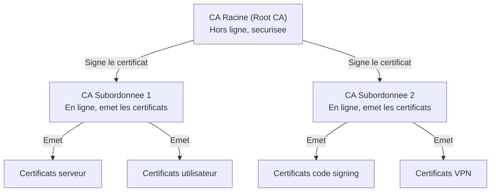
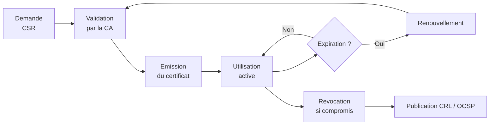

# Concepts fondamentaux de la PKI

<span class="level-advanced">Avance</span> · Temps estime : 35 minutes

La PKI (Public Key Infrastructure) est l'ensemble des composants, politiques et procedures qui permettent de gerer des certificats numeriques. Elle constitue le socle de la confiance dans les environnements Windows Server.

---


---

## Cryptographie asymetrique

La PKI repose sur la **cryptographie asymetrique** : chaque entite possede une paire de cles mathematiquement liees.

| Cle | Utilisation | Diffusion |
|-----|-------------|-----------|
| **Cle privee** | Signer, dechiffrer | Secrete, jamais partagee |
| **Cle publique** | Verifier une signature, chiffrer | Publique, distribuee via le certificat |



### Cas d'usage

- **Signature** : l'emetteur signe avec sa cle privee, le destinataire verifie avec la cle publique
- **Chiffrement** : l'emetteur chiffre avec la cle publique du destinataire, seul le destinataire dechiffre avec sa cle privee
- **Authentification** : un serveur prouve son identite en presentant un certificat signe par une CA de confiance

---

## Le certificat numerique

Un certificat numerique est un document electronique qui lie une identite (serveur, utilisateur, service) a une cle publique, le tout signe par une autorite de certification.

### Structure d'un certificat X.509

| Champ | Description |
|-------|-------------|
| **Subject** | Identite du proprietaire (CN, O, OU, etc.) |
| **Issuer** | Autorite de certification emettrice |
| **Serial Number** | Identifiant unique du certificat |
| **Valid From / To** | Periode de validite |
| **Public Key** | Cle publique du proprietaire |
| **Key Usage** | Utilisations autorisees (signature, chiffrement, etc.) |
| **Enhanced Key Usage** | Applications specifiques (Server Auth, Client Auth, etc.) |
| **Subject Alternative Name (SAN)** | Noms alternatifs (DNS, IP, email) |
| **CRL Distribution Points** | URL de la liste de revocation |
| **Authority Information Access** | URL pour verifier la chaine de confiance |
| **Thumbprint** | Empreinte SHA-1 ou SHA-256 du certificat |

### Consulter un certificat en PowerShell

```powershell
# List certificates in the local machine store
Get-ChildItem -Path Cert:\LocalMachine\My |
    Select-Object Subject, Issuer, NotAfter, Thumbprint

# View detailed certificate information
$cert = Get-ChildItem -Path Cert:\LocalMachine\My | Select-Object -First 1
$cert | Format-List *

# Check certificate chain validation
Test-Certificate -Cert $cert -Policy SSL
```

---

## Hierarchie d'autorites de certification

Une PKI d'entreprise repose sur une hierarchie de CA (Certificate Authorities) organisee en niveaux.

### Architecture a deux niveaux (recommandee)



### Roles des CA

| Niveau | Role | Disponibilite |
|--------|------|--------------|
| **CA Racine (Root)** | Ancre de confiance, signe les CA subordonnees | **Hors ligne** (securite maximale) |
| **CA Subordonnee (Issuing)** | Emet les certificats aux utilisateurs et services | **En ligne** en permanence |

!!! danger "Protection de la CA Racine"

    La CA Racine est la pierre angulaire de toute la PKI. Si sa cle privee est compromise, **toute l'infrastructure de confiance est detruite**. Bonnes pratiques :

    - Machine physique isolee (pas de VM si possible)
    - Aucune connexion reseau
    - Stockage du disque dans un coffre-fort
    - Allumee uniquement pour signer des certificats de CA subordonnees ou publier des CRL

---

## Cycle de vie d'un certificat



### Les etapes detaillees

1. **Demande (Certificate Signing Request - CSR)** : le demandeur genere une paire de cles et soumet la cle publique avec ses informations d'identite
2. **Validation** : la CA verifie l'identite du demandeur et les droits d'acces au modele de certificat
3. **Emission** : la CA signe le certificat avec sa cle privee
4. **Utilisation** : le certificat est installe et utilise (HTTPS, authentification, signature, etc.)
5. **Renouvellement** : avant l'expiration, un nouveau certificat est emis
6. **Revocation** : en cas de compromission de la cle privee, le certificat est ajoute a la CRL

### Revocation : CRL et OCSP

| Methode | Description | Avantage | Inconvenient |
|---------|-------------|----------|--------------|
| **CRL** (Certificate Revocation List) | Liste des certificats revoques publiee periodiquement | Simple a mettre en place | Delai entre la revocation et la publication |
| **OCSP** (Online Certificate Status Protocol) | Verification en temps reel du statut d'un certificat | Reponse immediate | Necessite un serveur OCSP disponible |

```powershell
# Check CRL distribution points of a certificate
$cert = Get-ChildItem -Path Cert:\LocalMachine\My | Select-Object -First 1
$cert.Extensions | Where-Object { $_.Oid.FriendlyName -eq "CRL Distribution Points" } |
    ForEach-Object { $_.Format($true) }

# Download and examine a CRL
certutil -URL "http://pki.lab.local/CertEnroll/lab-ROOT-CA.crl"
```

---

## Magasins de certificats Windows

Windows organise les certificats dans des magasins logiques :

| Magasin | Chemin PowerShell | Contenu |
|---------|-------------------|---------|
| **Personal (My)** | `Cert:\LocalMachine\My` | Certificats de la machine avec cle privee |
| **Trusted Root** | `Cert:\LocalMachine\Root` | CA racines de confiance |
| **Intermediate** | `Cert:\LocalMachine\CA` | CA intermediaires |
| **Trusted People** | `Cert:\LocalMachine\TrustedPeople` | Certificats de personnes de confiance |
| **User Personal** | `Cert:\CurrentUser\My` | Certificats de l'utilisateur courant |

```powershell
# Browse all certificate stores
Get-ChildItem -Path Cert:\LocalMachine

# Count certificates per store
Get-ChildItem -Path Cert:\LocalMachine\Root | Measure-Object
Get-ChildItem -Path Cert:\LocalMachine\My | Measure-Object

# Find expiring certificates (within 30 days)
$threshold = (Get-Date).AddDays(30)
Get-ChildItem -Path Cert:\LocalMachine\My |
    Where-Object { $_.NotAfter -lt $threshold -and $_.NotAfter -gt (Get-Date) } |
    Select-Object Subject, NotAfter, Thumbprint
```

---

## Points cles a retenir

- La PKI repose sur la **cryptographie asymetrique** (paire cle privee / cle publique)
- Un **certificat X.509** lie une identite a une cle publique, signe par une CA
- L'architecture recommandee est une **hierarchie a deux niveaux** (Root CA hors ligne + Issuing CA en ligne)
- Le **cycle de vie** d'un certificat comprend la demande, la validation, l'emission, l'utilisation, le renouvellement et la revocation
- La **CA Racine** doit etre protegee et maintenue hors ligne
- La revocation se gere via **CRL** (periodique) ou **OCSP** (temps reel)

---

## Pour aller plus loin

- Installation d'une CA d'entreprise (voir la page [Installer une CA](installer-ca.md))
- Modeles de certificats (voir la page [Modeles de certificats](modeles-certificats.md))
- RFC 5280 : Internet X.509 PKI Certificate and CRL Profile
- Microsoft : AD Certificate Services overview
