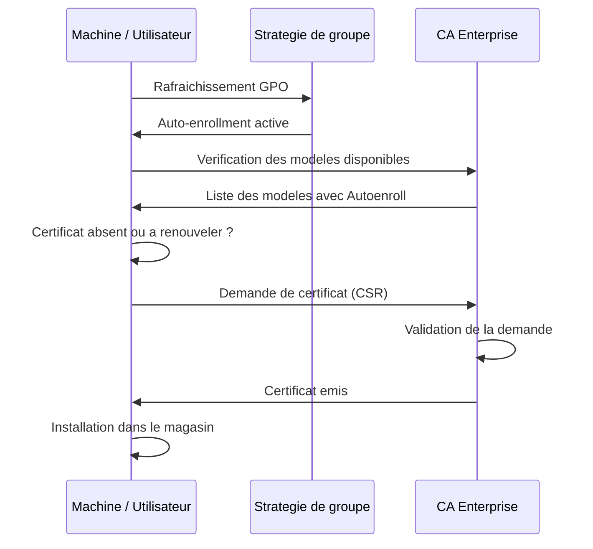

# Inscription automatique des certificats

<span class="level-advanced">Avance</span> · Temps estime : 30 minutes

L'inscription automatique (auto-enrollment) permet aux machines et utilisateurs du domaine d'obtenir et de renouveler leurs certificats sans intervention manuelle. Cette fonctionnalite est essentielle pour deployer la PKI a grande echelle.

---

## Principe de fonctionnement

!!! example "Analogie"

    L'auto-enrollment fonctionne comme le renouvellement automatique d'un abonnement : votre carte de transport expire bientot, le systeme detecte automatiquement l'echeance et vous envoie une nouvelle carte sans que vous ayez a vous deplacer au guichet. C'est exactement ce que fait l'inscription automatique pour les certificats numeriques.

L'auto-enrollment combine trois elements :

1. **Modele de certificat** avec la permission `Autoenroll` accordee au sujet
2. **GPO** activant l'inscription automatique cote machine ou utilisateur
3. **Rafraichissement GPO** declenchant la verification et la demande



---

## Prerequis

- Une **CA Enterprise** fonctionnelle jointe au domaine
- Des **modeles de certificats** configures avec la permission `Autoenroll`
- Les modeles doivent etre **publies** sur la CA
- Le certificat de la CA Racine doit etre dans le magasin **Trusted Root** des clients

---

## Configuration du modele

Le modele doit accorder les permissions suivantes au groupe cible :

| Permission | Necessaire |
|------------|-----------|
| **Read** | Oui |
| **Enroll** | Oui |
| **Autoenroll** | Oui |

### Exemple pour les certificats machine

```powershell
# Verify that the template has Autoenroll permission for Domain Computers
# Use certtmpl.msc GUI:
# 1. Open the template properties
# 2. Go to the Security tab
# 3. Select "Domain Computers" or a custom group
# 4. Check: Read, Enroll, Autoenroll

# Verify via command line
$templateName = "Lab-Computer"
$configContext = ([ADSI]"LDAP://RootDSE").configurationNamingContext
$templateDN = "CN=$templateName,CN=Certificate Templates,CN=Public Key Services,CN=Services,$configContext"
dsacls $templateDN
```

Resultat :

```text
Access list:
  Allow LAB\Domain Computers         SPECIAL ACCESS
                                       READ
                                       Enroll
                                       Autoenroll
  Allow LAB\Domain Admins            FULL CONTROL
  Allow NT AUTHORITY\Authenticated Users
                                       READ
```

---

## Configuration GPO pour l'auto-enrollment

### Certificats machine (Computer Configuration)

```
Computer Configuration
  > Policies
    > Windows Settings
      > Security Settings
        > Public Key Policies
          > Certificate Services Client - Auto-Enrollment
            - Configuration Model : Enabled
            - [x] Renew expired certificates, update pending certificates,
                  and remove revoked certificates
            - [x] Update certificates that use certificate templates
```

### Certificats utilisateur (User Configuration)

```
User Configuration
  > Policies
    > Windows Settings
      > Security Settings
        > Public Key Policies
          > Certificate Services Client - Auto-Enrollment
            - Configuration Model : Enabled
            - [x] Renew expired certificates, update pending certificates,
                  and remove revoked certificates
            - [x] Update certificates that use certificate templates
```

### Appliquer la GPO

```powershell
# Create a new GPO for auto-enrollment
$gpoName = "PKI - Auto-Enrollment"
New-GPO -Name $gpoName

# Link to the domain root (or a specific OU)
New-GPLink -Name $gpoName -Target "DC=lab,DC=local" -LinkEnabled Yes

# Force GPO refresh to trigger enrollment
gpupdate /force

# Trigger certificate auto-enrollment manually
certutil -pulse
```

Resultat :

```text
DisplayName       : PKI - Auto-Enrollment
DomainName        : lab.local
GpoStatus         : AllSettingsEnabled

GpoId             : {F1E2D3C4-B5A6-7890-FEDC-BA0987654321}
DisplayName       : PKI - Auto-Enrollment
Enabled           : True
Target            : DC=lab,DC=local

Updating policy...
Computer Policy update has completed successfully.

CertUtil: -pulse command completed successfully.
```

---

## Renouvellement automatique

L'auto-enrollment gere aussi le renouvellement des certificats avant leur expiration.

### Fonctionnement du renouvellement

Le client verifie ses certificats a chaque rafraichissement GPO (par defaut toutes les 90 minutes + delai aleatoire de 0-30 minutes) :

1. Le certificat arrive dans la **periode de renouvellement** (definie dans le modele)
2. Le client soumet une nouvelle demande a la CA
3. La CA emet un nouveau certificat
4. L'ancien certificat est remplace (ou conserve selon la configuration)

### Configuration de la periode de renouvellement

Dans les proprietes du modele :

| Parametre | Valeur typique |
|-----------|---------------|
| **Validity period** | 1 an |
| **Renewal period** | 6 semaines |

!!! tip "Periode de renouvellement"

    La periode de renouvellement doit etre suffisamment longue pour couvrir les machines eteintes ou deconnectees. Une periode de 6 semaines pour un certificat d'un an est un bon compromis.

### Verifier le renouvellement

```powershell
# Check certificates approaching expiration
$renewalWindow = (Get-Date).AddDays(45)

Get-ChildItem -Path Cert:\LocalMachine\My |
    Where-Object { $_.NotAfter -lt $renewalWindow } |
    Select-Object Subject, NotAfter, Thumbprint,
        @{N='DaysRemaining';E={($_.NotAfter - (Get-Date)).Days}}
```

Resultat :

```text
Subject                    NotAfter              Thumbprint                        DaysRemaining
-------                    --------              ----------                        -------------
CN=SRV-01.lab.local        2025-03-25 10:00:00   A1B2C3D4E5F6A7B8C9D0E1F2A3...   33
```

---

## Supervision des certificats

### Detecter les certificats expirant bientot

```powershell
# Script to audit expiring certificates across multiple servers
$servers = Get-ADComputer -Filter { OperatingSystem -like "*Server*" } |
    Select-Object -ExpandProperty Name

$threshold = 30  # days
$report = @()

foreach ($server in $servers) {
    try {
        $certs = Invoke-Command -ComputerName $server -ScriptBlock {
            Get-ChildItem -Path Cert:\LocalMachine\My |
                Where-Object {
                    $_.NotAfter -lt (Get-Date).AddDays($using:threshold) -and
                    $_.NotAfter -gt (Get-Date)
                } |
                Select-Object Subject, NotAfter, Thumbprint
        } -ErrorAction Stop

        foreach ($cert in $certs) {
            $report += [PSCustomObject]@{
                Server      = $server
                Subject     = $cert.Subject
                Expiration  = $cert.NotAfter
                DaysLeft    = ($cert.NotAfter - (Get-Date)).Days
                Thumbprint  = $cert.Thumbprint
            }
        }
    }
    catch {
        Write-Warning "Cannot connect to $server : $_"
    }
}

$report | Sort-Object DaysLeft | Format-Table -AutoSize
```

Resultat :

```text
Server      Subject                    Expiration            DaysLeft  Thumbprint
------      -------                    ----------            --------  ----------
SRV-01      CN=SRV-01.lab.local        2025-03-10 14:30:00  18        A1B2C3D4...
SRV-APP01   CN=SRV-APP01.lab.local     2025-03-15 09:00:00  23        B2C3D4E5...
WARNING: Cannot connect to SRV-DEV02 : WinRM cannot process the request.
```

### Detecter les certificats deja expires

```powershell
# Find expired certificates on the local machine
Get-ChildItem -Path Cert:\LocalMachine\My |
    Where-Object { $_.NotAfter -lt (Get-Date) } |
    Select-Object Subject, NotAfter, Thumbprint |
    Format-Table -AutoSize
```

### Auditer les certificats emis par la CA

```powershell
# List recently issued certificates from the CA
certutil -view -restrict "NotBefore>=$(Get-Date (Get-Date).AddDays(-7) -Format 'MM/dd/yyyy')" `
    -out "RequesterName,CommonName,NotBefore,NotAfter,CertificateTemplate"
```

---

## Journalisation de l'auto-enrollment

Les evenements d'auto-enrollment sont journalises dans :

- **Application** log : evenements du client d'inscription
- **CertificateServicesClient-Lifecycle-System** : cycle de vie des certificats machine

| Event ID | Description |
|----------|-------------|
| **1006** | Certificat inscrit avec succes |
| **1007** | Echec d'inscription |
| **1003** | Certificat renouvele avec succes |
| **64** | Certificat emis par la CA (cote CA) |
| **53** | Demande de certificat recue (cote CA) |

```powershell
# View auto-enrollment events
Get-WinEvent -LogName "Microsoft-Windows-CertificateServicesClient-Lifecycle-System/Operational" `
    -MaxEvents 20 |
    Select-Object TimeCreated, Id, Message |
    Format-Table -AutoSize

# View CA-side enrollment events
Get-WinEvent -LogName "Security" |
    Where-Object { $_.Id -in @(4886, 4887, 4888) } |
    Select-Object TimeCreated, Id, Message -First 10
```

Resultat :

```text
TimeCreated            Id    Message
-----------            --    -------
2025-02-20 10:15:32    1006  Certificate enrollment for Local System succeeded...
2025-02-20 10:15:30    1006  Certificate enrollment for Local System succeeded...
2025-02-19 14:22:10    1003  Certificate renewal for Local System completed...
```

---

## Depannage

### Problemes courants

| Symptome | Cause probable | Solution |
|----------|---------------|----------|
| Pas de certificat inscrit | Permission Autoenroll manquante | Verifier les ACL du modele |
| Erreur "template not found" | Modele non publie sur la CA | Publier le modele via certsrv.msc |
| Certificat non renouvele | Machine eteinte pendant la fenetre | Declencher manuellement avec `certutil -pulse` |
| Erreur de validation | CRL inaccessible | Verifier les CDP et l'acces reseau |
| Doublon de certificats | Ancien modele pas retire | Retirer l'ancien modele de la CA |

### Commandes de diagnostic

```powershell
# Trigger auto-enrollment manually
certutil -pulse

# View detailed enrollment debug logs
certutil -enrollmentserverURL -config "LAB-SUB-CA\Lab-SUB-CA"

# Verify template availability from a client
certutil -CATemplates -config "LAB-SUB-CA\Lab-SUB-CA"

# Check CRL accessibility
certutil -verify -urlfetch Cert:\LocalMachine\My\<thumbprint>
```

---

## Scenario pratique

!!! example "Scenario pratique"

    **Contexte** : Pierre, administrateur systeme, constate que le serveur `SRV-APP01` (10.0.0.20) n'a pas recu son certificat machine automatiquement alors que tous les autres serveurs de l'OU l'ont obtenu.

    **Diagnostic** :

    ```powershell
    # Check if the machine has a certificate
    Invoke-Command -ComputerName "SRV-APP01" -ScriptBlock {
        Get-ChildItem -Path Cert:\LocalMachine\My | Select-Object Subject, Issuer, NotAfter
    }
    ```

    Resultat :

    ```text
    (aucun certificat)
    ```

    ```powershell
    # Trigger auto-enrollment and check for errors
    Invoke-Command -ComputerName "SRV-APP01" -ScriptBlock {
        certutil -pulse
        Get-WinEvent -LogName "Microsoft-Windows-CertificateServicesClient-Lifecycle-System/Operational" -MaxEvents 5 |
            Select-Object TimeCreated, Id, Message
    }
    ```

    Resultat :

    ```text
    CertUtil: -pulse command completed successfully.

    TimeCreated            Id    Message
    -----------            --    -------
    2025-02-20 11:30:15    1007  Certificate enrollment for Local System failed:
                                 The requested certificate template is not supported by this CA.
    ```

    **Cause** : le modele `Lab-Computer` n'a pas ete publie sur la CA `Lab-SUB-CA`.

    **Resolution** :

    ```powershell
    # Publish the template on the CA
    certutil -SetCATemplates +Lab-Computer

    # Retry enrollment on the client
    Invoke-Command -ComputerName "SRV-APP01" -ScriptBlock { certutil -pulse }
    ```

    Apres publication du modele et relance de l'enrollment, `SRV-APP01` recoit son certificat machine en quelques secondes.

---

!!! danger "Erreurs courantes"

    1. **Configurer Autoenroll dans la GPO sans accorder la permission Autoenroll sur le modele** : la GPO active le mecanisme cote client, mais le modele doit aussi accorder `Read + Enroll + Autoenroll` au groupe cible (ex: `Domain Computers`). Les deux sont necessaires.

    2. **Oublier de publier le modele sur la CA** : un modele configure dans AD n'est pas automatiquement disponible. L'erreur "template not found" dans les logs client indique que le modele n'est pas publie via `certsrv.msc` ou `certutil -SetCATemplates`.

    3. **Ne pas superviser les certificats expirant** : l'auto-enrollment renouvelle les certificats uniquement si la machine est allumee et connectee au reseau pendant la periode de renouvellement. Les serveurs eteints ou deconnectes conservent des certificats expires.

    4. **Definir une periode de renouvellement trop courte** : avec une periode de renouvellement de 1 semaine sur un certificat d'un an, une machine eteinte pendant 10 jours se retrouve avec un certificat expire. Prevoyez au minimum 6 semaines.

---

## Points cles a retenir

- L'auto-enrollment necessite trois elements : **permissions Autoenroll** sur le modele, **GPO activee**, et **modele publie** sur la CA
- Le renouvellement se declenche automatiquement lorsque le certificat entre dans la **periode de renouvellement**
- La supervision des certificats expirant est **indispensable** pour eviter les interruptions de service
- Les evenements d'enrollment sont journalises dans les logs **CertificateServicesClient** et **Security**
- `certutil -pulse` force un cycle d'auto-enrollment immediat pour le depannage

---

## Pour aller plus loin

- Modeles de certificats (voir la page [Modeles de certificats](modeles-certificats.md))
- Installation d'une CA (voir la page [Installer une CA](installer-ca.md))
- Microsoft : Certificate auto-enrollment in Windows
- Microsoft : Troubleshoot certificate enrollment
