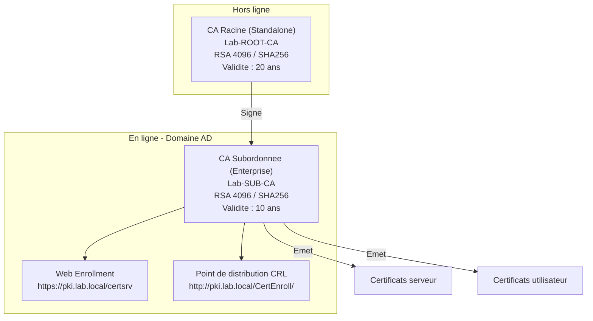

# Installer une autorite de certification

!!! info "Niveau : avance | Temps estime : 50 minutes"

Active Directory Certificate Services (AD CS) est le role Windows Server qui implemente une autorite de certification (CA). Cette page couvre l'installation d'une architecture a deux niveaux avec une CA racine et une CA subordonnee.

---

## Standalone vs Enterprise CA

| Critere | Standalone CA | Enterprise CA |
|---------|---------------|---------------|
| **Dependance AD** | Aucune | Requiert Active Directory |
| **Modeles de certificats** | Non | Oui (modeles personnalisables) |
| **Auto-enrollment** | Non | Oui |
| **Approbation automatique** | Non (manuelle par defaut) | Oui (selon le modele) |
| **Usage typique** | CA Racine hors ligne | CA Subordonnee en production |

!!! tip "Architecture recommandee"

    - **CA Racine** : Standalone, hors ligne, non jointe au domaine
    - **CA Subordonnee** : Enterprise, en ligne, jointe au domaine

---

## Installation de la CA Racine (Standalone)

### Prerequis

- Windows Server 2022 (Standard ou Datacenter)
- Machine **non jointe au domaine** (pour l'isoler)
- Pas de connexion reseau permanente

### Etape 1 : installer le role AD CS

```powershell
# Install the AD CS role with the Certification Authority component
Install-WindowsFeature AD-Certificate -IncludeManagementTools

# Verify installation
Get-WindowsFeature AD-Certificate
```

### Etape 2 : configurer la CA Racine

```powershell
# Configure as a Standalone Root CA
Install-AdcsCertificationAuthority `
    -CAType StandaloneRootCA `
    -CACommonName "Lab-ROOT-CA" `
    -KeyLength 4096 `
    -HashAlgorithmName SHA256 `
    -CryptoProviderName "RSA#Microsoft Software Key Storage Provider" `
    -ValidityPeriod Years `
    -ValidityPeriodUnits 20 `
    -Force

# The CA certificate validity is set to 20 years
# Subordinate CA certificates will be signed for shorter periods
```

!!! warning "Longueur de cle et duree de validite"

    - **CA Racine** : cle RSA 4096 bits, validite 15-20 ans
    - **CA Subordonnee** : cle RSA 2048 ou 4096 bits, validite 5-10 ans
    - Les certificats emis ne peuvent pas depasser la validite de leur CA emettrice

### Etape 3 : configurer les extensions CRL et AIA

Les extensions definissent ou trouver la CRL et le certificat de la CA :

```powershell
# Get current CRL Distribution Point configuration
$crlList = Get-CACrlDistributionPoint
$crlList | Format-List

# Remove default CDP entries and add custom ones
$crlList | Remove-CACrlDistributionPoint -Force

# Add HTTP-based CDP (accessible from the network)
Add-CACrlDistributionPoint `
    -Uri "http://pki.lab.local/CertEnroll/<CaName><CRLNameSuffix><DeltaCRLAllowed>.crl" `
    -AddToCertificateCdp `
    -AddToFreshestCrl `
    -Force

# Configure AIA (Authority Information Access)
$aiaList = Get-CAAuthorityInformationAccess
$aiaList | Remove-CAAuthorityInformationAccess -Force

Add-CAAuthorityInformationAccess `
    -Uri "http://pki.lab.local/CertEnroll/<ServerDNSName>_<CaName><CertificateName>.crt" `
    -AddToCertificateAia `
    -Force

# Restart the CA service to apply changes
Restart-Service CertSvc
```

### Etape 4 : publier la CRL

```powershell
# Publish the initial CRL
certutil -CRL

# Configure CRL publication interval (every 6 months for a Root CA)
certutil -setreg CA\CRLPeriod "Months"
certutil -setreg CA\CRLPeriodUnits 6
certutil -setreg CA\CRLOverlapPeriod "Weeks"
certutil -setreg CA\CRLOverlapUnits 2

# Restart the service
Restart-Service CertSvc

# Publish the CRL again with new settings
certutil -CRL
```

### Etape 5 : exporter le certificat et la CRL

```powershell
# Export Root CA certificate
$rootCert = "C:\CertExport\Lab-ROOT-CA.cer"
certutil -ca.cert $rootCert

# Export the CRL
Copy-Item "C:\Windows\System32\CertSrv\CertEnroll\*.crl" "C:\CertExport\"
Copy-Item "C:\Windows\System32\CertSrv\CertEnroll\*.crt" "C:\CertExport\"

# These files must be transferred to:
# 1. The subordinate CA server
# 2. The web server hosting the CDP/AIA
# 3. Published in Active Directory
```

---

## Installation de la CA Subordonnee (Enterprise)

### Prerequis

- Windows Server 2022 joint au domaine
- Compte membre de **Enterprise Admins** (pour l'installation Enterprise CA)
- Le certificat de la CA Racine doit etre importe dans le magasin Trusted Root

### Etape 1 : importer le certificat de la CA Racine

```powershell
# Publish Root CA certificate to Active Directory
certutil -dspublish -f "C:\CertExport\Lab-ROOT-CA.cer" RootCA

# Publish Root CA CRL to Active Directory
certutil -dspublish -f "C:\CertExport\Lab-ROOT-CA.crl" "Lab-ROOT-CA"

# Import Root CA certificate into local machine Trusted Root store
Import-Certificate -FilePath "C:\CertExport\Lab-ROOT-CA.cer" `
    -CertStoreLocation Cert:\LocalMachine\Root
```

### Etape 2 : installer le role AD CS

```powershell
# Install AD CS with management tools and web enrollment
Install-WindowsFeature AD-Certificate, ADCS-Web-Enrollment -IncludeManagementTools
```

### Etape 3 : configurer la CA Subordonnee

```powershell
# Configure as an Enterprise Subordinate CA
Install-AdcsCertificationAuthority `
    -CAType EnterpriseSubordinateCA `
    -CACommonName "Lab-SUB-CA" `
    -KeyLength 4096 `
    -HashAlgorithmName SHA256 `
    -CryptoProviderName "RSA#Microsoft Software Key Storage Provider" `
    -Force

# This generates a certificate request (.req) file
# The request must be submitted to the Root CA for signing
```

### Etape 4 : signer la requete sur la CA Racine

Sur la CA Racine (hors ligne) :

```powershell
# Submit the subordinate CA request to the Root CA
certreq -submit "C:\CertExport\Lab-SUB-CA.req"

# Note the Request ID displayed

# Approve the pending request (replace ID with actual)
certutil -resubmit <RequestID>

# Retrieve the signed certificate
certreq -retrieve <RequestID> "C:\CertExport\Lab-SUB-CA.cer"
```

### Etape 5 : installer le certificat sur la CA Subordonnee

```powershell
# Install the signed CA certificate
Install-AdcsCertificationAuthority -CertFile "C:\CertExport\Lab-SUB-CA.cer" -Force

# Verify the CA is running
Get-Service CertSvc
certutil -ping
```

### Etape 6 : configurer les extensions CDP et AIA

```powershell
# Configure CRL publication settings for the subordinate CA
certutil -setreg CA\CRLPeriod "Days"
certutil -setreg CA\CRLPeriodUnits 7
certutil -setreg CA\CRLDeltaPeriod "Days"
certutil -setreg CA\CRLDeltaPeriodUnits 1

# Restart and publish CRL
Restart-Service CertSvc
certutil -CRL
```

---

## Configuration de l'interface Web Enrollment

```powershell
# Install and configure the Web Enrollment feature
Install-AdcsWebEnrollment -Force

# The web interface is accessible at:
# https://<server-name>/certsrv
```

!!! warning "Securite de l'interface Web"

    L'interface Web Enrollment utilise par defaut HTTP. Configurez un certificat SSL pour securiser l'acces en HTTPS. Restreignez l'acces par firewall aux seuls sous-reseaux autorises.

---

## Verification post-installation

```powershell
# Verify CA configuration
certutil -CAInfo

# Verify certificate chain
certutil -verify -urlfetch "C:\CertExport\Lab-SUB-CA.cer"

# Check CRL validity
certutil -URL "http://pki.lab.local/CertEnroll/Lab-ROOT-CA.crl"

# Test certificate enrollment
certutil -ping

# List certificate templates available on the Enterprise CA
certutil -CATemplates
```

### Resume de l'architecture deployee



---

## Points cles a retenir

- L'architecture recommandee est **CA Racine Standalone hors ligne** + **CA Subordonnee Enterprise en ligne**
- La CA Racine ne s'allume que pour signer des certificats de CA subordonnees et publier des CRL
- La cle de la CA Racine doit etre **RSA 4096 bits minimum** avec **SHA-256**
- Les extensions **CDP** et **AIA** doivent etre configurees avant l'emission du premier certificat
- Le certificat de la CA Racine doit etre **publie dans Active Directory** pour etre approuve automatiquement par tous les clients du domaine
- L'interface **Web Enrollment** doit etre securisee en HTTPS

---

## Pour aller plus loin

- Modeles de certificats (voir la page [Modeles de certificats](modeles-certificats.md))
- Inscription automatique (voir la page [Inscription automatique](inscription-automatique.md))
- Microsoft : AD CS step-by-step guide
- ANSSI : Recommandations sur la mise en oeuvre d'une IGC
