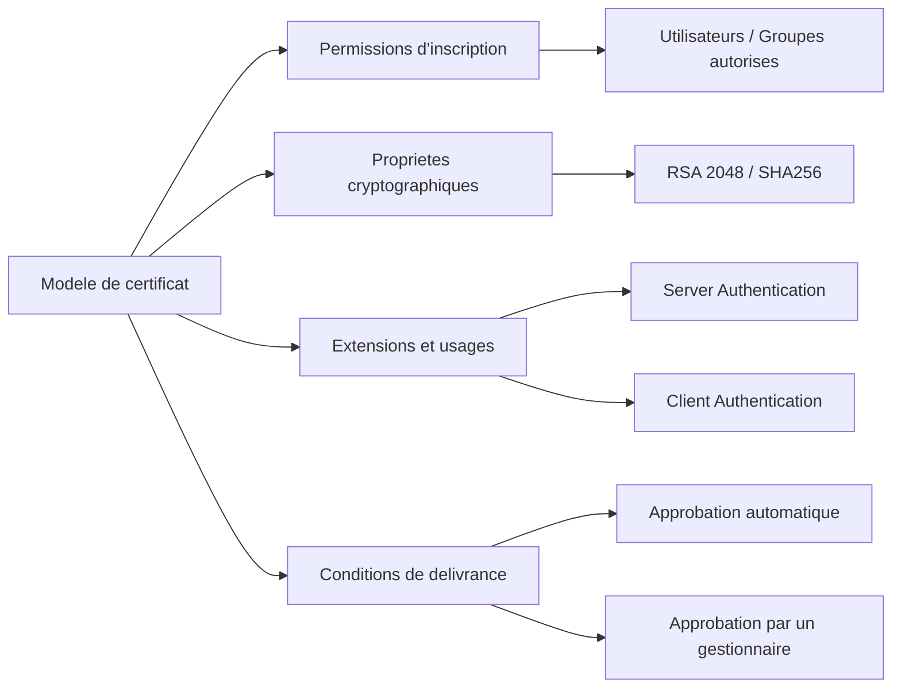

# Modeles de certificats

!!! info "Niveau : avance | Temps estime : 35 minutes"

Les modeles de certificats (Certificate Templates) definissent les proprietes des certificats emis par une CA Enterprise. Ils controlent la duree de validite, l'algorithme de chiffrement, les usages autorises et les permissions d'inscription.

---

## Principe des modeles

Un modele de certificat est un objet stocke dans Active Directory qui definit :

- Le **type de certificat** : serveur, utilisateur, code signing, etc.
- La **duree de validite** et la **periode de renouvellement**
- L'**algorithme et la taille de cle**
- Les **usages** (Key Usage et Enhanced Key Usage)
- Les **permissions** : qui peut s'inscrire, qui peut gerer le modele
- Le **mode de delivrance** : automatique ou avec approbation manuelle



---

## Modeles integres courants

Windows Server fournit des modeles pre-configures. Les plus utilises :

| Modele | Usage | Enhanced Key Usage |
|--------|-------|--------------------|
| **Web Server** | Certificat SSL/TLS pour serveurs web | Server Authentication |
| **Computer** | Authentification machine | Client Authentication, Server Authentication |
| **User** | Authentification utilisateur, email | Client Authentication, EFS, Secure Email |
| **Domain Controller** | Authentification des DC | Client Authentication, Server Authentication |
| **Code Signing** | Signature de code | Code Signing |
| **OCSP Response Signing** | Reponses OCSP | OCSP Signing |

!!! warning "Ne jamais modifier les modeles originaux"

    Les modeles integres ne doivent pas etre modifies directement. Creez toujours une **copie** (duplication) avant de personnaliser.

---

## Dupliquer un modele

La duplication est la methode standard pour creer un modele personnalise a partir d'un modele existant.

### Via la console certtmpl.msc

1. Ouvrir `certtmpl.msc` (Certificate Templates Console)
2. Clic droit sur le modele a dupliquer > **Duplicate Template**
3. Configurer les proprietes du nouveau modele
4. Nommer le modele (Display Name et Template Name)

### Via PowerShell

```powershell
# List all certificate templates in AD
$configContext = ([ADSI]"LDAP://RootDSE").configurationNamingContext
$templateContainer = "CN=Certificate Templates,CN=Public Key Services,CN=Services,$configContext"

Get-ADObject -SearchBase $templateContainer -Filter { objectClass -eq "pKICertificateTemplate" } |
    Select-Object Name, DistinguishedName |
    Sort-Object Name
```

!!! tip "Versions de modele"

    - **Version 1** : compatibilite Windows 2000, fonctionnalites limitees
    - **Version 2** : Windows Server 2003+, auto-enrollment, archivage de cle
    - **Version 3** : Windows Server 2008+, CNG (Cryptography Next Generation)
    - **Version 4** : Windows Server 2012+, renouvellement avec meme cle, Key Attestation

    Privilegiez les **versions 3 ou 4** pour les nouveaux modeles.

---

## Configurer un modele Web Server personnalise

### Proprietes generales

| Parametre | Valeur recommandee |
|-----------|-------------------|
| **Template Display Name** | Lab-WebServer |
| **Template Name** | Lab-WebServer |
| **Validity Period** | 1 an |
| **Renewal Period** | 6 semaines |

### Proprietes cryptographiques

| Parametre | Valeur recommandee |
|-----------|-------------------|
| **Provider Category** | Key Storage Provider |
| **Algorithm Name** | RSA |
| **Minimum Key Size** | 2048 |
| **Hash Algorithm** | SHA256 |

### Request Handling

| Parametre | Valeur recommandee |
|-----------|-------------------|
| **Purpose** | Signature and Encryption |
| **Allow private key to be exported** | Oui (pour les certificats web) |

### Extensions - Key Usage

- Digital Signature
- Key Encipherment

### Extensions - Application Policies (EKU)

- Server Authentication (1.3.6.1.5.5.7.3.1)

### Subject Name

| Option | Choix |
|--------|-------|
| **Supply in the request** | Oui (le demandeur specifie le Subject) |

!!! danger "Securite du Subject Name"

    L'option **Supply in the request** permet au demandeur de choisir le nom du certificat. Cela peut etre exploite pour creer des certificats frauduleux (ex: un certificat pour le nom d'un autre serveur). Restreignez les permissions d'inscription et envisagez l'approbation manuelle par un gestionnaire de CA.

---

## Configurer les permissions

Les permissions d'un modele controlent qui peut demander un certificat base sur ce modele.

### Permissions essentielles

| Permission | Description |
|------------|-------------|
| **Read** | Voir le modele dans la liste |
| **Enroll** | Soumettre une demande de certificat |
| **Autoenroll** | Inscription automatique via GPO |
| **Write** | Modifier le modele |
| **Full Control** | Controle total sur le modele |

### Exemple de configuration

```powershell
# The template permissions are stored as ACLs on the AD object
# Use ADSI or the GUI to configure them

# Example: Grant Enroll permission to a group on a template
$templateName = "Lab-WebServer"
$configContext = ([ADSI]"LDAP://RootDSE").configurationNamingContext
$templateDN = "CN=$templateName,CN=Certificate Templates,CN=Public Key Services,CN=Services,$configContext"

# View current permissions
dsacls $templateDN

# Best practice: create dedicated security groups
# - "PKI-WebServer-Enroll" : servers allowed to request web certificates
# - "PKI-Template-Managers" : administrators who manage templates
```

### Recommandations

- Creer des **groupes de securite dedies** pour chaque modele (`PKI-<Template>-Enroll`)
- Ne jamais accorder `Enroll` a **Authenticated Users** sur des modeles sensibles
- Separer les droits `Enroll` (demande) et `Write` (modification)
- Utiliser `Autoenroll` uniquement pour les certificats machine deployes massivement

---

## Publier un modele sur la CA

Un modele cree dans AD n'est pas automatiquement disponible sur la CA. Il faut le **publier** explicitement.

### Via la console certsrv.msc

1. Ouvrir `certsrv.msc` (Certification Authority)
2. Developper l'arborescence de la CA
3. Clic droit sur **Certificate Templates** > **New** > **Certificate Template to Issue**
4. Selectionner le modele a publier

### Via PowerShell

```powershell
# Add a template to the CA's list of issued templates
$templateName = "Lab-WebServer"
$caName = "Lab-SUB-CA"

# Using certutil
certutil -SetCATemplates +$templateName

# Verify published templates
certutil -CATemplates
```

### Retirer un modele de la publication

```powershell
# Remove a template from the CA (stop issuing)
certutil -SetCATemplates -$templateName

# This does NOT delete the template from AD, only stops the CA from issuing it
```

---

## Modele pour certificat utilisateur

### Configuration typique

| Parametre | Valeur |
|-----------|--------|
| **Template Name** | Lab-User |
| **Validity** | 1 an |
| **Key Size** | 2048 |
| **Key Usage** | Digital Signature, Key Encipherment |
| **EKU** | Client Authentication, Secure Email, EFS |
| **Subject Name** | Build from AD information (E-mail, UPN) |
| **Autoenroll** | Oui (via GPO) |

### Configuration du Subject depuis AD

Pour les certificats utilisateur, le Subject Name doit etre **construit a partir d'Active Directory** (pas fourni dans la requete) :

- **Subject name format** : Common Name
- **Include e-mail in subject name** : Oui
- **Include e-mail in subject alternative name** : Oui

---

## Demander un certificat manuellement

### Via PowerShell

```powershell
# Request a certificate using a specific template
$template = "Lab-WebServer"
$subjectName = "CN=www.lab.local"
$san = "dns=www.lab.local&dns=lab.local"

# Create the certificate request and submit it
$enrollment = New-Object -ComObject X509Enrollment.CX509Enrollment
$request = New-Object -ComObject X509Enrollment.CX509CertificateRequestCertificate

# Simplified method using certreq
# Create an INF file for the request
$inf = @"
[Version]
Signature="`$Windows NT`$"

[NewRequest]
Subject = "$subjectName"
KeyLength = 2048
Exportable = TRUE
MachineKeySet = TRUE
ProviderName = "Microsoft RSA SChannel Cryptographic Provider"

[Extensions]
2.5.29.17 = "{text}"
_continue_ = "$san"

[RequestAttributes]
CertificateTemplate = $template
"@

$inf | Out-File -FilePath "C:\Temp\certrequest.inf" -Encoding ASCII

# Generate the request
certreq -new "C:\Temp\certrequest.inf" "C:\Temp\certrequest.req"

# Submit to the CA
certreq -submit -config "LAB-SUB-CA\Lab-SUB-CA" "C:\Temp\certrequest.req" "C:\Temp\certresponse.cer"

# Install the certificate
certreq -accept "C:\Temp\certresponse.cer"
```

---

## Points cles a retenir

- Toujours **dupliquer** un modele existant avant de le personnaliser, ne jamais modifier les originaux
- Les permissions d'inscription doivent etre **restreintes** via des groupes de securite dedies
- L'option **Supply in the request** pour le Subject Name necessite des controles supplementaires
- Un modele doit etre **publie** sur la CA pour etre disponible a l'inscription
- Privilegier les modeles **version 3 ou 4** avec des algorithmes modernes (RSA 2048+, SHA-256)
- Separer les modeles par usage : web, utilisateur, machine, code signing

---

## Pour aller plus loin

- Inscription automatique via GPO (voir la page [Inscription automatique](inscription-automatique.md))
- Concepts PKI (voir la page [Concepts PKI](concepts-pki.md))
- Microsoft : Certificate Templates overview
- Microsoft : Configuring certificate auto-enrollment
