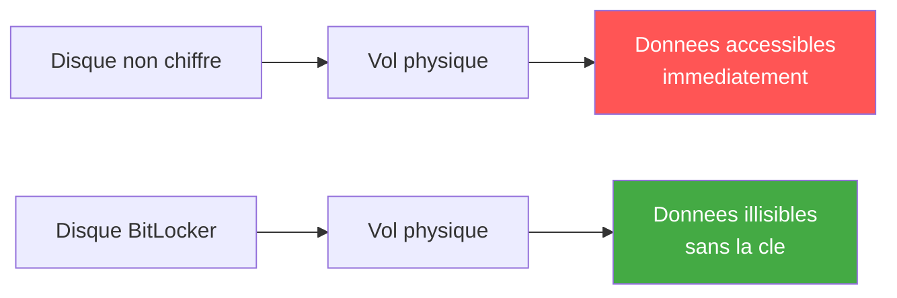

# BitLocker sur serveur

!!! info "Niveau : avance | Temps estime : 35 minutes"

BitLocker Drive Encryption protege les donnees au repos en chiffrant integralement les volumes de disque. Sur un serveur, BitLocker empeche l'acces aux donnees en cas de vol physique du disque ou du serveur.

---

## Pourquoi BitLocker sur un serveur ?

| Scenario | Risque sans BitLocker |
|----------|----------------------|
| **Vol de disque** | Lecture directe des donnees en montant le disque sur un autre systeme |
| **Decommissionnement** | Donnees residuelles sur les disques cedes ou detruits |
| **Acces physique non autorise** | Demarrage sur un Live USB pour acceder aux fichiers |
| **Conformite** | Exigences reglementaires (RGPD, PCI-DSS, ISO 27001) |



---

## Prerequis

### Materiel

- **TPM 2.0** (Trusted Platform Module) : recommande pour le deverrouillage automatique
- Sans TPM : utilisation d'une cle USB ou d'un mot de passe au demarrage

### Logiciel

- Fonctionnalite **BitLocker Drive Encryption** installee
- Partition systeme de 350 Mo minimum (creee automatiquement)

```powershell
# Verify TPM availability
Get-Tpm

# Expected output for a functional TPM:
# TpmPresent   : True
# TpmReady     : True
# TpmEnabled   : True
# TpmActivated : True
# TpmOwned     : True
```

---

## Installation de la fonctionnalite

```powershell
# Install the BitLocker feature
Install-WindowsFeature BitLocker -IncludeAllSubFeature -IncludeManagementTools -Restart

# Verify installation
Get-WindowsFeature BitLocker
```

---

## Activation de BitLocker sur le volume systeme (C:)

### Avec TPM (recommande)

```powershell
# Enable BitLocker on C: with TPM protector
Enable-BitLocker -MountPoint "C:" `
    -EncryptionMethod XtsAes256 `
    -TpmProtector

# Add a recovery password protector (ESSENTIAL for recovery)
Add-BitLockerKeyProtector -MountPoint "C:" -RecoveryPasswordProtector

# View the recovery password - STORE THIS SECURELY
$blv = Get-BitLockerVolume -MountPoint "C:"
$blv.KeyProtector | Where-Object { $_.KeyProtectorType -eq 'RecoveryPassword' }
```

### Sans TPM (avec mot de passe)

```powershell
# First, allow BitLocker without TPM via GPO or registry
$regPath = "HKLM:\SOFTWARE\Policies\Microsoft\FVE"
New-Item -Path $regPath -Force
Set-ItemProperty -Path $regPath -Name "UseAdvancedStartup" -Value 1 -Type DWord
Set-ItemProperty -Path $regPath -Name "EnableBDEWithNoTPM" -Value 1 -Type DWord
Set-ItemProperty -Path $regPath -Name "UseTPM" -Value 2 -Type DWord
Set-ItemProperty -Path $regPath -Name "UseTPMPIN" -Value 2 -Type DWord
Set-ItemProperty -Path $regPath -Name "UseTPMKey" -Value 2 -Type DWord
Set-ItemProperty -Path $regPath -Name "UseTPMKeyPIN" -Value 2 -Type DWord

# Enable BitLocker with password protector
$password = Read-Host -AsSecureString "Enter BitLocker password"
Enable-BitLocker -MountPoint "C:" `
    -EncryptionMethod XtsAes256 `
    -PasswordProtector `
    -Password $password
```

---

## Activation sur les volumes de donnees

```powershell
# Enable BitLocker on a data volume (D:)
Enable-BitLocker -MountPoint "D:" `
    -EncryptionMethod XtsAes256 `
    -RecoveryPasswordProtector

# Enable auto-unlock for data volumes (requires the OS volume to be BitLocker-protected)
Enable-BitLockerAutoUnlock -MountPoint "D:"

# Check encryption progress
Get-BitLockerVolume -MountPoint "D:" | Select-Object MountPoint, VolumeStatus, EncryptionPercentage
```

---

## Gestion des cles de recuperation

### Sauvegarder dans Active Directory

```powershell
# Backup recovery key to Active Directory
$blv = Get-BitLockerVolume -MountPoint "C:"
$recoveryProtector = $blv.KeyProtector | Where-Object { $_.KeyProtectorType -eq 'RecoveryPassword' }

Backup-BitLockerKeyProtector -MountPoint "C:" -KeyProtectorId $recoveryProtector.KeyProtectorId

# The recovery key is now stored in the computer object in AD
# Viewable via ADUC > Computer Properties > BitLocker Recovery tab
```

### Configuration GPO pour la sauvegarde automatique

```
Computer Configuration
  > Administrative Templates
    > Windows Components
      > BitLocker Drive Encryption
        > Operating System Drives
          > Choose how BitLocker-protected operating system drives can be recovered
            - Enabled
            - [x] Save BitLocker recovery information to AD DS
            - [x] Do not enable BitLocker until recovery information
                  is stored to AD DS
```

### Recuperer une cle depuis AD

```powershell
# Find BitLocker recovery key for a computer in AD
$computerName = "SRV01"
$computer = Get-ADComputer $computerName

Get-ADObject -Filter { objectClass -eq 'msFVE-RecoveryInformation' } `
    -SearchBase $computer.DistinguishedName `
    -Properties 'msFVE-RecoveryPassword' |
    Select-Object Name, @{N='RecoveryPassword';E={$_.'msFVE-RecoveryPassword'}}
```

---

## Algorithmes de chiffrement

| Algorithme | Usage recommande |
|------------|-----------------|
| **XTS-AES 128** | Volumes fixes (performances) |
| **XTS-AES 256** | Volumes fixes (securite maximale) |
| **AES-CBC 128** | Volumes amovibles (compatibilite) |
| **AES-CBC 256** | Volumes amovibles (securite) |

!!! tip "XTS-AES 256"

    Pour les serveurs, privilegiez **XTS-AES 256**. Le surcharge de performance est negligeable sur le materiel moderne et offre le niveau de securite le plus eleve.

---

## Supervision et rapport

```powershell
# View BitLocker status for all volumes
Get-BitLockerVolume | Select-Object MountPoint, VolumeStatus,
    EncryptionMethod, EncryptionPercentage, LockStatus,
    @{N='Protectors';E={($_.KeyProtector | ForEach-Object { $_.KeyProtectorType }) -join ', '}}

# Check BitLocker status across multiple servers
$servers = @("SRV01", "SRV02", "SRV03")

foreach ($server in $servers) {
    try {
        $blv = Invoke-Command -ComputerName $server -ScriptBlock {
            Get-BitLockerVolume | Select-Object MountPoint, VolumeStatus, EncryptionPercentage
        } -ErrorAction Stop

        $blv | ForEach-Object {
            [PSCustomObject]@{
                Server     = $server
                Volume     = $_.MountPoint
                Status     = $_.VolumeStatus
                Encrypted  = "$($_.EncryptionPercentage)%"
            }
        }
    }
    catch {
        [PSCustomObject]@{
            Server     = $server
            Volume     = "N/A"
            Status     = "Inaccessible"
            Encrypted  = "N/A"
        }
    }
} | Format-Table -AutoSize
```

---

## Suspension et desactivation

```powershell
# Suspend BitLocker (for maintenance, BIOS update, etc.)
# BitLocker auto-resumes after reboot
Suspend-BitLocker -MountPoint "C:" -RebootCount 1

# Disable BitLocker (decrypt the volume)
Disable-BitLocker -MountPoint "C:"

# Monitor decryption progress
Get-BitLockerVolume -MountPoint "C:" | Select-Object VolumeStatus, EncryptionPercentage
```

!!! warning "Suspension vs desactivation"

    - **Suspend** : temporaire, BitLocker reprend au prochain redemarrage. Utile avant une mise a jour du BIOS/firmware.
    - **Disable** : dechiffrement complet du volume. Les donnees ne sont plus protegees.

---

## Points cles a retenir

- BitLocker protege les donnees **au repos** contre le vol physique et l'acces non autorise
- **TPM 2.0** est recommande pour le deverrouillage automatique et transparent au demarrage
- La **cle de recuperation** doit etre sauvegardee dans Active Directory (obligatoire avant d'activer BitLocker via GPO)
- Utiliser **XTS-AES 256** comme algorithme de chiffrement sur les serveurs
- **Suspendre** BitLocker avant les mises a jour firmware/BIOS pour eviter le mode recuperation
- Superviser l'etat BitLocker sur l'ensemble du parc serveur

---

## Pour aller plus loin

- EFS : chiffrement au niveau fichier (voir la page [EFS](efs.md))
- Microsoft : BitLocker deployment guide for Windows Server
- Microsoft : BitLocker recovery guide
- ANSSI : Recommandations pour le chiffrement des postes et serveurs
