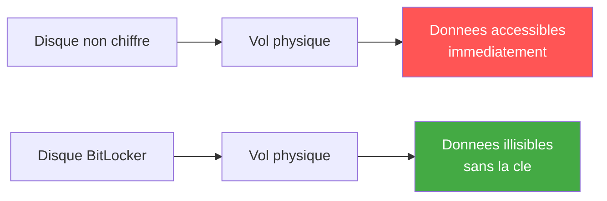

<!--
  Copyright 2026 Julien Bombled

  Licensed under the Apache License, Version 2.0 (the "License");
  you may not use this file except in compliance with the License.
  You may obtain a copy of the License at

      http://www.apache.org/licenses/LICENSE-2.0

  Unless required by applicable law or agreed to in writing, software
  distributed under the License is distributed on an "AS IS" BASIS,
  WITHOUT WARRANTIES OR CONDITIONS OF ANY KIND, either express or implied.
  See the License for the specific language governing permissions and
  limitations under the License.
-->

# BitLocker sur serveur

<span class="level-advanced">Avance</span> · Temps estime : 35 minutes

BitLocker Drive Encryption protege les donnees au repos en chiffrant integralement les volumes de disque. Sur un serveur, BitLocker empeche l'acces aux donnees en cas de vol physique du disque ou du serveur.

---

!!! example "Analogie"

    BitLocker fonctionne comme un coffre-fort qui enveloppe tout le contenu de votre disque dur. Sans la combinaison (la cle de chiffrement), meme si un voleur emporte physiquement le coffre, il ne pourra jamais lire son contenu. Le TPM, c'est le mecanisme qui verifie que le coffre n'a pas ete deplace dans un autre batiment avant de l'ouvrir automatiquement.

## Pourquoi BitLocker sur un serveur ?

| Scenario | Risque sans BitLocker |
|----------|----------------------|
| **Vol de disque** | Lecture directe des donnees en montant le disque sur un autre systeme |
| **Decommissionnement** | Donnees residuelles sur les disques cedes ou detruits |
| **Acces physique non autorise** | Demarrage sur un Live USB pour acceder aux fichiers |
| **Conformite** | Exigences reglementaires (RGPD, PCI-DSS, ISO 27001) |



---

## Prerequis

### Materiel

- **TPM 2.0** (Trusted Platform Module) : recommande pour le deverrouillage automatique
- Sans TPM : utilisation d'une cle USB ou d'un mot de passe au demarrage

### Logiciel

- Fonctionnalite **BitLocker Drive Encryption** installee
- Partition systeme de 350 Mo minimum (creee automatiquement)

```powershell
# Verify TPM availability
Get-Tpm

# Expected output for a functional TPM:
# TpmPresent   : True
# TpmReady     : True
# TpmEnabled   : True
# TpmActivated : True
# TpmOwned     : True
```

Resultat :

```text
TpmPresent        : True
TpmReady          : True
TpmEnabled        : True
TpmActivated      : True
TpmOwned          : True
ManufacturerId    : 1398033696
ManufacturerIdTxt : INTC
ManufacturerVersion : 403.1.0.0
ManagedAuthLevel  : Full
OwnerClearDisabled : True
AutoProvisioning  : Enabled
LockedOut         : False
LockoutHealTime   : 10 minutes
LockoutCount      : 0
LockoutMax        : 31
```

---

## Installation de la fonctionnalite

```powershell
# Install the BitLocker feature
Install-WindowsFeature BitLocker -IncludeAllSubFeature -IncludeManagementTools -Restart

# Verify installation
Get-WindowsFeature BitLocker
```

Resultat :

```text
Success Restart Needed Exit Code      Feature Result
------- -------------- ---------      --------------
True    Yes            SuccessRest... {BitLocker Drive Encryption, ...}

Display Name                            Name               Install State
------------                            ----               -------------
[X] BitLocker Drive Encryption          BitLocker              Installed
```

---

## Activation de BitLocker sur le volume systeme (C:)

### Avec TPM (recommande)

```powershell
# Enable BitLocker on C: with TPM protector
Enable-BitLocker -MountPoint "C:" `
    -EncryptionMethod XtsAes256 `
    -TpmProtector

# Add a recovery password protector (ESSENTIAL for recovery)
Add-BitLockerKeyProtector -MountPoint "C:" -RecoveryPasswordProtector

# View the recovery password - STORE THIS SECURELY
$blv = Get-BitLockerVolume -MountPoint "C:"
$blv.KeyProtector | Where-Object { $_.KeyProtectorType -eq 'RecoveryPassword' }
```

Resultat :

```text
MountPoint  VolumeStatus       VolumeType   EncryptionPercentage
----------  ------------       ----------   --------------------
C:          EncryptionInProgress OsVolume    45

KeyProtectorId                         KeyProtectorType  RecoveryPassword
--------------                         ----------------  ----------------
{A1B2C3D4-E5F6-7890-ABCD-EF1234567890} TpmProtector
{B2C3D4E5-F6A7-8901-BCDE-F12345678901} RecoveryPassword  123456-789012-345678-901234-567890-123456-789012-345678
```

### Sans TPM (avec mot de passe)

```powershell
# First, allow BitLocker without TPM via GPO or registry
$regPath = "HKLM:\SOFTWARE\Policies\Microsoft\FVE"
New-Item -Path $regPath -Force
Set-ItemProperty -Path $regPath -Name "UseAdvancedStartup" -Value 1 -Type DWord
Set-ItemProperty -Path $regPath -Name "EnableBDEWithNoTPM" -Value 1 -Type DWord
Set-ItemProperty -Path $regPath -Name "UseTPM" -Value 2 -Type DWord
Set-ItemProperty -Path $regPath -Name "UseTPMPIN" -Value 2 -Type DWord
Set-ItemProperty -Path $regPath -Name "UseTPMKey" -Value 2 -Type DWord
Set-ItemProperty -Path $regPath -Name "UseTPMKeyPIN" -Value 2 -Type DWord

# Enable BitLocker with password protector
$password = Read-Host -AsSecureString "Enter BitLocker password"
Enable-BitLocker -MountPoint "C:" `
    -EncryptionMethod XtsAes256 `
    -PasswordProtector `
    -Password $password
```

---

## Activation sur les volumes de donnees

```powershell
# Enable BitLocker on a data volume (D:)
Enable-BitLocker -MountPoint "D:" `
    -EncryptionMethod XtsAes256 `
    -RecoveryPasswordProtector

# Enable auto-unlock for data volumes (requires the OS volume to be BitLocker-protected)
Enable-BitLockerAutoUnlock -MountPoint "D:"

# Check encryption progress
Get-BitLockerVolume -MountPoint "D:" | Select-Object MountPoint, VolumeStatus, EncryptionPercentage
```

Resultat :

```text
MountPoint  VolumeStatus            EncryptionPercentage
----------  ------------            --------------------
D:          EncryptionInProgress    67
```

---

## Gestion des cles de recuperation

### Sauvegarder dans Active Directory

```powershell
# Backup recovery key to Active Directory
$blv = Get-BitLockerVolume -MountPoint "C:"
$recoveryProtector = $blv.KeyProtector | Where-Object { $_.KeyProtectorType -eq 'RecoveryPassword' }

Backup-BitLockerKeyProtector -MountPoint "C:" -KeyProtectorId $recoveryProtector.KeyProtectorId

# The recovery key is now stored in the computer object in AD
# Viewable via ADUC > Computer Properties > BitLocker Recovery tab
```

### Configuration GPO pour la sauvegarde automatique

```
Computer Configuration
  > Administrative Templates
    > Windows Components
      > BitLocker Drive Encryption
        > Operating System Drives
          > Choose how BitLocker-protected operating system drives can be recovered
            - Enabled
            - [x] Save BitLocker recovery information to AD DS
            - [x] Do not enable BitLocker until recovery information
                  is stored to AD DS
```

### Recuperer une cle depuis AD

```powershell
# Find BitLocker recovery key for a computer in AD
$computerName = "SRV01"
$computer = Get-ADComputer $computerName

Get-ADObject -Filter { objectClass -eq 'msFVE-RecoveryInformation' } `
    -SearchBase $computer.DistinguishedName `
    -Properties 'msFVE-RecoveryPassword' |
    Select-Object Name, @{N='RecoveryPassword';E={$_.'msFVE-RecoveryPassword'}}
```

Resultat :

```text
Name                                                    RecoveryPassword
----                                                    ----------------
2025-02-15T10:30:00-00:00{B2C3D4E5-F6A7-8901-...}     123456-789012-345678-901234-567890-123456-789012-345678
```

---

## Algorithmes de chiffrement

| Algorithme | Usage recommande |
|------------|-----------------|
| **XTS-AES 128** | Volumes fixes (performances) |
| **XTS-AES 256** | Volumes fixes (securite maximale) |
| **AES-CBC 128** | Volumes amovibles (compatibilite) |
| **AES-CBC 256** | Volumes amovibles (securite) |

!!! tip "XTS-AES 256"

    Pour les serveurs, privilegiez **XTS-AES 256**. Le surcharge de performance est negligeable sur le materiel moderne et offre le niveau de securite le plus eleve.

---

## Supervision et rapport

```powershell
# View BitLocker status for all volumes
Get-BitLockerVolume | Select-Object MountPoint, VolumeStatus,
    EncryptionMethod, EncryptionPercentage, LockStatus,
    @{N='Protectors';E={($_.KeyProtector | ForEach-Object { $_.KeyProtectorType }) -join ', '}}

# Check BitLocker status across multiple servers
$servers = @("SRV01", "SRV02", "SRV03")

foreach ($server in $servers) {
    try {
        $blv = Invoke-Command -ComputerName $server -ScriptBlock {
            Get-BitLockerVolume | Select-Object MountPoint, VolumeStatus, EncryptionPercentage
        } -ErrorAction Stop

        $blv | ForEach-Object {
            [PSCustomObject]@{
                Server     = $server
                Volume     = $_.MountPoint
                Status     = $_.VolumeStatus
                Encrypted  = "$($_.EncryptionPercentage)%"
            }
        }
    }
    catch {
        [PSCustomObject]@{
            Server     = $server
            Volume     = "N/A"
            Status     = "Inaccessible"
            Encrypted  = "N/A"
        }
    }
} | Format-Table -AutoSize
```

Resultat :

```text
Server      Volume  Status               Encrypted
------      ------  ------               ---------
SRV-01      C:      FullyEncrypted       100%
SRV-01      D:      FullyEncrypted       100%
SRV-02      C:      FullyEncrypted       100%
SRV-02      D:      EncryptionInProgress 78%
SRV-03      N/A     Inaccessible         N/A

MountPoint  VolumeStatus     EncryptionMethod  EncryptionPercentage  LockStatus  Protectors
----------  ------------     ----------------  --------------------  ----------  ----------
C:          FullyEncrypted   XtsAes256         100                   Unlocked    Tpm, RecoveryPassword
D:          FullyEncrypted   XtsAes256         100                   Unlocked    RecoveryPassword, AutoUnlock
```

---

## Suspension et desactivation

```powershell
# Suspend BitLocker (for maintenance, BIOS update, etc.)
# BitLocker auto-resumes after reboot
Suspend-BitLocker -MountPoint "C:" -RebootCount 1

# Disable BitLocker (decrypt the volume)
Disable-BitLocker -MountPoint "C:"

# Monitor decryption progress
Get-BitLockerVolume -MountPoint "C:" | Select-Object VolumeStatus, EncryptionPercentage
```

!!! warning "Suspension vs desactivation"

    - **Suspend** : temporaire, BitLocker reprend au prochain redemarrage. Utile avant une mise a jour du BIOS/firmware.
    - **Disable** : dechiffrement complet du volume. Les donnees ne sont plus protegees.

---

## Scenario pratique

!!! example "Scenario pratique"

    **Contexte** : Laurent, administrateur systeme, doit effectuer une mise a jour du firmware BIOS sur le serveur `SRV-01` (10.0.0.11) protege par BitLocker avec TPM. Il craint que la modification du firmware declenche le mode de recuperation BitLocker au prochain demarrage.

    **Procedure** :

    ```powershell
    # 1. Suspend BitLocker before firmware update (1 reboot)
    Suspend-BitLocker -MountPoint "C:" -RebootCount 1

    # 2. Verify suspension
    Get-BitLockerVolume -MountPoint "C:" | Select-Object MountPoint, ProtectionStatus
    ```

    Resultat :

    ```text
    MountPoint  ProtectionStatus
    ----------  ----------------
    C:          Off
    ```

    ```powershell
    # 3. Save the recovery key just in case
    $blv = Get-BitLockerVolume -MountPoint "C:"
    $rp = $blv.KeyProtector | Where-Object { $_.KeyProtectorType -eq 'RecoveryPassword' }
    Write-Output "Recovery Key: $($rp.RecoveryPassword)"
    ```

    Resultat :

    ```text
    Recovery Key: 123456-789012-345678-901234-567890-123456-789012-345678
    ```

    Laurent note la cle de recuperation, effectue la mise a jour du firmware, et redemarre le serveur. BitLocker reprend automatiquement apres le redemarrage sans demander la cle de recuperation.

    ```powershell
    # 4. Verify protection is restored after reboot
    Get-BitLockerVolume -MountPoint "C:" | Select-Object MountPoint, ProtectionStatus
    ```

    Resultat :

    ```text
    MountPoint  ProtectionStatus
    ----------  ----------------
    C:          On
    ```

---

!!! danger "Erreurs courantes"

    1. **Mettre a jour le firmware sans suspendre BitLocker** : la modification du firmware change les mesures PCR du TPM. BitLocker detecte le changement et demande la cle de recuperation au demarrage. Si personne n'a la cle, le serveur est inaccessible.

    2. **Ne pas sauvegarder la cle de recuperation dans AD** : sans GPO imposant la sauvegarde AD, la cle de recuperation peut etre perdue. Configurez toujours la GPO "Do not enable BitLocker until recovery information is stored to AD DS".

    3. **Utiliser AES-CBC 128 au lieu de XTS-AES 256 sur les volumes fixes** : AES-CBC est destine aux supports amovibles (compatibilite). Pour les disques fixes de serveur, XTS-AES 256 offre une securite superieure sans impact notable sur les performances.

    4. **Oublier de proteger les volumes de donnees** : chiffrer uniquement le volume systeme C: laisse les donnees applicatives (D:, E:) en clair. Activez BitLocker sur tous les volumes contenant des donnees sensibles avec l'auto-unlock.

---

## Points cles a retenir

- BitLocker protege les donnees **au repos** contre le vol physique et l'acces non autorise
- **TPM 2.0** est recommande pour le deverrouillage automatique et transparent au demarrage
- La **cle de recuperation** doit etre sauvegardee dans Active Directory (obligatoire avant d'activer BitLocker via GPO)
- Utiliser **XTS-AES 256** comme algorithme de chiffrement sur les serveurs
- **Suspendre** BitLocker avant les mises a jour firmware/BIOS pour eviter le mode recuperation
- Superviser l'etat BitLocker sur l'ensemble du parc serveur

---

## Pour aller plus loin

- EFS : chiffrement au niveau fichier (voir la page [EFS](efs.md))
- Microsoft : BitLocker deployment guide for Windows Server
- Microsoft : BitLocker recovery guide
- ANSSI : Recommandations pour le chiffrement des postes et serveurs

