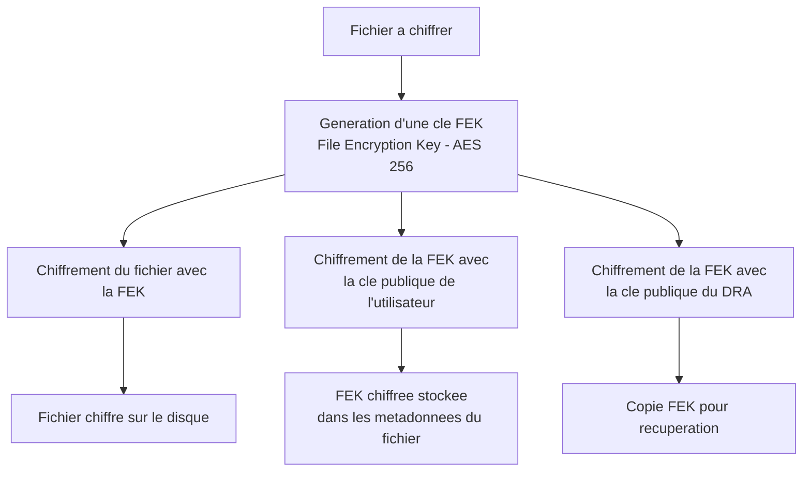

# EFS - Encrypting File System

<span class="level-advanced">Avance</span> · Temps estime : 30 minutes

EFS (Encrypting File System) est une fonctionnalite de chiffrement integree a NTFS qui protege des fichiers et dossiers individuels. Contrairement a BitLocker qui chiffre des volumes entiers, EFS offre une granularite au niveau du fichier.

---

## Principe de fonctionnement

EFS utilise un chiffrement hybride combinant cryptographie symetrique (pour la performance) et asymetrique (pour la gestion des cles) :



### Processus detaille

1. Une **FEK** (File Encryption Key) AES 256 bits est generee pour chaque fichier
2. Le fichier est chiffre avec cette FEK (chiffrement symetrique rapide)
3. La FEK est chiffree avec la **cle publique EFS** de l'utilisateur
4. La FEK chiffree est stockee dans les **attributs NTFS** du fichier (champ `$EFS`)
5. Si un **DRA** (Data Recovery Agent) est configure, une copie de la FEK est egalement chiffree avec sa cle publique

---

## Utilisation d'EFS

### Chiffrer un fichier ou un dossier

```powershell
# Encrypt a single file
cipher /e "D:\Donnees\confidentiel.docx"

# Encrypt a folder (all new files in the folder will be encrypted)
cipher /e /s:"D:\Donnees\Confidentiel"

# Using .NET API
(Get-Item "D:\Donnees\confidentiel.docx").Encrypt()
```

### Dechiffrer un fichier ou un dossier

```powershell
# Decrypt a single file
cipher /d "D:\Donnees\confidentiel.docx"

# Decrypt a folder and its contents
cipher /d /s:"D:\Donnees\Confidentiel"

# Using .NET API
(Get-Item "D:\Donnees\confidentiel.docx").Decrypt()
```

### Verifier l'etat de chiffrement

```powershell
# Check encryption status of files in a directory
cipher /s:"D:\Donnees"

# Output legend:
# E = Encrypted
# U = Unencrypted

# List encrypted files via PowerShell
Get-ChildItem -Path "D:\Donnees" -Recurse |
    Where-Object { $_.Attributes -match "Encrypted" } |
    Select-Object FullName, Length, LastWriteTime
```

---

## Certificats EFS

### Certificat utilisateur EFS

Chaque utilisateur qui chiffre un fichier avec EFS utilise un certificat numerique. Si aucun certificat n'existe, Windows en genere un automatiquement (auto-signe).

```powershell
# View the current user's EFS certificate
cipher /r:backup

# List EFS certificates in the user's store
Get-ChildItem -Path Cert:\CurrentUser\My |
    Where-Object { $_.EnhancedKeyUsageList.FriendlyName -contains "Encrypting File System" } |
    Select-Object Subject, Thumbprint, NotAfter
```

### Utiliser des certificats d'une PKI d'entreprise

Pour un deploiement en entreprise, les certificats EFS doivent etre emis par la **CA d'entreprise** (pas auto-signes) :

1. Creer un modele de certificat EFS dans la CA
2. Publier le modele sur la CA Enterprise
3. Configurer l'auto-enrollment pour les utilisateurs

!!! tip "Certificats PKI vs auto-signes"

    Les certificats auto-signes EFS posent un probleme majeur : si l'utilisateur perd son profil ou sa cle privee, **les fichiers sont irrecuperables** (sauf si un DRA est configure). Avec une PKI, les cles peuvent etre archivees et recuperees.

---

## Agent de recuperation (DRA)

Le **Data Recovery Agent** est un compte capable de dechiffrer tous les fichiers EFS d'un domaine, meme sans connaitre le mot de passe de l'utilisateur original.

### Configurer un DRA

```powershell
# Generate a DRA certificate (self-signed for lab, PKI for production)
cipher /r:DRA-EFS

# This creates:
# - DRA-EFS.cer (public certificate)
# - DRA-EFS.pfx (certificate with private key - PROTECT THIS!)
```

### Deployer le DRA via GPO

```
Computer Configuration
  > Policies
    > Windows Settings
      > Security Settings
        > Public Key Policies
          > Encrypting File System
            > Right-click > Add Data Recovery Agent
            > Browse to the DRA-EFS.cer file
```

### Recuperer un fichier avec le DRA

```powershell
# 1. Import the DRA certificate with private key on the recovery machine
Import-PfxCertificate -FilePath "C:\Secure\DRA-EFS.pfx" `
    -CertStoreLocation Cert:\CurrentUser\My `
    -Password (Read-Host -AsSecureString "PFX password")

# 2. Access the encrypted file - it will be decrypted transparently
# (the DRA's private key allows automatic decryption)

# 3. Optionally decrypt the file permanently
cipher /d "D:\Donnees\confidentiel.docx"
```

!!! danger "Protection de la cle DRA"

    La cle privee du DRA donne acces a **tous les fichiers EFS** du domaine. Elle doit etre :

    - Stockee hors ligne (cle USB dans un coffre-fort)
    - Protegee par un mot de passe fort
    - Accessible uniquement a un nombre restreint de personnes
    - Jamais stockee sur un poste connecte au reseau

---

## Limites d'EFS

| Limitation | Detail |
|------------|--------|
| **NTFS requis** | EFS ne fonctionne pas sur FAT32 ou ReFS |
| **Pas de chiffrement en transit** | EFS protege uniquement les donnees au repos sur le disque local |
| **Copie/deplacment** | Un fichier copie sur un volume non-NTFS perd son chiffrement |
| **Sauvegarde** | Les outils de backup standard sauvegardent les fichiers en clair si le compte de backup a acces |
| **Dossiers systeme** | Impossible de chiffrer les fichiers systeme Windows |
| **Fichiers comprimes** | Un fichier ne peut pas etre a la fois compresse NTFS et chiffre EFS |
| **Partage reseau** | Le chiffrement est applique sur le serveur, pas pendant le transfert |

---

## EFS vs BitLocker

| Critere | EFS | BitLocker |
|---------|-----|-----------|
| **Granularite** | Fichier / dossier | Volume entier |
| **Transparence** | Transparente pour l'utilisateur proprietaire | Transparente au demarrage (avec TPM) |
| **Protection contre** | Acces par un autre utilisateur du meme systeme | Vol physique du disque |
| **Gestion des cles** | Certificat par utilisateur | Cle de volume + protecteur (TPM, PIN, cle USB) |
| **Prerequis** | NTFS | TPM recommande |
| **Impact performance** | Faible (par fichier) | Negligeable (chiffrement AES materiel) |
| **Multiutilisateur** | Oui (ajout de cles par fichier) | Non applicable |
| **Cas d'usage serveur** | Donnees sensibles specifiques | Protection globale du volume |

!!! tip "Complementarite"

    EFS et BitLocker ne sont pas exclusifs. BitLocker protege contre le vol physique, EFS protege contre les acces non autorises entre utilisateurs du meme systeme. L'utilisation combinee offre une protection en profondeur.

---

## Audit des operations EFS

```powershell
# Enable auditing for EFS operations
auditpol /set /subcategory:"File System" /success:enable /failure:enable

# EFS events are logged under:
# Event ID 4656 : Handle requested for an encrypted file
# Event ID 4663 : Access attempt on an encrypted file

# Search for EFS-related events
Get-WinEvent -FilterHashtable @{
    LogName = 'Security'
    Id = @(4656, 4663)
} -MaxEvents 20 |
    Where-Object { $_.Message -match "Encrypt" } |
    Select-Object TimeCreated, Id, Message |
    Format-Table -Wrap
```

---

## Points cles a retenir

- EFS chiffre les fichiers **individuellement** avec une FEK protegee par le certificat de l'utilisateur
- Un **Data Recovery Agent** (DRA) est indispensable : sans lui, la perte du certificat utilisateur entraine la perte definitive des donnees
- Les certificats EFS doivent provenir d'une **PKI d'entreprise** en production (pas auto-signes)
- EFS et BitLocker sont **complementaires** : BitLocker contre le vol physique, EFS contre les acces inter-utilisateurs
- EFS ne fonctionne que sur **NTFS** et ne protege pas les donnees en transit
- La cle privee du DRA doit etre stockee **hors ligne** dans un emplacement securise

---

## Pour aller plus loin

- BitLocker sur serveur (voir la page [BitLocker](bitlocker.md))
- Concepts PKI (voir la page [Concepts PKI](../pki/concepts-pki.md))
- Microsoft : Encrypting File System overview
- Microsoft : Best practices for EFS
