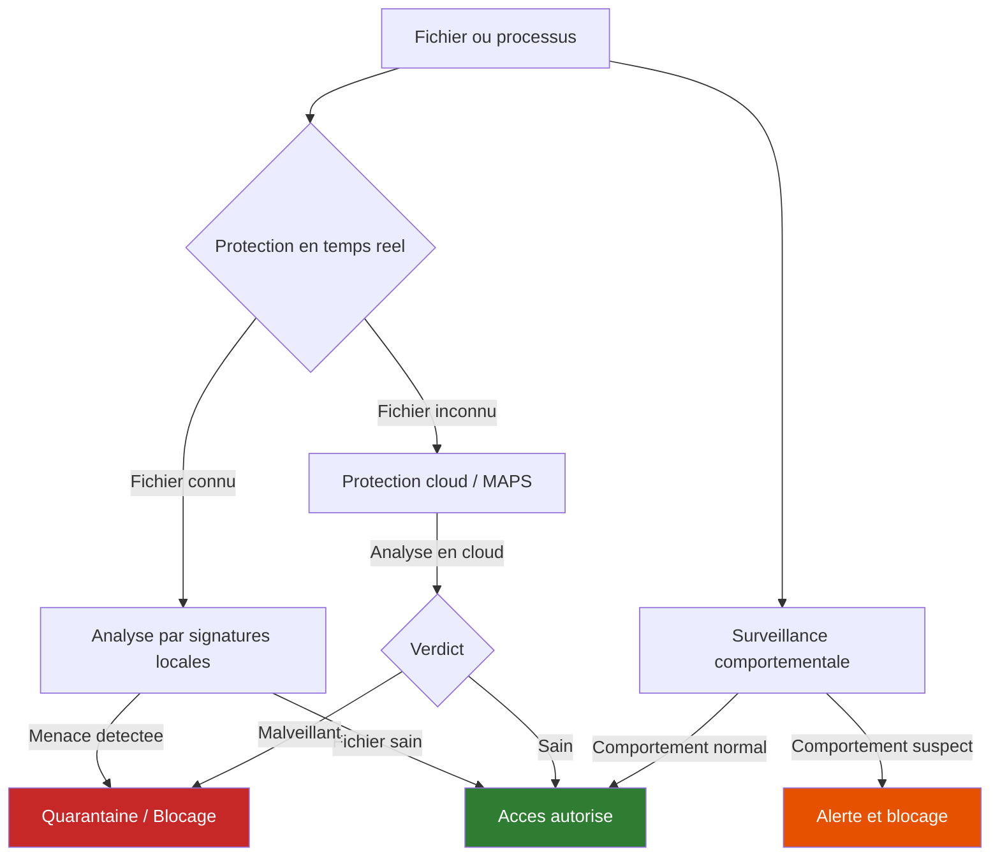

<!--
  Copyright 2026 Julien Bombled

  Licensed under the Apache License, Version 2.0 (the "License");
  you may not use this file except in compliance with the License.
  You may obtain a copy of the License at

      http://www.apache.org/licenses/LICENSE-2.0

  Unless required by applicable law or agreed to in writing, software
  distributed under the License is distributed on an "AS IS" BASIS,
  WITHOUT WARRANTIES OR CONDITIONS OF ANY KIND, either express or implied.
  See the License for the specific language governing permissions and
  limitations under the License.
-->

# Microsoft Defender Antivirus sur Windows Server

<span class="level-intermediate">Intermediaire</span> · Temps estime : 30 minutes

Microsoft Defender Antivirus est la solution de protection contre les programmes malveillants integree a Windows Server 2022. Contrairement aux editions clientes, son activation et sa gestion sur serveur necessitent une approche specifique, en particulier sur les installations Server Core depourvues d'interface graphique.

---

!!! example "Analogie"

    Defender fonctionne comme le systeme immunitaire d'un organisme. La **protection en temps reel** agit comme les globules blancs qui patrouillent en permanence pour neutraliser les menaces des qu'elles penetrent. Les **definitions de signatures** sont la memoire immunitaire : elles permettent de reconnaitre les pathogenes deja connus. La **protection cloud** joue le role d'un laboratoire d'analyse centralise, capable d'identifier de nouvelles souches inconnues en interrogeant une base de donnees mondiale. Enfin, la **surveillance comportementale** detecte les cellules qui se comportent de maniere anormale, meme si elles n'ont jamais ete observees auparavant.

---

## Architecture de Defender sur Windows Server



---

## Differences entre Windows Server et Windows Client

| Caracteristique | Windows Client | Windows Server 2022 |
|----------------|----------------|---------------------|
| **Installation** | Active par defaut | Active par defaut (Desktop Experience) |
| **Interface graphique** | Application Securite Windows complete | Limitee (Desktop Experience) / Absente (Server Core) |
| **Gestion principale** | GUI + PowerShell | PowerShell + GPO |
| **Exclusions automatiques** | Non | Oui (roles detectes automatiquement) |
| **Protection anti-sabotage** | Disponible | Disponible (necessite Defender for Endpoint) |
| **Mises a jour** | Windows Update automatique | WSUS / Configuration manuelle recommandee |

!!! info "Exclusions automatiques de roles"

    Sur Windows Server 2022, Defender detecte automatiquement les roles installes (AD DS, Hyper-V, DNS, etc.) et applique des exclusions predefinies pour eviter les impacts sur les performances. Cette fonctionnalite est activee par defaut.

---

## Installation et verification

### Desktop Experience

Sur une installation avec interface graphique, Defender est installe et actif par defaut.

```powershell
# Verify Defender status
Get-MpComputerStatus | Select-Object AMRunningMode, AMServiceEnabled,
    AntispywareEnabled, AntivirusEnabled, RealTimeProtectionEnabled
```

Resultat :

```text
AMRunningMode             : Normal
AMServiceEnabled          : True
AntispywareEnabled        : True
AntivirusEnabled          : True
RealTimeProtectionEnabled : True
```

### Server Core

Sur Server Core, la fonctionnalite Defender est presente mais l'interface graphique n'est pas disponible. Toute la gestion se fait en PowerShell.

```powershell
# Verify the Defender feature is installed (Server Core)
Get-WindowsFeature Windows-Defender | Select-Object Name, InstallState

# If not installed, add the feature
Install-WindowsFeature -Name Windows-Defender -IncludeManagementTools
```

Resultat :

```text
Name              InstallState
----              ------------
Windows-Defender  Installed
```

!!! warning "Installation sans interface graphique"

    Sur Server Core, l'interface graphique de Defender (`Windows-Defender-GUI`) n'est pas installable. Utilisez exclusivement PowerShell ou les GPO pour la configuration. L'outil en ligne de commande `MpCmdRun.exe` est egalement disponible.

---

## Gestion PowerShell

### Verifier l'etat complet

```powershell
# Full Defender status report
Get-MpComputerStatus
```

Resultat :

```text
AMEngineVersion                  : 1.1.24010.10
AMProductVersion                 : 4.18.24010.12
AMRunningMode                    : Normal
AMServiceEnabled                 : True
AMServiceVersion                 : 4.18.24010.12
AntispywareEnabled               : True
AntispywareSignatureAge          : 0
AntispywareSignatureLastUpdated  : 2026-02-20 06:15:32
AntispywareSignatureVersion      : 1.405.1234.0
AntivirusEnabled                 : True
AntivirusSignatureAge            : 0
AntivirusSignatureLastUpdated    : 2026-02-20 06:15:32
AntivirusSignatureVersion        : 1.405.1234.0
BehaviorMonitorEnabled           : True
IoavProtectionEnabled            : True
NISEnabled                       : True
RealTimeProtectionEnabled        : True
```

### Mettre a jour les definitions

```powershell
# Update antivirus definitions from Microsoft Update
Update-MpSignature

# Update from a specific source (UNC path)
Update-MpSignature -UpdateSource "\\SRV-WSUS\Updates\Defender"

# Verify signature age after update
Get-MpComputerStatus | Select-Object AntivirusSignatureAge, AntivirusSignatureLastUpdated
```

Resultat :

```text
AntivirusSignatureAge           : 0
AntivirusSignatureLastUpdated   : 2026-02-20 14:22:10
```

### Types d'analyses

```powershell
# Quick scan (memory and common infection points)
Start-MpScan -ScanType QuickScan

# Full scan (all files on all drives)
Start-MpScan -ScanType FullScan

# Custom scan (specific path)
Start-MpScan -ScanType CustomScan -ScanPath "D:\AppData"

# Offline scan (requires reboot, scans before OS loads)
Start-MpWDOScan
```

| Type d'analyse | Commande | Duree | Usage |
|---------------|----------|-------|-------|
| **Rapide** | `Start-MpScan -ScanType QuickScan` | Quelques minutes | Verification quotidienne |
| **Complete** | `Start-MpScan -ScanType FullScan` | Plusieurs heures | Audit hebdomadaire |
| **Personnalisee** | `Start-MpScan -ScanType CustomScan` | Variable | Dossier specifique |
| **Hors ligne** | `Start-MpWDOScan` | Redemarrage requis | Menaces persistantes |

---

## Configuration des exclusions

Les exclusions sont essentielles sur les serveurs pour eviter que Defender n'impacte les performances des applications critiques. Trois types d'exclusions existent : **chemins**, **processus** et **extensions**.

### Exclusions pour SQL Server

```powershell
# Path exclusions for SQL Server data and log files
Add-MpPreference -ExclusionPath "D:\MSSQL\Data"
Add-MpPreference -ExclusionPath "D:\MSSQL\Log"
Add-MpPreference -ExclusionPath "D:\MSSQL\Backup"

# Process exclusions for SQL Server engine and agent
Add-MpPreference -ExclusionProcess "sqlservr.exe"
Add-MpPreference -ExclusionProcess "sqlagent.exe"
Add-MpPreference -ExclusionProcess "sqlwriter.exe"
Add-MpPreference -ExclusionProcess "sqlceip.exe"

# Extension exclusions for database files
Add-MpPreference -ExclusionExtension ".mdf"
Add-MpPreference -ExclusionExtension ".ldf"
Add-MpPreference -ExclusionExtension ".ndf"
Add-MpPreference -ExclusionExtension ".bak"
Add-MpPreference -ExclusionExtension ".trn"
```

### Exclusions pour IIS

```powershell
# Process exclusions for IIS
Add-MpPreference -ExclusionProcess "w3wp.exe"
Add-MpPreference -ExclusionProcess "iisrstas.exe"

# Path exclusions for IIS logs and temp files
Add-MpPreference -ExclusionPath "C:\inetpub\logs"
Add-MpPreference -ExclusionPath "C:\inetpub\temp"
Add-MpPreference -ExclusionPath "C:\Windows\System32\inetsrv"
```

### Exclusions pour Hyper-V

```powershell
# Process exclusions for Hyper-V
Add-MpPreference -ExclusionProcess "vmms.exe"
Add-MpPreference -ExclusionProcess "vmwp.exe"
Add-MpPreference -ExclusionProcess "vmsp.exe"

# Path exclusions for VM storage
Add-MpPreference -ExclusionPath "D:\Hyper-V\Virtual Machines"
Add-MpPreference -ExclusionPath "D:\Hyper-V\Virtual Hard Disks"

# Extension exclusions for VM disk files
Add-MpPreference -ExclusionExtension ".vhd"
Add-MpPreference -ExclusionExtension ".vhdx"
Add-MpPreference -ExclusionExtension ".avhd"
Add-MpPreference -ExclusionExtension ".avhdx"
Add-MpPreference -ExclusionExtension ".vsv"
Add-MpPreference -ExclusionExtension ".iso"
```

### Verifier les exclusions configurees

```powershell
# List all configured exclusions
$prefs = Get-MpPreference
Write-Output "=== Path exclusions ==="
$prefs.ExclusionPath
Write-Output "=== Process exclusions ==="
$prefs.ExclusionProcess
Write-Output "=== Extension exclusions ==="
$prefs.ExclusionExtension
```

Resultat :

```text
=== Path exclusions ===
D:\MSSQL\Data
D:\MSSQL\Log
D:\MSSQL\Backup
C:\inetpub\logs
=== Process exclusions ===
sqlservr.exe
sqlagent.exe
w3wp.exe
vmms.exe
=== Extension exclusions ===
.mdf
.ldf
.ndf
.bak
```

---

## Protection en temps reel et cloud

### Configuration des protections

```powershell
# Enable real-time protection
Set-MpPreference -DisableRealtimeMonitoring $false

# Enable cloud-delivered protection (MAPS)
Set-MpPreference -MAPSReporting Advanced

# Enable automatic sample submission
Set-MpPreference -SubmitSamplesConsent SendAllSamples

# Enable behavior monitoring
Set-MpPreference -DisableBehaviorMonitoring $false

# Enable network protection (block connections to malicious domains)
Set-MpPreference -EnableNetworkProtection Enabled

# Enable PUA (Potentially Unwanted Application) detection
Set-MpPreference -PUAProtection Enabled

# Verify all settings
Get-MpPreference | Select-Object DisableRealtimeMonitoring, MAPSReporting,
    SubmitSamplesConsent, DisableBehaviorMonitoring, EnableNetworkProtection, PUAProtection
```

Resultat :

```text
DisableRealtimeMonitoring : False
MAPSReporting             : 2
SubmitSamplesConsent      : 3
DisableBehaviorMonitoring : False
EnableNetworkProtection   : 1
PUAProtection             : 1
```

| Parametre | Valeur recommandee | Description |
|-----------|-------------------|-------------|
| `DisableRealtimeMonitoring` | `$false` | Analyse des fichiers a l'acces |
| `MAPSReporting` | `Advanced` | Envoie des metadonnees detaillees au cloud |
| `SubmitSamplesConsent` | `SendAllSamples` | Soumet automatiquement les echantillons suspects |
| `DisableBehaviorMonitoring` | `$false` | Detecte les comportements malveillants |
| `EnableNetworkProtection` | `Enabled` | Bloque les connexions vers des domaines malveillants |
| `PUAProtection` | `Enabled` | Detecte les applications potentiellement indesirables |

---

## Configuration centralisee par GPO

Pour gerer Defender sur un parc de serveurs, les GPO offrent une configuration centralisee.

```
Computer Configuration
  > Administrative Templates
    > Windows Components
      > Microsoft Defender Antivirus
        > Real-time Protection
          > Turn off real-time protection : Disabled
          > Turn on behavior monitoring : Enabled
        > MAPS
          > Join Microsoft MAPS : Advanced MAPS
          > Send file samples when further analysis is required : Send all samples
        > Scan
          > Specify the scan type to use for a scheduled scan : Quick scan
          > Specify the day of the week to run a scheduled scan : Sunday
          > Specify the time of day to run a scheduled scan : 02:00
        > Signature Updates
          > Specify the interval to check for definition updates : 4 (hours)
        > Exclusions
          > Path Exclusions : (configure per server role)
          > Process Exclusions : (configure per server role)
```

!!! tip "Filtrage WMI pour les exclusions par role"

    Creez des GPO d'exclusions specifiques filtrees par WMI pour chaque role serveur. Par exemple, un filtre WMI qui detecte si SQL Server est installe permet d'appliquer les exclusions SQL uniquement aux serveurs concernes.

    ```
    SELECT * FROM Win32_Service WHERE Name = 'MSSQLSERVER'
    ```

---

## Integration avec Microsoft Defender for Endpoint

Microsoft Defender for Endpoint (MDE) etend les capacites de Defender Antivirus avec une plateforme de detection et reponse (EDR).

| Fonctionnalite | Defender Antivirus seul | Avec Defender for Endpoint |
|----------------|------------------------|---------------------------|
| **Protection en temps reel** | Oui | Oui |
| **Detection et reponse (EDR)** | Non | Oui |
| **Investigation automatisee** | Non | Oui |
| **Threat Analytics** | Non | Oui |
| **Gestion centralisee** | GPO uniquement | Portail Microsoft 365 Defender |
| **Anti-sabotage** | Non | Oui |
| **Indicateurs de compromission** | Non | Oui |

```powershell
# Check if the server is onboarded to Defender for Endpoint
$mdeSenseService = Get-Service -Name "Sense" -ErrorAction SilentlyContinue
if ($mdeSenseService -and $mdeSenseService.Status -eq 'Running') {
    Write-Output "MDE Sense service is running - server is onboarded"
} else {
    Write-Output "MDE Sense service is not running - server is NOT onboarded"
}

# Check onboarding status via registry
$onboardingState = Get-ItemProperty -Path "HKLM:\SOFTWARE\Microsoft\Windows Advanced Threat Protection\Status" `
    -Name "OnboardingState" -ErrorAction SilentlyContinue
Write-Output "Onboarding state: $($onboardingState.OnboardingState)"
```

Resultat :

```text
MDE Sense service is running - server is onboarded
Onboarding state: 1
```

---

## Supervision et diagnostics

### Journaux d'evenements

```powershell
# View recent Defender operational events
Get-WinEvent -LogName "Microsoft-Windows-Windows Defender/Operational" -MaxEvents 20 |
    Select-Object TimeCreated, Id, LevelDisplayName, Message |
    Format-Table -AutoSize -Wrap
```

Resultat :

```text
TimeCreated           Id LevelDisplayName Message
-----------           -- ---------------- -------
2026-02-20 14:22:10 2000 Information      Windows Defender Antivirus definition update succeeded
2026-02-20 14:00:05 1001 Information      Windows Defender Antivirus scan completed (Quick)
2026-02-20 06:15:32 2000 Information      Windows Defender Antivirus definition update succeeded
```

| ID Evenement | Description |
|--------------|-------------|
| **1001** | Analyse terminee |
| **1002** | Analyse annulee |
| **1006** | Malware ou logiciel potentiellement indesirable detecte |
| **1007** | Action effectuee pour proteger le systeme |
| **1116** | Detection de menace |
| **1117** | Action de protection executee |
| **2000** | Mise a jour des definitions reussie |
| **2001** | Echec de la mise a jour des definitions |
| **5001** | Protection en temps reel desactivee |

### Diagnostics avec MpCmdRun.exe

```powershell
# Collect diagnostic data for support
& "$env:ProgramFiles\Windows Defender\MpCmdRun.exe" -GetFiles

# View collected data location
Write-Output "Diagnostics saved to: $env:ProgramData\Microsoft\Windows Defender\Support"

# Check the platform update status
& "$env:ProgramFiles\Windows Defender\MpCmdRun.exe" -SignatureUpdate

# Validate cloud connectivity (MAPS)
& "$env:ProgramFiles\Windows Defender\MpCmdRun.exe" -ValidateMapsConnection
```

Resultat :

```text
Service Version: 4.18.24010.12
Engine Version: 1.1.24010.10
AntiSpyware Signature Version: 1.405.1234.0
AntiVirus Signature Version: 1.405.1234.0
Gathering diagnostic data...
MpCmdRun.exe: Diagnostic data collected successfully.
File saved to: C:\ProgramData\Microsoft\Windows Defender\Support\MpSupportFiles.cab

ValidateMapsConnection successfully established a connection to MAPS.
```

---

## Scenario pratique

!!! example "Scenario pratique"

    **Contexte** : Marc, administrateur systeme, doit configurer Microsoft Defender Antivirus sur un serveur SQL Server 2022 (`SRV-SQL01`, 10.0.0.20) recemment deploye sur Windows Server 2022. Le serveur presente des ralentissements lors des sauvegardes nocturnes de bases de donnees. Marc suspecte que Defender analyse les fichiers de sauvegarde SQL en temps reel.

    **Diagnostic** :

    ```powershell
    # 1. Verify Defender is running
    Get-MpComputerStatus | Select-Object AntivirusEnabled, RealTimeProtectionEnabled,
        AntivirusSignatureAge
    ```

    Resultat :

    ```text
    AntivirusEnabled          : True
    RealTimeProtectionEnabled : True
    AntivirusSignatureAge     : 0
    ```

    ```powershell
    # 2. Check current exclusions (likely none configured)
    Get-MpPreference | Select-Object ExclusionPath, ExclusionProcess, ExclusionExtension
    ```

    Resultat :

    ```text
    ExclusionPath      :
    ExclusionProcess   :
    ExclusionExtension :
    ```

    **Remediation** :

    ```powershell
    # 3. Add SQL Server path exclusions
    Add-MpPreference -ExclusionPath "D:\MSSQL\Data"
    Add-MpPreference -ExclusionPath "D:\MSSQL\Log"
    Add-MpPreference -ExclusionPath "D:\MSSQL\Backup"
    Add-MpPreference -ExclusionPath "D:\MSSQL\TempDB"

    # 4. Add SQL Server process exclusions
    Add-MpPreference -ExclusionProcess "sqlservr.exe"
    Add-MpPreference -ExclusionProcess "sqlagent.exe"
    Add-MpPreference -ExclusionProcess "sqlwriter.exe"
    Add-MpPreference -ExclusionProcess "sqlceip.exe"
    Add-MpPreference -ExclusionProcess "sqlbrowser.exe"

    # 5. Add SQL Server extension exclusions
    Add-MpPreference -ExclusionExtension ".mdf"
    Add-MpPreference -ExclusionExtension ".ldf"
    Add-MpPreference -ExclusionExtension ".ndf"
    Add-MpPreference -ExclusionExtension ".bak"
    Add-MpPreference -ExclusionExtension ".trn"

    # 6. Schedule full scan outside backup window (Sunday 14:00)
    Set-MpPreference -ScanScheduleDay 1
    Set-MpPreference -ScanScheduleTime 840

    # 7. Verify all exclusions are applied
    $prefs = Get-MpPreference
    Write-Output "Path exclusions: $($prefs.ExclusionPath -join ', ')"
    Write-Output "Process exclusions: $($prefs.ExclusionProcess -join ', ')"
    Write-Output "Extension exclusions: $($prefs.ExclusionExtension -join ', ')"
    ```

    ??? success "Resultat attendu"

        ```text
        Path exclusions: D:\MSSQL\Data, D:\MSSQL\Log, D:\MSSQL\Backup, D:\MSSQL\TempDB
        Process exclusions: sqlservr.exe, sqlagent.exe, sqlwriter.exe, sqlceip.exe, sqlbrowser.exe
        Extension exclusions: .mdf, .ldf, .ndf, .bak, .trn
        ```

        Les sauvegardes nocturnes ne sont plus ralenties par l'analyse en temps reel de Defender. Marc verifie que la protection reste active sur les autres chemins du serveur et planifie une analyse complete hebdomadaire en dehors de la fenetre de sauvegarde.

---

!!! failure "Erreur 1 : Defender desactive par un autre antivirus"

    L'installation d'un antivirus tiers (Symantec, McAfee, etc.) desactive automatiquement Defender. Sur un serveur, cela peut passer inapercu si personne ne verifie l'etat de la protection apres l'installation. Verifiez systematiquement avec `Get-MpComputerStatus` que `AMRunningMode` est bien `Normal` et non `Passive` ou `SxS Passive`.

!!! failure "Erreur 2 : Exclusions trop larges"

    Exclure des chemins entiers comme `C:\` ou `D:\` pour eviter les problemes de performance revient a desactiver Defender. Limitez les exclusions aux dossiers et extensions strictement necessaires. Par exemple, pour SQL Server, excluez `D:\MSSQL\Data` et non `D:\`.

!!! failure "Erreur 3 : Definitions de signatures obsoletes"

    Des signatures vieilles de plus de 7 jours laissent le serveur vulnerable aux menaces recentes. Configurez la mise a jour automatique via GPO (intervalle de 4 heures) ou WSUS, et surveillez l'attribut `AntivirusSignatureAge` avec `Get-MpComputerStatus`. Une alerte doit etre declenchee si la valeur depasse 3 jours.

!!! failure "Erreur 4 : Impact de la protection en temps reel sur SQL ou IIS"

    L'analyse en temps reel de fichiers `.mdf`, `.ldf` ou de pools d'applications IIS cause des degradations de performance significatives (latence des requetes, timeouts). Sans exclusions configurees, Defender analyse chaque ecriture et lecture sur les fichiers de bases de donnees et les fichiers temporaires IIS. Configurez les exclusions recommandees par Microsoft pour chaque role serveur.

!!! failure "Erreur 5 : Gerer Defender sur Server Core sans PowerShell"

    Sur Server Core, certains administrateurs tentent d'utiliser `mpcmdrun.exe` pour toute la configuration. Cet outil est limite aux operations de scan et de mise a jour. Pour configurer les exclusions, la protection en temps reel ou les parametres cloud, il faut utiliser les cmdlets PowerShell (`Set-MpPreference`, `Add-MpPreference`) ou les GPO.

---

## Points cles a retenir

- Defender est **active par defaut** sur Windows Server 2022 (Desktop Experience) et doit rester actif meme en presence d'un pare-feu reseau
- Sur **Server Core**, la gestion se fait exclusivement en **PowerShell** et par GPO
- Les **exclusions** sont indispensables pour les roles serveur (SQL, IIS, Hyper-V, Exchange) afin d'eviter les impacts sur les performances
- La **protection cloud (MAPS)** et la **surveillance comportementale** renforcent la detection au-dela des signatures locales
- Les **definitions** doivent etre mises a jour au minimum toutes les 4 heures via GPO ou WSUS
- **Defender for Endpoint** ajoute les capacites EDR, indispensables pour une strategie de securite moderne

---

## Pour aller plus loin

- Bonnes pratiques de durcissement (voir la page [Bonnes pratiques](../durcissement/bonnes-pratiques.md))
- AppLocker et WDAC : controle d'applications (voir la page [AppLocker et WDAC](../durcissement/applocker-wdac.md))
- Credential Guard : protection des identifiants (voir la page [Credential Guard](../durcissement/credential-guard.md))
- Observateur d'evenements : surveillance centralisee (voir la page [Observateur d'evenements](../../supervision/surveillance/event-viewer.md))
- Microsoft : Configure exclusions for Microsoft Defender Antivirus on Windows Server
- Microsoft : Microsoft Defender Antivirus on Windows Server
