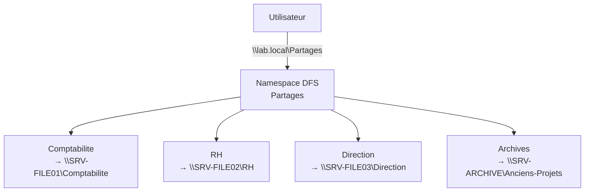
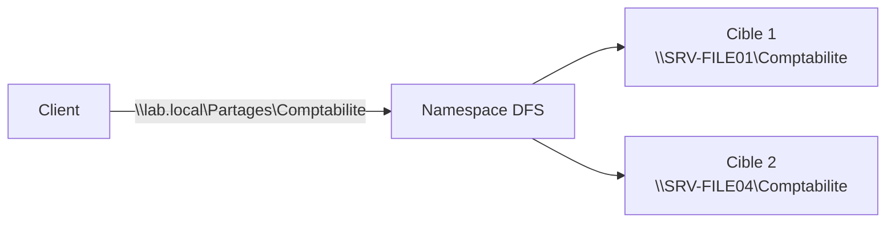
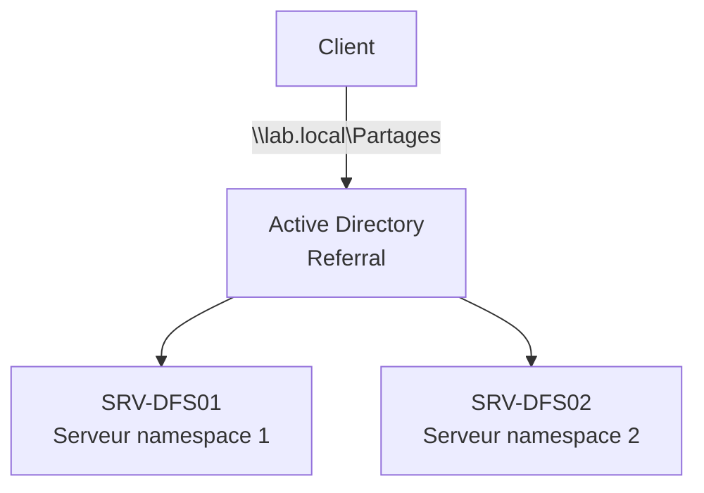

# DFS Namespaces

<span class="level-intermediate">Intermediaire</span> · Temps estime : 25 minutes

## Qu'est-ce que DFS Namespaces ?

DFS Namespaces (DFS-N) est un service de role qui permet de regrouper des dossiers partages situes sur differents serveurs sous un chemin d'acces unifie et logique. Les utilisateurs accedent a un seul chemin UNC sans se soucier du serveur physique qui heberge les donnees.

### Le probleme sans DFS

Sans DFS, les utilisateurs doivent connaitre le nom de chaque serveur :

```
\\SRV-FILE01\Comptabilite
\\SRV-FILE02\RH
\\SRV-FILE03\Direction
\\SRV-ARCHIVE\Anciens-Projets
```

### La solution avec DFS

Avec un namespace DFS, tous les partages sont accessibles depuis une racine unique :

```
\\lab.local\Partages\Comptabilite    → \\SRV-FILE01\Comptabilite
\\lab.local\Partages\RH              → \\SRV-FILE02\RH
\\lab.local\Partages\Direction        → \\SRV-FILE03\Direction
\\lab.local\Partages\Archives         → \\SRV-ARCHIVE\Anciens-Projets
```



## Terminologie

| Terme | Description |
|-------|-------------|
| **Namespace** (espace de noms) | Chemin d'acces racine virtuel (ex : `\\lab.local\Partages`) |
| **Namespace server** | Serveur qui heberge le namespace |
| **Folder** (dossier DFS) | Entree dans le namespace qui pointe vers une ou plusieurs cibles |
| **Folder target** (cible) | Chemin reel vers un dossier partage sur un serveur (ex : `\\SRV-FILE01\Comptabilite`) |
| **Referral** (orientation) | Reponse du serveur DFS au client, indiquant les cibles disponibles |

## Types de namespaces

### Namespace de domaine (Domain-based)

Le namespace est associe au domaine Active Directory :

| Propriete | Valeur |
|-----------|--------|
| Chemin d'acces | `\\domaine.local\NomNamespace` |
| Stockage de la configuration | Active Directory |
| Haute disponibilite | Oui (plusieurs serveurs de namespace) |
| Nombre max de dossiers | 50 000 (mode Windows Server 2008+) |
| Prerequis | Domaine Active Directory |

!!! tip "Mode recommande"

    Utilisez le mode **Windows Server 2008** (ou superieur) pour les namespaces de domaine. Ce mode prend en charge l'enumeration basee sur l'acces (ABE) et augmente la limite de dossiers a 50 000.

### Namespace autonome (Standalone)

Le namespace est associe a un serveur unique :

| Propriete | Valeur |
|-----------|--------|
| Chemin d'acces | `\\NomServeur\NomNamespace` |
| Stockage de la configuration | Registre local du serveur |
| Haute disponibilite | Non (serveur unique) |
| Nombre max de dossiers | 50 000 |
| Prerequis | Aucun domaine requis |

### Comparaison

| Critere | Domaine | Autonome |
|---------|:-------:|:--------:|
| Haute disponibilite | :material-check: | :material-close: |
| Requiert AD | :material-check: | :material-close: |
| Transparence pour les utilisateurs | :material-check: | Partielle |
| Plusieurs serveurs de namespace | :material-check: | :material-close: |
| Enumeration basee sur l'acces (ABE) | :material-check: | :material-check: |

## Installation

### Installer le role

```powershell
# Install the DFS Namespaces role
Install-WindowsFeature FS-DFS-Namespace -IncludeManagementTools
```

Le parametre `-IncludeManagementTools` installe la console de gestion DFS et les cmdlets PowerShell associees.

### Module PowerShell

```powershell
# Verify the DFSN module is available
Get-Module -ListAvailable -Name DFSN

# Import the module (automatic in most cases)
Import-Module DFSN
```

## Creer un namespace de domaine

### Etape 1 : Creer la racine du namespace

```powershell
# Create a domain-based namespace
New-DfsnRoot -TargetPath "\\SRV-DFS01\Partages" `
    -Path "\\lab.local\Partages" `
    -Type DomainV2 `
    -Description "Namespace principal pour les partages de fichiers"
```

!!! info "DomainV2"

    Le type `DomainV2` correspond au mode Windows Server 2008 et superieur, qui offre une meilleure scalabilite et le support ABE.

Le dossier partage `Partages` doit exister sur le serveur `SRV-DFS01` :

```powershell
# Create the root share folder on the namespace server
New-Item -Path "C:\DFSRoots\Partages" -ItemType Directory -Force
New-SmbShare -Name "Partages" -Path "C:\DFSRoots\Partages" `
    -FullAccess "BUILTIN\Administrators" `
    -ReadAccess "Authenticated Users"
```

### Etape 2 : Ajouter des dossiers DFS

Chaque dossier DFS pointe vers un ou plusieurs dossiers partages reels :

```powershell
# Add a DFS folder pointing to a file server share
New-DfsnFolder -Path "\\lab.local\Partages\Comptabilite" `
    -TargetPath "\\SRV-FILE01\Comptabilite" `
    -Description "Documents comptabilite"

New-DfsnFolder -Path "\\lab.local\Partages\RH" `
    -TargetPath "\\SRV-FILE02\RH" `
    -Description "Documents ressources humaines"

New-DfsnFolder -Path "\\lab.local\Partages\Direction" `
    -TargetPath "\\SRV-FILE03\Direction" `
    -Description "Documents direction"
```

### Etape 3 : Ajouter des cibles supplementaires (haute disponibilite)

Un dossier DFS peut avoir plusieurs cibles. Le client est oriente vers la cible la plus appropriee :

```powershell
# Add a second target for the Comptabilite folder (redundancy)
New-DfsnFolderTarget -Path "\\lab.local\Partages\Comptabilite" `
    -TargetPath "\\SRV-FILE04\Comptabilite"
```



!!! warning "Coherence des donnees"

    Plusieurs cibles sur un meme dossier DFS necessitent un mecanisme de synchronisation pour maintenir les donnees identiques. Utilisez **DFS Replication** pour synchroniser les cibles automatiquement.

## Creer un namespace autonome

```powershell
# Create a standalone namespace
New-DfsnRoot -TargetPath "\\SRV-FILE01\Partages" `
    -Path "\\SRV-FILE01\Partages" `
    -Type Standalone `
    -Description "Namespace autonome"
```

## Gestion des namespaces

### Lister les namespaces et dossiers

```powershell
# List all DFS namespaces on the domain
Get-DfsnRoot -Domain "lab.local" |
    Select-Object Path, Type, State |
    Format-Table -AutoSize

# List folders in a namespace
Get-DfsnFolder -Path "\\lab.local\Partages\*" |
    Select-Object Path, State, Description |
    Format-Table -AutoSize

# List targets for a specific folder
Get-DfsnFolderTarget -Path "\\lab.local\Partages\Comptabilite" |
    Select-Object Path, TargetPath, State |
    Format-Table -AutoSize
```

### Modifier les proprietes d'un dossier

```powershell
# Enable access-based enumeration on a folder
Set-DfsnFolder -Path "\\lab.local\Partages\Direction" `
    -EnableInsiteReferrals $true `
    -Description "Documents direction - Acces restreint"
```

### Configurer l'ordre des cibles (referrals)

```powershell
# Set referral ordering to lowest cost (site-aware)
Set-DfsnRoot -Path "\\lab.local\Partages" `
    -ReferralOrdering SiteCostNormal

# Set a specific target priority
Set-DfsnFolderTarget -Path "\\lab.local\Partages\Comptabilite" `
    -TargetPath "\\SRV-FILE01\Comptabilite" `
    -ReferralPriorityClass GlobalHigh
```

Ordres de referral disponibles :

| Ordre | Description |
|-------|-------------|
| **SiteCostNormal** | Cibles dans le meme site en priorite (par defaut, recommande) |
| **SiteCostLowest** | Cible avec le cout de site le plus bas |
| **InsiteOnly** | Uniquement les cibles dans le meme site que le client |
| **Random** | Ordre aleatoire |

### Desactiver ou supprimer

```powershell
# Disable a folder target (temporarily)
Set-DfsnFolderTarget -Path "\\lab.local\Partages\Comptabilite" `
    -TargetPath "\\SRV-FILE04\Comptabilite" `
    -State Offline

# Remove a folder target
Remove-DfsnFolderTarget -Path "\\lab.local\Partages\Comptabilite" `
    -TargetPath "\\SRV-FILE04\Comptabilite" -Confirm:$false

# Remove an entire DFS folder
Remove-DfsnFolder -Path "\\lab.local\Partages\Comptabilite" -Confirm:$false
```

## Ajouter un serveur de namespace (haute disponibilite)

Pour les namespaces de domaine, vous pouvez ajouter des serveurs supplementaires :

```powershell
# Create the root share on the second namespace server
New-Item -Path "C:\DFSRoots\Partages" -ItemType Directory -Force
New-SmbShare -Name "Partages" -Path "C:\DFSRoots\Partages" `
    -FullAccess "BUILTIN\Administrators" `
    -ReadAccess "Authenticated Users"

# Add a second namespace server
New-DfsnRootTarget -Path "\\lab.local\Partages" `
    -TargetPath "\\SRV-DFS02\Partages"
```



## Enumeration basee sur l'acces (ABE)

L'ABE masque les dossiers DFS auxquels l'utilisateur n'a pas acces :

```powershell
# Enable ABE on a namespace root
Set-DfsnRoot -Path "\\lab.local\Partages" -EnableAccessBasedEnumeration $true

# Verify ABE status
Get-DfsnRoot -Path "\\lab.local\Partages" |
    Select-Object Path, Flags
```

!!! tip "ABE et securite"

    L'ABE ne remplace pas les permissions NTFS et de partage. Elle masque uniquement les dossiers non accessibles dans l'affichage, ce qui simplifie la navigation pour les utilisateurs.

## Depannage

### Commandes de diagnostic

```powershell
# Test DFS namespace accessibility
Test-Path "\\lab.local\Partages"

# View referral cache on the client
dfsutil /pktinfo

# Flush the referral cache on the client
dfsutil /pktflush

# Check namespace configuration
dfsutil root \\lab.local\Partages

# View DFS diagnostic information
dfsdiag /TestDCs /Domain:lab.local
dfsdiag /TestSites /DFSPath:\\lab.local\Partages
```

### Problemes courants

| Symptome | Cause probable | Solution |
|----------|---------------|----------|
| Namespace inaccessible | Service DFS arrete | `Start-Service Dfs` |
| Dossier pointe vers mauvaise cible | Cache referral obsolete | `dfsutil /pktflush` sur le client |
| ABE ne masque pas les dossiers | ABE non activee | `Set-DfsnRoot -EnableAccessBasedEnumeration $true` |
| Cible affichee comme hors ligne | Partage SMB absent sur le serveur cible | Verifier le partage avec `Get-SmbShare` |

## Points cles a retenir

- **DFS Namespaces** unifie l'acces aux partages sous un chemin unique (`\\domaine\Namespace`)
- Le namespace **de domaine** offre la haute disponibilite avec plusieurs serveurs de namespace
- Le namespace **autonome** convient aux environnements sans AD ou pour un serveur unique
- Les **dossiers DFS** pointent vers une ou plusieurs **cibles** (dossiers partages reels)
- L'**enumeration basee sur l'acces** (ABE) masque les dossiers non accessibles
- Les **referrals** orientent les clients vers la cible la plus appropriee (site-aware)
- Utilisez **DFS Replication** pour synchroniser les donnees entre plusieurs cibles

## Pour aller plus loin

- [DFS Replication](dfs-replication.md)
- [Permissions de partage](../partage/permissions-partage.md)
- [Permissions NTFS](../partage/permissions-ntfs.md)
