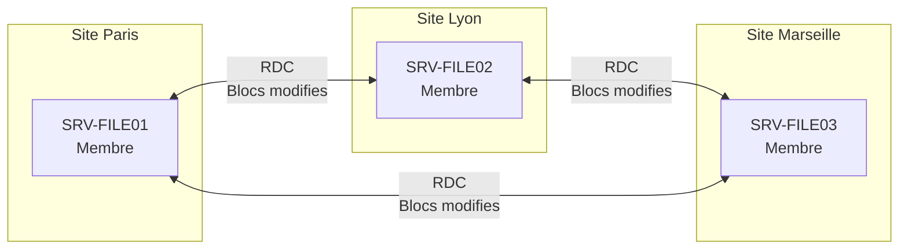
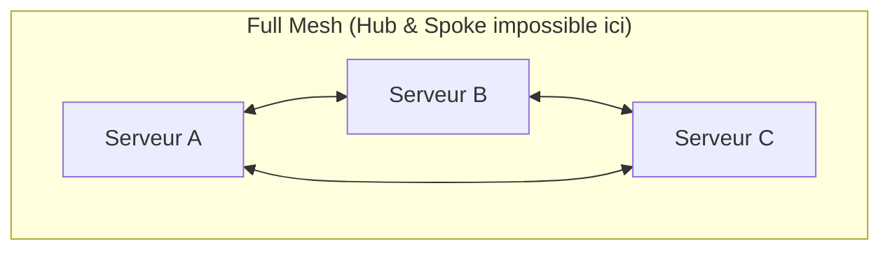
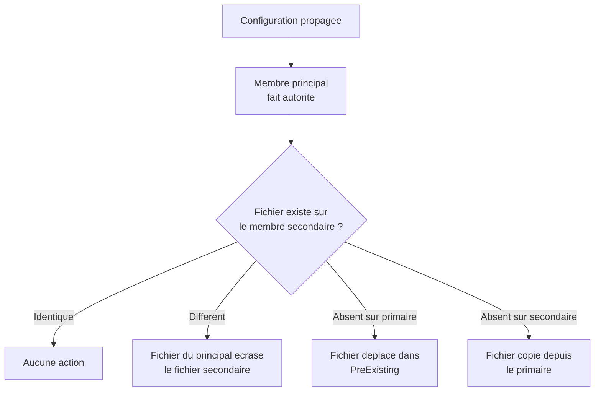
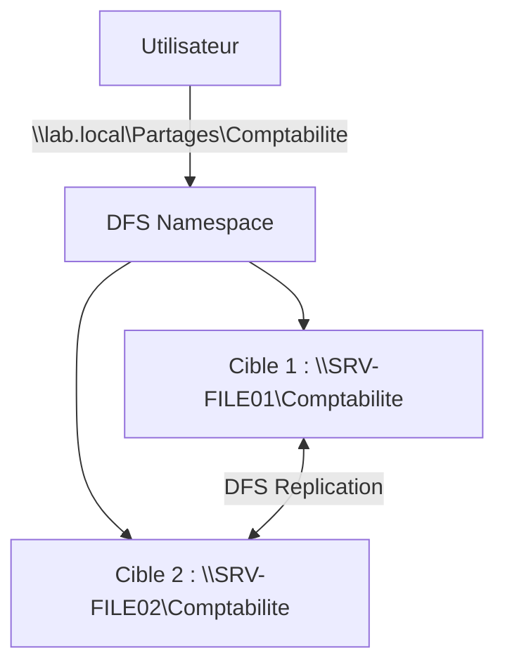

# DFS Replication

<span class="level-intermediate">Intermediaire</span> · Temps estime : 30 minutes

## Qu'est-ce que DFS Replication ?

!!! example "Analogie"

    Imaginez deux collegues travaillant sur le meme dossier papier, chacun dans un bureau different. DFS Replication agit comme un **coursier intelligent** : au lieu de photocopier tout le dossier a chaque modification, il ne transmet que les **pages modifiees** (compression differentielle). Si les deux collegues modifient la meme page en meme temps, le coursier garde la version la plus recente et archive l'autre dans un tiroir de secours (dossier ConflictAndDeleted).

DFS Replication (DFS-R) est un moteur de replication multi-maitre qui synchronise des dossiers entre plusieurs serveurs de maniere efficace. Il utilise la compression differetielle a distance (RDC) pour ne transmettre que les blocs modifies des fichiers, minimisant ainsi l'utilisation de la bande passante.



### Cas d'usage principaux

- **Synchronisation des cibles DFS** : maintenir les donnees identiques entre les cibles d'un dossier DFS Namespace
- **Replication SYSVOL** : replique les GPO et scripts de connexion entre controleurs de domaine (remplace FRS)
- **Sites distants** : synchroniser les donnees de reference entre le siege et les succursales
- **Collecte de donnees** : agreger les fichiers de plusieurs sites vers un serveur central

## Concepts fondamentaux

### Groupe de replication (Replication Group)

Un groupe de replication definit :

- Les **membres** : serveurs participant a la replication
- Les **dossiers repliques** : dossiers a synchroniser
- Les **connexions** : liens de replication entre les membres
- La **planification** : horaires et bande passante alloues

### Topologies de replication



| Topologie | Description | Usage |
|-----------|-------------|-------|
| **Hub and Spoke** | Un serveur central (hub) replique vers des serveurs distants (spokes) | Siege + succursales |
| **Full Mesh** | Chaque serveur replique avec tous les autres | Petit nombre de serveurs |
| **Personnalisee** | Connexions definies manuellement | Topologies complexes |

### Compression differentielle a distance (RDC)

La RDC est l'algorithme cle de DFS-R :

1. Le fichier est divise en blocs de taille variable
2. Un hash est calcule pour chaque bloc
3. Seuls les blocs dont le hash differe sont transmis
4. Le fichier est reconstruit a destination avec les blocs locaux + les blocs recus

!!! tip "Efficacite de la RDC"

    Pour un document Office de 10 Mo dont seule une page a change, la RDC peut ne transmettre que quelques Ko au lieu des 10 Mo complets. La RDC est desactivee automatiquement pour les fichiers de moins de 64 Ko (le cout de calcul serait superieur au gain).

### Replication multi-maitre

DFS-R fonctionne en mode **multi-maitre** :

- Les modifications peuvent etre faites sur n'importe quel membre
- Les conflits sont resolus automatiquement (le fichier le plus recent gagne)
- En cas de conflit, le fichier perdant est deplace dans le dossier `ConflictAndDeleted`

!!! warning "Gestion des conflits"

    La replication multi-maitre ne remplace pas un vrai systeme de verrouillage de fichiers. Si deux utilisateurs modifient le meme fichier simultanement sur deux serveurs differents, l'un des deux perdra ses modifications. Privilegiez un serveur principal pour l'edition active.

## Installation

```powershell
# Install the DFS Replication role service
Install-WindowsFeature FS-DFS-Replication -IncludeManagementTools

# Verify installation
Get-WindowsFeature FS-DFS-Replication | Select-Object Name, InstallState
```

Resultat :

```text
Success Restart Needed Exit Code      Feature Result
------- -------------- ---------      --------------
True    No             Success        {DFS Replication}

Name                InstallState
----                ------------
FS-DFS-Replication  Installed
```

## Configurer DFS Replication avec PowerShell

### Creer un groupe de replication

```powershell
# Create a replication group
New-DfsReplicationGroup -GroupName "RG-Partages" |
    New-DfsReplicatedFolder -FolderName "Comptabilite"
```

### Ajouter des membres

```powershell
# Add servers as members of the replication group
Add-DfsrMember -GroupName "RG-Partages" -ComputerName "SRV-FILE01"
Add-DfsrMember -GroupName "RG-Partages" -ComputerName "SRV-FILE02"
```

### Definir les connexions

```powershell
# Create bidirectional connections between members
Add-DfsrConnection -GroupName "RG-Partages" `
    -SourceComputerName "SRV-FILE01" `
    -DestinationComputerName "SRV-FILE02"
```

!!! info "Connexions bidirectionnelles"

    `Add-DfsrConnection` cree automatiquement la connexion dans les deux sens. Une seule commande suffit pour une paire de serveurs.

### Configurer les chemins locaux

```powershell
# Set the local path of the replicated folder on each member
Set-DfsrMembership -GroupName "RG-Partages" `
    -FolderName "Comptabilite" `
    -ComputerName "SRV-FILE01" `
    -ContentPath "D:\Partages\Comptabilite" `
    -PrimaryMember $true

Set-DfsrMembership -GroupName "RG-Partages" `
    -FolderName "Comptabilite" `
    -ComputerName "SRV-FILE02" `
    -ContentPath "D:\Partages\Comptabilite"
```

!!! danger "Membre principal (PrimaryMember)"

    Le **membre principal** est celui dont les donnees font autorite lors de la synchronisation initiale. Les fichiers du membre non-principal qui n'existent pas sur le membre principal seront deplaces dans le dossier `PreExisting`. Choisissez avec soin le serveur qui contient les donnees de reference.

### Propager la configuration

```powershell
# Update the DFSR configuration on all members
Update-DfsrConfigurationFromAD -ComputerName "SRV-FILE01", "SRV-FILE02"
```

## Synchronisation initiale

La synchronisation initiale est le processus le plus critique et le plus long.

### Fonctionnement



### Bonnes pratiques pour la sync initiale

1. **Pre-chargement (pre-seeding)** : copiez les donnees manuellement (robocopy) sur le membre secondaire avant d'activer la replication. DFS-R detectera les fichiers identiques et ne les retransmettra pas.

```powershell
# Pre-seed data to the secondary member using robocopy
robocopy "D:\Partages\Comptabilite" "\\SRV-FILE02\D$\Partages\Comptabilite" /E /COPYALL /R:1 /W:1
```

2. **Surveillez la progression** : la sync initiale peut prendre des heures ou des jours selon le volume de donnees.

```powershell
# Monitor initial sync progress
Get-DfsrBacklog -GroupName "RG-Partages" `
    -FolderName "Comptabilite" `
    -SourceComputerName "SRV-FILE01" `
    -DestinationComputerName "SRV-FILE02" |
    Select-Object FileName, @{N='BacklogCount';E={$_.BacklogFileCount}}

# Quick backlog count
(Get-DfsrBacklog -GroupName "RG-Partages" -FolderName "Comptabilite" `
    -SourceComputerName "SRV-FILE01" `
    -DestinationComputerName "SRV-FILE02").Count
```

Resultat :

```text
FileName              BacklogCount
--------              ------------
Budget_2026.xlsx               1
Rapport_annuel.docx            1

42
```

Le backlog de 42 fichiers indique que 42 fichiers attendent d'etre repliques de SRV-FILE01 vers SRV-FILE02.

## Planification et bande passante

### Limiter la bande passante

```powershell
# Set bandwidth limit to 256 Mbps during business hours
Set-DfsrConnectionSchedule -GroupName "RG-Partages" `
    -SourceComputerName "SRV-FILE01" `
    -DestinationComputerName "SRV-FILE02" `
    -Day Monday, Tuesday, Wednesday, Thursday, Friday `
    -BandwidthDetail 256Mbps `
    -TimeSlotInMinutes 15 `
    -UseUTC $false
```

### Planification par plage horaire

```powershell
# Set a custom schedule: full bandwidth at night, limited during the day
# Business hours (8h-18h): limited to 128 Mbps
Set-DfsrConnectionSchedule -GroupName "RG-Partages" `
    -SourceComputerName "SRV-FILE01" `
    -DestinationComputerName "SRV-FILE02" `
    -Day Monday, Tuesday, Wednesday, Thursday, Friday `
    -BandwidthDetail 128Mbps `
    -TimeSlotInMinutes 15 `
    -UseUTC $false

# Night and weekends: full bandwidth (no limit)
Set-DfsrConnectionSchedule -GroupName "RG-Partages" `
    -SourceComputerName "SRV-FILE01" `
    -DestinationComputerName "SRV-FILE02" `
    -Day Saturday, Sunday `
    -BandwidthDetail Full `
    -TimeSlotInMinutes 15 `
    -UseUTC $false
```

## Zone de staging

Le staging est un cache local utilise par DFS-R pour preparer les fichiers avant de les envoyer ou de les appliquer.

### Fonctionnement

1. Un fichier modifie est d'abord compresse dans le dossier de staging
2. Les blocs compresses sont transmis au(x) partenaire(s) de replication
3. Le partenaire decompresse et applique les modifications

### Dimensionner le staging

La taille par defaut du staging est de **4 Go**. Cette valeur est souvent insuffisante en production.

!!! tip "Regle de dimensionnement"

    Microsoft recommande que la taille du staging soit au moins egale a la **somme des 32 plus gros fichiers** du dossier replique.

```powershell
# Find the sum of the 32 largest files (in GB) for staging calculation
$path = "D:\Partages\Comptabilite"
$topFiles = Get-ChildItem -Path $path -Recurse -File |
    Sort-Object Length -Descending |
    Select-Object -First 32
$stagingSize = ($topFiles | Measure-Object Length -Sum).Sum
Write-Output "Recommended staging size: $([math]::Round($stagingSize/1GB,2)) GB"
```

Resultat :

```text
Recommended staging size: 2.84 GB
```

### Modifier la taille du staging

```powershell
# Set staging quota to 16 GB
Set-DfsrMembership -GroupName "RG-Partages" `
    -FolderName "Comptabilite" `
    -ComputerName "SRV-FILE01" `
    -StagingPathQuotaInMB 16384
```

### Dossier ConflictAndDeleted

Ce dossier stocke les fichiers en conflit et les fichiers supprimes. Sa taille par defaut est de **660 Mo**.

```powershell
# Set ConflictAndDeleted quota to 4 GB
Set-DfsrMembership -GroupName "RG-Partages" `
    -FolderName "Comptabilite" `
    -ComputerName "SRV-FILE01" `
    -ConflictAndDeletedQuotaInMB 4096
```

## Surveillance et depannage

### Verifier l'etat de la replication

```powershell
# Get replication group status
Get-DfsrGroupSchedule -GroupName "RG-Partages"

# Check replication backlog (pending files)
Get-DfsrBacklog -GroupName "RG-Partages" -FolderName "Comptabilite" `
    -SourceComputerName "SRV-FILE01" -DestinationComputerName "SRV-FILE02"

# Generate a DFSR health report
Write-DfsrHealthReport -GroupName "RG-Partages" `
    -ReferenceComputerName "SRV-FILE01" `
    -Path "C:\Reports"
```

Resultat :

```text
GroupName               : RG-Partages
BandwidthLevel          : Full
ScheduleType            : UseGroupSchedule

Sending Member  Receiving Member Files      Size
--------------  ---------------- -----      ----
SRV-FILE01      SRV-FILE02       3          1.24 MB

Report generated: C:\Reports\RG-Partages-health-20260220.html
```

### Rapports de diagnostic

```powershell
# Generate a diagnostic report (HTML)
dfsrdiag.exe ReplicationState

# Propagation test: create a test file and verify replication
dfsrdiag.exe PropagationTest /RGName:"RG-Partages" `
    /RFName:"Comptabilite" /SendMember:"SRV-FILE01"
```

### Journaux d'evenements

Les evenements DFS-R sont enregistres dans :

- **Event Viewer** > **Applications and Services Logs** > **DFS Replication**

| Event ID | Signification |
|:--------:|---------------|
| 4012 | Synchronisation initiale terminee |
| 4104 | Replication arretee (manque d'espace disque ou staging) |
| 4302 | Fichier supprime du staging (quota atteint) |
| 4412 | Quota de staging atteint, les fichiers sont supprimes du staging |
| 5002 | Connexion de replication non disponible |
| 5014 | Configuration actualisee depuis AD |

### Problemes courants

| Symptome | Cause probable | Solution |
|----------|---------------|----------|
| Backlog qui ne diminue pas | Bande passante insuffisante ou staging trop petit | Augmenter la bande passante et le staging |
| Fichiers manquants apres sync initiale | Fichiers dans `PreExisting` | Verifier le membre principal |
| Erreur 4104 (replication arretee) | Espace disque insuffisant | Liberer de l'espace sur le volume |
| Conflit frequent | Modifications simultanees sur plusieurs serveurs | Definir un serveur principal d'edition |
| Replication lente | RDC desactivee ou staging sous-dimensionne | Verifier RDC et augmenter le staging |

## Integration avec DFS Namespaces

DFS Replication s'integre naturellement avec DFS Namespaces pour offrir haute disponibilite et transparence :



L'utilisateur accede au namespace DFS, est oriente vers la cible la plus proche, et DFS-R assure que les deux cibles contiennent les memes donnees.

## Points cles a retenir

- **DFS-R** synchronise des dossiers entre serveurs avec la compression differentielle (RDC)
- La replication est **multi-maitre** : les modifications sont acceptees sur tous les membres
- La **synchronisation initiale** est critique : utilisez le pre-seeding (robocopy) pour les grands volumes
- Le **membre principal** fait autorite lors de la premiere synchronisation
- Le **staging** doit etre dimensionne correctement (somme des 32 plus gros fichiers minimum)
- La **bande passante** peut etre limitee par plage horaire pour eviter la saturation du reseau
- Les **conflits** sont resolus par horodatage (le fichier le plus recent gagne)
- Surveillez le **backlog** avec `Get-DfsrBacklog` pour verifier que la replication suit

!!! example "Scenario pratique"

    **Contexte :** Lucas, administrateur dans un cabinet d'architectes, constate que la replication DFS-R entre le siege (SRV-FILE01) et la succursale (SRV-FILE02) est bloquee depuis 2 jours. Les utilisateurs de la succursale se plaignent de fichiers obsoletes.

    **Diagnostic :**

    ```powershell
    # Check the replication backlog
    (Get-DfsrBacklog -GroupName "RG-Partages" -FolderName "Projets" `
        -SourceComputerName "SRV-FILE01" `
        -DestinationComputerName "SRV-FILE02").Count
    ```

    Resultat :

    ```text
    15847
    ```

    Le backlog est enorme. Lucas verifie les evenements :

    ```powershell
    # Check recent DFSR events
    Get-WinEvent -LogName "DFS Replication" -MaxEvents 10 |
        Select-Object TimeCreated, Id, Message | Format-Table -Wrap
    ```

    Resultat :

    ```text
    TimeCreated           Id Message
    -----------           -- -------
    2026-02-18 14:32:10 4412 The DFS Replication service detected that the staging
                              space in use for the replicated folder Projets is above
                              the high watermark. The service will attempt to delete
                              the oldest staging files...
    ```

    **Solution :** Le staging est sous-dimensionne. Les gros fichiers AutoCAD (.dwg) saturent le staging.

    ```powershell
    # Calculate the right staging size
    $topFiles = Get-ChildItem -Path "D:\Partages\Projets" -Recurse -File |
        Sort-Object Length -Descending | Select-Object -First 32
    $stagingSize = ($topFiles | Measure-Object Length -Sum).Sum
    Write-Output "Recommended: $([math]::Round($stagingSize/1GB,2)) GB"

    # Increase staging quota to 32 GB
    Set-DfsrMembership -GroupName "RG-Partages" `
        -FolderName "Projets" -ComputerName "SRV-FILE01" `
        -StagingPathQuotaInMB 32768

    Set-DfsrMembership -GroupName "RG-Partages" `
        -FolderName "Projets" -ComputerName "SRV-FILE02" `
        -StagingPathQuotaInMB 32768
    ```

    Apres augmentation du staging, le backlog commence a diminuer et la replication reprend normalement en quelques heures.

!!! danger "Erreurs courantes"

    1. **Choisir le mauvais membre principal** : le membre principal fait autorite lors de la synchronisation initiale. Si vous designez un serveur vide comme principal, les fichiers du serveur secondaire seront deplaces dans `PreExisting` et sembleront avoir disparu.

    2. **Sous-dimensionner le staging** : la taille par defaut de 4 Go est insuffisante pour la plupart des environnements de production. Le staging sature entraine un ralentissement severe de la replication. Calculez la taille avec la somme des 32 plus gros fichiers.

    3. **Modifier le meme fichier sur deux serveurs simultanement** : DFS-R est multi-maitre, mais la resolution de conflits signifie qu'une des modifications sera perdue. Etablissez une convention : un seul site modifie activement les fichiers.

    4. **Oublier le pre-seeding pour les grands volumes** : sans pre-seeding (robocopy), la synchronisation initiale de plusieurs teraoctets peut prendre des jours, voire des semaines, en saturant le lien WAN. Copiez les donnees via un support physique ou un transfert hors heures.

    5. **Ne pas surveiller le backlog regulierement** : un backlog qui ne diminue jamais indique un probleme de bande passante, de staging ou de connectivite. Mettez en place un script de surveillance automatique avec `Get-DfsrBacklog` et des alertes par e-mail.

## Pour aller plus loin

- [DFS Namespaces](dfs-namespaces.md)
- [Permissions de partage](../partage/permissions-partage.md)
- [BranchCache](../partage/branchcache.md)
