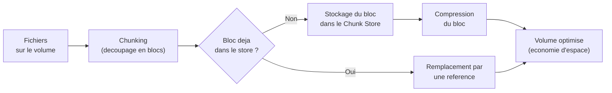

<!--
  Copyright 2026 Julien Bombled

  Licensed under the Apache License, Version 2.0 (the "License");
  you may not use this file except in compliance with the License.
  You may obtain a copy of the License at

      http://www.apache.org/licenses/LICENSE-2.0

  Unless required by applicable law or agreed to in writing, software
  distributed under the License is distributed on an "AS IS" BASIS,
  WITHOUT WARRANTIES OR CONDITIONS OF ANY KIND, either express or implied.
  See the License for the specific language governing permissions and
  limitations under the License.
-->

# Deduplication des donnees

<span class="level-intermediate">Intermediaire</span> · Temps estime : 25 minutes

## Introduction

La **deduplication des donnees** (Data Deduplication) est une fonctionnalite de Windows Server qui identifie et elimine les donnees dupliquees sur un volume NTFS. Plutot que de stocker plusieurs copies identiques d'un meme bloc de donnees, le systeme conserve une seule copie et remplace les doublons par des pointeurs (references).

!!! example "Analogie"

    Imaginez une **bibliotheque partagee** dans un immeuble de bureaux. Au lieu que chaque employe achete son propre exemplaire du meme livre de reference, la bibliotheque conserve **un seul exemplaire** et chaque employe dispose d'une **fiche de pret** (reference) pointant vers ce livre. Le resultat : 50 employes ont acces au meme contenu, mais l'espace de rangement necessaire est divise par 50. La deduplication fonctionne exactement ainsi : un seul bloc de donnees est stocke, et toutes les copies identiques sont remplacees par des references vers ce bloc unique.

## Fonctionnement technique

### Processus de deduplication

La deduplication Windows Server fonctionne en **post-traitement** (post-process) : les fichiers sont d'abord ecrits normalement sur le volume, puis un travail planifie les optimise.



Les etapes cles :

1. **Chunking** : les fichiers sont decoupes en blocs de taille variable (32 a 128 Ko)
2. **Hachage** : chaque bloc recoit un hash unique pour identification
3. **Deduplication** : les blocs identiques sont remplaces par des references
4. **Compression** : les blocs uniques sont compresses dans le Chunk Store

!!! info "Post-traitement"

    La deduplication ne s'execute pas en temps reel. Les fichiers recemment crees ou modifies restent intacts jusqu'au prochain cycle d'optimisation. Par defaut, seuls les fichiers de plus de 3 jours sont traites (parametre `MinimumFileAge`).

### Charges de travail supportees

| Type de charge | Description | Taux d'economies typique |
|---|---|---|
| **General Purpose File Server** | Partages de fichiers, dossiers utilisateurs, dossiers departementaux | 50-70 % |
| **VDI (Virtual Desktop Infrastructure)** | Fichiers VHDX des bureaux virtuels | 80-95 % |
| **Backup** | Cible de sauvegarde Hyper-V (VHDX de sauvegarde) | 60-80 % |

### Charges de travail **non supportees**

!!! warning "Limitations importantes"

    La deduplication n'est **pas adaptee** aux scenarios suivants :

    - **Bases de donnees SQL Server** : les fichiers MDF/LDF ont deja leur propre gestion d'espace ; la deduplication degrade les performances
    - **Bases de donnees Exchange** : meme probleme de performances et d'integrite
    - **Volume systeme (C:)** : la deduplication ne peut pas etre activee sur le volume contenant le systeme d'exploitation
    - **Volumes inferieurs a 32 Go** : taille minimale requise pour activer la deduplication
    - **Fichiers chiffres (EFS)** : les fichiers chiffres ne peuvent pas etre dedupliques

## Installation

### Installer la fonctionnalite

```powershell
# Install the Data Deduplication feature
Install-WindowsFeature FS-Data-Deduplication -IncludeManagementTools
```

Resultat :

```text
Success Restart Needed Exit Code      Feature Result
------- -------------- ---------      --------------
True    No             Success        {Data Deduplication}
```

### Verifier l'installation

```powershell
# Verify the feature is installed
Get-WindowsFeature FS-Data-Deduplication | Format-Table Name, InstallState -AutoSize
```

Resultat :

```text
Name                    InstallState
----                    ------------
FS-Data-Deduplication   Installed
```

## Activer la deduplication sur un volume

### Activation de base

```powershell
# Enable deduplication on volume D: with default usage type
Enable-DedupVolume -Volume "D:" -UsageType Default
```

Resultat :

```text
Enabled            : True
Volume             : D:
VolumeId           : \\?\Volume{12345678-abcd-efgh-ijkl-123456789012}\
UsageType          : Default
MinimumFileAgeDays : 3
```

### Types d'utilisation (UsageType)

| UsageType | Utilisation | Details |
|---|---|---|
| **Default** | Serveur de fichiers generaliste | Optimise pour les fichiers de plus de 3 jours |
| **HyperV** | VDI (bureaux virtuels) | Optimise pour les fichiers VHDX en lecture intensive |
| **Backup** | Cible de sauvegarde | Optimise pour les fichiers de sauvegarde volumineux |

```powershell
# Enable deduplication for a VDI workload
Enable-DedupVolume -Volume "E:" -UsageType HyperV

# Enable deduplication for a backup target
Enable-DedupVolume -Volume "F:" -UsageType Backup
```

## Configuration avancee

### Ajuster les parametres de deduplication

```powershell
# Set minimum file age to 0 days (process immediately)
Set-DedupVolume -Volume "D:" -MinimumFileAgeDays 0

# Set minimum file size to 64 KB (skip very small files)
Set-DedupVolume -Volume "D:" -MinimumFileSize 65536

# Exclude specific folders from deduplication
Set-DedupVolume -Volume "D:" -ExcludeFolder @("D:\Databases", "D:\TempFiles")

# Exclude specific file types
Set-DedupVolume -Volume "D:" -ExcludeFileType @("mp4", "zip", "bak")

# Enable or disable background optimization
Set-DedupVolume -Volume "D:" -OptimizeInUseFiles
```

### Parametres de configuration complets

| Parametre | Valeur par defaut | Description |
|---|---|---|
| `MinimumFileAgeDays` | 3 | Nombre de jours avant optimisation d'un fichier |
| `MinimumFileSize` | 32768 (32 Ko) | Taille minimale des fichiers a dedupliquer |
| `ExcludeFolder` | (aucun) | Dossiers exclus de la deduplication |
| `ExcludeFileType` | (aucun) | Extensions de fichiers exclues |
| `OptimizePartialFiles` | False | Optimiser les fichiers partiellement modifies |
| `NoCompress` | False | Desactiver la compression des blocs |

### Planifier les travaux de deduplication

```powershell
# View current deduplication schedule
Get-DedupSchedule

# Create a custom optimization schedule (nightly at 2 AM)
New-DedupSchedule -Name "NightlyOptimization" `
    -Type Optimization `
    -Start "02:00" `
    -DurationHours 6 `
    -Priority Normal `
    -Memory 50

# Create a weekly garbage collection job (Sunday at 3 AM)
New-DedupSchedule -Name "WeeklyGarbageCollection" `
    -Type GarbageCollection `
    -Start "03:00" `
    -Days Sunday `
    -DurationHours 4 `
    -Priority Normal

# Create a weekly integrity scrubbing job
New-DedupSchedule -Name "WeeklyScrubbing" `
    -Type Scrubbing `
    -Start "04:00" `
    -Days Saturday `
    -DurationHours 3
```

## Supervision et monitoring

### Verifier le statut de la deduplication

```powershell
# Get deduplication status for all volumes
Get-DedupStatus | Format-Table Volume, OptimizedFilesCount,
    @{N='SavedSpaceGB';E={[math]::Round($_.SavedSpace/1GB,2)}},
    OptimizationSavingsRate -AutoSize
```

Resultat :

```text
Volume OptimizedFilesCount SavedSpaceGB OptimizationSavingsRate
------ ------------------- ------------ -----------------------
D:                   45230       823.45                    62 %
E:                   12100       456.78                    87 %
```

### Surveiller les travaux en cours

```powershell
# List active deduplication jobs
Get-DedupJob | Format-Table Volume, Type, State, Progress -AutoSize
```

Resultat :

```text
Volume Type            State   Progress
------ ----            -----   --------
D:     Optimization    Running       45%
```

### Statistiques detaillees d'un volume

```powershell
# Get detailed deduplication volume information
Get-DedupVolume -Volume "D:" | Format-List *
```

Resultat :

```text
Volume              : D:
Enabled             : True
UsageType           : Default
SavedSpace          : 884130529280
SavingsRate         : 62
OptimizedFilesCount : 45230
InPolicyFilesCount  : 48500
InPolicyFilesSize   : 1425789345792
```

### Calculer les economies realisees

```powershell
# Calculate deduplication savings summary
$status = Get-DedupStatus -Volume "D:"
$saved = [math]::Round($status.SavedSpace / 1GB, 2)
$rate = $status.OptimizationSavingsRate
$optimized = $status.OptimizedFilesCount
$total = $status.InPolicyFilesCount

Write-Output "Volume: D:"
Write-Output "Files optimized: $optimized / $total"
Write-Output "Space saved: $saved GB ($rate%)"
```

### Lancer un travail manuellement

```powershell
# Start an optimization job manually
Start-DedupJob -Volume "D:" -Type Optimization -Priority High

# Start a garbage collection to reclaim space from deleted chunks
Start-DedupJob -Volume "D:" -Type GarbageCollection

# Start an integrity scrubbing job
Start-DedupJob -Volume "D:" -Type Scrubbing
```

## Points cles a retenir

- La deduplication est un processus **post-traitement** : les fichiers sont d'abord ecrits normalement puis optimises
- Le taux d'economies depend fortement de la charge de travail : **50-95 %** selon le scenario
- Les fichiers recents (moins de `MinimumFileAgeDays`) ne sont pas traites
- La deduplication est **incompatible** avec les volumes systeme, les bases de donnees et les volumes < 32 Go
- Le **Garbage Collection** est essentiel pour recuperer l'espace des blocs orphelins

!!! example "Scenario pratique"

    **Contexte :** Laura, administratrice dans un cabinet d'architecture, gere un serveur de fichiers (SRV-FILES) avec un volume D: de 2 To hebergeant les plans et documents du cabinet. Elle constate que le volume est utilise a 85 % (1,7 To) et que de nombreux fichiers sont dupliques entre les dossiers des differents projets. Environ 60 % des donnees sont des doublons.

    **Objectif :** Activer la deduplication pour recuperer de l'espace sans acheter de nouveaux disques.

    **Mise en oeuvre :**

    ```powershell
    # Install the deduplication feature
    Install-WindowsFeature FS-Data-Deduplication -IncludeManagementTools

    # Enable deduplication on the file share volume
    Enable-DedupVolume -Volume "D:" -UsageType Default

    # Set minimum file age to 1 day (aggressive but safe for file shares)
    Set-DedupVolume -Volume "D:" -MinimumFileAgeDays 1

    # Exclude temporary folders and video archives
    Set-DedupVolume -Volume "D:" -ExcludeFolder @("D:\Temp", "D:\Archives-Video")
    Set-DedupVolume -Volume "D:" -ExcludeFileType @("mp4", "avi", "mkv")

    # Start the first optimization manually
    Start-DedupJob -Volume "D:" -Type Optimization -Priority High -Memory 50
    ```

    **Verification apres le premier cycle :**

    ```powershell
    # Check deduplication results
    Get-DedupStatus -Volume "D:" | Format-List Volume, OptimizedFilesCount,
        @{N='SavedSpaceGB';E={[math]::Round($_.SavedSpace/1GB,2)}},
        OptimizationSavingsRate
    ```

??? success "Resultat attendu"

    ```text
    Volume                  : D:
    OptimizedFilesCount     : 38450
    SavedSpaceGB            : 952.30
    OptimizationSavingsRate : 56 %
    ```

    Laura recupere environ 950 Go d'espace disque. Le volume passe de 85 % a 37 % d'utilisation, repoussant significativement l'achat de stockage supplementaire. Les utilisateurs ne constatent aucune difference dans l'acces aux fichiers.

## Erreurs courantes

!!! failure "Erreur 1 : Activer la deduplication sur le volume systeme"

    La deduplication ne peut pas etre activee sur le volume C: contenant le systeme d'exploitation. La commande `Enable-DedupVolume -Volume "C:"` echoue avec un message d'erreur. La deduplication est concue pour les volumes de donnees uniquement. Deplacez les donnees a dedupliquer sur un volume secondaire.

!!! failure "Erreur 2 : Consommation CPU elevee pendant la fenetre d'optimisation"

    Le travail d'optimisation peut consommer des ressources importantes si le parametre `-Memory` n'est pas limite. Configurez les travaux planifies avec un pourcentage memoire raisonnable (`-Memory 50`) et executez-les en dehors des heures de production. Utilisez `-Priority Low` pour reduire l'impact sur les performances.

!!! failure "Erreur 3 : Utiliser un type d'utilisation incompatible avec la charge de travail"

    Activer `UsageType HyperV` sur un serveur de fichiers generaliste, ou `UsageType Default` sur un serveur VDI, degrade les performances. Chaque type ajuste les algorithmes de chunking et de compression pour sa charge de travail specifique. Verifiez la charge de travail reelle avec `Get-DedupVolume` et changez le type si necessaire avec `Set-DedupVolume -Volume "D:" -UsageType`.

!!! failure "Erreur 4 : Tenter d'activer la deduplication sur un volume inferieur a 32 Go"

    La deduplication requiert un volume d'au moins 32 Go. Sur un volume plus petit, la commande `Enable-DedupVolume` echoue. L'overhead du Chunk Store et des metadonnees ne justifie pas la deduplication sur de petits volumes. Regroupez les donnees sur un volume plus grand si necessaire.

!!! failure "Erreur 5 : Garbage Collection non execute et espace disque non recupere"

    Apres suppression de fichiers dedupliques, l'espace n'est pas immediatement libere. Les blocs orphelins restent dans le Chunk Store jusqu'a l'execution du travail Garbage Collection. Si ce travail n'est pas planifie, l'espace ne sera jamais recupere. Verifiez la planification avec `Get-DedupSchedule` et ajoutez un travail hebdomadaire de type `GarbageCollection`.

## Pour aller plus loin

- [Types de disques](types-de-disques.md)
- [Volumes et partitions](volumes-et-partitions.md)
- [Permissions NTFS](../partage/permissions-ntfs.md)
- [Storage Spaces : concepts](../storage-spaces/concepts.md)
