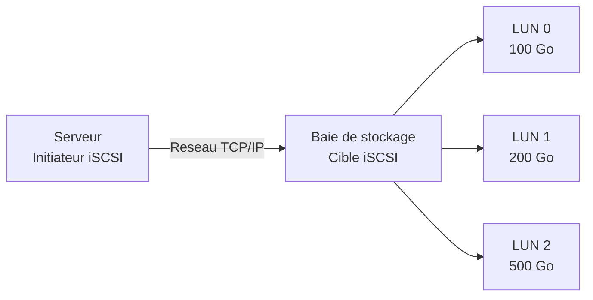
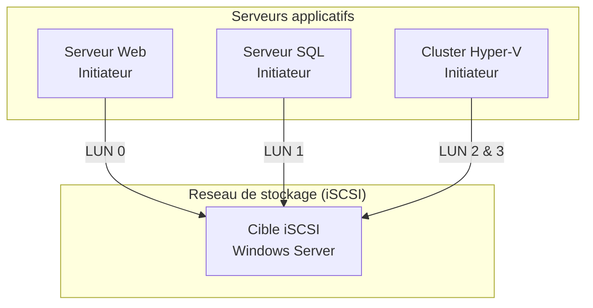
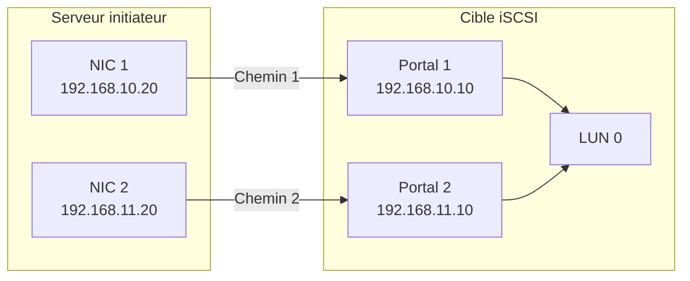

<!--
  Copyright 2026 Julien Bombled

  Licensed under the Apache License, Version 2.0 (the "License");
  you may not use this file except in compliance with the License.
  You may obtain a copy of the License at

      http://www.apache.org/licenses/LICENSE-2.0

  Unless required by applicable law or agreed to in writing, software
  distributed under the License is distributed on an "AS IS" BASIS,
  WITHOUT WARRANTIES OR CONDITIONS OF ANY KIND, either express or implied.
  See the License for the specific language governing permissions and
  limitations under the License.
-->
---
title: iSCSI
description: Comprendre et configurer le stockage iSCSI sous Windows Server 2022 - initiateur, cible, IQN, LUN et MPIO.
tags:
  - stockage
  - disques
  - iscsi
  - intermediaire
---

# iSCSI

<span class="level-intermediate">Intermediaire</span> · Temps estime : 35 minutes

## Concepts fondamentaux

### Qu'est-ce que iSCSI ?

!!! example "Analogie"

    Imaginez un entrepot de stockage situe de l'autre cote de la ville. Normalement, pour acceder a vos cartons, il faudrait vous deplacer physiquement. iSCSI, c'est comme un **service de livraison express** qui amene les cartons directement a votre bureau. Pour vous, tout se passe comme si l'entrepot etait juste a cote : vous ouvrez, lisez et rangez vos cartons normalement, mais ils transitent par la route (le reseau TCP/IP).

iSCSI (Internet Small Computer Systems Interface) est un protocole qui encapsule des commandes SCSI dans des paquets TCP/IP. Il permet d'acceder a du stockage distant via le reseau Ethernet standard, comme si les disques etaient connectes localement.



### Terminologie cle

| Terme | Description |
|-------|-------------|
| **Initiateur** (Initiator) | Le client qui accede au stockage distant. Composant logiciel ou carte HBA dediee. |
| **Cible** (Target) | Le serveur qui expose le stockage. Peut etre un SAN, un NAS ou un serveur Windows. |
| **IQN** (iSCSI Qualified Name) | Identifiant unique et mondial d'un noeud iSCSI (format : `iqn.yyyy-mm.com.domaine:nom`) |
| **LUN** (Logical Unit Number) | Numero logique identifiant un disque virtuel expose par la cible |
| **Portail** (Portal) | Adresse IP et port TCP (par defaut 3260) de la cible |
| **Session** | Connexion etablie entre un initiateur et une cible |
| **CHAP** | Challenge Handshake Authentication Protocol, pour l'authentification |
| **MPIO** | Multipath I/O, pour la redundance et l'equilibrage de charge reseau |

### Architecture typique



!!! tip "Reseau dedie"

    En production, isolez le trafic iSCSI sur un VLAN ou un reseau physique dedie pour eviter la contention avec le trafic applicatif. Utilisez des trames Jumbo (MTU 9000) pour de meilleures performances.

## Configurer une cible iSCSI (iSCSI Target)

Le role **iSCSI Target Server** transforme un serveur Windows en cible de stockage.

### Installer le role

```powershell
# Install the iSCSI Target Server role
Install-WindowsFeature FS-iSCSITarget-Server -IncludeManagementTools
```

Resultat :

```text
Success Restart Needed Exit Code      Feature Result
------- -------------- ---------      --------------
True    No             NoChangeNeeded {iSCSI Target Server, iSCSI Target...}
```

### Creer un disque virtuel iSCSI

Un disque virtuel iSCSI est un fichier VHDX stocke sur le serveur cible :

```powershell
# Create a 100 GB iSCSI virtual disk (thin provisioned by default)
New-IscsiVirtualDisk -Path "E:\iSCSIDisks\SQL-Data.vhdx" -SizeBytes 100GB
```

Options de provisioning :

```powershell
# Fixed size (pre-allocated, better performance)
New-IscsiVirtualDisk -Path "E:\iSCSIDisks\SQL-Data.vhdx" -SizeBytes 100GB -UseFixed

# Dynamic (thin provisioned, saves space)
New-IscsiVirtualDisk -Path "E:\iSCSIDisks\SQL-Logs.vhdx" -SizeBytes 50GB
```

### Creer une cible iSCSI

La cible definit quels initiateurs sont autorises a se connecter :

```powershell
# Create an iSCSI target allowing a specific initiator by IQN
New-IscsiServerTarget -TargetName "SQL-Target" `
    -InitiatorIds @("IQN:iqn.1991-05.com.microsoft:srv-sql.lab.local")
```

Autoriser un initiateur par adresse IP :

```powershell
# Allow connection by IP address
New-IscsiServerTarget -TargetName "HyperV-Target" `
    -InitiatorIds @("IPAddress:192.168.10.20", "IPAddress:192.168.10.21")
```

### Assigner un disque virtuel a une cible

```powershell
# Map the virtual disk to the target (assigns LUN automatically)
Add-IscsiVirtualDiskTargetMapping -TargetName "SQL-Target" `
    -Path "E:\iSCSIDisks\SQL-Data.vhdx"

# Map with a specific LUN number
Add-IscsiVirtualDiskTargetMapping -TargetName "SQL-Target" `
    -Path "E:\iSCSIDisks\SQL-Logs.vhdx" -Lun 1
```

### Verifier la configuration de la cible

```powershell
# List all iSCSI targets
Get-IscsiServerTarget | Format-Table TargetName, Status, InitiatorIds -AutoSize

# List all iSCSI virtual disks
Get-IscsiVirtualDisk | Format-Table Path,
    @{N='SizeGB';E={[math]::Round($_.Size/1GB,2)}},
    Status -AutoSize

# List target-to-disk mappings
Get-IscsiVirtualDiskTargetMapping | Format-Table TargetName, Path, Lun -AutoSize
```

Resultat :

```text
TargetName   Status InitiatorIds
----------   ------ ------------
SQL-Target   Online {IQN:iqn.1991-05.com.microsoft:srv-sql.lab.local}
HyperV-Target Online {IPAddress:10.0.0.20, IPAddress:10.0.0.21}

Path                                SizeGB Status
----                                ------ ------
E:\iSCSIDisks\SQL-Data.vhdx        100.00 NotConnected
E:\iSCSIDisks\SQL-Logs.vhdx         50.00 NotConnected

TargetName   Path                             Lun
----------   ----                             ---
SQL-Target   E:\iSCSIDisks\SQL-Data.vhdx        0
SQL-Target   E:\iSCSIDisks\SQL-Logs.vhdx        1
```

## Configurer l'initiateur iSCSI

L'initiateur iSCSI est le composant cote client qui se connecte a la cible.

### Demarrer le service Initiateur

```powershell
# Start and enable the iSCSI Initiator service
Set-Service -Name MSiSCSI -StartupType Automatic
Start-Service MSiSCSI

# Verify the service is running
Get-Service MSiSCSI | Select-Object Name, Status, StartType
```

Resultat :

```text
Name    Status  StartType
----    ------  ---------
MSiSCSI Running Automatic
```

### Decouvrir une cible

```powershell
# Discover targets on the portal (IP of the target server)
New-IscsiTargetPortal -TargetPortalAddress 192.168.10.10

# List discovered targets
Get-IscsiTarget | Format-Table NodeAddress, IsConnected -AutoSize
```

Resultat :

```text
NodeAddress                                          IsConnected
-----------                                          -----------
iqn.1991-05.com.microsoft:srv-stor-sql-target        False
```

### Se connecter a une cible

```powershell
# Connect to the target (non-persistent, lost after reboot)
Connect-IscsiTarget -NodeAddress "iqn.1991-05.com.microsoft:srv-stor-sql-target"

# Connect with persistence (reconnects automatically after reboot)
Connect-IscsiTarget -NodeAddress "iqn.1991-05.com.microsoft:srv-stor-sql-target" `
    -IsPersistent $true
```

### Connexion avec authentification CHAP

```powershell
# Connect with CHAP authentication
Connect-IscsiTarget -NodeAddress "iqn.1991-05.com.microsoft:srv-stor-sql-target" `
    -AuthenticationType ONEWAYCHAP `
    -ChapUsername "sql-server" `
    -ChapSecret "P@ssw0rdCH@P123!" `
    -IsPersistent $true
```

!!! warning "Securite CHAP"

    CHAP fournit une authentification basique mais transmet le secret en clair a travers le reseau. Pour une securite accrue, combinez CHAP avec IPSec ou isolez le trafic iSCSI sur un reseau dedie.

### Verifier la connexion et utiliser le disque

Une fois connecte, le LUN distant apparait comme un disque local :

```powershell
# List iSCSI sessions
Get-IscsiSession | Format-Table InitiatorNodeAddress, TargetNodeAddress,
    IsConnected, IsPersistent -AutoSize

# The new disk appears as a local disk
Get-Disk | Where-Object { $_.BusType -eq "iSCSI" } |
    Format-Table Number, FriendlyName,
        @{N='SizeGB';E={[math]::Round($_.Size/1GB,2)}},
        OperationalStatus -AutoSize

# Initialize, partition, and format the iSCSI disk
$disk = Get-Disk | Where-Object { $_.BusType -eq "iSCSI" -and $_.PartitionStyle -eq "RAW" }
$disk | Initialize-Disk -PartitionStyle GPT -PassThru |
    New-Partition -UseMaximumSize -AssignDriveLetter |
    Format-Volume -FileSystem NTFS -NewFileSystemLabel "SQL-Data" -Confirm:$false
```

Resultat :

```text
InitiatorNodeAddress                            TargetNodeAddress                             IsConnected IsPersistent
--------------------                            -----------------                             ----------- ------------
iqn.1991-05.com.microsoft:srv-sql.lab.local     iqn.1991-05.com.microsoft:srv-stor-sql-target        True         True

Number FriendlyName           SizeGB OperationalStatus
------ ------------           ------ -----------------
     2 MSFT Virtual HD        100.00 Online

DriveLetter FileSystemLabel FileSystem DriveType HealthStatus SizeRemaining    Size
----------- --------------- ---------- --------- ------------ -------------    ----
F           SQL-Data        NTFS       Fixed     Healthy         99.87 GB   99.97 GB
```

### Se deconnecter d'une cible

```powershell
# Disconnect from a target
Disconnect-IscsiTarget -NodeAddress "iqn.1991-05.com.microsoft:srv-stor-sql-target" -Confirm:$false

# Remove the target portal
Remove-IscsiTargetPortal -TargetPortalAddress 192.168.10.10 -Confirm:$false
```

## MPIO (Multipath I/O)

!!! example "Analogie"

    MPIO, c'est comme avoir **deux routes distinctes** pour aller de votre maison a votre bureau. Si un accident bloque la route principale, vous prenez l'autre sans interruption. Mieux encore, aux heures creuses, vous pouvez utiliser les deux routes en meme temps pour transporter plus de marchandises (equilibrage de charge).

MPIO permet d'utiliser plusieurs chemins reseau vers une meme cible iSCSI, assurant la redundance et l'equilibrage de charge.

### Architecture MPIO



### Installer et configurer MPIO

```powershell
# Install the Multipath I/O feature
Install-WindowsFeature Multipath-IO -IncludeManagementTools

# A reboot is required after installation
Restart-Computer -Force
```

Resultat :

```text
Success Restart Needed Exit Code      Feature Result
------- -------------- ---------      --------------
True    Yes            SuccessRest... {Multipath I/O}
```

Apres le redemarrage :

```powershell
# Add iSCSI support to MPIO
Enable-MSDSMAutomaticClaim -BusType iSCSI

# A second reboot may be required
Restart-Computer -Force
```

### Configurer les chemins multiples

```powershell
# Connect to the target via the first path
Connect-IscsiTarget -NodeAddress "iqn.1991-05.com.microsoft:srv-stor-sql-target" `
    -TargetPortalAddress 192.168.10.10 `
    -InitiatorPortalAddress 192.168.10.20 `
    -IsMultipathEnabled $true `
    -IsPersistent $true

# Connect via the second path
Connect-IscsiTarget -NodeAddress "iqn.1991-05.com.microsoft:srv-stor-sql-target" `
    -TargetPortalAddress 192.168.11.10 `
    -InitiatorPortalAddress 192.168.11.20 `
    -IsMultipathEnabled $true `
    -IsPersistent $true
```

### Politiques d'equilibrage de charge

```powershell
# View current MPIO load balance policy
Get-MSDSMGlobalDefaultLoadBalancePolicy

# Set Round Robin policy (recommended for iSCSI)
Set-MSDSMGlobalDefaultLoadBalancePolicy -Policy RR
```

Politiques disponibles :

| Politique | Description |
|-----------|-------------|
| **FOO** (Fail Over Only) | Un chemin actif, les autres en standby |
| **RR** (Round Robin) | Alternance entre les chemins (recommande) |
| **LQD** (Least Queue Depth) | Chemin avec le moins de requetes en attente |
| **WP** (Weighted Paths) | Poids attribue a chaque chemin |

### Verifier MPIO

```powershell
# Check MPIO configuration
Get-MPIOSetting

# List MPIO disks and their paths
Get-MSDSMSupportedHW | Format-Table VendorId, ProductId -AutoSize

# Verify paths for a specific disk (via Disk Management or mpclaim)
mpclaim -s -d
```

## Bonnes pratiques en production

### Reseau

- Dedie un VLAN ou un reseau physique au trafic iSCSI
- Activez les trames Jumbo (MTU 9000) sur les cartes reseau iSCSI
- Utilisez MPIO avec au minimum deux chemins physiques independants
- Desactivez le mode veille des cartes reseau iSCSI

### Securite

- Activez l'authentification CHAP ou CHAP mutuel
- Combinez avec IPSec si le reseau n'est pas physiquement isole
- Limitez l'acces aux cibles par IQN plutot que par adresse IP

### Performances

```powershell
# Disable power management on iSCSI network adapters
Get-NetAdapter | Where-Object { $_.Name -like "*iSCSI*" } |
    ForEach-Object {
        Set-NetAdapterPowerManagement -Name $_.Name -WakeOnMagicPacket Disabled
    }

# Set Jumbo Frames on iSCSI adapters
Set-NetAdapterAdvancedProperty -Name "iSCSI-NIC1" `
    -RegistryKeyword "*JumboPacket" -RegistryValue 9014
```

## Points cles a retenir

- **iSCSI** transporte des commandes SCSI sur TCP/IP, permettant l'acces a du stockage distant via Ethernet
- Le role **iSCSI Target Server** transforme un serveur Windows en baie de stockage
- L'**initiateur** se connecte aux cibles ; les LUN distants apparaissent comme des disques locaux
- Les connexions **persistantes** (`-IsPersistent $true`) survivent aux redemarrages
- **MPIO** assure la redundance et l'equilibrage de charge avec plusieurs chemins reseau
- En production, isolez le trafic iSCSI sur un reseau dedie avec trames Jumbo
- Utilisez **CHAP** pour l'authentification et **IPSec** pour le chiffrement

!!! example "Scenario pratique"

    **Contexte :** Marc, administrateur dans une entreprise de logistique, configure un nouveau serveur SQL (SRV-SQL, 10.0.0.20) qui doit acceder a du stockage iSCSI heberge sur SRV-STOR (10.0.0.10). Apres avoir configure la cible et l'initiateur, il constate que le disque iSCSI n'apparait pas dans Windows.

    **Diagnostic :**

    ```powershell
    # Check if the iSCSI initiator service is running
    Get-Service MSiSCSI | Select-Object Name, Status, StartType
    ```

    Resultat :

    ```text
    Name    Status  StartType
    ----    ------  ---------
    MSiSCSI Stopped  Manual
    ```

    Le service n'est pas demarre et n'est pas configure en demarrage automatique.

    **Solution :**

    ```powershell
    # Start and configure the service
    Set-Service -Name MSiSCSI -StartupType Automatic
    Start-Service MSiSCSI

    # Discover and connect to the target
    New-IscsiTargetPortal -TargetPortalAddress 10.0.0.10
    $target = Get-IscsiTarget
    Connect-IscsiTarget -NodeAddress $target.NodeAddress -IsPersistent $true

    # Verify the disk appears
    Get-Disk | Where-Object { $_.BusType -eq "iSCSI" } |
        Format-Table Number, FriendlyName,
            @{N='SizeGB';E={[math]::Round($_.Size/1GB,2)}},
            OperationalStatus -AutoSize
    ```

    Resultat :

    ```text
    Number FriendlyName    SizeGB OperationalStatus
    ------ ------------    ------ -----------------
         2 MSFT Virtual HD 100.00 Online
    ```

    Le disque iSCSI apparait maintenant. Marc l'initialise en GPT, le partitionne et le formate pour SQL Server avec une taille d'allocation de 64 Ko.

!!! danger "Erreurs courantes"

    1. **Oublier de demarrer le service MSiSCSI** : le service de l'initiateur iSCSI est en demarrage manuel par defaut. Sans `Set-Service -StartupType Automatic`, la connexion sera perdue apres chaque redemarrage.

    2. **Ne pas utiliser `-IsPersistent $true`** : sans persistance, la connexion iSCSI est perdue au redemarrage du serveur. Les volumes deviennent inaccessibles et les applications echouent.

    3. **Melanger trafic iSCSI et trafic applicatif** : le trafic iSCSI sur le meme reseau que les utilisateurs provoque de la contention et des latences. Isolez toujours le trafic iSCSI sur un VLAN ou un reseau physique dedie.

    4. **Ignorer MPIO en production** : un seul chemin reseau constitue un point de defaillance unique. Si le cable ou le switch tombe en panne, le stockage iSCSI est perdu. Configurez toujours MPIO avec au moins deux chemins independants.

    5. **Utiliser des trames standard au lieu de Jumbo Frames** : le MTU par defaut de 1500 octets genere un overhead important pour les transferts volumineux. Activez les trames Jumbo (MTU 9000) sur toute la chaine (NIC, switchs, cible) pour de meilleures performances.

## Pour aller plus loin

- [Types de disques](types-de-disques.md)
- [Volumes et partitions](volumes-et-partitions.md)
- [Storage Spaces : concepts](../storage-spaces/concepts.md)
- [Storage Spaces Direct](../storage-spaces/storage-spaces-direct.md)

