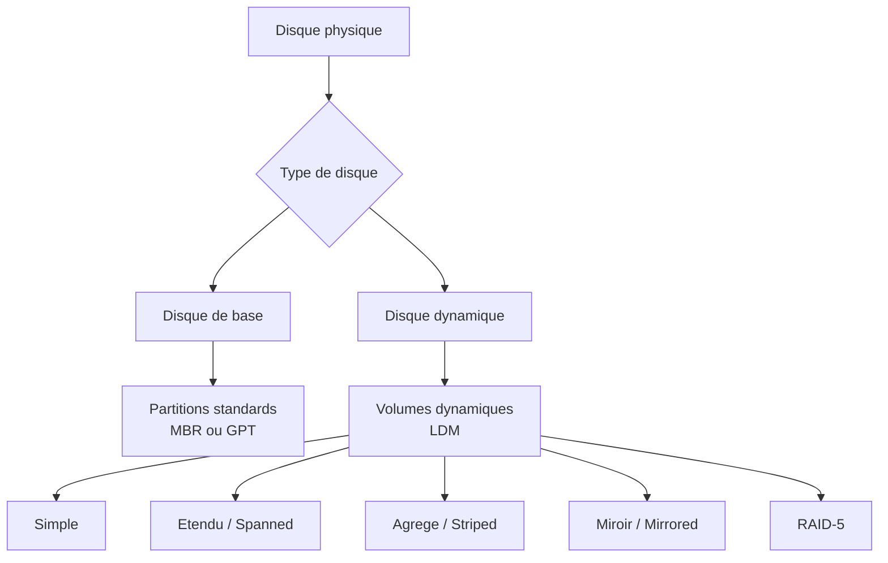

# Types de disques

<span class="level-intermediate">Intermediaire</span> · Temps estime : 25 minutes

## Styles de partition : MBR vs GPT

Le style de partition definit la maniere dont la table de partitions est organisee sur le disque. Windows Server 2022 prend en charge deux styles.

!!! example "Analogie"

    Imaginez un disque dur comme un terrain a batir. Le style de partition (MBR ou GPT) correspond au **plan de lotissement** : il definit comment le terrain est decoupe en parcelles. MBR est un ancien plan qui ne permet que 4 parcelles et un terrain de 2 hectares maximum. GPT est un plan moderne qui autorise 128 parcelles sur un terrain quasi illimite.

### MBR (Master Boot Record)

Le MBR est le format historique, present depuis les annees 1980 :

| Caracteristique | Valeur |
|-----------------|--------|
| Taille max du disque | 2 To |
| Partitions principales | 4 maximum |
| Partitions avec etendue | 3 principales + 1 etendue (lecteurs logiques illimites) |
| Mode de demarrage | BIOS (Legacy) |
| Table de partitions | Un seul exemplaire (debut du disque) |

!!! warning "Limitation critique"

    Un disque MBR ne peut pas adresser l'espace au-dela de 2 To. Sur un disque de 4 To en MBR, 2 To seront inaccessibles.

### GPT (GUID Partition Table)

Le GPT est le standard moderne, requis pour UEFI :

| Caracteristique | Valeur |
|-----------------|--------|
| Taille max du disque | 18 Eo (exaoctets) |
| Partitions principales | 128 par defaut sous Windows |
| Mode de demarrage | UEFI |
| Table de partitions | Deux exemplaires (debut et fin du disque) |
| Identification | GUID unique par partition |

!!! tip "Bonne pratique"

    Pour tout nouveau deploiement Windows Server 2022, privilegiez GPT. Le mode UEFI est desormais la norme et offre un demarrage plus rapide ainsi que Secure Boot.

### Comparaison rapide

| Critere | MBR | GPT |
|---------|:---:|:---:|
| Disques > 2 To | :material-close: | :material-check: |
| UEFI / Secure Boot | :material-close: | :material-check: |
| Redundance de la table | :material-close: | :material-check: |
| Compatibilite anciens OS | :material-check: | Limite |
| Nombre de partitions | 4 (ou 3+1 etendue) | 128 |

### Verifier le style de partition

```powershell
# List disks and their partition style
Get-Disk | Format-Table Number, FriendlyName, PartitionStyle, Size -AutoSize
```

Resultat :

```text
Number FriendlyName       PartitionStyle      Size
------ ------------       --------------      ----
     0 Virtual HD         GPT            127 GB
     1 Virtual HD         RAW             50 GB
```

!!! info "RAW"

    Un disque dont le style est `RAW` n'a pas encore ete initialise. Il faut choisir MBR ou GPT lors de l'initialisation.

### Convertir entre MBR et GPT

!!! danger "Perte de donnees"

    La conversion entre MBR et GPT via `diskpart` ou PowerShell **supprime toutes les donnees** du disque. Sauvegardez avant de proceder.

```powershell
# Initialize a new (RAW) disk as GPT
Initialize-Disk -Number 1 -PartitionStyle GPT

# Convert an existing MBR disk to GPT (all data will be lost)
# First, clean the disk, then re-initialize
Clear-Disk -Number 1 -RemoveData -Confirm:$false
Initialize-Disk -Number 1 -PartitionStyle GPT
```

Resultat :

```text
Number PartitionStyle OperationalStatus
------ -------------- -----------------
     1 GPT            Online
```

Via `diskpart` (methode classique) :

```powershell
# Launch diskpart interactively
diskpart
# Then execute:
#   select disk 1
#   clean
#   convert gpt
```

!!! tip "Conversion sans perte (Windows 10 / Server 2019+)"

    L'outil `mbr2gpt.exe` permet de convertir un disque systeme MBR vers GPT **sans perte de donnees**, a condition que le disque reponde aux prerequis (3 partitions maximum, pas de partitions etendues).

    ```powershell
    # Validate before conversion
    mbr2gpt /validate /disk:0

    # Convert (run from WinPE or with /allowFullOS)
    mbr2gpt /convert /disk:0 /allowFullOS
    ```

## Disques de base vs disques dynamiques

Au-dela du style de partition, Windows distingue deux types de disques selon la facon dont les volumes sont geres.

!!! example "Analogie"

    Pensez au disque de base comme un **appartement avec des cloisons fixes** : chaque piece (partition) est independante et bien definie. Le disque dynamique, c'est un **loft modulable** : vous pouvez abattre des cloisons, fusionner des pieces ou meme etendre une piece sur l'appartement d'a cote. Plus flexible, mais plus difficile a revendre (compatibilite).

### Disque de base (Basic Disk)

C'est le type par defaut a l'initialisation :

- Utilise les partitions standard (principales et etendues pour MBR, principales pour GPT)
- Chaque partition est un volume independant
- Compatible avec tous les systemes d'exploitation
- Gere par la table de partitions MBR ou GPT

### Disque dynamique (Dynamic Disk)

Les disques dynamiques offrent des fonctionnalites avancees au prix de la compatibilite :

- Utilise une base de donnees LDM (Logical Disk Manager) en fin de disque
- Permet la creation de volumes complexes (etendus, agreges, en miroir, RAID-5)
- Non reconnu par les autres OS en dual-boot
- **Deprecie** depuis Windows Server 2012 R2 au profit de Storage Spaces



### Comparaison des types

| Critere | Disque de base | Disque dynamique |
|---------|:--------------:|:----------------:|
| Type par defaut | :material-check: | :material-close: |
| Volumes etendus / agreges | :material-close: | :material-check: |
| Miroir logiciel | :material-close: | :material-check: |
| RAID-5 logiciel | :material-close: | :material-check: |
| Dual-boot compatible | :material-check: | :material-close: |
| Recommande par Microsoft | :material-check: | :material-close: |
| Cluster failover | :material-check: | :material-close: |

!!! warning "Depreciation des disques dynamiques"

    Microsoft recommande d'utiliser **Storage Spaces** au lieu des disques dynamiques pour toutes les fonctionnalites avancees (miroir, parite, etc.). Les disques dynamiques restent fonctionnels mais ne sont plus en developpement actif.

### Convertir en disque dynamique

```powershell
# Check current disk type (OperationalStatus, PartitionStyle)
Get-Disk | Format-Table Number, PartitionStyle, OperationalStatus

# Convert to dynamic disk using diskpart
# NOTE: This is a one-way operation (dynamic -> basic requires data loss)
diskpart
# select disk 1
# convert dynamic
```

Resultat :

```text
Number PartitionStyle OperationalStatus
------ -------------- -----------------
     0 GPT            Online
     1 GPT            Online
```

!!! danger "Attention"

    La conversion de base vers dynamique est possible sans perte de donnees, mais la **conversion inverse** (dynamique vers base) necessite la suppression de tous les volumes du disque.

## Identifier les disques sur le serveur

### Avec PowerShell

```powershell
# Detailed disk inventory
Get-Disk | Select-Object Number, FriendlyName, PartitionStyle,
    @{N='SizeGB';E={[math]::Round($_.Size/1GB,2)}},
    OperationalStatus, HealthStatus |
    Format-Table -AutoSize

# List physical disks with media type (HDD, SSD, etc.)
Get-PhysicalDisk | Select-Object DeviceId, FriendlyName, MediaType,
    @{N='SizeGB';E={[math]::Round($_.Size/1GB,2)}},
    HealthStatus |
    Format-Table -AutoSize
```

Resultat :

```text
Number FriendlyName   PartitionStyle SizeGB OperationalStatus HealthStatus
------ ------------   -------------- ------ ----------------- ------------
     0 Virtual HD     GPT            127.00 Online            Healthy
     1 Virtual HD     GPT             50.00 Online            Healthy
     2 Virtual HD     RAW            100.00 Online            Healthy

DeviceId FriendlyName   MediaType SizeGB HealthStatus
-------- ------------   --------- ------ ------------
0        Virtual HD     Unspecified 127.00 Healthy
1        Virtual HD     Unspecified  50.00 Healthy
2        Virtual HD     Unspecified 100.00 Healthy
```

### Avec la console Gestion des disques

La console `diskmgmt.msc` affiche graphiquement tous les disques, leurs partitions et le style de partition :

```powershell
# Open Disk Management console
diskmgmt.msc
```

## Quand utiliser chaque type

| Scenario | Style | Type |
|----------|-------|------|
| Serveur de production neuf (UEFI) | GPT | Base |
| Disque de donnees > 2 To | GPT | Base |
| Ancien serveur BIOS | MBR | Base |
| Stockage flexible (miroir, parite) | GPT | Base + Storage Spaces |
| Migration depuis un ancien RAID logiciel | - | Dynamique (existant) |

## Points cles a retenir

- **GPT** est le standard moderne : pas de limite de 2 To, 128 partitions, redondance de la table
- **MBR** subsiste uniquement pour la compatibilite avec les anciens systemes BIOS
- Les **disques de base** sont le choix par defaut et recommande pour tous les nouveaux deployments
- Les **disques dynamiques** sont deprecies ; preferez **Storage Spaces** pour les volumes avances
- La conversion MBR vers GPT detruit les donnees sauf avec `mbr2gpt.exe`
- Verifiez toujours le style de partition avec `Get-Disk` avant toute operation

!!! example "Scenario pratique"

    **Contexte :** Thomas, administrateur systeme chez une PME, ajoute un nouveau disque de 4 To a son serveur de fichiers SRV-01. Il initialise le disque en MBR par reflexe. Apres formatage, il ne voit que 2 To d'espace disponible.

    **Diagnostic :**

    ```powershell
    # Check the partition style and reported size
    Get-Disk -Number 2 | Select-Object Number, PartitionStyle,
        @{N='SizeGB';E={[math]::Round($_.Size/1GB,2)}}
    ```

    Resultat :

    ```text
    Number PartitionStyle SizeGB
    ------ -------------- ------
         2 MBR            4096.00
    ```

    Le disque fait bien 4 To, mais MBR ne peut adresser que 2 To.

    **Solution :**

    ```powershell
    # Backup data first, then convert to GPT
    Clear-Disk -Number 2 -RemoveData -Confirm:$false
    Initialize-Disk -Number 2 -PartitionStyle GPT
    New-Partition -DiskNumber 2 -UseMaximumSize -AssignDriveLetter |
        Format-Volume -FileSystem NTFS -NewFileSystemLabel "Donnees" -Confirm:$false
    ```

    Resultat :

    ```text
    DriveLetter FileSystemLabel FileSystem DriveType HealthStatus SizeRemaining    Size
    ----------- --------------- ---------- --------- ------------ -------------    ----
    F           Donnees         NTFS       Fixed     Healthy      3.99 TB          4 TB
    ```

    Thomas retrouve maintenant la totalite des 4 To. La lecon : pour tout disque superieur a 2 To, toujours choisir GPT.

!!! danger "Erreurs courantes"

    1. **Initialiser un disque > 2 To en MBR** : l'espace au-dela de 2 To est perdu. Verifiez toujours la taille du disque avant de choisir le style de partition.

    2. **Convertir MBR/GPT sans sauvegarde** : la conversion via `diskpart` ou `Clear-Disk` supprime toutes les donnees. Seul `mbr2gpt.exe` permet une conversion sans perte, et uniquement pour le disque systeme.

    3. **Convertir un disque en dynamique sans reflexion** : la conversion base vers dynamique est sans retour (sauf perte de donnees). De plus, les disques dynamiques sont deprecies au profit de Storage Spaces.

    4. **Oublier de verifier le mode de demarrage** : un disque GPT ne demarre que sur un systeme UEFI. Avant de convertir le disque systeme, verifiez que le firmware est en UEFI et non en BIOS Legacy.

    5. **Ne pas verifier l'etat de sante des disques** : avant toute operation de partitionnement, executez `Get-PhysicalDisk` pour verifier le `HealthStatus`. Manipuler un disque en etat `Warning` ou `Unhealthy` augmente le risque de perte de donnees.

## Pour aller plus loin

- [Volumes et partitions](volumes-et-partitions.md)
- [iSCSI](iscsi.md)
- [Storage Spaces : concepts](../storage-spaces/concepts.md)
