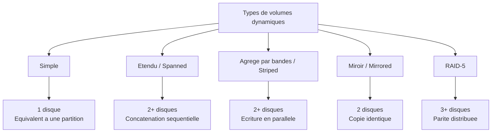

<!--
  Copyright 2026 Julien Bombled

  Licensed under the Apache License, Version 2.0 (the "License");
  you may not use this file except in compliance with the License.
  You may obtain a copy of the License at

      http://www.apache.org/licenses/LICENSE-2.0

  Unless required by applicable law or agreed to in writing, software
  distributed under the License is distributed on an "AS IS" BASIS,
  WITHOUT WARRANTIES OR CONDITIONS OF ANY KIND, either express or implied.
  See the License for the specific language governing permissions and
  limitations under the License.
-->
---
title: Volumes et partitions
description: Creer, redimensionner et gerer les volumes et partitions sous Windows Server 2022 avec PowerShell et la console graphique.
tags:
  - stockage
  - disques
  - intermediaire
---

# Volumes et partitions

<span class="level-intermediate">Intermediaire</span> · Temps estime : 30 minutes

## Concepts fondamentaux

### Partition vs Volume

!!! example "Analogie"

    Imaginez un immeuble de bureaux. La **partition**, c'est la delimitation physique d'un etage (les murs porteurs qui separent les espaces). Le **volume**, c'est le bureau amenage et fonctionnel avec une adresse postale (la lettre de lecteur). Vous ne pouvez pas travailler dans un espace non amenage : de la meme facon, une partition doit etre formatee pour devenir un volume utilisable.

Ces deux termes sont souvent confondus mais designent des notions differentes :

- **Partition** : division logique d'un disque physique, definie dans la table de partitions (MBR ou GPT)
- **Volume** : espace de stockage formate avec un systeme de fichiers, accessible par une lettre de lecteur ou un point de montage

Sur un disque de base, chaque partition correspond generalement a un volume. Sur un disque dynamique, un volume peut s'etendre sur plusieurs disques.

### Systemes de fichiers

| Systeme | Taille max volume | Taille max fichier | Usage |
|---------|:-----------------:|:------------------:|-------|
| NTFS | 256 To | 256 To | Standard pour Windows Server |
| ReFS | 35 Po | 35 Po | Storage Spaces, Hyper-V |
| FAT32 | 32 Go | 4 Go | Cles USB, compatibilite |
| exFAT | 128 Po | 128 Po | Stockage amovible |

!!! tip "NTFS vs ReFS"

    **NTFS** reste le systeme de fichiers principal pour les volumes systeme et les partages de fichiers. **ReFS** (Resilient File System) est optimise pour la resilience des donnees et les grands volumes, mais ne prend pas en charge toutes les fonctionnalites NTFS (compression, quotas de disque, EFS).

## Types de volumes

### Volumes sur disques de base

Sur un disque de base, les volumes correspondent aux partitions :

- **Volume simple** : une partition unique sur un seul disque
- **Volume systeme** : contient le chargeur de demarrage (partition EFI en GPT)
- **Volume de demarrage** : contient le dossier Windows

### Volumes sur disques dynamiques

Les disques dynamiques offrent des types de volumes avances :



| Type | Disques min | Performances | Tolerance de pannes | Espace utilisable |
|------|:-----------:|:------------:|:-------------------:|:-----------------:|
| Simple | 1 | Normales | Non | 100% |
| Etendu (Spanned) | 2 | Normales | Non | 100% |
| Agrege par bandes (Striped) | 2 | Lecture/ecriture ameliorees | Non | 100% |
| Miroir (Mirrored) | 2 | Lecture amelioree | Oui (1 disque) | 50% |
| RAID-5 | 3 | Lecture amelioree | Oui (1 disque) | (N-1)/N |

!!! warning "Rappel"

    Les disques dynamiques sont deprecies. Pour un nouveau deploiement, utilisez **Storage Spaces** qui offre les memes fonctionnalites et davantage.

## Gestion des volumes avec PowerShell

### Lister les disques et volumes existants

```powershell
# List all disks
Get-Disk | Format-Table Number, FriendlyName, PartitionStyle,
    @{N='SizeGB';E={[math]::Round($_.Size/1GB,2)}}, OperationalStatus -AutoSize

# List all partitions
Get-Partition | Format-Table DiskNumber, PartitionNumber, DriveLetter,
    @{N='SizeGB';E={[math]::Round($_.Size/1GB,2)}}, Type -AutoSize

# List all volumes with file system info
Get-Volume | Format-Table DriveLetter, FileSystemLabel, FileSystem,
    @{N='SizeGB';E={[math]::Round($_.Size/1GB,2)}},
    @{N='FreeGB';E={[math]::Round($_.SizeRemaining/1GB,2)}} -AutoSize
```

Resultat :

```text
Number FriendlyName PartitionStyle SizeGB OperationalStatus
------ ------------ -------------- ------ -----------------
     0 Virtual HD   GPT            127.00 Online
     1 Virtual HD   RAW             50.00 Online

DiskNumber PartitionNumber DriveLetter SizeGB Type
---------- --------------- ----------- ------ ----
         0               1                0.10 System
         0               2             C 126.40 Basic
         0               3                0.51 Unknown

DriveLetter FileSystemLabel FileSystem SizeGB FreeGB
----------- --------------- ---------- ------ ------
C           Windows         NTFS       126.40  98.12
```

### Initialiser un nouveau disque

```powershell
# Initialize disk 1 as GPT
Initialize-Disk -Number 1 -PartitionStyle GPT
```

Resultat :

```text
Number FriendlyName PartitionStyle OperationalStatus
------ ------------ -------------- -----------------
     1 Virtual HD   GPT            Online
```

### Creer une partition et formater

```powershell
# Create a partition using all available space and assign a drive letter
New-Partition -DiskNumber 1 -UseMaximumSize -AssignDriveLetter

# Format the new volume with NTFS
Format-Volume -DriveLetter E -FileSystem NTFS -NewFileSystemLabel "Donnees" -Confirm:$false
```

Resultat :

```text
   DiskNumber PartitionNumber DriveLetter  Size Type
   ---------- --------------- -----------  ---- ----
            1               2 E           49.87 GB Basic

DriveLetter FileSystemLabel FileSystem DriveType HealthStatus SizeRemaining    Size
----------- --------------- ---------- --------- ------------ -------------    ----
E           Donnees         NTFS       Fixed     Healthy         49.83 GB   49.87 GB
```

Combinaison en pipeline (initialisation complete) :

```powershell
# Full pipeline: initialize, partition, and format
Initialize-Disk -Number 1 -PartitionStyle GPT -PassThru |
    New-Partition -UseMaximumSize -AssignDriveLetter |
    Format-Volume -FileSystem NTFS -NewFileSystemLabel "Donnees" -Confirm:$false
```

Resultat :

```text
DriveLetter FileSystemLabel FileSystem DriveType HealthStatus SizeRemaining    Size
----------- --------------- ---------- --------- ------------ -------------    ----
E           Donnees         NTFS       Fixed     Healthy         49.83 GB   49.87 GB
```

### Creer une partition de taille specifique

```powershell
# Create a 50 GB partition
New-Partition -DiskNumber 1 -Size 50GB -AssignDriveLetter

# Create a partition with the remaining space
New-Partition -DiskNumber 1 -UseMaximumSize -AssignDriveLetter
```

### Redimensionner un volume

```powershell
# Check the maximum supported size for partition resize
$maxSize = (Get-PartitionSupportedSize -DriveLetter E).SizeMax
Write-Output "Maximum supported size: $([math]::Round($maxSize/1GB,2)) GB"

# Extend to maximum supported size
Resize-Partition -DriveLetter E -Size $maxSize

# Shrink to a specific size (60 GB)
Resize-Partition -DriveLetter E -Size 60GB
```

Resultat :

```text
Maximum supported size: 49.87 GB
```

!!! warning "Redimensionnement"

    Le retrecissement d'un volume peut echouer si des fichiers systeme ou non deplacables se trouvent a la fin du volume. Dans ce cas, defragmentez d'abord le volume ou utilisez `Optimize-Volume`.

### Supprimer une partition

```powershell
# Remove a partition (data will be lost)
Remove-Partition -DriveLetter E -Confirm:$false
```

!!! danger "Suppression irreversible"

    La suppression d'une partition detruit toutes les donnees qu'elle contient. Assurez-vous d'avoir une sauvegarde avant de proceder.

### Gerer les lettres de lecteur et points de montage

```powershell
# Change drive letter from E to F
Set-Partition -DriveLetter E -NewDriveLetter F

# Remove drive letter (volume becomes inaccessible by letter)
Remove-PartitionAccessPath -DriveLetter F -AccessPath "F:\"

# Mount a volume to a folder (mount point)
Add-PartitionAccessPath -DriveLetter F -AccessPath "C:\Mounts\Donnees"
```

!!! tip "Points de montage"

    Les points de montage permettent de depasser la limite des 26 lettres de lecteur. Un volume monte dans `C:\Mounts\Donnees` est accessible comme un dossier standard, sans lettre de lecteur.

## Gestion avec la console graphique

### Console Gestion des disques (diskmgmt.msc)

La console graphique permet d'effectuer toutes les operations courantes :

```powershell
# Open Disk Management
diskmgmt.msc
```

Operations disponibles via clic droit sur un disque ou un volume :

- **Initialiser le disque** : choisir MBR ou GPT
- **Nouveau volume simple** : assistant de creation
- **Etendre le volume** : agrandir avec de l'espace non alloue adjacent
- **Reduire le volume** : liberer de l'espace en fin de volume
- **Modifier la lettre de lecteur** : changer ou supprimer la lettre
- **Formater** : choisir le systeme de fichiers et la taille d'allocation
- **Supprimer le volume** : effacer la partition

### Server Manager

Le Gestionnaire de serveur propose le role **Services de fichiers et de stockage** > **Volumes** > **Disques** pour gerer les disques de maniere centralisee, y compris sur des serveurs distants.

## Formatage : options avancees

### Taille d'unite d'allocation

La taille d'unite d'allocation (cluster size) impacte les performances et l'utilisation de l'espace :

| Taille d'unite | Adapte pour |
|:--------------:|-------------|
| 4 Ko (defaut) | Usage general, fichiers de taille variee |
| 8 Ko | Bases de donnees de taille moderee |
| 64 Ko | SQL Server, grandes bases de donnees |
| 64 Ko | Hyper-V (VHDX) |

```powershell
# Format with a specific allocation unit size (64 KB for SQL Server)
Format-Volume -DriveLetter E -FileSystem NTFS -AllocationUnitSize 65536 `
    -NewFileSystemLabel "SQL_Data" -Confirm:$false
```

Resultat :

```text
DriveLetter FileSystemLabel FileSystem DriveType HealthStatus SizeRemaining    Size
----------- --------------- ---------- --------- ------------ -------------    ----
E           SQL_Data        NTFS       Fixed     Healthy         49.83 GB   49.87 GB
```

### Formatage ReFS

```powershell
# Format with ReFS (for Storage Spaces or Hyper-V workloads)
Format-Volume -DriveLetter E -FileSystem ReFS -NewFileSystemLabel "HyperV_VMs" -Confirm:$false
```

## Operations courantes en production

### Verifier l'integrite d'un volume

```powershell
# Check file system integrity (NTFS)
Repair-Volume -DriveLetter E -Scan

# Repair if issues are found (offline repair)
Repair-Volume -DriveLetter E -OfflineScanAndFix
```

Resultat :

```text
NoErrorsFound
```

### Optimiser un volume

```powershell
# Defragment an HDD volume
Optimize-Volume -DriveLetter E -Defrag -Verbose

# TRIM an SSD volume
Optimize-Volume -DriveLetter E -ReTrim -Verbose

# Analyze only (no action)
Optimize-Volume -DriveLetter E -Analyze -Verbose
```

### Surveiller l'espace disque

```powershell
# Quick overview of all volumes and free space
Get-Volume | Where-Object { $_.DriveLetter } |
    Select-Object DriveLetter, FileSystemLabel,
        @{N='SizeGB';E={[math]::Round($_.Size/1GB,2)}},
        @{N='FreeGB';E={[math]::Round($_.SizeRemaining/1GB,2)}},
        @{N='Free%';E={[math]::Round(($_.SizeRemaining/$_.Size)*100,1)}} |
    Format-Table -AutoSize
```

Resultat :

```text
DriveLetter FileSystemLabel SizeGB FreeGB Free%
----------- --------------- ------ ------ -----
C           Windows         126.40  98.12  77.6
E           Donnees          49.87  49.83  99.9
F           SQL_Data         99.87  99.80  99.9
```

## Points cles a retenir

- Une **partition** est une division logique du disque ; un **volume** est l'espace formate et accessible
- **NTFS** est le systeme de fichiers standard ; **ReFS** est adapte aux charges Hyper-V et Storage Spaces
- Le pipeline PowerShell `Initialize-Disk | New-Partition | Format-Volume` permet de preparer un disque en une seule commande
- La taille d'unite d'allocation doit etre adaptee a la charge de travail (64 Ko pour SQL Server)
- `Resize-Partition` permet d'agrandir ou de reduire un volume existant
- Les **points de montage** permettent de depasser la limite des 26 lettres de lecteur
- Surveillez regulierement l'espace libre avec `Get-Volume`

!!! example "Scenario pratique"

    **Contexte :** Sophie, administratrice chez une societe d'ingenierie, recoit un ticket : le serveur SQL SRV-01 affiche des alertes de disque plein sur le volume E: (100 Go). La base de donnees ne peut plus s'etendre.

    **Diagnostic :**

    ```powershell
    # Check available space on all volumes
    Get-Volume | Where-Object { $_.DriveLetter } |
        Select-Object DriveLetter, FileSystemLabel,
            @{N='SizeGB';E={[math]::Round($_.Size/1GB,2)}},
            @{N='FreeGB';E={[math]::Round($_.SizeRemaining/1GB,2)}},
            @{N='Free%';E={[math]::Round(($_.SizeRemaining/$_.Size)*100,1)}} |
        Format-Table -AutoSize
    ```

    Resultat :

    ```text
    DriveLetter FileSystemLabel SizeGB FreeGB Free%
    ----------- --------------- ------ ------ -----
    C           Windows         126.40  85.20  67.4
    E           SQL_Data         99.87   0.45   0.5
    ```

    Le volume E: est presque sature. Sophie verifie si le disque dispose d'espace non alloue.

    **Solution :** Le disque 1 fait 200 Go mais la partition ne fait que 100 Go. Sophie etend le volume :

    ```powershell
    # Check maximum supported size
    $maxSize = (Get-PartitionSupportedSize -DriveLetter E).SizeMax
    Write-Output "Max size: $([math]::Round($maxSize/1GB,2)) GB"

    # Extend the partition to use all available space
    Resize-Partition -DriveLetter E -Size $maxSize
    ```

    Resultat :

    ```text
    Max size: 199.87 GB
    ```

    Le volume E: passe a 200 Go sans interruption de service ni perte de donnees.

!!! danger "Erreurs courantes"

    1. **Formater avec la mauvaise taille d'allocation** : utiliser 4 Ko (defaut) pour un volume SQL Server degrade les performances. Pour SQL Server et Hyper-V, utilisez 64 Ko (`-AllocationUnitSize 65536`).

    2. **Oublier de formater apres le partitionnement** : `New-Partition` cree la partition mais ne la formate pas. Sans `Format-Volume`, le volume apparait comme RAW et est inutilisable.

    3. **Confondre lettre de lecteur et point de montage** : supprimer une lettre de lecteur avec `Remove-PartitionAccessPath` rend le volume invisible mais ne supprime pas les donnees. A l'inverse, monter un volume dans un dossier non vide masque le contenu existant du dossier.

    4. **Retrecir un volume sans verification prealable** : le retrecissement peut echouer si des fichiers systeme (pagefile, hibernation) se trouvent en fin de volume. Executez `Optimize-Volume -DriveLetter E -Analyze` avant de tenter un retrecissement.

    5. **Supprimer une partition systeme par erreur** : les partitions EFI et Recovery sont essentielles au demarrage. Verifiez toujours le `Type` de la partition avec `Get-Partition` avant suppression.

## Pour aller plus loin

- [Types de disques](types-de-disques.md)
- [iSCSI](iscsi.md)
- [Storage Spaces : concepts](../storage-spaces/concepts.md)
- [Quotas et filtrage FSRM](../partage/quotas-et-filtrage.md)

