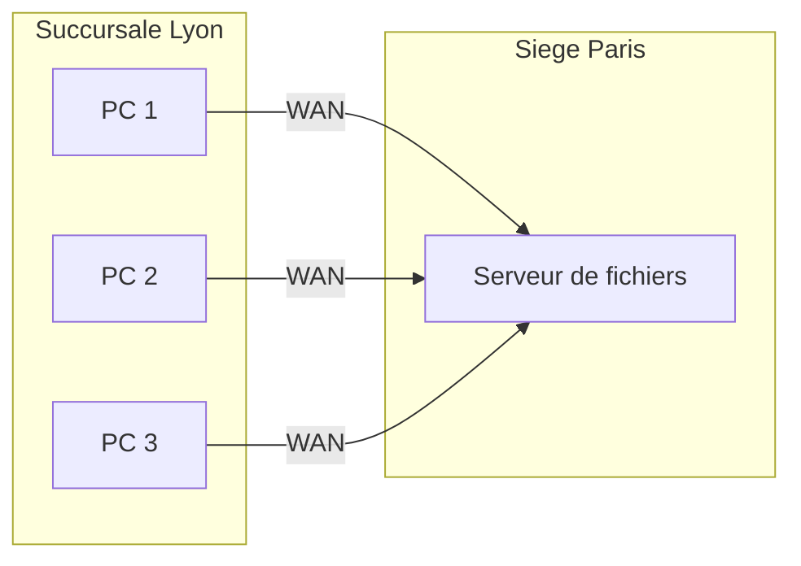
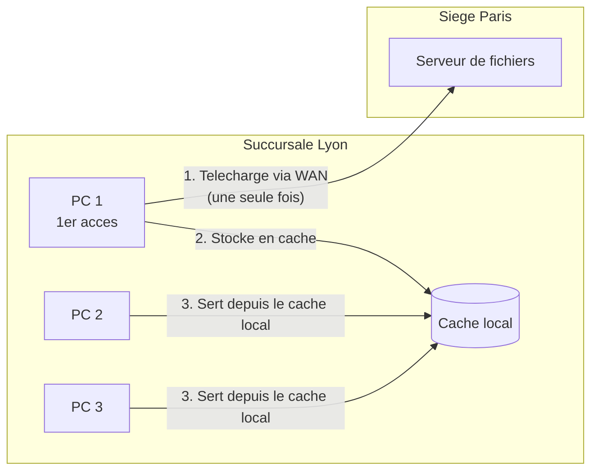
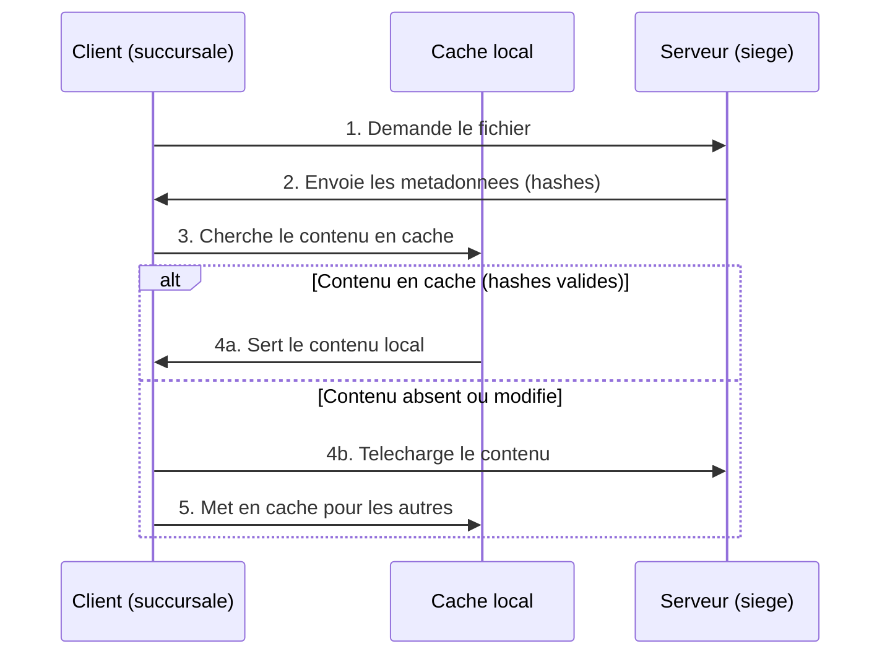
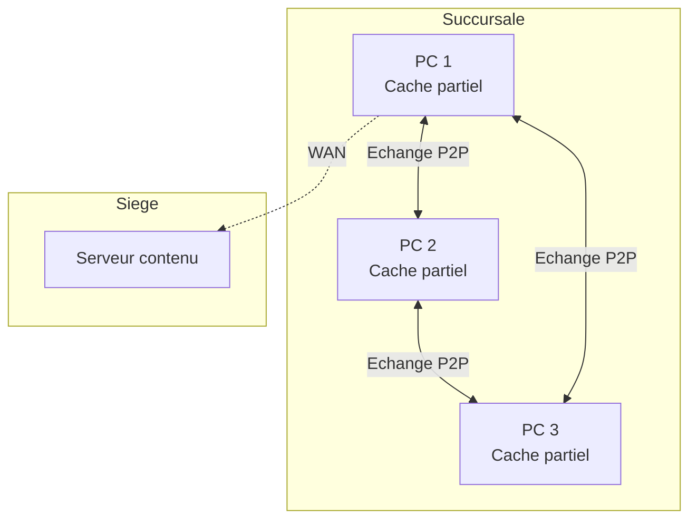
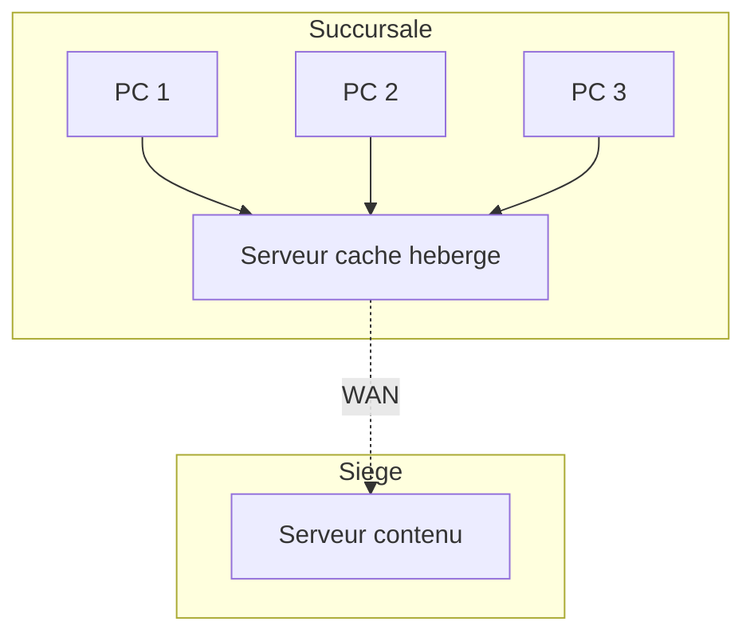
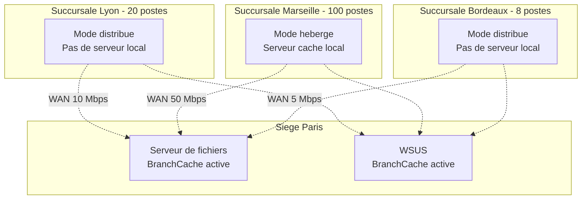

# BranchCache

!!! info "Niveau : Intermediaire"

    Temps estime : 25 minutes

## Qu'est-ce que BranchCache ?

BranchCache est une technologie d'optimisation de la bande passante WAN integree a Windows Server. Elle permet aux ordinateurs des sites distants (succursales) de mettre en cache le contenu provenant de serveurs du site central, reduisant ainsi le trafic WAN et ameliorant les temps de reponse.

### Le probleme des succursales

Sans BranchCache, chaque acces a un fichier du siege transite par le lien WAN :



Si 10 utilisateurs ouvrent le meme document, le fichier est transfere 10 fois sur le lien WAN.

### La solution BranchCache

Avec BranchCache, le premier acces telecharge le contenu via le WAN. Les acces suivants sont servis depuis le cache local :



## Fonctionnement detaille

### Protocole de BranchCache

1. Le client demande un fichier au serveur du siege
2. Le serveur repond avec des **metadonnees** (hashes) du contenu
3. Le client cherche le contenu correspondant dans le cache local (distribue ou heberge)
4. Si le contenu est en cache et les hashes correspondent : le client utilise le cache local
5. Sinon : le client telecharge le contenu depuis le serveur et le met en cache



!!! info "Securite du cache"

    Le contenu est identifie par des hashes cryptographiques. Un client ne peut acceder au cache que s'il possede les metadonnees fournies par le serveur, ce qui necessite une authentification valide aupres du serveur de contenu.

### Protocoles pris en charge

BranchCache fonctionne avec les protocoles suivants :

| Protocole | Usage |
|-----------|-------|
| **SMB** | Partages de fichiers Windows |
| **HTTP/HTTPS** | Sites web internes, WSUS |
| **BITS** | Transferts en arriere-plan (Windows Update via WSUS) |

## Modes de fonctionnement

### Mode distribue (Distributed Cache)

Dans le mode distribue, le cache est reparti entre les ordinateurs clients de la succursale. Aucun serveur supplementaire n'est necessaire.



| Propriete | Valeur |
|-----------|--------|
| Serveur requis en succursale | Non |
| Stockage du cache | Reparti sur les postes clients |
| Clients minimum | 2 (pour beneficier du P2P) |
| Adapte pour | Petites succursales (< 50 postes) |

!!! tip "Mode distribue"

    Le mode distribue est le plus simple a deployer. Il convient parfaitement aux petites succursales sans serveur local.

### Mode heberge (Hosted Cache)

Dans le mode heberge, un serveur local dans la succursale joue le role de cache centralisee.



| Propriete | Valeur |
|-----------|--------|
| Serveur requis en succursale | Oui (Windows Server) |
| Stockage du cache | Centralise sur le serveur local |
| Cache persistent | Oui (survit aux redemarrages des postes) |
| Adapte pour | Succursales moyennes a grandes (> 50 postes) |

**Avantages par rapport au mode distribue :**

- Le cache est persistant meme quand les postes clients sont eteints
- Meilleure efficacite : un seul emplacement de cache a consulter
- Le cache est disponible immediatement au demarrage des postes

## Configuration cote serveur (siege)

### Installer la fonctionnalite BranchCache

```powershell
# Install BranchCache feature on the content server
Install-WindowsFeature BranchCache -IncludeManagementTools
```

### Activer BranchCache sur les partages de fichiers

```powershell
# Install the BranchCache for Network Files role service
Install-WindowsFeature FS-BranchCache -IncludeManagementTools
```

Activer BranchCache par partage :

```powershell
# Enable BranchCache on an existing share
Set-SmbShare -Name "Commun" -CachingMode BranchCache -Confirm:$false

# Create a new share with BranchCache enabled
New-SmbShare -Name "Applications" -Path "D:\Partages\Applications" `
    -FullAccess "BUILTIN\Administrators" `
    -ReadAccess "Authenticated Users" `
    -CachingMode BranchCache
```

### Activer BranchCache par strategie de groupe (recommande)

La methode recommandee pour le deploiement a grande echelle est la GPO :

1. Ouvrir **Group Policy Management** (`gpmc.msc`)
2. Creer ou modifier une GPO liee aux serveurs de fichiers
3. Naviguer vers : **Computer Configuration** > **Policies** > **Administrative Templates** > **Network** > **Lanman Server**
4. Activer : **Hash Publication for BranchCache**
    - Option 1 : Allow hash publication for all shared folders
    - Option 2 : Allow hash publication only for shared folders on which BranchCache is enabled

```powershell
# Verify hash publication is enabled (via registry)
Get-ItemProperty -Path "HKLM:\SYSTEM\CurrentControlSet\Services\LanmanServer\Parameters" `
    -Name "HashPublicationForBranchCache" -ErrorAction SilentlyContinue
```

## Configuration cote client (succursale)

### Activer BranchCache sur les clients

Par GPO (methode recommandee pour un deploiement en masse) :

1. **Computer Configuration** > **Policies** > **Administrative Templates** > **Network** > **BranchCache**
2. Activer : **Turn on BranchCache**
3. Choisir le mode :
    - **Set BranchCache Distributed Cache mode** (pas de serveur local)
    - **Set BranchCache Hosted Cache mode** (avec serveur local)

Pour le mode heberge, specifier l'adresse du serveur cache :

4. Activer : **Configure Hosted Cache Servers** et ajouter le FQDN du serveur cache

### Activer par PowerShell (poste individuel)

```powershell
# Enable BranchCache on the client
Enable-BCLocal

# Set distributed cache mode
Enable-BCDistributed

# Or set hosted cache mode with server address
Enable-BCHostedClient -ServerNames "srv-cache.lab.local"
```

### Configurer la taille du cache client

```powershell
# Set cache size to 10% of disk (default is 5%)
Set-BCCache -Percentage 10

# Or set a fixed cache size
Set-BCCache -SizeBytes 5GB
```

## Configuration du serveur cache heberge

### Installer le role

```powershell
# Install BranchCache Hosted Cache server
Install-WindowsFeature BranchCache-HostedServer -IncludeManagementTools
```

### Configurer le serveur cache

```powershell
# Enable hosted cache server mode
Enable-BCHostedServer -RegisterSCP

# Set the hosted cache data path and size
Set-BCDataCacheEntryMaxAge -TimeDays 28
```

!!! info "SCP (Service Connection Point)"

    Le parametre `-RegisterSCP` enregistre le serveur cache dans Active Directory. Les clients peuvent ainsi decouvrir automatiquement le serveur cache sans configuration manuelle.

### Pre-charger le cache (pre-hashing)

Pour des performances optimales des le premier acces, vous pouvez pre-charger le contenu dans le cache :

```powershell
# Generate hash data on the content server for a share
Publish-BCFileContent -Path "D:\Partages\Applications" -Recurse

# Export hash data for transfer to the hosted cache server
Export-BCCachePackage -Destination "\\srv-cache\BranchCache\AppCache.pkg"

# Import on the hosted cache server
Import-BCCachePackage -Path "C:\BranchCache\AppCache.pkg"
```

## Surveillance et depannage

### Verifier le statut BranchCache

```powershell
# Check BranchCache status on a client
Get-BCStatus | Select-Object BranchCacheIsEnabled,
    BranchCacheServiceStatus, CurrentClientMode

# Detailed status including cache size
Get-BCStatus -Verbose
```

### Statistiques du cache

```powershell
# View cache statistics
Get-BCDataCache | Select-Object CurrentActiveCacheSize,
    MaxCacheSizeAsPercentageOfDiskVolume,
    CurrentActiveCacheSize

# View cache contents
Get-BCDataCacheExtension
```

### Compteurs de performance

Les compteurs de performance BranchCache sont disponibles dans Performance Monitor :

| Compteur | Description |
|----------|-------------|
| BranchCache\Bytes From Cache | Octets servis depuis le cache local |
| BranchCache\Bytes From Server | Octets telecharges depuis le serveur |
| BranchCache\Cache Hit Ratio | Pourcentage de requetes servies par le cache |

```powershell
# Quick check of BranchCache performance counters
Get-Counter -Counter "\BranchCache\*" -SampleInterval 5 -MaxSamples 3
```

### Vider le cache

```powershell
# Clear the local BranchCache cache
Clear-BCCache -Force
```

### Problemes courants

| Symptome | Cause probable | Solution |
|----------|---------------|----------|
| BranchCache inactif sur le client | Service BranchCache arrete | `Start-Service PeerDistSvc` |
| Pas de mise en cache | Hash publication non activee sur le serveur | Verifier la GPO Lanman Server |
| Cache ratio faible | Cache trop petit | Augmenter la taille avec `Set-BCCache` |
| Mode heberge non detecte | SCP non enregistre | `Enable-BCHostedServer -RegisterSCP` |
| Contenu non mis a jour | Cache expire | Verifier `BCDataCacheEntryMaxAge` |

## Cas d'usage typiques

### Entreprise multi-sites



**Regles de choix du mode :**

- **< 50 postes sans serveur local** : mode distribue
- **> 50 postes ou serveur local disponible** : mode heberge
- **Lien WAN tres lent (< 10 Mbps)** : BranchCache est particulierement benefique

### Combinaison avec DFS

BranchCache se combine naturellement avec DFS Namespaces :

- Les utilisateurs accedent aux fichiers via le namespace DFS (`\\lab.local\Partages`)
- BranchCache met en cache le contenu localement apres le premier acces
- Les acces suivants sont servis depuis le cache, meme si le lien WAN est temporairement coupe

## Points cles a retenir

- **BranchCache** reduit le trafic WAN en mettant en cache le contenu des serveurs du siege dans les succursales
- Le mode **distribue** repartit le cache sur les postes clients (pas de serveur requis en succursale)
- Le mode **heberge** centralise le cache sur un serveur local (plus performant pour les grandes succursales)
- Fonctionne avec **SMB**, **HTTP/HTTPS** et **BITS**
- Le contenu en cache est valide par des **hashes cryptographiques** (securite garantie)
- Le **pre-hashing** (`Publish-BCFileContent`) permet de remplir le cache avant le premier acces
- Deployez la configuration par **GPO** pour un deploiement a grande echelle
- Combinez avec **DFS Namespaces** pour une experience transparente multi-sites

## Pour aller plus loin

- [Permissions de partage](permissions-partage.md)
- [DFS Namespaces](../dfs/dfs-namespaces.md)
- [DFS Replication](../dfs/dfs-replication.md)
