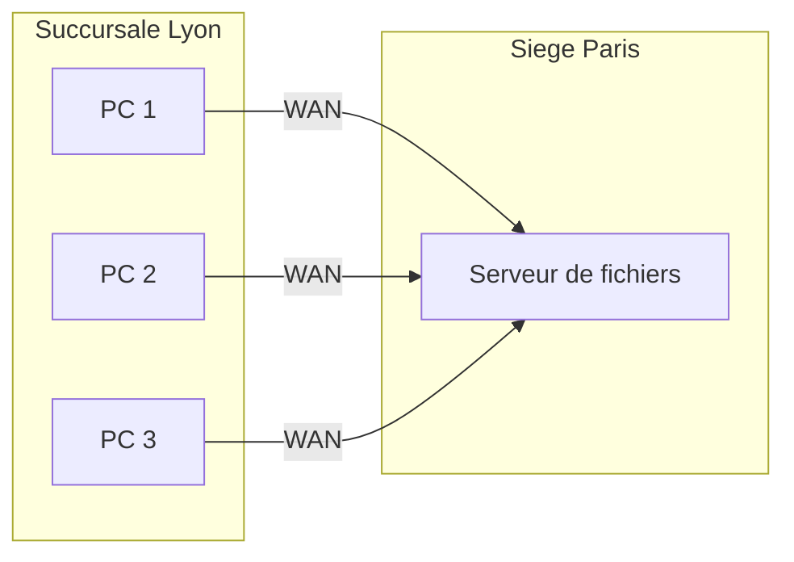
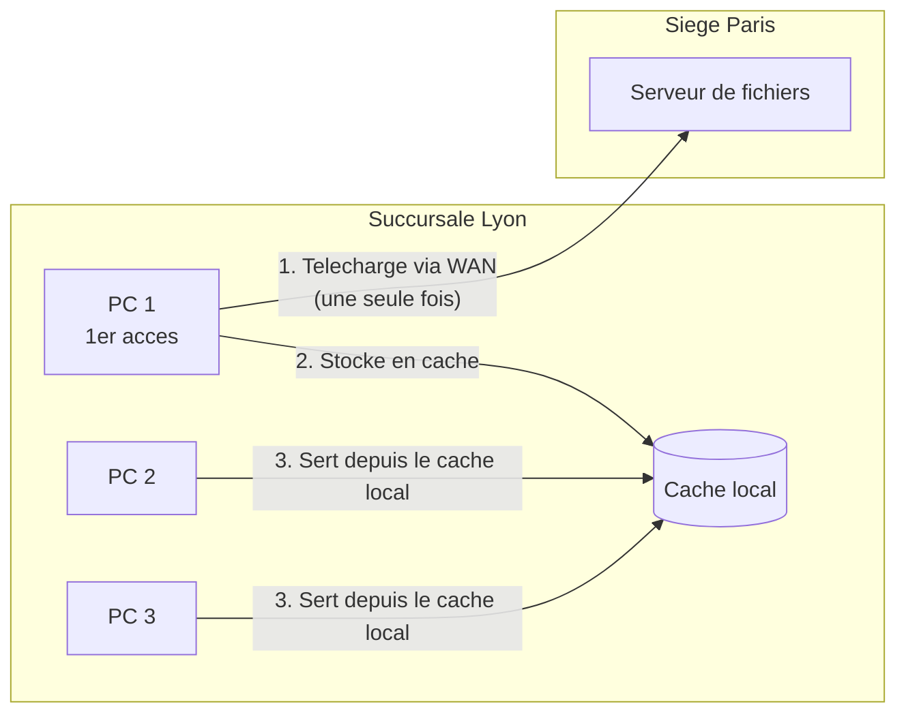
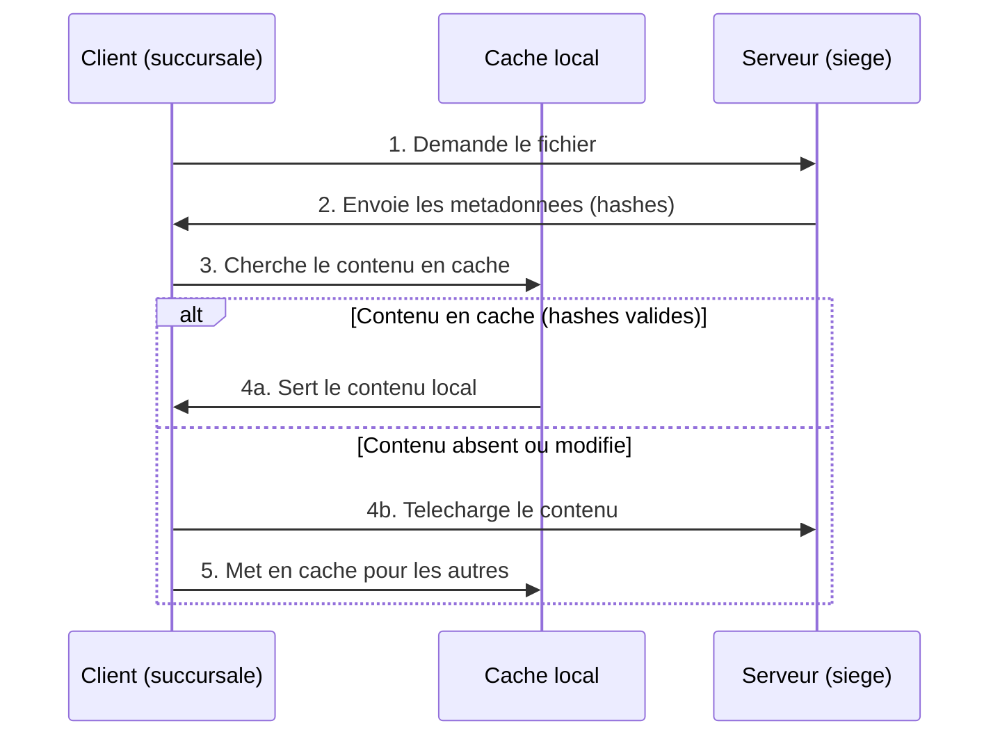
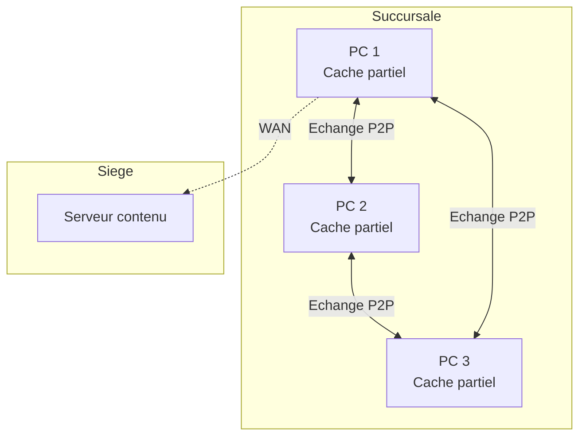
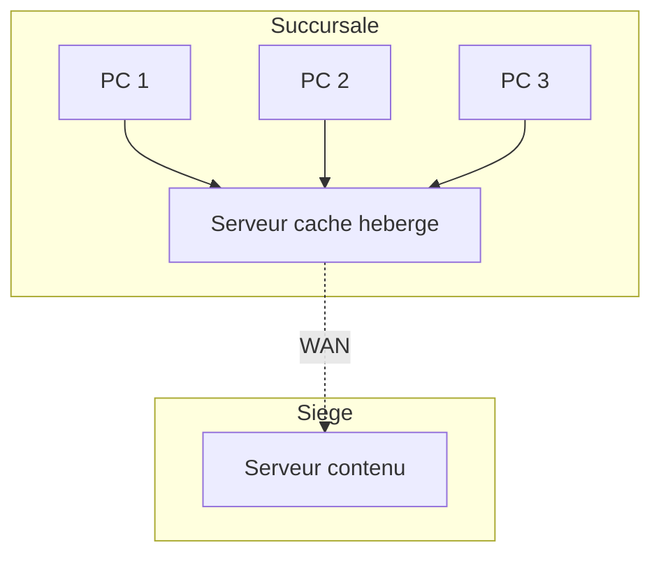
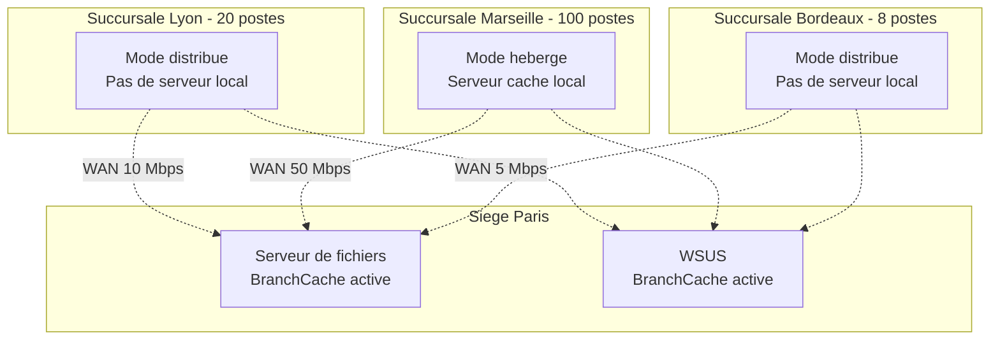

<!--
  Copyright 2026 Julien Bombled

  Licensed under the Apache License, Version 2.0 (the "License");
  you may not use this file except in compliance with the License.
  You may obtain a copy of the License at

      http://www.apache.org/licenses/LICENSE-2.0

  Unless required by applicable law or agreed to in writing, software
  distributed under the License is distributed on an "AS IS" BASIS,
  WITHOUT WARRANTIES OR CONDITIONS OF ANY KIND, either express or implied.
  See the License for the specific language governing permissions and
  limitations under the License.
-->

# BranchCache

<span class="level-intermediate">Intermediaire</span> · Temps estime : 25 minutes

## Qu'est-ce que BranchCache ?

!!! example "Analogie"

    Imaginez une entreprise avec un siege et des succursales. Le siege possede une **photocopieuse centrale** avec tous les documents de reference. Sans BranchCache, chaque employe de succursale doit appeler le siege et demander l'envoi par courrier (WAN) d'une copie a chaque fois qu'il a besoin d'un document. Avec BranchCache, la premiere copie recue est archivee dans **une armoire locale** (le cache). Quand un collegue demande le meme document, on lui donne la copie locale instantanement au lieu de rappeler le siege.

BranchCache est une technologie d'optimisation de la bande passante WAN integree a Windows Server. Elle permet aux ordinateurs des sites distants (succursales) de mettre en cache le contenu provenant de serveurs du site central, reduisant ainsi le trafic WAN et ameliorant les temps de reponse.

### Le probleme des succursales

Sans BranchCache, chaque acces a un fichier du siege transite par le lien WAN :



Si 10 utilisateurs ouvrent le meme document, le fichier est transfere 10 fois sur le lien WAN.

### La solution BranchCache

Avec BranchCache, le premier acces telecharge le contenu via le WAN. Les acces suivants sont servis depuis le cache local :



## Fonctionnement detaille

### Protocole de BranchCache

1. Le client demande un fichier au serveur du siege
2. Le serveur repond avec des **metadonnees** (hashes) du contenu
3. Le client cherche le contenu correspondant dans le cache local (distribue ou heberge)
4. Si le contenu est en cache et les hashes correspondent : le client utilise le cache local
5. Sinon : le client telecharge le contenu depuis le serveur et le met en cache



!!! info "Securite du cache"

    Le contenu est identifie par des hashes cryptographiques. Un client ne peut acceder au cache que s'il possede les metadonnees fournies par le serveur, ce qui necessite une authentification valide aupres du serveur de contenu.

### Protocoles pris en charge

BranchCache fonctionne avec les protocoles suivants :

| Protocole | Usage |
|-----------|-------|
| **SMB** | Partages de fichiers Windows |
| **HTTP/HTTPS** | Sites web internes, WSUS |
| **BITS** | Transferts en arriere-plan (Windows Update via WSUS) |

## Modes de fonctionnement

!!! example "Analogie"

    Le mode **distribue**, c'est quand chaque employe de la succursale garde ses photocopies dans **son propre tiroir** et les partage avec ses collegues a la demande (pair-a-pair). Le mode **heberge**, c'est quand la succursale possede une **armoire centrale partagee** geree par un responsable : tout le monde y range ses copies et tout le monde peut y acceder, meme quand l'employe qui a fait la premiere copie est absent.

### Mode distribue (Distributed Cache)

Dans le mode distribue, le cache est reparti entre les ordinateurs clients de la succursale. Aucun serveur supplementaire n'est necessaire.



| Propriete | Valeur |
|-----------|--------|
| Serveur requis en succursale | Non |
| Stockage du cache | Reparti sur les postes clients |
| Clients minimum | 2 (pour beneficier du P2P) |
| Adapte pour | Petites succursales (< 50 postes) |

!!! tip "Mode distribue"

    Le mode distribue est le plus simple a deployer. Il convient parfaitement aux petites succursales sans serveur local.

### Mode heberge (Hosted Cache)

Dans le mode heberge, un serveur local dans la succursale joue le role de cache centralisee.



| Propriete | Valeur |
|-----------|--------|
| Serveur requis en succursale | Oui (Windows Server) |
| Stockage du cache | Centralise sur le serveur local |
| Cache persistent | Oui (survit aux redemarrages des postes) |
| Adapte pour | Succursales moyennes a grandes (> 50 postes) |

**Avantages par rapport au mode distribue :**

- Le cache est persistant meme quand les postes clients sont eteints
- Meilleure efficacite : un seul emplacement de cache a consulter
- Le cache est disponible immediatement au demarrage des postes

## Configuration cote serveur (siege)

### Installer la fonctionnalite BranchCache

```powershell
# Install BranchCache feature on the content server
Install-WindowsFeature BranchCache -IncludeManagementTools
```

Resultat :

```text
Success Restart Needed Exit Code      Feature Result
------- -------------- ---------      --------------
True    No             Success        {BranchCache}
```

### Activer BranchCache sur les partages de fichiers

```powershell
# Install the BranchCache for Network Files role service
Install-WindowsFeature FS-BranchCache -IncludeManagementTools
```

Activer BranchCache par partage :

```powershell
# Enable BranchCache on an existing share
Set-SmbShare -Name "Commun" -CachingMode BranchCache -Confirm:$false

# Create a new share with BranchCache enabled
New-SmbShare -Name "Applications" -Path "D:\Partages\Applications" `
    -FullAccess "BUILTIN\Administrators" `
    -ReadAccess "Authenticated Users" `
    -CachingMode BranchCache
```

### Activer BranchCache par strategie de groupe (recommande)

La methode recommandee pour le deploiement a grande echelle est la GPO :

1. Ouvrir **Group Policy Management** (`gpmc.msc`)
2. Creer ou modifier une GPO liee aux serveurs de fichiers
3. Naviguer vers : **Computer Configuration** > **Policies** > **Administrative Templates** > **Network** > **Lanman Server**
4. Activer : **Hash Publication for BranchCache**
    - Option 1 : Allow hash publication for all shared folders
    - Option 2 : Allow hash publication only for shared folders on which BranchCache is enabled

```powershell
# Verify hash publication is enabled (via registry)
Get-ItemProperty -Path "HKLM:\SYSTEM\CurrentControlSet\Services\LanmanServer\Parameters" `
    -Name "HashPublicationForBranchCache" -ErrorAction SilentlyContinue
```

## Configuration cote client (succursale)

### Activer BranchCache sur les clients

Par GPO (methode recommandee pour un deploiement en masse) :

1. **Computer Configuration** > **Policies** > **Administrative Templates** > **Network** > **BranchCache**
2. Activer : **Turn on BranchCache**
3. Choisir le mode :
    - **Set BranchCache Distributed Cache mode** (pas de serveur local)
    - **Set BranchCache Hosted Cache mode** (avec serveur local)

Pour le mode heberge, specifier l'adresse du serveur cache :

4. Activer : **Configure Hosted Cache Servers** et ajouter le FQDN du serveur cache

### Activer par PowerShell (poste individuel)

```powershell
# Enable BranchCache on the client
Enable-BCLocal

# Set distributed cache mode
Enable-BCDistributed

# Or set hosted cache mode with server address
Enable-BCHostedClient -ServerNames "srv-cache.lab.local"
```

### Configurer la taille du cache client

```powershell
# Set cache size to 10% of disk (default is 5%)
Set-BCCache -Percentage 10

# Or set a fixed cache size
Set-BCCache -SizeBytes 5GB
```

## Configuration du serveur cache heberge

### Installer le role

```powershell
# Install BranchCache Hosted Cache server
Install-WindowsFeature BranchCache-HostedServer -IncludeManagementTools
```

### Configurer le serveur cache

```powershell
# Enable hosted cache server mode
Enable-BCHostedServer -RegisterSCP

# Set the hosted cache data path and size
Set-BCDataCacheEntryMaxAge -TimeDays 28
```

!!! info "SCP (Service Connection Point)"

    Le parametre `-RegisterSCP` enregistre le serveur cache dans Active Directory. Les clients peuvent ainsi decouvrir automatiquement le serveur cache sans configuration manuelle.

### Pre-charger le cache (pre-hashing)

Pour des performances optimales des le premier acces, vous pouvez pre-charger le contenu dans le cache :

```powershell
# Generate hash data on the content server for a share
Publish-BCFileContent -Path "D:\Partages\Applications" -Recurse

# Export hash data for transfer to the hosted cache server
Export-BCCachePackage -Destination "\\srv-cache\BranchCache\AppCache.pkg"

# Import on the hosted cache server
Import-BCCachePackage -Path "C:\BranchCache\AppCache.pkg"
```

## Surveillance et depannage

### Verifier le statut BranchCache

```powershell
# Check BranchCache status on a client
Get-BCStatus | Select-Object BranchCacheIsEnabled,
    BranchCacheServiceStatus, CurrentClientMode

# Detailed status including cache size
Get-BCStatus -Verbose
```

Resultat :

```text
BranchCacheIsEnabled     : True
BranchCacheServiceStatus : Running
CurrentClientMode        : DistributedCache
```

### Statistiques du cache

```powershell
# View cache statistics
Get-BCDataCache | Select-Object CurrentActiveCacheSize,
    MaxCacheSizeAsPercentageOfDiskVolume,
    CurrentActiveCacheSize

# View cache contents
Get-BCDataCacheExtension
```

Resultat :

```text
CurrentActiveCacheSize              : 1.24 GB
MaxCacheSizeAsPercentageOfDiskVolume : 5
```

### Compteurs de performance

Les compteurs de performance BranchCache sont disponibles dans Performance Monitor :

| Compteur | Description |
|----------|-------------|
| BranchCache\Bytes From Cache | Octets servis depuis le cache local |
| BranchCache\Bytes From Server | Octets telecharges depuis le serveur |
| BranchCache\Cache Hit Ratio | Pourcentage de requetes servies par le cache |

```powershell
# Quick check of BranchCache performance counters
Get-Counter -Counter "\BranchCache\*" -SampleInterval 5 -MaxSamples 3
```

Resultat :

```text
Timestamp                 CounterSamples
---------                 --------------
2026-02-20 10:15:30       \\PC-LYON01\BranchCache\Bytes From Cache :     847249408
                          \\PC-LYON01\BranchCache\Bytes From Server :    125829120
                          \\PC-LYON01\BranchCache\Cache Hit Ratio :      87.12
```

### Vider le cache

```powershell
# Clear the local BranchCache cache
Clear-BCCache -Force
```

### Problemes courants

| Symptome | Cause probable | Solution |
|----------|---------------|----------|
| BranchCache inactif sur le client | Service BranchCache arrete | `Start-Service PeerDistSvc` |
| Pas de mise en cache | Hash publication non activee sur le serveur | Verifier la GPO Lanman Server |
| Cache ratio faible | Cache trop petit | Augmenter la taille avec `Set-BCCache` |
| Mode heberge non detecte | SCP non enregistre | `Enable-BCHostedServer -RegisterSCP` |
| Contenu non mis a jour | Cache expire | Verifier `BCDataCacheEntryMaxAge` |

## Cas d'usage typiques

### Entreprise multi-sites



**Regles de choix du mode :**

- **< 50 postes sans serveur local** : mode distribue
- **> 50 postes ou serveur local disponible** : mode heberge
- **Lien WAN tres lent (< 10 Mbps)** : BranchCache est particulierement benefique

### Combinaison avec DFS

BranchCache se combine naturellement avec DFS Namespaces :

- Les utilisateurs accedent aux fichiers via le namespace DFS (`\\lab.local\Partages`)
- BranchCache met en cache le contenu localement apres le premier acces
- Les acces suivants sont servis depuis le cache, meme si le lien WAN est temporairement coupe

## Points cles a retenir

- **BranchCache** reduit le trafic WAN en mettant en cache le contenu des serveurs du siege dans les succursales
- Le mode **distribue** repartit le cache sur les postes clients (pas de serveur requis en succursale)
- Le mode **heberge** centralise le cache sur un serveur local (plus performant pour les grandes succursales)
- Fonctionne avec **SMB**, **HTTP/HTTPS** et **BITS**
- Le contenu en cache est valide par des **hashes cryptographiques** (securite garantie)
- Le **pre-hashing** (`Publish-BCFileContent`) permet de remplir le cache avant le premier acces
- Deployez la configuration par **GPO** pour un deploiement a grande echelle
- Combinez avec **DFS Namespaces** pour une experience transparente multi-sites

!!! example "Scenario pratique"

    **Contexte :** Isabelle, responsable IT d'une entreprise avec un siege a Paris et 3 succursales, constate que les utilisateurs de la succursale de Bordeaux (8 postes, lien WAN 5 Mbps) se plaignent de temps d'ouverture de fichiers tres lents depuis le serveur de fichiers du siege.

    **Diagnostic :**

    ```powershell
    # On a Bordeaux workstation, check if BranchCache is enabled
    Get-BCStatus | Select-Object BranchCacheIsEnabled, CurrentClientMode
    ```

    Resultat :

    ```text
    BranchCacheIsEnabled CurrentClientMode
    -------------------- -----------------
                   False     Disabled
    ```

    BranchCache n'est pas active sur les postes.

    **Solution :** Deployer BranchCache en mode distribue (pas de serveur local a Bordeaux).

    ```powershell
    # On the file server (Paris): install BranchCache and enable hash publication
    Install-WindowsFeature BranchCache, FS-BranchCache -IncludeManagementTools

    # Enable BranchCache on the main shares
    Set-SmbShare -Name "Applications" -CachingMode BranchCache -Confirm:$false
    Set-SmbShare -Name "Commun" -CachingMode BranchCache -Confirm:$false
    ```

    Resultat :

    ```text
    Success Restart Needed Exit Code      Feature Result
    ------- -------------- ---------      --------------
    True    No             Success        {BranchCache, BranchCache for Network Files}
    ```

    Sur les postes de Bordeaux (via GPO ou manuellement) :

    ```powershell
    # Enable BranchCache in distributed mode
    Enable-BCDistributed

    # Set cache to 10% of disk space
    Set-BCCache -Percentage 10

    # Verify
    Get-BCStatus | Select-Object BranchCacheIsEnabled, CurrentClientMode
    ```

    Resultat :

    ```text
    BranchCacheIsEnabled CurrentClientMode
    -------------------- -----------------
                    True  DistributedCache
    ```

    Apres quelques jours d'utilisation, Isabelle verifie l'efficacite :

    ```powershell
    Get-Counter -Counter "\BranchCache\Cache Hit Ratio" -SampleInterval 5 -MaxSamples 1
    ```

    Resultat :

    ```text
    Timestamp                 CounterSamples
    ---------                 --------------
    2026-02-20 14:30:00       \\PC-BDX01\BranchCache\Cache Hit Ratio : 82.45
    ```

    82% des fichiers sont servis depuis le cache local. Le lien WAN est soulage et les temps d'ouverture sont passes de 15 secondes a moins de 2 secondes pour les fichiers deja en cache.

!!! danger "Erreurs courantes"

    1. **Oublier d'activer la publication de hashes sur le serveur** : BranchCache cote client ne suffit pas. Le serveur de contenu doit publier les metadonnees (hashes) via la GPO "Hash Publication for BranchCache" ou le role FS-BranchCache. Sans cela, aucun contenu n'est mis en cache.

    2. **Choisir le mode heberge sans serveur local** : le mode heberge necessite un serveur Windows Server dans la succursale. Si ce serveur n'existe pas, utilisez le mode distribue qui ne necessite que les postes clients.

    3. **Laisser la taille de cache par defaut (5%)** : sur un poste avec un petit disque SSD de 128 Go, 5% ne represente que 6,4 Go. Pour des partages volumineux, augmentez la taille du cache avec `Set-BCCache -Percentage 10` ou une valeur fixe.

    4. **Ne pas verifier la compatibilite des versions SMB** : BranchCache necessite SMB 2.1 ou superieur. Les anciens clients Windows XP ou les peripheriques NAS non compatibles ne beneficient pas du cache.

    5. **Oublier de pre-charger le cache pour les deploiements** : sans pre-hashing (`Publish-BCFileContent`), le premier acces a chaque fichier transite toujours par le WAN. Pour les mises a jour logicielles ou les images de deploiement, pre-chargez le cache pour un benefice immediat.

## Pour aller plus loin

- [Permissions de partage](permissions-partage.md)
- [DFS Namespaces](../dfs/dfs-namespaces.md)
- [DFS Replication](../dfs/dfs-replication.md)

