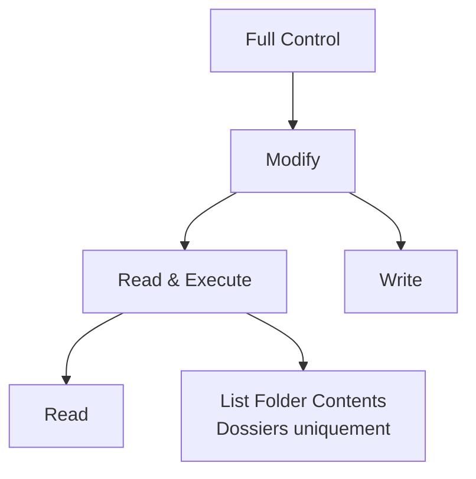
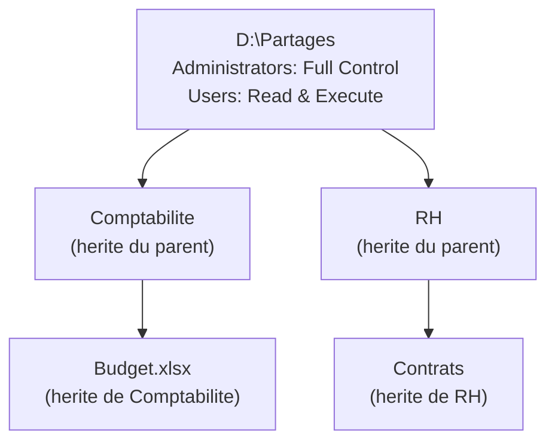
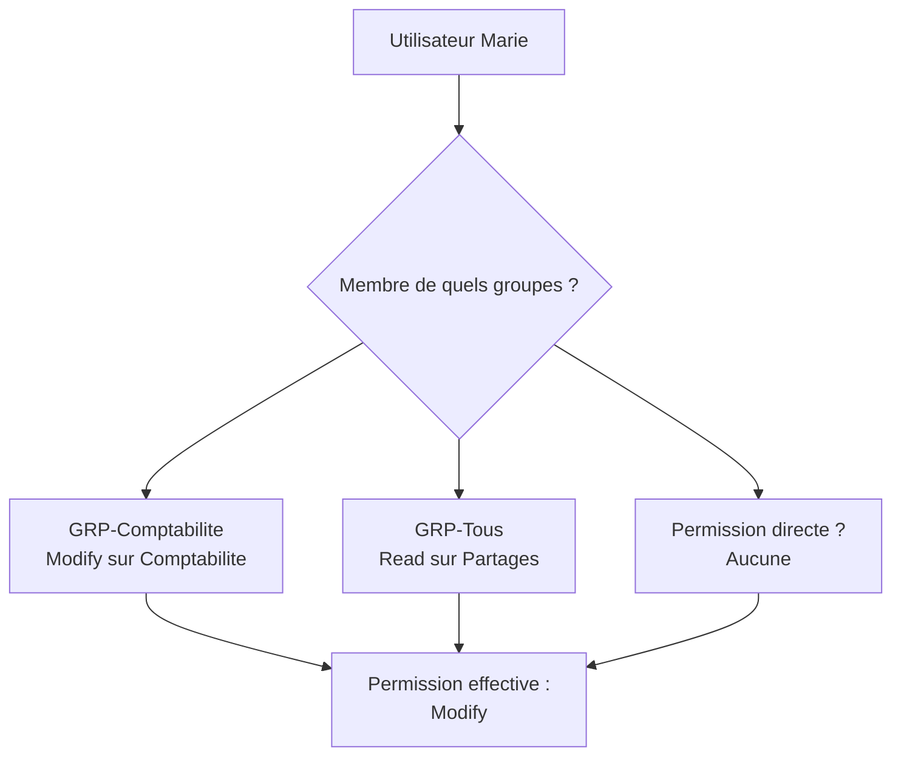

<!--
  Copyright 2026 Julien Bombled

  Licensed under the Apache License, Version 2.0 (the "License");
  you may not use this file except in compliance with the License.
  You may obtain a copy of the License at

      http://www.apache.org/licenses/LICENSE-2.0

  Unless required by applicable law or agreed to in writing, software
  distributed under the License is distributed on an "AS IS" BASIS,
  WITHOUT WARRANTIES OR CONDITIONS OF ANY KIND, either express or implied.
  See the License for the specific language governing permissions and
  limitations under the License.
-->
---
title: Permissions NTFS
description: Comprendre les permissions NTFS - niveaux de permission, heritage, permissions effectives et gestion avec PowerShell.
tags:
  - stockage
  - partage
  - ntfs
  - securite
  - intermediaire
---

# Permissions NTFS

<span class="level-intermediate">Intermediaire</span> · Temps estime : 30 minutes

## Vue d'ensemble

!!! example "Analogie"

    Les permissions NTFS fonctionnent comme les **serrures et cles d'un immeuble de bureaux**. Chaque porte (dossier ou fichier) possede sa propre serrure. Certaines cles ouvrent toutes les portes (Full Control), d'autres permettent seulement d'entrer dans le bureau et lire les documents sur la table (Read), et d'autres encore permettent de modifier les documents (Modify). L'heritage, c'est quand la cle de l'etage ouvre aussi toutes les portes des bureaux de cet etage.

Les permissions NTFS controlent l'acces aux fichiers et dossiers sur un volume NTFS, que l'acces soit local ou distant. Elles sont stockees dans la liste de controle d'acces (ACL) de chaque objet du systeme de fichiers.

!!! tip "NTFS vs partage"

    Les permissions NTFS s'appliquent **toujours**, que l'acces soit local ou via un partage reseau. Les permissions de partage ne s'appliquent qu'en acces reseau. En combinaison, c'est la permission **la plus restrictive** qui s'applique.

## Niveaux de permissions standard

### Permissions sur les dossiers

| Permission | Effet |
|------------|-------|
| **Full Control** (Controle total) | Toutes les operations + modifier les permissions et prendre possession |
| **Modify** (Modification) | Lire, ecrire, modifier, supprimer les fichiers et sous-dossiers |
| **Read & Execute** (Lecture et execution) | Parcourir le dossier, lire les fichiers, executer les programmes |
| **List Folder Contents** (Afficher le contenu) | Voir la liste des fichiers et sous-dossiers (dossiers uniquement) |
| **Read** (Lecture) | Voir le contenu des fichiers et les attributs |
| **Write** (Ecriture) | Creer des fichiers et sous-dossiers, modifier les attributs |

### Permissions sur les fichiers

| Permission | Effet |
|------------|-------|
| **Full Control** | Toutes les operations + modifier les permissions et prendre possession |
| **Modify** | Lire, ecrire, modifier, supprimer le fichier |
| **Read & Execute** | Lire le fichier et executer si c'est un programme |
| **Read** | Voir le contenu du fichier et ses attributs |
| **Write** | Modifier le contenu du fichier et ses attributs |

### Hierarchie des permissions



Chaque niveau inclut toutes les permissions des niveaux inferieurs. Par exemple, **Modify** inclut Read & Execute, Read, Write et List Folder Contents.

## Permissions avancees

Les permissions standard sont des combinaisons de permissions avancees (granulaires) :

| Permission avancee | FC | M | RX | R | W |
|-------------------|:--:|:--:|:--:|:--:|:--:|
| Traverse Folder / Execute File | :material-check: | :material-check: | :material-check: | | |
| List Folder / Read Data | :material-check: | :material-check: | :material-check: | :material-check: | |
| Read Attributes | :material-check: | :material-check: | :material-check: | :material-check: | |
| Read Extended Attributes | :material-check: | :material-check: | :material-check: | :material-check: | |
| Create Files / Write Data | :material-check: | :material-check: | | | :material-check: |
| Create Folders / Append Data | :material-check: | :material-check: | | | :material-check: |
| Write Attributes | :material-check: | :material-check: | | | :material-check: |
| Write Extended Attributes | :material-check: | :material-check: | | | :material-check: |
| Delete Subfolders and Files | :material-check: | | | | |
| Delete | :material-check: | :material-check: | | | |
| Read Permissions | :material-check: | :material-check: | :material-check: | :material-check: | :material-check: |
| Change Permissions | :material-check: | | | | |
| Take Ownership | :material-check: | | | | |

## Heritage des permissions

### Fonctionnement

Par defaut, les permissions sont heritees du dossier parent vers les sous-dossiers et fichiers :



### Types de propagation

Lors de la definition d'une permission, vous pouvez choisir ou elle s'applique :

| Portee | S'applique a |
|--------|-------------|
| This folder only | Le dossier courant uniquement |
| This folder, subfolders and files | Le dossier, ses sous-dossiers et ses fichiers (defaut) |
| This folder and subfolders | Le dossier et ses sous-dossiers (pas les fichiers) |
| This folder and files | Le dossier et ses fichiers (pas les sous-dossiers) |
| Subfolders and files only | Les sous-dossiers et fichiers (pas le dossier lui-meme) |
| Subfolders only | Les sous-dossiers uniquement |
| Files only | Les fichiers uniquement |

### Bloquer l'heritage

Vous pouvez bloquer l'heritage sur un dossier enfant :

```powershell
# Get the current ACL
$acl = Get-Acl -Path "D:\Partages\Confidentiel"

# Disable inheritance and convert inherited rules to explicit rules
$acl.SetAccessRuleProtection($true, $true)

# Apply the modified ACL
Set-Acl -Path "D:\Partages\Confidentiel" -AclObject $acl
```

Pour bloquer l'heritage et **supprimer** les regles heritees :

```powershell
# Disable inheritance and remove all inherited rules
$acl = Get-Acl -Path "D:\Partages\Confidentiel"
$acl.SetAccessRuleProtection($true, $false)
Set-Acl -Path "D:\Partages\Confidentiel" -AclObject $acl
```

!!! warning "Bloquer l'heritage"

    Bloquer l'heritage avec suppression des regles (`$false`) retire toutes les permissions heritees. Assurez-vous d'ajouter des permissions explicites avant ou juste apres, sinon l'acces au dossier sera refuse a tous (sauf aux administrateurs via la prise de possession).

## Gestion avec PowerShell

### Consulter les permissions

```powershell
# View the ACL of a folder
Get-Acl -Path "D:\Partages\Comptabilite" | Format-List

# Display individual access rules
(Get-Acl -Path "D:\Partages\Comptabilite").Access |
    Select-Object IdentityReference, FileSystemRights, AccessControlType,
        IsInherited, InheritanceFlags, PropagationFlags |
    Format-Table -AutoSize
```

Resultat :

```text
IdentityReference          FileSystemRights  AccessControlType IsInherited InheritanceFlags       PropagationFlags
-----------------          ----------------  ----------------- ----------- ----------------       ----------------
BUILTIN\Administrators     FullControl       Allow             False       ContainerInherit, ...  None
NT AUTHORITY\SYSTEM         FullControl       Allow             False       ContainerInherit, ...  None
LAB\GRP-Comptabilite       Modify            Allow             False       ContainerInherit, ...  None
BUILTIN\Users              ReadAndExecute    Allow             True        ContainerInherit, ...  None
```

### Ajouter une permission

```powershell
# Grant Modify permission to the Comptabilite group
$acl = Get-Acl -Path "D:\Partages\Comptabilite"

$rule = New-Object System.Security.AccessControl.FileSystemAccessRule(
    "LAB\GRP-Comptabilite",       # Identity
    "Modify",                      # Rights
    "ContainerInherit,ObjectInherit",  # Inheritance (subfolders and files)
    "None",                        # Propagation
    "Allow"                        # Type
)
$acl.AddAccessRule($rule)
Set-Acl -Path "D:\Partages\Comptabilite" -AclObject $acl
```

### Supprimer une permission

```powershell
# Remove a specific access rule
$acl = Get-Acl -Path "D:\Partages\Comptabilite"

$rule = New-Object System.Security.AccessControl.FileSystemAccessRule(
    "LAB\GRP-Stagiaires",
    "Modify",
    "ContainerInherit,ObjectInherit",
    "None",
    "Allow"
)
$acl.RemoveAccessRule($rule)
Set-Acl -Path "D:\Partages\Comptabilite" -AclObject $acl
```

### Remplacer toutes les permissions

```powershell
# Reset ACL: disable inheritance, clear all rules, add specific rules
$acl = Get-Acl -Path "D:\Partages\Confidentiel"

# Disable inheritance and remove inherited rules
$acl.SetAccessRuleProtection($true, $false)

# Clear all existing rules
$acl.Access | ForEach-Object { $acl.RemoveAccessRule($_) }

# Add Administrators with Full Control
$adminRule = New-Object System.Security.AccessControl.FileSystemAccessRule(
    "BUILTIN\Administrators", "FullControl",
    "ContainerInherit,ObjectInherit", "None", "Allow"
)
$acl.AddAccessRule($adminRule)

# Add a specific group with Read
$readRule = New-Object System.Security.AccessControl.FileSystemAccessRule(
    "LAB\GRP-Direction", "Read",
    "ContainerInherit,ObjectInherit", "None", "Allow"
)
$acl.AddAccessRule($readRule)

Set-Acl -Path "D:\Partages\Confidentiel" -AclObject $acl
```

### Prendre possession d'un dossier

```powershell
# Take ownership of a folder (requires Administrator privileges)
$acl = Get-Acl -Path "D:\Partages\Orphelin"
$acl.SetOwner([System.Security.Principal.NTAccount]"BUILTIN\Administrators")
Set-Acl -Path "D:\Partages\Orphelin" -AclObject $acl
```

## Permissions effectives

### Calcul des permissions effectives

Les permissions effectives d'un utilisateur sont determinees par la combinaison de toutes les regles qui le concernent :

1. **Regles Allow** : toutes les permissions Allow (directes et via les groupes) sont cumulees
2. **Regles Deny** : les permissions Deny l'emportent toujours sur les Allow
3. **Heritage** : les permissions heritees se combinent avec les permissions explicites
4. **Deny explicite > Allow explicite > Deny herite > Allow herite**



!!! info "Cumul des Allow"

    Si un utilisateur est membre de deux groupes, l'un avec Read et l'autre avec Write, l'utilisateur dispose de Read + Write (les permissions Allow se cumulent).

### Verifier les permissions effectives

```powershell
# Check effective NTFS permissions for a specific user
$acl = Get-Acl -Path "D:\Partages\Comptabilite"
$acl.Access |
    Where-Object { $_.IdentityReference -like "*Comptabilite*" -or
                   $_.IdentityReference -like "*Users*" } |
    Format-Table IdentityReference, FileSystemRights, AccessControlType -AutoSize
```

Resultat :

```text
IdentityReference     FileSystemRights AccessControlType
-----------------     ---------------- -----------------
LAB\GRP-Comptabilite  Modify           Allow
BUILTIN\Users         ReadAndExecute   Allow
```

Via l'interface graphique :

1. Clic droit sur le dossier > **Properties** > onglet **Security**
2. Cliquer sur **Advanced** > onglet **Effective Access**
3. Selectionner un utilisateur ou un groupe
4. Cliquer sur **View effective access**

## Modele de permissions recommande

### Structure type pour un serveur de fichiers

```
D:\Partages\                         Administrators: Full Control
                                     SYSTEM: Full Control
    |
    +-- Comptabilite\                GRP-Comptabilite: Modify
    |   +-- Archives\               GRP-Comptabilite: Read
    |
    +-- RH\                         GRP-RH: Modify
    |   +-- Confidentiel\           GRP-RH-Direction: Modify
    |                               (heritage bloque)
    |
    +-- Commun\                     Domain Users: Read & Execute
    |                               GRP-Redacteurs: Modify
    |
    +-- Direction\                  GRP-Direction: Modify
```

### Bonnes pratiques

!!! tip "Strategie AGDLP"

    Utilisez la strategie **AGDLP** (Account > Global Group > Domain Local Group > Permission) :

    1. Les **comptes utilisateurs** sont membres de **groupes globaux** (par fonction)
    2. Les **groupes globaux** sont membres de **groupes locaux de domaine** (par ressource)
    3. Les **permissions NTFS** sont attribuees aux **groupes locaux de domaine**

    Exemple :

    - Marie (compte) → GRP-G-Comptabilite (global) → GRP-DL-Compta-Modify (domain local) → Modify sur `D:\Partages\Comptabilite`

- Attribuez les permissions aux **groupes**, jamais directement aux utilisateurs
- Evitez les permissions **Deny** explicites sauf en cas de necessite absolue
- Documentez les ruptures d'heritage et les permissions speciales
- Utilisez **Read & Execute** comme permission de base (pas Full Control)
- Reservez **Full Control** aux administrateurs uniquement

## Points cles a retenir

- Les permissions **NTFS** s'appliquent en acces local ET distant
- **Full Control** inclut la modification des permissions et la prise de possession
- L'**heritage** propage les permissions du parent vers les enfants par defaut
- Les permissions **Allow** se cumulent ; les permissions **Deny** l'emportent toujours
- Utilisez `Get-Acl` et `Set-Acl` pour gerer les ACL en PowerShell
- La strategie **AGDLP** est la methode recommandee pour l'attribution des permissions
- Attribuez les permissions aux **groupes**, pas aux utilisateurs individuels
- Les permissions **effectives** sont la combinaison de toutes les regles applicables

!!! example "Scenario pratique"

    **Contexte :** Julie, administratrice systeme, recoit un ticket : Marie du service comptabilite ne peut pas modifier les fichiers dans `\\SRV-01\Comptabilite\Archives` alors qu'elle est membre du groupe `GRP-Comptabilite` qui a les droits Modify sur le dossier parent.

    **Diagnostic :**

    ```powershell
    # Check ACL on the Archives subfolder
    (Get-Acl -Path "D:\Partages\Comptabilite\Archives").Access |
        Select-Object IdentityReference, FileSystemRights, AccessControlType,
            IsInherited |
        Format-Table -AutoSize
    ```

    Resultat :

    ```text
    IdentityReference        FileSystemRights  AccessControlType IsInherited
    -----------------        ----------------  ----------------- -----------
    BUILTIN\Administrators   FullControl       Allow             False
    LAB\GRP-Comptabilite     ReadAndExecute    Allow             False
    ```

    L'heritage a ete coupe sur le dossier `Archives`, et seule la permission Read & Execute a ete ajoutee pour GRP-Comptabilite.

    **Solution :**

    ```powershell
    # Add Modify permission explicitly on Archives
    $acl = Get-Acl -Path "D:\Partages\Comptabilite\Archives"
    $rule = New-Object System.Security.AccessControl.FileSystemAccessRule(
        "LAB\GRP-Comptabilite", "Modify",
        "ContainerInherit,ObjectInherit", "None", "Allow"
    )
    # Remove the old Read rule first
    $oldRule = New-Object System.Security.AccessControl.FileSystemAccessRule(
        "LAB\GRP-Comptabilite", "ReadAndExecute",
        "ContainerInherit,ObjectInherit", "None", "Allow"
    )
    $acl.RemoveAccessRule($oldRule)
    $acl.AddAccessRule($rule)
    Set-Acl -Path "D:\Partages\Comptabilite\Archives" -AclObject $acl
    ```

    Marie peut maintenant modifier les fichiers dans le dossier Archives. Julie documente la rupture d'heritage pour reference future.

!!! danger "Erreurs courantes"

    1. **Attribuer des permissions directement aux utilisateurs** : cela rend la gestion impossible a grande echelle. Quand un employe change de poste, il faut modifier les permissions sur chaque dossier individuellement. Utilisez toujours la strategie AGDLP avec des groupes.

    2. **Abuser des permissions Deny** : les Deny s'appliquent en priorite sur les Allow et se propagent par heritage. Un Deny mal place peut bloquer tout un arbre de dossiers. Preferez simplement ne pas accorder de permissions plutot que d'utiliser Deny.

    3. **Couper l'heritage sans documenter** : une rupture d'heritage cree un ilot de permissions independant. Sans documentation, le prochain administrateur ne comprendra pas pourquoi certains utilisateurs n'ont pas acces a un sous-dossier.

    4. **Accorder Full Control aux utilisateurs** : Full Control permet de modifier les permissions elles-memes et de prendre possession du dossier. Accordez Modify au maximum pour les utilisateurs ; reservez Full Control aux administrateurs.

    5. **Oublier SYSTEM dans les ACL** : le compte `NT AUTHORITY\SYSTEM` est necessaire pour que Windows Server et ses services (sauvegarde, antivirus, indexation) fonctionnent. Si vous reinitialisez les ACL d'un dossier, ajoutez toujours SYSTEM en Full Control.

## Pour aller plus loin

- [Permissions de partage](permissions-partage.md)
- [Quotas et filtrage FSRM](quotas-et-filtrage.md)
- [DFS Namespaces](../dfs/dfs-namespaces.md)

