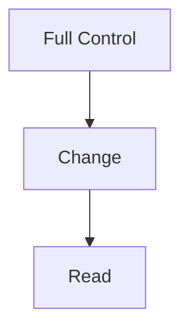
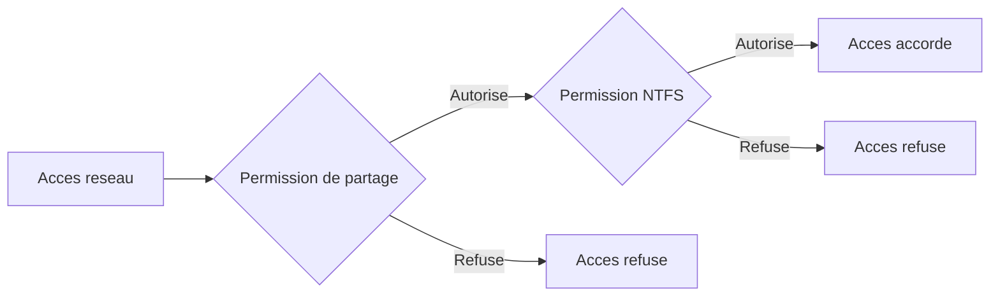

<!--
  Copyright 2026 Julien Bombled

  Licensed under the Apache License, Version 2.0 (the "License");
  you may not use this file except in compliance with the License.
  You may obtain a copy of the License at

      http://www.apache.org/licenses/LICENSE-2.0

  Unless required by applicable law or agreed to in writing, software
  distributed under the License is distributed on an "AS IS" BASIS,
  WITHOUT WARRANTIES OR CONDITIONS OF ANY KIND, either express or implied.
  See the License for the specific language governing permissions and
  limitations under the License.
-->
---
title: Permissions de partage
description: Creer des partages SMB, configurer les permissions de partage et comprendre l'interaction avec les permissions NTFS.
tags:
  - stockage
  - partage
  - smb
  - intermediaire
---

# Permissions de partage

<span class="level-intermediate">Intermediaire</span> · Temps estime : 25 minutes

## Partages SMB : concepts

### Qu'est-ce qu'un partage SMB ?

!!! example "Analogie"

    Un partage SMB, c'est comme une **salle de reunion ouverte** dans un immeuble de bureaux. Les permissions de partage sont le **badge d'acces au batiment** (elles controlent qui peut entrer par le reseau), tandis que les permissions NTFS sont les **cles des armoires a l'interieur** (elles controlent ce que chacun peut faire avec les documents). Pour acceder a un document, il faut avoir le badge ET la bonne cle. C'est toujours la restriction la plus forte qui s'applique.

Un partage SMB (Server Message Block) est un dossier rendu accessible via le reseau. Les clients Windows accedent aux partages via le chemin UNC : `\\NomServeur\NomPartage`.

SMB est le protocole standard pour le partage de fichiers dans les environnements Windows. Windows Server 2022 prend en charge SMB 3.1.1, qui offre le chiffrement, l'integrite pre-authentification et le clustering.

### Partages administratifs

Windows Server cree automatiquement des partages administratifs caches (suffixe `$`) :

| Partage | Description |
|---------|-------------|
| `C$`, `D$` | Racine de chaque volume (acces administrateur uniquement) |
| `ADMIN$` | Dossier systeme Windows |
| `IPC$` | Communication inter-processus (sessions nulles, RPC) |
| `PRINT$` | Pilotes d'imprimantes partages |

!!! warning "Partages administratifs"

    Ne desactivez pas les partages administratifs sauf si la politique de securite l'exige explicitement. De nombreux outils d'administration a distance en dependent.

## Permissions de partage

### Niveaux de permission

Les permissions de partage sont simples, avec seulement trois niveaux :

| Permission | Effet |
|------------|-------|
| **Full Control** | Lire, modifier, supprimer, changer les permissions de partage |
| **Change** | Lire, modifier, creer et supprimer des fichiers et dossiers |
| **Read** | Lire les fichiers et les attributs, executer les programmes |



### Permission par defaut

Lors de la creation d'un partage via PowerShell (`New-SmbShare`), la permission par defaut est **Read** pour **Everyone**.

!!! tip "Everyone vs Authenticated Users"

    Le groupe **Everyone** inclut les sessions anonymes. Pour plus de securite, preferez **Authenticated Users** qui ne concerne que les utilisateurs ayant un compte valide.

## Creer un partage SMB

### Avec PowerShell

```powershell
# Create a basic SMB share
New-SmbShare -Name "Comptabilite" -Path "D:\Partages\Comptabilite" `
    -Description "Documents du service comptabilite"

# Create a share with specific permissions
New-SmbShare -Name "RH" -Path "D:\Partages\RH" `
    -FullAccess "BUILTIN\Administrators" `
    -ChangeAccess "LAB\GRP-RH" `
    -ReadAccess "LAB\GRP-Direction" `
    -Description "Documents des ressources humaines"

# Create a share with access-based enumeration
New-SmbShare -Name "Commun" -Path "D:\Partages\Commun" `
    -FullAccess "BUILTIN\Administrators" `
    -ChangeAccess "LAB\Domain Users" `
    -FolderEnumerationMode AccessBased `
    -Description "Dossier commun entreprise"
```

### Avec Server Manager

1. **Server Manager** > **File and Storage Services** > **Shares**
2. Cliquer sur **TASKS** > **New Share...**
3. Choisir le profil de partage :
    - **SMB Share - Quick** : partage simple avec permissions standard
    - **SMB Share - Advanced** : partage avec quotas, classification, etc.
4. Configurer le chemin, le nom et les permissions

### Partage cache (invisible)

Pour creer un partage invisible dans l'explorateur reseau, ajoutez `$` au nom :

```powershell
# Create a hidden share (not visible in network browse)
New-SmbShare -Name "Admin$Data" -Path "D:\AdminData" `
    -FullAccess "BUILTIN\Administrators" `
    -Description "Partage administratif personnalise"
```

## Gerer les permissions de partage

### Consulter les permissions

```powershell
# View share permissions
Get-SmbShareAccess -Name "Comptabilite" | Format-Table AccountName, AccessRight, AccessControlType -AutoSize
```

Resultat :

```text
AccountName          AccessRight AccessControlType
-----------          ----------- -----------------
Everyone             Read        Allow
BUILTIN\Administrators Full     Allow
```

### Modifier les permissions

```powershell
# Grant Change permission to a group
Grant-SmbShareAccess -Name "Comptabilite" `
    -AccountName "LAB\GRP-Comptabilite" `
    -AccessRight Change -Confirm:$false

# Grant Read permission
Grant-SmbShareAccess -Name "Comptabilite" `
    -AccountName "LAB\GRP-Direction" `
    -AccessRight Read -Confirm:$false

# Revoke all permissions for Everyone
Revoke-SmbShareAccess -Name "Comptabilite" `
    -AccountName "Everyone" -Confirm:$false

# Block (deny) access for a specific group
Block-SmbShareAccess -Name "Comptabilite" `
    -AccountName "LAB\GRP-Stagiaires" -Confirm:$false
```

### Supprimer un partage

```powershell
# Remove a share (does not delete the folder or its data)
Remove-SmbShare -Name "Comptabilite" -Confirm:$false
```

## Interaction NTFS et partage : la regle du plus restrictif

Lorsqu'un utilisateur accede a un partage reseau, **deux couches de permissions** s'appliquent :

1. **Permissions de partage** : evaluees en premier (acces reseau uniquement)
2. **Permissions NTFS** : evaluees ensuite (toujours, local et reseau)

La permission effective est la **plus restrictive** des deux :



### Exemples concrets

**Exemple 1 :**

| Couche | Permission |
|--------|-----------|
| Partage | Change |
| NTFS | Read |
| **Effective** | **Read** (NTFS plus restrictif) |

**Exemple 2 :**

| Couche | Permission |
|--------|-----------|
| Partage | Read |
| NTFS | Modify |
| **Effective** | **Read** (partage plus restrictif) |

**Exemple 3 :**

| Couche | Permission |
|--------|-----------|
| Partage | Full Control |
| NTFS | Modify |
| **Effective** | **Modify** (NTFS plus restrictif) |

### Strategie recommandee

!!! tip "Simplification des permissions"

    La bonne pratique est d'utiliser des permissions de partage larges et de controler l'acces finement avec les permissions NTFS :

    - **Partage** : Full Control pour les administrateurs, Change pour les utilisateurs autorises
    - **NTFS** : permissions granulaires par groupe (Read, Modify, etc.)

    Cette approche simplifie la gestion car les permissions NTFS sont plus fines et s'appliquent aussi en acces local.

## Configuration avancee des partages

### Enumeration basee sur l'acces (ABE)

L'ABE masque les dossiers et fichiers auxquels l'utilisateur n'a pas acces :

```powershell
# Enable ABE on an existing share
Set-SmbShare -Name "Commun" -FolderEnumerationMode AccessBased -Confirm:$false

# Disable ABE
Set-SmbShare -Name "Commun" -FolderEnumerationMode Unrestricted -Confirm:$false
```

### Chiffrement SMB

```powershell
# Enable SMB encryption on a specific share
Set-SmbShare -Name "Confidentiel" -EncryptData $true -Confirm:$false

# Enable SMB encryption for all shares on the server
Set-SmbServerConfiguration -EncryptData $true -Confirm:$false
```

!!! info "Chiffrement SMB"

    Le chiffrement SMB (AES-128 ou AES-256 avec SMB 3.1.1) protege les donnees en transit. Les clients qui ne supportent pas le chiffrement seront rejetes sauf si l'acces non chiffre est explicitement autorise.

### Acces hors connexion (caching)

```powershell
# Configure caching mode for offline files
Set-SmbShare -Name "Documents" -CachingMode Manual -Confirm:$false
```

| Mode | Description |
|------|-------------|
| **Manual** | L'utilisateur choisit les fichiers disponibles hors connexion |
| **Documents** | Les fichiers ouverts sont automatiquement mis en cache |
| **Programs** | Optimise pour les executables (lecture seule) |
| **None** | Pas de mise en cache hors connexion |
| **BranchCache** | Active BranchCache pour ce partage |

### Limiter les connexions

```powershell
# Limit concurrent connections to a share
Set-SmbShare -Name "Comptabilite" -ConcurrentUserLimit 50 -Confirm:$false
```

## Surveillance des partages

### Lister les partages et sessions

```powershell
# List all shares on the server
Get-SmbShare | Select-Object Name, Path, Description,
    CurrentUsers, ShareType |
    Format-Table -AutoSize

# List active SMB sessions
Get-SmbSession | Select-Object ClientComputerName, ClientUserName,
    NumOpens, SecondsExists |
    Format-Table -AutoSize

# List open files on a share
Get-SmbOpenFile | Select-Object ClientComputerName, ClientUserName,
    Path, ShareRelativePath |
    Format-Table -AutoSize
```

Resultat :

```text
Name          Path                     Description                     CurrentUsers ShareType
----          ----                     -----------                     ------------ ---------
ADMIN$        C:\Windows               Remote Admin                              0 Special
C$            C:\                      Default share                             2 Special
Comptabilite  D:\Partages\Comptabilite Documents du service comptabilite         5 FileSystemDirectory
Commun        D:\Partages\Commun       Dossier commun entreprise               12 FileSystemDirectory
RH            D:\Partages\RH           Documents des ressources humaines         3 FileSystemDirectory

ClientComputerName ClientUserName     NumOpens SecondsExists
------------------ --------------     -------- -------------
10.0.0.50          LAB\marie.dupont         4          3842
10.0.0.51          LAB\jean.martin          2          1205
10.0.0.52          LAB\sophie.bernard       7          7201

ClientComputerName ClientUserName     Path                                     ShareRelativePath
------------------ --------------     ----                                     -----------------
10.0.0.50          LAB\marie.dupont   D:\Partages\Comptabilite\Budget.xlsx     Comptabilite\Budget.xlsx
10.0.0.52          LAB\sophie.bernard D:\Partages\RH\Contrats\CDI-2026.docx   RH\Contrats\CDI-2026.docx
```

### Fermer des sessions ou fichiers ouverts

```powershell
# Close all sessions from a specific computer
Close-SmbSession -ClientComputerName "PC-MARIE" -Confirm:$false

# Close a specific open file
Close-SmbOpenFile -FileId 12345 -Confirm:$false
```

## Script : creation de partages structuree

Voici un exemple complet de creation de partages pour un serveur de fichiers d'entreprise :

```powershell
# Define share configuration
$shares = @(
    @{
        Name = "Comptabilite"
        Path = "D:\Partages\Comptabilite"
        ChangeAccess = "LAB\GRP-Comptabilite"
        ReadAccess = "LAB\GRP-Direction"
    },
    @{
        Name = "RH"
        Path = "D:\Partages\RH"
        ChangeAccess = "LAB\GRP-RH"
        ReadAccess = "LAB\GRP-Direction"
    },
    @{
        Name = "Commun"
        Path = "D:\Partages\Commun"
        ChangeAccess = "LAB\Domain Users"
        ReadAccess = $null
    }
)

foreach ($share in $shares) {
    # Create folder if it does not exist
    if (-not (Test-Path $share.Path)) {
        New-Item -Path $share.Path -ItemType Directory -Force
    }

    # Build parameters for New-SmbShare
    $params = @{
        Name        = $share.Name
        Path        = $share.Path
        FullAccess  = "BUILTIN\Administrators"
        ChangeAccess = $share.ChangeAccess
        FolderEnumerationMode = "AccessBased"
    }

    if ($share.ReadAccess) {
        $params.ReadAccess = $share.ReadAccess
    }

    # Create the share
    New-SmbShare @params
    Write-Output "Share created: $($share.Name)"
}
```

## Points cles a retenir

- Les permissions de partage n'ont que **trois niveaux** : Full Control, Change, Read
- Elles ne s'appliquent qu'en **acces reseau** (pas en local)
- En combinaison avec NTFS, c'est la permission **la plus restrictive** qui gagne
- La strategie recommandee : permissions de partage **larges** + controle fin en **NTFS**
- L'**ABE** (Access-Based Enumeration) masque les elements non accessibles
- Le **chiffrement SMB** protege les donnees en transit (AES-256 avec SMB 3.1.1)
- Utilisez `New-SmbShare`, `Grant-SmbShareAccess`, `Get-SmbShareAccess` pour gerer les partages
- Surveillez les sessions et fichiers ouverts avec `Get-SmbSession` et `Get-SmbOpenFile`

!!! example "Scenario pratique"

    **Contexte :** Antoine, administrateur d'un serveur de fichiers, recoit un appel : Pierre du service direction ne peut pas modifier les documents dans le partage `\\SRV-01\Direction`. Pierre est membre du groupe `GRP-Direction` qui dispose des permissions NTFS Modify sur le dossier.

    **Diagnostic :**

    ```powershell
    # Check share permissions
    Get-SmbShareAccess -Name "Direction" |
        Format-Table AccountName, AccessRight, AccessControlType -AutoSize
    ```

    Resultat :

    ```text
    AccountName              AccessRight AccessControlType
    -----------              ----------- -----------------
    Everyone                 Read        Allow
    BUILTIN\Administrators   Full        Allow
    ```

    Le partage n'accorde que Read a Everyone. Meme si les permissions NTFS autorisent Modify, la permission de partage (Read) est plus restrictive et prend le dessus.

    **Solution :**

    ```powershell
    # Grant Change permission at the share level for the Direction group
    Grant-SmbShareAccess -Name "Direction" `
        -AccountName "LAB\GRP-Direction" `
        -AccessRight Change -Confirm:$false

    # Optionally remove Everyone Read if not needed
    Revoke-SmbShareAccess -Name "Direction" `
        -AccountName "Everyone" -Confirm:$false

    # Verify
    Get-SmbShareAccess -Name "Direction" |
        Format-Table AccountName, AccessRight, AccessControlType -AutoSize
    ```

    Resultat :

    ```text
    AccountName              AccessRight AccessControlType
    -----------              ----------- -----------------
    BUILTIN\Administrators   Full        Allow
    LAB\GRP-Direction        Change      Allow
    ```

    Pierre peut maintenant modifier les fichiers. La permission effective est Modify (la plus restrictive entre Change au niveau partage et Modify au niveau NTFS).

!!! danger "Erreurs courantes"

    1. **Laisser Everyone en Read par defaut** : la permission par defaut de `New-SmbShare` est Read pour Everyone. Cela bloque les modifications meme si les permissions NTFS autorisent Modify. Pensez a configurer les permissions de partage explicitement.

    2. **Confondre permissions de partage et permissions NTFS** : les permissions de partage ne s'appliquent qu'en acces reseau. Un utilisateur connecte localement (RDP sur le serveur) ne voit que les permissions NTFS. Cela peut creer des incoherences troublantes.

    3. **Utiliser Full Control au lieu de Change** : au niveau du partage, Full Control permet de modifier les permissions du partage lui-meme. Accordez Change aux utilisateurs et reservez Full Control aux administrateurs.

    4. **Oublier d'activer l'ABE (Access-Based Enumeration)** : sans ABE, les utilisateurs voient tous les dossiers du partage, meme ceux auxquels ils n'ont pas acces. Activez-la avec `Set-SmbShare -FolderEnumerationMode AccessBased`.

    5. **Ne pas activer le chiffrement SMB pour les donnees sensibles** : sans chiffrement, les fichiers transitent en clair sur le reseau. Pour les partages contenant des donnees confidentielles, activez `Set-SmbShare -EncryptData $true`.

## Pour aller plus loin

- [Permissions NTFS](permissions-ntfs.md)
- [Quotas et filtrage FSRM](quotas-et-filtrage.md)
- [BranchCache](branchcache.md)
- [DFS Namespaces](../dfs/dfs-namespaces.md)

