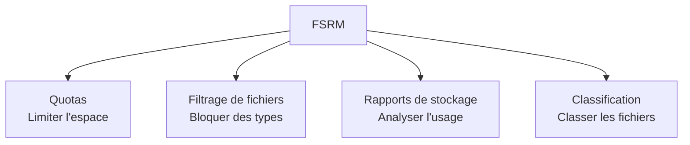

<!--
  Copyright 2026 Julien Bombled

  Licensed under the Apache License, Version 2.0 (the "License");
  you may not use this file except in compliance with the License.
  You may obtain a copy of the License at

      http://www.apache.org/licenses/LICENSE-2.0

  Unless required by applicable law or agreed to in writing, software
  distributed under the License is distributed on an "AS IS" BASIS,
  WITHOUT WARRANTIES OR CONDITIONS OF ANY KIND, either express or implied.
  See the License for the specific language governing permissions and
  limitations under the License.
-->

# Quotas et filtrage FSRM

<span class="level-intermediate">Intermediaire</span> · Temps estime : 30 minutes

## Qu'est-ce que FSRM ?

!!! example "Analogie"

    FSRM fonctionne comme le **reglement interieur d'un parking de bureau**. Les **quotas** sont l'equivalent des places de parking attribuees : chaque service a un nombre limite de places (espace disque) et recoit un avertissement quand il n'en reste plus qu'une. Le **filtrage de fichiers** est le vigile a l'entree qui refuse les camions (fichiers .exe, .mp3) mais laisse passer les voitures (documents bureautiques). Les **rapports**, ce sont les statistiques mensuelles d'occupation du parking.

Le Gestionnaire de ressources du serveur de fichiers (File Server Resource Manager, FSRM) est un ensemble d'outils integres a Windows Server pour controler et gerer les donnees stockees sur les serveurs de fichiers :

- **Quotas** : limiter l'espace disque utilise par dossier
- **Filtrage de fichiers** : bloquer certains types de fichiers
- **Rapports** : generer des rapports sur l'utilisation du stockage
- **Classification** : classer automatiquement les fichiers (non couvert ici)



## Installation

```powershell
# Install FSRM role service
Install-WindowsFeature FS-Resource-Manager -IncludeManagementTools

# Verify installation
Get-WindowsFeature FS-Resource-Manager | Select-Object Name, InstallState
```

Resultat :

```text
Success Restart Needed Exit Code      Feature Result
------- -------------- ---------      --------------
True    No             Success        {File Server Resource Manager}

Name                    InstallState
----                    ------------
FS-Resource-Manager     Installed
```

La console de gestion est accessible via :

```powershell
# Open FSRM management console
fsrm.msc
```

## Quotas

### Types de quotas

| Type | Comportement |
|------|-------------|
| **Hard quota** (strict) | Empeche l'ecriture lorsque la limite est atteinte. L'utilisateur recoit un message d'erreur "Disk full". |
| **Soft quota** (souple) | Autorise le depassement mais declenche des notifications (e-mail, journal d'evenements, commande). |

!!! tip "Choix du type de quota"

    Utilisez un **hard quota** pour les partages utilisateurs (home directories) afin d'empecher un utilisateur de consommer tout l'espace. Utilisez un **soft quota** pour la surveillance et le reporting sans bloquer les operations.

### Seuils de notification

Chaque quota peut avoir plusieurs seuils (en pourcentage) :

| Seuil | Action typique |
|:-----:|---------------|
| 70% | Journaliser l'evenement |
| 85% | Envoyer un e-mail a l'administrateur |
| 95% | Envoyer un e-mail a l'utilisateur + administrateur |
| 100% | Bloquer (hard) ou journaliser (soft) |

### Creer un quota avec PowerShell

```powershell
# Create a hard quota of 5 GB on a folder
New-FsrmQuota -Path "D:\Partages\Comptabilite" `
    -Size 5GB `
    -Description "Quota 5 Go pour le service comptabilite"
```

Avec des seuils de notification :

```powershell
# Define notification thresholds
$threshold85 = New-FsrmQuotaThreshold -Percentage 85 `
    -Action (New-FsrmAction -Type Event -EventType Warning `
        -Body "Quota at 85% on [Quota Path]. Used: [Quota Used] / [Quota Limit]")

$threshold100 = New-FsrmQuotaThreshold -Percentage 100 `
    -Action (New-FsrmAction -Type Event -EventType Error `
        -Body "Quota REACHED on [Quota Path]. Used: [Quota Used] / [Quota Limit]")

# Create a hard quota with thresholds
New-FsrmQuota -Path "D:\Partages\Comptabilite" `
    -Size 5GB `
    -Threshold $threshold85, $threshold100 `
    -Description "Quota 5 Go avec alertes"
```

### Creer un soft quota

```powershell
# Create a soft quota (monitoring only, no blocking)
New-FsrmQuota -Path "D:\Partages\Commun" `
    -Size 10GB `
    -SoftLimit `
    -Description "Surveillance de l'espace commun"
```

### Quota automatique (Auto Apply Quota)

Un quota automatique applique un modele de quota a tous les sous-dossiers existants et futurs :

```powershell
# Create an auto-apply quota that applies to all subfolders
New-FsrmAutoQuota -Path "D:\HomeDirectories" `
    -Template "5 GB Limit"
```

Chaque nouveau sous-dossier cree dans `D:\HomeDirectories` recevra automatiquement un quota de 5 Go.

## Modeles de quotas

Les modeles permettent de standardiser et de reutiliser les configurations de quotas.

### Modeles integres

Windows Server inclut plusieurs modeles par defaut :

| Modele | Type | Taille |
|--------|------|--------|
| 100 MB Limit | Hard | 100 Mo |
| 200 MB Limit Reports to User | Hard | 200 Mo |
| 200 GB Limit Reports to User | Hard | 200 Go |
| Monitor 200 GB Usage | Soft | 200 Go |
| Monitor 500 MB Usage | Soft | 500 Mo |

### Lister les modeles

```powershell
# List all quota templates
Get-FsrmQuotaTemplate | Select-Object Name, Size, SoftLimit |
    Format-Table -AutoSize
```

Resultat :

```text
Name                              Size     SoftLimit
----                              ----     ---------
100 MB Limit                      104857600    False
200 MB Limit Reports to User      209715200    False
200 GB Limit Reports to User      214748364800 False
Monitor 200 GB Usage              214748364800  True
Monitor 500 MB Usage              524288000     True
```

### Creer un modele personnalise

```powershell
# Create threshold actions
$warn = New-FsrmQuotaThreshold -Percentage 85 `
    -Action (New-FsrmAction -Type Event -EventType Warning `
        -Body "Warning: [Quota Path] at [Quota Used Percent]%")

$limit = New-FsrmQuotaThreshold -Percentage 100 `
    -Action (New-FsrmAction -Type Event -EventType Error `
        -Body "Limit reached: [Quota Path]")

# Create the template
New-FsrmQuotaTemplate -Name "Corporate 5GB" `
    -Size 5GB `
    -Threshold $warn, $limit `
    -Description "Standard 5 GB quota for department shares"
```

### Appliquer un modele

```powershell
# Create a quota based on a template
New-FsrmQuota -Path "D:\Partages\RH" -Template "Corporate 5GB"

# Update all quotas derived from a template (after template modification)
Reset-FsrmQuota -Path "D:\Partages\RH" -Template "Corporate 5GB"
```

## Gestion des quotas

### Consulter les quotas existants

```powershell
# List all quotas
Get-FsrmQuota | Select-Object Path,
    @{N='SizeGB';E={[math]::Round($_.Size/1GB,2)}},
    @{N='UsedGB';E={[math]::Round($_.Usage/1GB,2)}},
    @{N='Used%';E={if($_.Size -gt 0){[math]::Round(($_.Usage/$_.Size)*100,1)}else{0}}},
    SoftLimit |
    Format-Table -AutoSize
```

Resultat :

```text
Path                        SizeGB UsedGB Used% SoftLimit
----                        ------ ------ ----- ---------
D:\Partages\Comptabilite      5.00   3.24  64.8     False
D:\Partages\Commun           10.00   7.85  78.5      True
D:\Partages\RH                5.00   1.12  22.4     False
```

### Modifier un quota

```powershell
# Change quota size
Set-FsrmQuota -Path "D:\Partages\Comptabilite" -Size 10GB

# Convert a hard quota to soft
Set-FsrmQuota -Path "D:\Partages\Comptabilite" -SoftLimit
```

### Supprimer un quota

```powershell
# Remove a quota
Remove-FsrmQuota -Path "D:\Partages\Comptabilite" -Confirm:$false
```

## Filtrage de fichiers (File Screening)

Le filtrage de fichiers permet de bloquer ou surveiller le stockage de certains types de fichiers.

### Groupes de fichiers

Les groupes de fichiers definissent les extensions a filtrer :

```powershell
# List built-in file groups
Get-FsrmFileGroup | Select-Object Name, IncludePattern |
    Format-Table -AutoSize
```

Resultat :

```text
Name                    IncludePattern
----                    --------------
Audio and Video Files   {*.aac, *.aif, *.aiff, *.au...}
Backup Files            {*.bak, *.bkf}
Compressed Files        {*.bz2, *.gz, *.lzh, *.rar...}
E-mail Files            {*.eml, *.msg, *.ost, *.pst}
Executable Files        {*.bat, *.cmd, *.com, *.exe...}
Image Files             {*.bmp, *.dib, *.eps, *.gif...}
Office Files            {*.doc, *.docx, *.ppt, *.xls...}
```

Groupes integres courants :

| Groupe | Extensions incluses |
|--------|-------------------|
| Audio and Video Files | *.mp3, *.mp4, *.avi, *.mkv, etc. |
| Executable Files | *.exe, *.com, *.bat, *.cmd, etc. |
| Image Files | *.jpg, *.png, *.gif, *.bmp, etc. |
| Backup Files | *.bak, *.bkf, etc. |
| Compressed Files | *.zip, *.rar, *.7z, *.gz, etc. |

### Creer un groupe de fichiers personnalise

```powershell
# Create a file group for ransomware extensions
New-FsrmFileGroup -Name "Ransomware Extensions" `
    -IncludePattern @("*.encrypted", "*.locked", "*.crypto",
        "*.crypt", "*.locky", "*.cerber", "*.zepto",
        "DECRYPT_INSTRUCTION*", "HELP_DECRYPT*")
```

### Types de filtres

| Type | Comportement |
|------|-------------|
| **Active screening** (actif) | Bloque la creation des fichiers correspondants |
| **Passive screening** (passif) | Autorise mais journalise et notifie |

### Creer un filtre de fichiers

```powershell
# Create an active file screen (blocks matched files)
New-FsrmFileScreen -Path "D:\Partages\Commun" `
    -IncludeGroup "Audio and Video Files", "Executable Files" `
    -Description "Block multimedia and executables"

# Create a passive file screen (monitor only)
New-FsrmFileScreen -Path "D:\Partages\RH" `
    -IncludeGroup "Executable Files" `
    -Notification (New-FsrmAction -Type Event -EventType Warning `
        -Body "Executable file detected: [File Screen Path]\[Source File Name]") `
    -Active:$false `
    -Description "Monitor executables in HR share"
```

### Modeles de filtres

```powershell
# List file screen templates
Get-FsrmFileScreenTemplate | Select-Object Name, IncludeGroup, Active |
    Format-Table -AutoSize

# Create a custom template
New-FsrmFileScreenTemplate -Name "Block Multimedia" `
    -IncludeGroup "Audio and Video Files", "Image Files" `
    -Active `
    -Description "Blocks multimedia files on data shares"

# Apply template to a path
New-FsrmFileScreen -Path "D:\Partages\Comptabilite" `
    -Template "Block Multimedia"
```

### Exceptions de filtre

```powershell
# Create an exception to allow specific file types in a subfolder
New-FsrmFileScreenException -Path "D:\Partages\Commun\Media" `
    -IncludeGroup "Image Files"
```

### Gerer les filtres existants

```powershell
# List active file screens
Get-FsrmFileScreen | Select-Object Path, IncludeGroup, Active |
    Format-Table -AutoSize

# Remove a file screen
Remove-FsrmFileScreen -Path "D:\Partages\Commun" -Confirm:$false
```

## Rapports de stockage

FSRM peut generer des rapports detailles sur l'utilisation du stockage.

### Types de rapports disponibles

| Rapport | Description |
|---------|-------------|
| Duplicate Files | Fichiers en double |
| File Screening Audit | Tentatives de creation de fichiers bloques |
| Files by File Group | Fichiers regroupes par type |
| Files by Owner | Fichiers par proprietaire |
| Large Files | Fichiers depassant une taille seuil |
| Least Recently Accessed | Fichiers les moins recemment accedes |
| Most Recently Accessed | Fichiers les plus recemment accedes |
| Quota Usage | Utilisation des quotas |

### Generer un rapport a la demande

```powershell
# Generate a storage report for large files and duplicate files
New-FsrmStorageReport -Name "Monthly Audit" `
    -Namespace "D:\Partages" `
    -ReportType LargeFiles, DuplicateFiles, FilesByOwner `
    -LargeFileMinimum 100MB `
    -ReportFormat HTML `
    -Interactive
```

!!! info "Parametre -Interactive"

    Le parametre `-Interactive` genere le rapport immediatement. Sans ce parametre, le rapport est planifie selon le calendrier defini.

### Planifier un rapport

```powershell
# Schedule a weekly storage report
$schedule = New-FsrmScheduledTask -Weekly Monday -Time "02:00"

New-FsrmStorageReport -Name "Weekly Storage Report" `
    -Namespace "D:\Partages" `
    -ReportType QuotaUsage, LargeFiles, FilesByFileGroup `
    -Schedule $schedule `
    -ReportFormat HTML `
    -MailTo "admin@lab.local"
```

### Configuration SMTP pour les notifications

```powershell
# Configure SMTP server for email notifications
Set-FsrmSetting -SmtpServer "smtp.lab.local" `
    -AdminEmailAddress "admin@lab.local" `
    -FromEmailAddress "fsrm@lab.local"

# Send a test email
Send-FsrmTestEmail -ToEmailAddress "admin@lab.local"
```

## Exemples de configurations types

### Serveur de fichiers d'entreprise

```powershell
# 1. Install FSRM
Install-WindowsFeature FS-Resource-Manager -IncludeManagementTools

# 2. Create quota template
$warn = New-FsrmQuotaThreshold -Percentage 85 `
    -Action (New-FsrmAction -Type Event -EventType Warning `
        -Body "[Quota Path] at [Quota Used Percent]%")
$limit = New-FsrmQuotaThreshold -Percentage 100 `
    -Action (New-FsrmAction -Type Event -EventType Error `
        -Body "[Quota Path] FULL")

New-FsrmQuotaTemplate -Name "Department 10GB" `
    -Size 10GB -Threshold $warn, $limit

# 3. Apply quotas to department shares
$departments = @("Comptabilite", "RH", "Direction", "IT")
foreach ($dept in $departments) {
    New-FsrmQuota -Path "D:\Partages\$dept" -Template "Department 10GB"
}

# 4. Block dangerous file types
New-FsrmFileScreen -Path "D:\Partages" `
    -IncludeGroup "Executable Files" `
    -Description "Block executables on all shares"

# 5. Allow executables in IT share only
New-FsrmFileScreenException -Path "D:\Partages\IT" `
    -IncludeGroup "Executable Files"
```

### Home directories avec quotas automatiques

```powershell
# Auto-apply 2 GB quota to each user home directory
$warn = New-FsrmQuotaThreshold -Percentage 90 `
    -Action (New-FsrmAction -Type Event -EventType Warning `
        -Body "Home directory [Quota Path] at [Quota Used Percent]%")

New-FsrmQuotaTemplate -Name "Home 2GB" -Size 2GB -Threshold $warn

New-FsrmAutoQuota -Path "D:\HomeDirectories" -Template "Home 2GB"
```

## Points cles a retenir

- **FSRM** fournit quotas, filtrage de fichiers et rapports pour les serveurs de fichiers
- Les **hard quotas** bloquent l'ecriture a la limite ; les **soft quotas** alertent uniquement
- Les **modeles de quotas** standardisent les configurations et facilitent les modifications en masse
- Les **quotas automatiques** s'appliquent a tous les sous-dossiers (ideal pour les home directories)
- Le **filtrage actif** bloque les types de fichiers interdits ; le **filtrage passif** surveille sans bloquer
- Les **exceptions** de filtre permettent d'autoriser des types specifiques dans certains sous-dossiers
- Les **rapports de stockage** identifient les fichiers volumineux, les doublons et l'utilisation par proprietaire
- Configurez le **serveur SMTP** pour recevoir les notifications par e-mail

!!! example "Scenario pratique"

    **Contexte :** David, administrateur systeme, constate que le volume de donnees du serveur de fichiers SRV-01 est sature a 95%. Apres investigation, il decouvre que des utilisateurs stockent des fichiers personnels volumineux (films, musique) dans le partage commun.

    **Diagnostic :**

    ```powershell
    # Generate a report to find large files and files by type
    New-FsrmStorageReport -Name "Audit Urgence" `
        -Namespace "D:\Partages\Commun" `
        -ReportType LargeFiles, FilesByFileGroup `
        -LargeFileMinimum 100MB `
        -ReportFormat HTML `
        -Interactive

    # Check file groups consuming space
    Get-ChildItem -Path "D:\Partages\Commun" -Recurse -File |
        Where-Object { $_.Extension -match '\.(mp4|avi|mkv|mp3|flac)$' } |
        Measure-Object Length -Sum |
        Select-Object @{N='TotalGB';E={[math]::Round($_.Sum/1GB,2)}}, Count
    ```

    Resultat :

    ```text
    TotalGB Count
    ------- -----
      45.67   128
    ```

    45 Go de fichiers multimedia dans le partage commun.

    **Solution en 3 etapes :**

    ```powershell
    # 1. Block multimedia files going forward
    New-FsrmFileScreen -Path "D:\Partages\Commun" `
        -IncludeGroup "Audio and Video Files" `
        -Description "Block multimedia in common share"

    # 2. Set a quota to prevent future saturation
    New-FsrmQuota -Path "D:\Partages\Commun" -Size 50GB `
        -Description "Quota 50 Go partage commun"

    # 3. Notify users and clean up existing files
    Get-ChildItem -Path "D:\Partages\Commun" -Recurse -File |
        Where-Object { $_.Extension -match '\.(mp4|avi|mkv|mp3|flac)$' } |
        Select-Object FullName, @{N='SizeMB';E={[math]::Round($_.Length/1MB,1)}} |
        Export-Csv -Path "C:\Reports\fichiers-multimedia.csv" -NoTypeInformation
    ```

    David envoie la liste aux managers pour validation avant suppression. Le filtre FSRM empeche les nouveaux fichiers multimedia, et le quota alerte en cas de saturation future.

!!! danger "Erreurs courantes"

    1. **Utiliser un hard quota sans avertissement prealable** : un quota strict sans seuils de notification a 70% et 85% surprend les utilisateurs. Ils decouvrent le blocage au pire moment (fichier important non sauvegarde). Configurez toujours des seuils d'alerte progressifs.

    2. **Oublier les quotas automatiques pour les home directories** : sans `New-FsrmAutoQuota`, les nouveaux dossiers utilisateur n'auront pas de quota. Un seul utilisateur peut alors consommer tout l'espace du volume.

    3. **Filtrage actif sans exception pour les services IT** : bloquer les executables sur tous les partages empeche le service IT de deployer des logiciels. Creez toujours une exception FSRM (`New-FsrmFileScreenException`) sur les dossiers IT.

    4. **Ne pas configurer le serveur SMTP** : sans configuration SMTP (`Set-FsrmSetting`), aucune notification par e-mail n'est envoyee. Les alertes se limitent au journal d'evenements que personne ne consulte proactivement.

    5. **Sous-estimer l'impact du soft quota** : un soft quota alerte mais ne bloque pas. Si personne ne reagit aux alertes, le volume se remplit tout de meme. Pour les dossiers a risque, privilegiez un hard quota combine a des alertes par e-mail.

## Pour aller plus loin

- [Permissions NTFS](permissions-ntfs.md)
- [Permissions de partage](permissions-partage.md)
- [BranchCache](branchcache.md)

