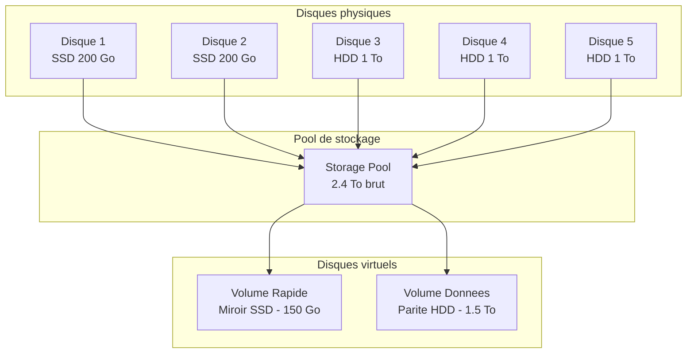
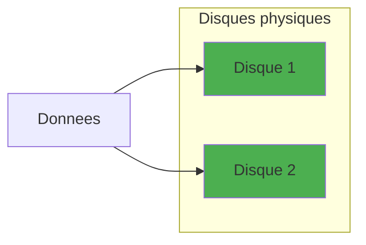
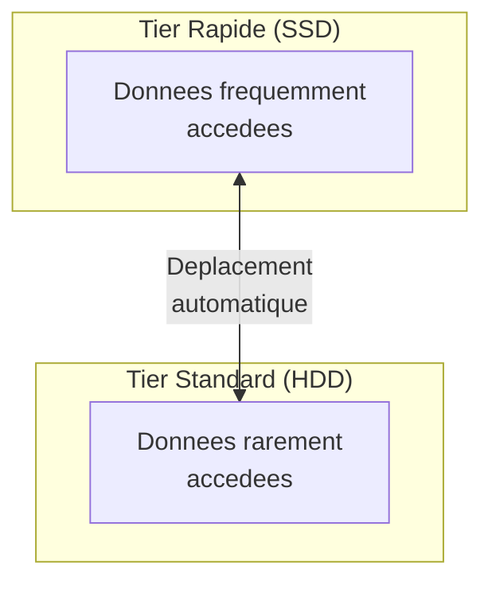

# Concepts de Storage Spaces

<span class="level-intermediate">Intermediaire</span> · Temps estime : 25 minutes

## Vue d'ensemble

!!! example "Analogie"

    Imaginez que vous avez plusieurs **tirelires** de tailles differentes (vos disques physiques). Plutot que de gerer chaque tirelire separement, vous versez tout dans un **coffre-fort commun** (le pool de stockage). Ensuite, vous creez des **enveloppes budgetaires** (les disques virtuels) avec des regles de protection : une enveloppe en double exemplaire pour vos documents importants (miroir), ou une enveloppe moins protegee pour vos brouillons (simple).

Storage Spaces est la technologie de virtualisation du stockage integree a Windows Server. Elle permet de regrouper des disques physiques heterogenes dans un pool commun, puis de creer des disques virtuels avec differents niveaux de resilience.



## Architecture en couches

Storage Spaces s'organise en trois couches distinctes :

### 1. Disques physiques (Physical Disks)

Ce sont les disques reels connectes au serveur. Ils peuvent etre :

- Des disques internes (SATA, SAS, NVMe)
- Des disques dans un boitier JBOD (Just a Bunch of Disks)
- Des types differents (SSD et HDD melanges)

!!! warning "Disques eligibles"

    Seuls les disques **non initialises** (sans partition) peuvent etre ajoutes a un pool. Le disque systeme ne peut pas etre inclus dans un pool.

### 2. Pool de stockage (Storage Pool)

Le pool est un regroupement logique de disques physiques :

- Agregation de la capacite de plusieurs disques
- Les disques peuvent etre de tailles et de types differents
- Un disque physique ne peut appartenir qu'a un seul pool
- Le pool peut etre etendu en ajoutant de nouveaux disques a chaud

### 3. Disques virtuels (Virtual Disks / Storage Spaces)

Les disques virtuels sont crees a partir de l'espace disponible dans un pool :

- Chaque disque virtuel peut avoir son propre niveau de resilience
- Un volume est cree sur chaque disque virtuel
- Le provisioning peut etre fixe ou dynamique (thin)

## Modes de resilience

Le mode de resilience determine comment les donnees sont protegees contre les defaillances de disques.

### Simple (pas de resilience)



| Propriete | Valeur |
|-----------|--------|
| Disques minimum | 1 |
| Tolerance de pannes | Aucune |
| Efficacite du stockage | 100% |
| Performance | Maximale |

!!! danger "Aucune protection"

    En mode Simple, la perte d'un seul disque entraine la perte de toutes les donnees du disque virtuel. A utiliser uniquement pour les donnees temporaires ou facilement regenerables.

### Miroir bidirectionnel (Two-Way Mirror)

Chaque bloc de donnees est ecrit sur deux disques differents :

| Propriete | Valeur |
|-----------|--------|
| Disques minimum | 2 |
| Tolerance de pannes | 1 disque |
| Efficacite du stockage | 50% |
| Performance en lecture | Excellente |
| Performance en ecriture | Bonne |

### Miroir tridirectionnel (Three-Way Mirror)

Chaque bloc de donnees est ecrit sur trois disques differents :

| Propriete | Valeur |
|-----------|--------|
| Disques minimum | 5 |
| Tolerance de pannes | 2 disques |
| Efficacite du stockage | 33% |
| Performance en lecture | Excellente |
| Performance en ecriture | Moderee |

!!! tip "Quand utiliser le miroir tridirectionnel"

    Le miroir tridirectionnel est recommande pour les charges critiques (bases de donnees, machines virtuelles) ou le cout du downtime est eleve. Il survit a la perte simultanee de deux disques.

### Parite (Parity)

Equivalent du RAID 5/6, utilise le calcul de parite pour la protection :

**Parite simple :**

| Propriete | Valeur |
|-----------|--------|
| Disques minimum | 3 |
| Tolerance de pannes | 1 disque |
| Efficacite du stockage | (N-1)/N |
| Performance en lecture | Bonne |
| Performance en ecriture | Faible (calcul de parite) |

**Double parite :**

| Propriete | Valeur |
|-----------|--------|
| Disques minimum | 7 |
| Tolerance de pannes | 2 disques |
| Efficacite du stockage | (N-2)/N |
| Performance en lecture | Bonne |
| Performance en ecriture | Faible |

!!! warning "Performances en ecriture"

    La parite est lente en ecriture a cause du calcul de parite (penalite lecture-modification-ecriture). Elle est adaptee aux donnees d'archivage ou en lecture intensive, mais pas aux bases de donnees.

### Tableau comparatif des modes

| Mode | Disques min | Pannes tolerees | Efficacite | Usage recommande |
|------|:-----------:|:---------------:|:----------:|------------------|
| Simple | 1 | 0 | 100% | Donnees temporaires |
| Miroir 2 | 2 | 1 | 50% | OS, applications |
| Miroir 3 | 5 | 2 | 33% | Bases de donnees critiques |
| Parite simple | 3 | 1 | ~67-87% | Archives, sauvegardes |
| Double parite | 7 | 2 | ~71-86% | Archives volumineuses |

## Tiers de stockage (Storage Tiers)

Les tiers permettent de combiner des disques SSD et HDD dans un meme disque virtuel, avec placement automatique des donnees selon leur frequence d'acces.



### Fonctionnement

- Les donnees « chaudes » (frequemment accedees) sont automatiquement deplacees vers le tier SSD
- Les donnees « froides » (rarement accedees) migrent vers le tier HDD
- Le deplacement se fait par defaut a 1h du matin (tache planifiee)
- Un cache en ecriture (write-back cache) sur SSD accelere les ecritures

### Configuration requise

- Au minimum 1 SSD et 1 HDD dans le pool
- Les tiers sont definis par type de media (SSD / HDD)
- Chaque tier peut avoir son propre mode de resilience

```powershell
# View media types of physical disks in a pool
Get-PhysicalDisk -StoragePool (Get-StoragePool -FriendlyName "MonPool") |
    Select-Object FriendlyName, MediaType,
        @{N='SizeGB';E={[math]::Round($_.Size/1GB,2)}} |
    Format-Table -AutoSize
```

Resultat :

```text
FriendlyName   MediaType SizeGB
------------   --------- ------
ATA Disk 1     SSD       200.00
ATA Disk 2     SSD       200.00
ATA Disk 3     HDD      1024.00
ATA Disk 4     HDD      1024.00
ATA Disk 5     HDD      1024.00
```

## Provisioning : fixe vs dynamique

### Provisioning fixe (Fixed / Thick)

L'espace est entierement alloue a la creation :

- L'espace sur les disques physiques est immediatement reserve
- Meilleures performances (pas de fragmentation)
- L'espace disponible dans le pool diminue immediatement

### Provisioning dynamique (Thin)

L'espace est alloue a la demande :

- Seul l'espace reellement utilise est consomme sur les disques physiques
- Permet de sur-provisionner (creer plus d'espace virtuel que l'espace physique disponible)
- Necessite une surveillance de l'espace pour eviter la saturation

!!! danger "Attention au thin provisioning"

    Avec le provisioning dynamique, le pool peut se retrouver en rupture d'espace si la consommation reelle depasse la capacite physique. Configurez des alertes sur l'espace restant dans le pool.

```powershell
# Check actual vs provisioned space
Get-StoragePool -FriendlyName "MonPool" |
    Select-Object FriendlyName,
        @{N='SizeGB';E={[math]::Round($_.Size/1GB,2)}},
        @{N='AllocatedGB';E={[math]::Round($_.AllocatedSize/1GB,2)}},
        @{N='FreeGB';E={[math]::Round(($_.Size - $_.AllocatedSize)/1GB,2)}} |
    Format-List
```

Resultat :

```text
FriendlyName : MonPool
SizeGB       : 2448.00
AllocatedGB  : 350.00
FreeGB       : 2098.00
```

## Disques de secours (Hot Spare)

Un disque de secours reste inactif dans le pool jusqu'a ce qu'un disque actif tombe en panne. Storage Spaces reconstruit alors automatiquement les donnees sur le disque de secours.

```powershell
# Set a physical disk as hot spare
Set-PhysicalDisk -FriendlyName "Disk5" -Usage HotSpare

# View disk usage roles
Get-PhysicalDisk -StoragePool (Get-StoragePool -FriendlyName "MonPool") |
    Select-Object FriendlyName, Usage, HealthStatus |
    Format-Table -AutoSize
```

Resultat :

```text
FriendlyName   Usage      HealthStatus
------------   -----      ------------
ATA Disk 1     Auto-Select Healthy
ATA Disk 2     Auto-Select Healthy
ATA Disk 3     Auto-Select Healthy
ATA Disk 4     Auto-Select Healthy
ATA Disk 5     HotSpare    Healthy
```

Les roles possibles d'un disque physique :

| Usage | Description |
|-------|-------------|
| **Auto-Select** | Utilise automatiquement pour le stockage (defaut) |
| **HotSpare** | Reserve comme disque de secours |
| **Retired** | Marque pour retrait (donnees en cours de migration) |
| **Journal** | Utilise comme journal d'ecriture (S2D) |

## Points cles a retenir

- **Storage Spaces** virtualise le stockage en trois couches : disques physiques, pool, disques virtuels
- Le **pool de stockage** regroupe des disques heterogenes en un espace commun
- Le **miroir bidirectionnel** (50% d'efficacite) est le meilleur compromis performances/protection
- La **parite** offre une meilleure efficacite de stockage mais des performances en ecriture reduites
- Les **tiers de stockage** (SSD + HDD) optimisent automatiquement le placement des donnees
- Le **provisioning dynamique** (thin) permet la sur-allocation mais necessite une surveillance attentive
- Les **disques de secours** (hot spare) assurent une reconstruction automatique apres une panne

!!! example "Scenario pratique"

    **Contexte :** Claire, responsable IT d'une PME, doit choisir le mode de resilience pour le nouveau serveur de fichiers SRV-01. Elle dispose de 4 disques HDD de 2 To. Les donnees sont critiques (contrats, factures) et la direction refuse tout risque de perte.

    **Analyse :**

    ```powershell
    # Check available disks
    Get-PhysicalDisk -CanPool $true |
        Select-Object DeviceId, FriendlyName, MediaType,
            @{N='SizeGB';E={[math]::Round($_.Size/1GB,2)}} |
        Format-Table -AutoSize
    ```

    Resultat :

    ```text
    DeviceId FriendlyName MediaType SizeGB
    -------- ------------ --------- ------
    1        ATA Disk 1   HDD       2048.00
    2        ATA Disk 2   HDD       2048.00
    3        ATA Disk 3   HDD       2048.00
    4        ATA Disk 4   HDD       2048.00
    ```

    **Decision :** Avec 4 disques HDD et des donnees critiques, Claire choisit le **miroir bidirectionnel**. Ce mode tolere la panne d'un disque tout en offrant de bonnes performances en lecture. L'espace utilisable sera de 50%, soit environ 4 To sur 8 To bruts. La **parite** aurait offert plus d'espace (~67%), mais les performances en ecriture seraient penalisees pour les fichiers bureautiques modifies frequemment.

    Elle reserve le 4e disque comme **hot spare** pour une reconstruction automatique en cas de defaillance.

!!! danger "Erreurs courantes"

    1. **Choisir le mode Simple pour des donnees de production** : le mode Simple n'offre aucune tolerance de pannes. La perte d'un seul disque entraine la perte de toutes les donnees. Reservez-le aux caches temporaires ou aux donnees facilement regenerables.

    2. **Sous-estimer le nombre de disques requis** : le miroir tridirectionnel necessite 5 disques minimum, pas 3. Verifiez les prerequis avant de planifier vos achats.

    3. **Utiliser la parite pour des charges en ecriture intensive** : la parite (RAID 5 equivalent) impose une penalite de lecture-modification-ecriture a chaque operation. Les bases de donnees et les machines virtuelles necessitent un mode miroir.

    4. **Oublier de surveiller le thin provisioning** : avec le provisioning dynamique, vous pouvez creer des volumes plus grands que l'espace physique. Si le pool se remplit sans alerte, les volumes passent hors ligne et les applications s'arretent.

    5. **Ne pas prevoir de disque hot spare** : sans disque de secours, la reconstruction apres une panne attend l'intervention manuelle. Pendant ce temps, le pool fonctionne en mode degrade et une deuxieme defaillance peut etre fatale.

## Pour aller plus loin

- [Creation d'un pool de stockage](creation-pool.md)
- [Storage Spaces Direct](storage-spaces-direct.md)
- [Types de disques](../disques/types-de-disques.md)
