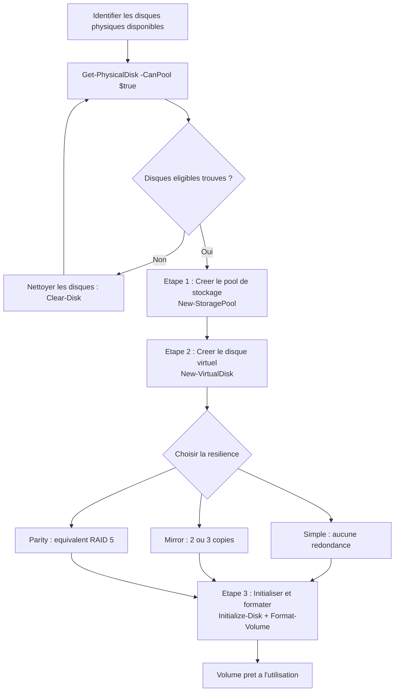

<!--
  Copyright 2026 Julien Bombled

  Licensed under the Apache License, Version 2.0 (the "License");
  you may not use this file except in compliance with the License.
  You may obtain a copy of the License at

      http://www.apache.org/licenses/LICENSE-2.0

  Unless required by applicable law or agreed to in writing, software
  distributed under the License is distributed on an "AS IS" BASIS,
  WITHOUT WARRANTIES OR CONDITIONS OF ANY KIND, either express or implied.
  See the License for the specific language governing permissions and
  limitations under the License.
-->
---
title: Creation d'un pool de stockage
description: Creer et gerer des pools de stockage et des disques virtuels avec PowerShell et Server Manager sous Windows Server 2022.
tags:
  - stockage
  - storage-spaces
  - intermediaire
---

# Creation d'un pool de stockage

<span class="level-intermediate">Intermediaire</span> · Temps estime : 30 minutes

!!! example "Analogie"

    Creer un pool de stockage, c'est comme amenager une **bibliotheque**. D'abord, vous rassemblez toutes vos etageres vides (les disques physiques) dans une meme piece (le pool). Ensuite, vous creez des rayons thematiques (les disques virtuels) avec des regles de rangement : certains livres importants sont en double exemplaire (miroir), tandis que les archives sont rangees avec un index de reconstruction (parite). Enfin, vous etiquetez chaque rayon (le formatage et la lettre de lecteur).

## Processus de creation d'un pool de stockage



## Prerequis

Avant de creer un pool de stockage, verifiez que :

- Vous disposez d'au moins **un disque physique non initialise** (sans partition ni volume)
- Le ou les disques ne font pas partie d'un autre pool
- Le disque systeme ne sera pas inclus dans le pool

```powershell
# List available physical disks (not in a pool, not the boot disk)
Get-PhysicalDisk -CanPool $true |
    Select-Object DeviceId, FriendlyName, MediaType,
        @{N='SizeGB';E={[math]::Round($_.Size/1GB,2)}},
        CanPool |
    Format-Table -AutoSize
```

Resultat :

```text
DeviceId FriendlyName MediaType SizeGB CanPool
-------- ------------ --------- ------ -------
1        ATA Disk 1   HDD       500.00    True
2        ATA Disk 2   HDD       500.00    True
3        ATA Disk 3   HDD       500.00    True
4        ATA Disk 4   SSD       200.00    True
```

!!! tip "Disques non eligibles"

    Si `Get-PhysicalDisk -CanPool $true` ne retourne aucun resultat, verifiez que les disques sont vierges (non initialises). Utilisez `Clear-Disk` pour les nettoyer.

    ```powershell
    # Clean a disk (removes all partitions and data)
    Clear-Disk -Number 1 -RemoveData -RemoveOEM -Confirm:$false
    ```

## Creation avec PowerShell

### Etape 1 : Creer le pool de stockage

```powershell
# Get the storage subsystem
$subsystem = Get-StorageSubSystem -FriendlyName "*Windows*"

# Get eligible physical disks
$disks = Get-PhysicalDisk -CanPool $true

# Create the storage pool
New-StoragePool -FriendlyName "PoolDonnees" `
    -StorageSubSystemFriendlyName $subsystem.FriendlyName `
    -PhysicalDisks $disks
```

Pour selectionner des disques specifiques :

```powershell
# Select specific disks by DeviceId
$disks = Get-PhysicalDisk -CanPool $true |
    Where-Object { $_.DeviceId -in @("1", "2", "3") }

New-StoragePool -FriendlyName "PoolDonnees" `
    -StorageSubSystemFriendlyName $subsystem.FriendlyName `
    -PhysicalDisks $disks
```

### Etape 2 : Creer un disque virtuel

```powershell
# Two-way mirror virtual disk, fixed provisioning
New-VirtualDisk -StoragePoolFriendlyName "PoolDonnees" `
    -FriendlyName "VD-Mirror" `
    -ResiliencySettingName Mirror `
    -Size 100GB `
    -ProvisioningType Fixed
```

Options de resilience :

```powershell
# Simple (no resilience)
New-VirtualDisk -StoragePoolFriendlyName "PoolDonnees" `
    -FriendlyName "VD-Simple" `
    -ResiliencySettingName Simple `
    -Size 200GB `
    -ProvisioningType Thin

# Parity (RAID 5 equivalent)
New-VirtualDisk -StoragePoolFriendlyName "PoolDonnees" `
    -FriendlyName "VD-Parity" `
    -ResiliencySettingName Parity `
    -Size 500GB `
    -ProvisioningType Fixed

# Three-way mirror (requires 5+ disks)
New-VirtualDisk -StoragePoolFriendlyName "PoolDonnees" `
    -FriendlyName "VD-Mirror3" `
    -ResiliencySettingName Mirror `
    -NumberOfDataCopies 3 `
    -Size 50GB
```

!!! info "Provisioning dynamique (Thin)"

    Avec `-ProvisioningType Thin`, la taille du disque virtuel peut depasser l'espace physique disponible dans le pool. L'espace est alloue a la demande au fur et a mesure de l'utilisation.

### Etape 3 : Initialiser et formater le volume

```powershell
# Initialize the virtual disk
$vd = Get-VirtualDisk -FriendlyName "VD-Mirror"
$vd | Initialize-Disk -PartitionStyle GPT -PassThru |
    New-Partition -UseMaximumSize -AssignDriveLetter |
    Format-Volume -FileSystem NTFS -NewFileSystemLabel "Donnees" -Confirm:$false
```

### Pipeline complet en une commande

```powershell
# Full pipeline: pool -> virtual disk -> volume
New-VirtualDisk -StoragePoolFriendlyName "PoolDonnees" `
    -FriendlyName "VD-Apps" `
    -ResiliencySettingName Mirror `
    -Size 100GB `
    -ProvisioningType Fixed |
    Initialize-Disk -PartitionStyle GPT -PassThru |
    New-Partition -UseMaximumSize -AssignDriveLetter |
    Format-Volume -FileSystem NTFS -NewFileSystemLabel "Applications" -Confirm:$false
```

Resultat :

```text
DriveLetter FileSystemLabel FileSystem DriveType HealthStatus SizeRemaining    Size
----------- --------------- ---------- --------- ------------ -------------    ----
E           Applications    NTFS       Fixed     Healthy         99.87 GB   99.97 GB
```

## Creation avec les tiers de stockage

Si votre pool contient des disques SSD et HDD, vous pouvez creer un disque virtuel avec tiers automatiques.

### Configurer les tiers

```powershell
# Verify media types are correctly detected
Get-PhysicalDisk -StoragePool (Get-StoragePool -FriendlyName "PoolDonnees") |
    Select-Object FriendlyName, MediaType,
        @{N='SizeGB';E={[math]::Round($_.Size/1GB,2)}} |
    Format-Table -AutoSize

# View available storage tiers
Get-StorageTier -MediaType SSD | Select-Object FriendlyName, MediaType, ResiliencySettingName
Get-StorageTier -MediaType HDD | Select-Object FriendlyName, MediaType, ResiliencySettingName
```

Resultat :

```text
FriendlyName MediaType SizeGB
------------ --------- ------
ATA Disk 1   HDD       500.00
ATA Disk 2   HDD       500.00
ATA Disk 3   HDD       500.00
ATA Disk 4   SSD       200.00

FriendlyName             MediaType ResiliencySettingName
------------             --------- --------------------
PoolDonnees-SSD-Mirror   SSD       Mirror
PoolDonnees-SSD-Parity   SSD       Parity

PoolDonnees-HDD-Mirror   HDD       Mirror
PoolDonnees-HDD-Parity   HDD       Parity
```

### Creer un disque virtuel avec tiers

```powershell
# Get tier references
$ssdTier = Get-StorageTier -FriendlyName "*SSD*" |
    Where-Object { $_.ResiliencySettingName -eq "Mirror" }
$hddTier = Get-StorageTier -FriendlyName "*HDD*" |
    Where-Object { $_.ResiliencySettingName -eq "Parity" }

# Create tiered virtual disk (mirror on SSD, parity on HDD)
New-VirtualDisk -StoragePoolFriendlyName "PoolDonnees" `
    -FriendlyName "VD-Tiered" `
    -StorageTiers $ssdTier, $hddTier `
    -StorageTierSizes 20GB, 200GB `
    -WriteCacheSize 1GB
```

!!! tip "Write-back cache"

    Le parametre `-WriteCacheSize` configure un cache d'ecriture sur SSD. Les ecritures sont d'abord stockees sur le tier SSD rapide, puis migrees vers le tier HDD en arriere-plan. La valeur par defaut est 1 Go.

## Creation avec Server Manager

L'interface graphique offre un assistant guide pour la creation de pools et disques virtuels.

### Etape 1 : Ouvrir l'assistant

1. Ouvrir **Server Manager** > **File and Storage Services** > **Volumes** > **Storage Pools**
2. Dans la zone **PHYSICAL DISKS**, verifier les disques disponibles
3. Dans **TASKS** (barre superieure), cliquer sur **New Storage Pool...**

### Etape 2 : Creer le pool

1. Nommer le pool et ajouter une description
2. Selectionner les disques physiques a inclure
3. Definir le role de chaque disque (Auto-Select ou Hot Spare)
4. Confirmer et creer

### Etape 3 : Creer le disque virtuel

1. Dans le pool nouvellement cree, cliquer **New Virtual Disk...**
2. Choisir la disposition de stockage (Simple, Mirror, Parity)
3. Selectionner le provisioning (Fixed ou Thin)
4. Definir la taille
5. L'assistant propose ensuite de creer un volume automatiquement

## Gestion courante

### Surveiller l'etat du pool

```powershell
# Pool health overview
Get-StoragePool | Where-Object { $_.IsPrimordial -eq $false } |
    Select-Object FriendlyName, HealthStatus, OperationalStatus,
        @{N='SizeGB';E={[math]::Round($_.Size/1GB,2)}},
        @{N='AllocatedGB';E={[math]::Round($_.AllocatedSize/1GB,2)}},
        @{N='FreeGB';E={[math]::Round(($_.Size - $_.AllocatedSize)/1GB,2)}} |
    Format-Table -AutoSize

# Virtual disk health
Get-VirtualDisk |
    Select-Object FriendlyName, HealthStatus, OperationalStatus,
        ResiliencySettingName,
        @{N='SizeGB';E={[math]::Round($_.Size/1GB,2)}},
        @{N='UsedGB';E={[math]::Round($_.FootprintOnPool/1GB,2)}} |
    Format-Table -AutoSize

# Physical disk health
Get-PhysicalDisk -StoragePool (Get-StoragePool -FriendlyName "PoolDonnees") |
    Select-Object FriendlyName, HealthStatus, OperationalStatus, Usage,
        @{N='SizeGB';E={[math]::Round($_.Size/1GB,2)}} |
    Format-Table -AutoSize
```

Resultat :

```text
FriendlyName HealthStatus OperationalStatus SizeGB AllocatedGB FreeGB
------------ ------------ ----------------- ------ ----------- ------
PoolDonnees  Healthy      OK                1700.00      350.00 1350.00

FriendlyName HealthStatus OperationalStatus ResiliencySettingName SizeGB UsedGB
------------ ------------ ----------------- -------------------- ------ ------
VD-Mirror    Healthy      OK                Mirror               100.00 200.00
VD-Parity    Healthy      OK                Parity               500.00 667.00
VD-Apps      Healthy      OK                Mirror               100.00 200.00

FriendlyName HealthStatus OperationalStatus Usage       SizeGB
------------ ------------ ----------------- -----       ------
ATA Disk 1   Healthy      OK                Auto-Select 500.00
ATA Disk 2   Healthy      OK                Auto-Select 500.00
ATA Disk 3   Healthy      OK                Auto-Select 500.00
ATA Disk 4   Healthy      OK                Auto-Select 200.00
```

### Ajouter un disque au pool

```powershell
# Add a new physical disk to an existing pool
$newDisk = Get-PhysicalDisk -CanPool $true | Where-Object { $_.DeviceId -eq "4" }
Add-PhysicalDisk -StoragePoolFriendlyName "PoolDonnees" -PhysicalDisks $newDisk
```

### Etendre un disque virtuel

```powershell
# Extend a virtual disk (after adding disks to the pool)
Resize-VirtualDisk -FriendlyName "VD-Mirror" -Size 200GB

# Then extend the partition on the volume
$partition = Get-VirtualDisk -FriendlyName "VD-Mirror" |
    Get-Disk | Get-Partition | Where-Object { $_.Type -eq "Basic" }
$maxSize = ($partition | Get-PartitionSupportedSize).SizeMax
$partition | Resize-Partition -Size $maxSize
```

### Retirer un disque du pool

```powershell
# Mark a disk as retired (data will be migrated to remaining disks)
Set-PhysicalDisk -FriendlyName "Disk3" -Usage Retired

# Remove the disk after migration completes
Remove-PhysicalDisk -StoragePoolFriendlyName "PoolDonnees" -PhysicalDisks (
    Get-PhysicalDisk -FriendlyName "Disk3"
)
```

!!! warning "Espace suffisant"

    Le retrait d'un disque ne reussit que si les disques restants ont assez d'espace pour accueillir les donnees migrees, tout en respectant le niveau de resilience.

### Reparer un disque virtuel degrade

```powershell
# Check degraded virtual disks
Get-VirtualDisk | Where-Object { $_.HealthStatus -ne "Healthy" } |
    Select-Object FriendlyName, HealthStatus, OperationalStatus

# Trigger repair (automatic if hot spare available)
Repair-VirtualDisk -FriendlyName "VD-Mirror"
```

### Supprimer un pool et ses composants

```powershell
# Remove volume, partition, virtual disk, then pool
$vd = Get-VirtualDisk -FriendlyName "VD-Mirror"
$vd | Get-Disk | Get-Partition | Where-Object { $_.Type -eq "Basic" } |
    Remove-Partition -Confirm:$false
$vd | Remove-VirtualDisk -Confirm:$false

# Remove the storage pool
Remove-StoragePool -FriendlyName "PoolDonnees" -Confirm:$false
```

## Exemples de configurations types

### Serveur de fichiers (PME)

```powershell
# 4 x 2 TB HDD -> Mirror pool for file shares
$subsystem = Get-StorageSubSystem -FriendlyName "*Windows*"
$disks = Get-PhysicalDisk -CanPool $true

New-StoragePool -FriendlyName "Pool-Fichiers" `
    -StorageSubSystemFriendlyName $subsystem.FriendlyName `
    -PhysicalDisks $disks

New-VirtualDisk -StoragePoolFriendlyName "Pool-Fichiers" `
    -FriendlyName "VD-Partages" `
    -ResiliencySettingName Mirror `
    -UseMaximumSize `
    -ProvisioningType Fixed |
    Initialize-Disk -PartitionStyle GPT -PassThru |
    New-Partition -UseMaximumSize -DriveLetter F |
    Format-Volume -FileSystem NTFS -NewFileSystemLabel "Partages" -Confirm:$false
```

### Serveur Hyper-V (performances + capacite)

```powershell
# 2 x SSD + 4 x HDD -> Tiered storage for VMs
$ssdTier = Get-StorageTier -FriendlyName "*SSD*" |
    Where-Object { $_.ResiliencySettingName -eq "Mirror" }
$hddTier = Get-StorageTier -FriendlyName "*HDD*" |
    Where-Object { $_.ResiliencySettingName -eq "Mirror" }

New-VirtualDisk -StoragePoolFriendlyName "Pool-HyperV" `
    -FriendlyName "VD-VMs" `
    -StorageTiers $ssdTier, $hddTier `
    -StorageTierSizes 100GB, 500GB `
    -WriteCacheSize 2GB |
    Initialize-Disk -PartitionStyle GPT -PassThru |
    New-Partition -UseMaximumSize -DriveLetter V |
    Format-Volume -FileSystem ReFS -NewFileSystemLabel "VMs" -Confirm:$false
```

## Points cles a retenir

- La creation d'un pool suit trois etapes : **pool** > **disque virtuel** > **volume**
- Seuls les disques **non initialises** et sans partition peuvent etre ajoutes a un pool
- Le mode de resilience (Simple, Mirror, Parity) est choisi a la creation du disque virtuel
- Les **tiers de stockage** (SSD + HDD) optimisent automatiquement le placement des donnees
- Le **provisioning dynamique** (Thin) necessite une surveillance de l'espace du pool
- Les pools peuvent etre etendus a chaud en ajoutant de nouveaux disques physiques
- Utilisez `Get-StoragePool`, `Get-VirtualDisk`, `Get-PhysicalDisk` pour surveiller l'etat

!!! example "Scenario pratique"

    **Contexte :** Nicolas, administrateur systeme, recoit une alerte : le disque virtuel `VD-Partages` sur SRV-01 est passe en etat `Degraded`. Un des disques physiques du pool a une defaillance.

    **Diagnostic :**

    ```powershell
    # Check virtual disk health
    Get-VirtualDisk | Select-Object FriendlyName, HealthStatus, OperationalStatus

    # Identify the faulty physical disk
    Get-PhysicalDisk -StoragePool (Get-StoragePool -FriendlyName "Pool-Fichiers") |
        Select-Object FriendlyName, HealthStatus, OperationalStatus, Usage |
        Format-Table -AutoSize
    ```

    Resultat :

    ```text
    FriendlyName  HealthStatus OperationalStatus
    ------------  ------------ -----------------
    VD-Partages   Warning      Degraded

    FriendlyName HealthStatus OperationalStatus Usage
    ------------ ------------ ----------------- -----
    ATA Disk 1   Healthy      OK                Auto-Select
    ATA Disk 2   Warning      Predictive Failure Auto-Select
    ATA Disk 3   Healthy      OK                Auto-Select
    ATA Disk 4   Healthy      OK                Auto-Select
    ```

    Le disque 2 est en defaillance predictive (S.M.A.R.T.).

    **Solution :**

    ```powershell
    # Mark the failing disk as retired to migrate data away
    Set-PhysicalDisk -FriendlyName "ATA Disk 2" -Usage Retired

    # Add a replacement disk to the pool
    $newDisk = Get-PhysicalDisk -CanPool $true
    Add-PhysicalDisk -StoragePoolFriendlyName "Pool-Fichiers" -PhysicalDisks $newDisk

    # Trigger repair of the virtual disk
    Repair-VirtualDisk -FriendlyName "VD-Partages"

    # Once repair completes, remove the old disk
    Remove-PhysicalDisk -StoragePoolFriendlyName "Pool-Fichiers" `
        -PhysicalDisks (Get-PhysicalDisk -FriendlyName "ATA Disk 2")
    ```

    Le pool reconstruit automatiquement les donnees sur le nouveau disque. Le volume reste accessible pendant toute l'operation.

!!! danger "Erreurs courantes"

    1. **Tenter d'ajouter un disque initialise au pool** : seuls les disques sans partition peuvent etre ajoutes. Utilisez `Clear-Disk -Number X -RemoveData -RemoveOEM` pour nettoyer un disque avant de l'ajouter.

    2. **Creer un pool avec un seul disque en mode miroir** : le miroir necessite au minimum 2 disques physiques. PowerShell retournera une erreur si le nombre de disques est insuffisant pour le mode de resilience choisi.

    3. **Retirer un disque sans verifier l'espace restant** : si les disques restants n'ont pas assez d'espace pour accueillir les donnees migrees tout en respectant la resilience, l'operation echoue et le pool reste degrade.

    4. **Oublier d'etendre la partition apres avoir etendu le disque virtuel** : `Resize-VirtualDisk` agrandit le disque virtuel, mais la partition NTFS conserve sa taille d'origine. Il faut ensuite etendre la partition avec `Resize-Partition`.

    5. **Melanger des disques de tailles tres differentes** : dans un pool en miroir, un disque de 500 Go et un disque de 4 To signifient que seulement 500 Go de l'espace sera protege en miroir sur les deux disques. Privilegiez des disques de taille identique pour une utilisation optimale.

## Pour aller plus loin

- [Concepts de Storage Spaces](concepts.md)
- [Storage Spaces Direct](storage-spaces-direct.md)
- [Volumes et partitions](../disques/volumes-et-partitions.md)

