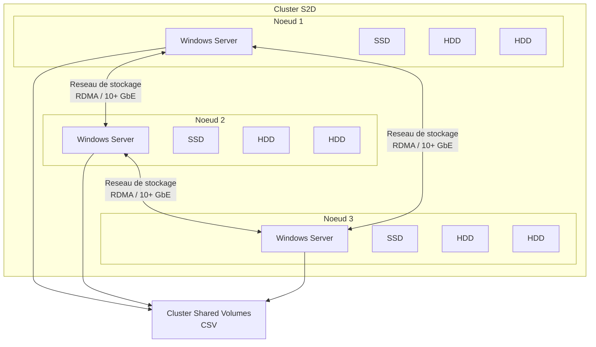
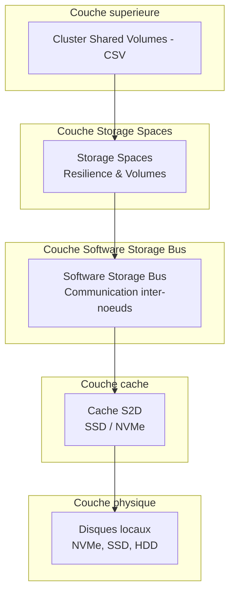
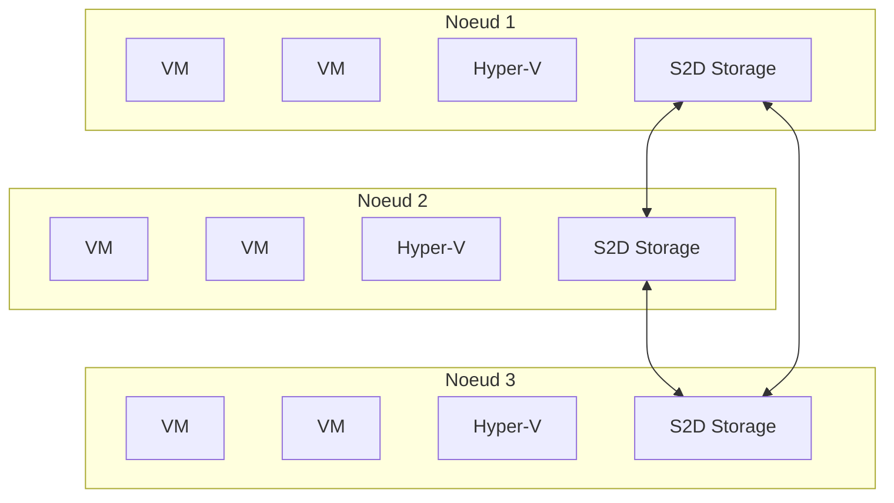
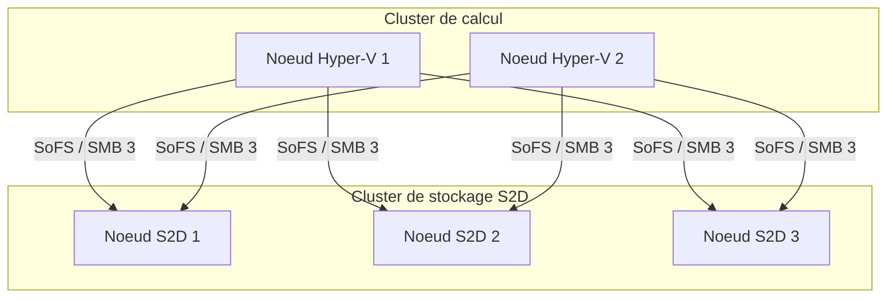
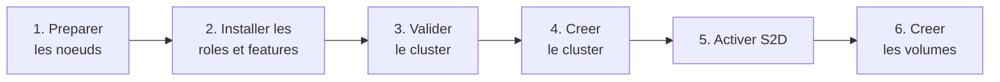

<!--
  Copyright 2026 Julien Bombled

  Licensed under the Apache License, Version 2.0 (the "License");
  you may not use this file except in compliance with the License.
  You may obtain a copy of the License at

      http://www.apache.org/licenses/LICENSE-2.0

  Unless required by applicable law or agreed to in writing, software
  distributed under the License is distributed on an "AS IS" BASIS,
  WITHOUT WARRANTIES OR CONDITIONS OF ANY KIND, either express or implied.
  See the License for the specific language governing permissions and
  limitations under the License.
-->
---
title: Storage Spaces Direct (S2D)
description: Comprendre Storage Spaces Direct - architecture hyper-convergee, prerequis, modes de deploiement et vue d'ensemble sous Windows Server 2022.
tags:
  - stockage
  - storage-spaces
  - s2d
  - intermediaire
---

# Storage Spaces Direct (S2D)

<span class="level-intermediate">Intermediaire</span> · Temps estime : 30 minutes

!!! warning "Edition requise"

    Storage Spaces Direct est disponible **uniquement** avec l'edition **Windows Server 2022 Datacenter**. L'edition Standard ne prend pas en charge cette fonctionnalite.

## Vue d'ensemble


Storage Spaces Direct (S2D) est l'evolution de Storage Spaces pour les environnements en cluster. Il permet de creer un stockage partage hautement disponible en utilisant les disques locaux de chaque noeud du cluster, sans necessiter de SAN externe ou de boitier JBOD partage.



## Concepts cles

!!! example "Analogie"

    Imaginez trois **bibliotheques municipales** dans des villes differentes. Avec Storage Spaces Direct, ces trois bibliotheques mettent en commun leurs catalogues et leurs livres via un reseau de transport rapide. Un lecteur peut demander n'importe quel livre depuis n'importe quelle bibliotheque : le systeme sait ou il se trouve et le livre est toujours disponible, meme si une bibliotheque ferme pour travaux (panne d'un noeud).

### Software-Defined Storage (SDS)

S2D est une solution de **stockage defini par logiciel** :

- Le materiel est compose de serveurs standards avec des disques locaux
- Toute l'intelligence (resilience, tiering, cache) est geree par le logiciel
- Pas besoin de controleur RAID materiel (mode HBA ou passthrough recommande)
- Evolutivite horizontale : ajoutez des noeuds pour plus de capacite et de performances

### Composants de l'architecture



| Composant | Role |
|-----------|------|
| **Software Storage Bus** | Interconnecte les disques de tous les noeuds via le reseau, cree un pool unifie |
| **Cache S2D** | Utilise les disques les plus rapides (NVMe ou SSD) comme cache automatique |
| **Storage Spaces** | Cree les disques virtuels resiliants a partir du pool distribue |
| **CSV (Cluster Shared Volumes)** | Permet a tous les noeuds d'acceder simultanement aux volumes |

### Cache S2D

Le cache est un mecanisme automatique qui accelere les operations :

| Configuration des disques | Disques de cache | Disques de capacite |
|---------------------------|:----------------:|:-------------------:|
| NVMe + SSD | NVMe | SSD |
| NVMe + HDD | NVMe | HDD |
| SSD + HDD | SSD | HDD |
| NVMe seul | Pas de cache | NVMe |
| SSD seul | Pas de cache | SSD |

!!! tip "Ratio cache/capacite"

    Microsoft recommande un ratio de **10% de cache** par rapport a la capacite totale. Par exemple, pour 10 To de capacite HDD, prevoyez environ 1 To de SSD pour le cache.

Le cache fonctionne en mode **lecture + ecriture** :

- **Lecture** : les donnees frequemment accedees sont conservees en cache
- **Ecriture** : les ecritures sont d'abord stockees sur les disques rapides, puis destockees (destaging) vers les disques de capacite

## Modes de deploiement

### Hyper-converge (Hyper-Converged Infrastructure - HCI)

Le mode hyper-converge combine calcul et stockage sur les memes noeuds :



**Avantages :**

- Architecture simplifiee (un seul cluster)
- Cout reduit (pas de SAN separe)
- Evolutivite lineaire (ajout de noeuds = plus de calcul + plus de stockage)

**Inconvenients :**

- Calcul et stockage evoluent ensemble (pas d'independance)
- Impact sur les ressources CPU/memoire pour le stockage

### Disagrege (Disaggregated / Converged)

Le mode disagrege separe le cluster de stockage du cluster de calcul :



**Avantages :**

- Evolutivite independante du calcul et du stockage
- Le stockage peut etre partage entre plusieurs clusters de calcul
- Charge de stockage isolee de la charge de calcul

**Inconvenients :**

- Deux clusters a gerer
- Infrastructure reseau plus complexe
- Necessite le role Scale-Out File Server (SoFS)

### Comparaison des modes

| Critere | Hyper-converge | Disagrege |
|---------|:--------------:|:---------:|
| Noeuds minimum | 2 | 2 (stockage) + 2 (calcul) |
| Noeuds maximum | 16 | 16 (stockage) |
| Complexite | Faible | Elevee |
| Evolutivite calcul | Liee au stockage | Independante |
| Cout initial | Faible | Eleve |
| Usage courant | PME, VDI, sites distants | Grandes entreprises |

## Prerequis

### Materiel

| Composant | Exigence |
|-----------|----------|
| **Noeuds** | 2 minimum, 16 maximum (identiques recommande) |
| **CPU** | x64 compatible avec les fonctionnalites requises |
| **RAM** | 4 Go minimum par noeud (plus pour Hyper-V) |
| **Disques** | 2 minimum par noeud (pas de RAID materiel, mode HBA) |
| **Reseau** | 10 GbE minimum, RDMA recommande (iWARP ou RoCE) |
| **Connectivite** | Full-mesh entre tous les noeuds |

### Disques

- **Pas de RAID materiel** : les controleurs doivent etre en mode HBA / passthrough / JBOD
- Tous les noeuds doivent avoir le **meme nombre** et le **meme type** de disques (configuration symetrique)
- Au minimum 4 disques de capacite par noeud pour le miroir tridirectionnel
- Les disques de cache doivent etre lies aux disques de capacite par un ratio equilibre

### Reseau

- **10 GbE** minimum entre les noeuds
- **RDMA** (Remote Direct Memory Access) fortement recommande pour les performances :
    - **iWARP** : plus simple a configurer, pas de configuration reseau speciale
    - **RoCE** (RDMA over Converged Ethernet) : meilleures performances, necessite la configuration DCB/PFC
- Au moins **deux cartes reseau** par noeud pour la redondance

### Logiciel

- Windows Server 2022 **Datacenter**
- Role **Failover Clustering**
- Fonctionnalite **Storage Spaces Direct**

## Deploiement simplifie (vue d'ensemble)

!!! info "Vue d'ensemble"

    Cette section presente les etapes a haut niveau. Le deploiement complet d'un cluster S2D est un processus avance detaille dans la documentation Microsoft.

### Etapes principales



### 1. Installer les roles et fonctionnalites

Sur chaque noeud :

```powershell
# Install required roles and features on each node
Install-WindowsFeature -Name Failover-Clustering, Hyper-V,
    Hyper-V-PowerShell, FS-FileServer -IncludeManagementTools -Restart
```

Resultat :

```text
Success Restart Needed Exit Code      Feature Result
------- -------------- ---------      --------------
True    Yes            SuccessRest... {Failover Clustering, Hyper-V, ...}
WARNING: You must restart this server to finish the installation process.
```

### 2. Valider et creer le cluster

```powershell
# Validate the cluster configuration
Test-Cluster -Node "Node1", "Node2", "Node3" -Include "Storage Spaces Direct",
    "Inventory", "Network", "System Configuration"

# Create the failover cluster
New-Cluster -Name "S2D-Cluster" -Node "Node1", "Node2", "Node3" `
    -StaticAddress 192.168.1.100 -NoStorage
```

### 3. Activer Storage Spaces Direct

```powershell
# Enable S2D on the cluster
Enable-ClusterStorageSpacesDirect -Confirm:$false
```

Resultat :

```text
VERBOSE: Scanning disks on node Node1...
VERBOSE: Scanning disks on node Node2...
VERBOSE: Scanning disks on node Node3...
VERBOSE: Configuring cache...
VERBOSE: Creating storage pool 'S2D on S2D-Cluster'...
VERBOSE: Storage Spaces Direct is now enabled.
```

Cette commande :

- Detecte automatiquement les disques locaux de chaque noeud
- Configure le cache SSD/NVMe automatiquement
- Cree un pool de stockage unifie couvrant tous les noeuds

### 4. Creer des volumes

```powershell
# Create a mirrored volume for VMs
New-Volume -FriendlyName "VMs" -FileSystem CSVFS_ReFS `
    -StoragePoolFriendlyName "S2D on S2D-Cluster" `
    -Size 1TB -ResiliencySettingName Mirror
```

!!! tip "CSVFS_ReFS"

    Pour S2D, le systeme de fichiers recommande est **ReFS** sur un Cluster Shared Volume (CSVFS_ReFS). ReFS offre de meilleures performances pour les operations de clonage de blocs utilisees par Hyper-V.

## Modes de resilience pour S2D

| Mode | Noeuds min | Pannes tolerees | Efficacite | Usage |
|------|:----------:|:---------------:|:----------:|-------|
| Miroir bidirectionnel | 2 | 1 noeud | 50% | Petits clusters |
| Miroir tridirectionnel | 3 | 2 noeuds | 33% | Production (recommande) |
| Mirror-Accelerated Parity | 3 | 1-2 noeuds | Variable | Capacite + performances |
| Double parite | 4+ | 2 noeuds | ~50-80% | Archive, sauvegarde |

### Mirror-Accelerated Parity (MAP)

Ce mode hybride combine un tier miroir (pour les ecritures recentes) et un tier parite (pour les donnees froides) :

```powershell
# Create a Mirror-Accelerated Parity volume
New-Volume -FriendlyName "Archives" -FileSystem CSVFS_ReFS `
    -StoragePoolFriendlyName "S2D on S2D-Cluster" `
    -StorageTierFriendlyNames MirrorOnSSD, ParityOnHDD `
    -StorageTierSizes 100GB, 900GB
```

## Surveillance

```powershell
# Overall S2D health
Get-StorageSubSystem -FriendlyName "*S2D*" | Get-StorageHealthReport

# Pool status
Get-StoragePool -FriendlyName "S2D*" |
    Select-Object FriendlyName, HealthStatus,
        @{N='SizeTB';E={[math]::Round($_.Size/1TB,2)}},
        @{N='FreeTB';E={[math]::Round(($_.Size - $_.AllocatedSize)/1TB,2)}}

# Virtual disk status (across all nodes)
Get-VirtualDisk | Select-Object FriendlyName, HealthStatus,
    OperationalStatus, ResiliencySettingName

# Physical disk status across the cluster
Get-PhysicalDisk | Select-Object FriendlyName, HealthStatus,
    OperationalStatus, Usage, MediaType,
    @{N='SizeGB';E={[math]::Round($_.Size/1GB,2)}} |
    Sort-Object Usage | Format-Table -AutoSize
```

Resultat :

```text
FriendlyName          HealthStatus SizeTB FreeTB
------------          ------------ ------ ------
S2D on S2D-Cluster    Healthy       12.00   8.50

FriendlyName HealthStatus OperationalStatus ResiliencySettingName
------------ ------------ ----------------- --------------------
VMs          Healthy      OK                Mirror
Archives     Healthy      OK                Parity

FriendlyName   HealthStatus OperationalStatus Usage       MediaType SizeGB
------------   ------------ ----------------- -----       --------- ------
Node1-Disk1    Healthy      OK                Journal     SSD       400.00
Node1-Disk2    Healthy      OK                Auto-Select HDD      2048.00
Node1-Disk3    Healthy      OK                Auto-Select HDD      2048.00
Node2-Disk1    Healthy      OK                Journal     SSD       400.00
Node2-Disk2    Healthy      OK                Auto-Select HDD      2048.00
Node2-Disk3    Healthy      OK                Auto-Select HDD      2048.00
Node3-Disk1    Healthy      OK                Journal     SSD       400.00
Node3-Disk2    Healthy      OK                Auto-Select HDD      2048.00
Node3-Disk3    Healthy      OK                Auto-Select HDD      2048.00
```

## Points cles a retenir

- **S2D** cree un stockage partage a partir des disques locaux de chaque noeud, sans SAN externe
- Disponible **uniquement** sur Windows Server Datacenter
- Le mode **hyper-converge** combine calcul et stockage sur les memes noeuds (le plus courant)
- Le mode **disagrege** separe stockage et calcul pour une evolutivite independante
- Le **cache automatique** utilise les disques les plus rapides (NVMe > SSD > HDD)
- **10 GbE minimum** et **RDMA recommande** pour les performances inter-noeuds
- Le **miroir tridirectionnel** est le mode de resilience recommande en production
- **ReFS** (CSVFS_ReFS) est le systeme de fichiers recommande pour les volumes S2D
- 2 a 16 noeuds par cluster, avec une configuration symetrique de disques

!!! example "Scenario pratique"

    **Contexte :** Audrey, architecte infrastructure, doit concevoir une solution de stockage hyper-convergee pour heberger 50 machines virtuelles dans une PME. Le budget est limite et la salle serveur ne peut accueillir que 3 noeuds. Les VM incluent un serveur SQL critique.

    **Analyse du dimensionnement :**

    - Besoin total : environ 8 To de stockage utile
    - Resilience requise : miroir tridirectionnel (2 pannes tolerees) pour SQL, miroir bidirectionnel pour les autres VM
    - Performances : SSD pour le cache, HDD pour la capacite

    **Configuration retenue pour chaque noeud :**

    - 1 x SSD NVMe 400 Go (cache)
    - 4 x HDD 2 To (capacite)
    - 2 x NIC 10 GbE (reseau de stockage avec RDMA iWARP)

    **Deploiement :**

    ```powershell
    # On each node: install roles
    Install-WindowsFeature -Name Failover-Clustering, Hyper-V,
        Hyper-V-PowerShell, FS-FileServer -IncludeManagementTools -Restart

    # Validate and create cluster
    Test-Cluster -Node "SRV-HCI01", "SRV-HCI02", "SRV-HCI03" `
        -Include "Storage Spaces Direct", "Inventory", "Network"
    New-Cluster -Name "HCI-Cluster" -Node "SRV-HCI01", "SRV-HCI02", "SRV-HCI03" `
        -StaticAddress 10.0.0.100 -NoStorage

    # Enable S2D
    Enable-ClusterStorageSpacesDirect -Confirm:$false

    # Create volumes
    New-Volume -FriendlyName "SQL-VMs" -FileSystem CSVFS_ReFS `
        -StoragePoolFriendlyName "S2D on HCI-Cluster" `
        -Size 2TB -ResiliencySettingName Mirror -NumberOfDataCopies 3

    New-Volume -FriendlyName "App-VMs" -FileSystem CSVFS_ReFS `
        -StoragePoolFriendlyName "S2D on HCI-Cluster" `
        -Size 6TB -ResiliencySettingName Mirror
    ```

    Le cluster S2D est operationnel avec un stockage partage hautement disponible, sans aucun SAN externe.

!!! danger "Erreurs courantes"

    1. **Utiliser l'edition Standard au lieu de Datacenter** : Storage Spaces Direct est exclusivement disponible sur Windows Server Datacenter. L'edition Standard ne prend pas en charge cette fonctionnalite, meme si le role Failover Clustering est present.

    2. **Laisser le RAID materiel active sur les controleurs** : S2D necessite un acces direct aux disques (mode HBA/passthrough). Un controleur RAID materiel masque les disques individuels et empeche S2D de fonctionner correctement.

    3. **Utiliser un reseau inferieur a 10 GbE** : le trafic de stockage inter-noeuds est tres volumineux. Un reseau 1 GbE creera un goulot d'etranglement severe et des problemes de performances, voire des deconnexions de noeuds.

    4. **Deployer des noeuds asymetriques** : des noeuds avec des configurations de disques differentes (nombre, taille, type) provoquent un desequilibre dans la distribution des donnees et reduisent l'efficacite du pool.

    5. **Oublier de configurer un temoin de cluster (witness)** : sans temoin, un cluster de 2 noeuds perd le quorum des qu'un noeud tombe. Configurez un temoin de partage de fichiers ou un temoin cloud Azure.

## Pour aller plus loin

- [Concepts de Storage Spaces](concepts.md)
- [Creation d'un pool de stockage](creation-pool.md)
- [iSCSI](../disques/iscsi.md)

