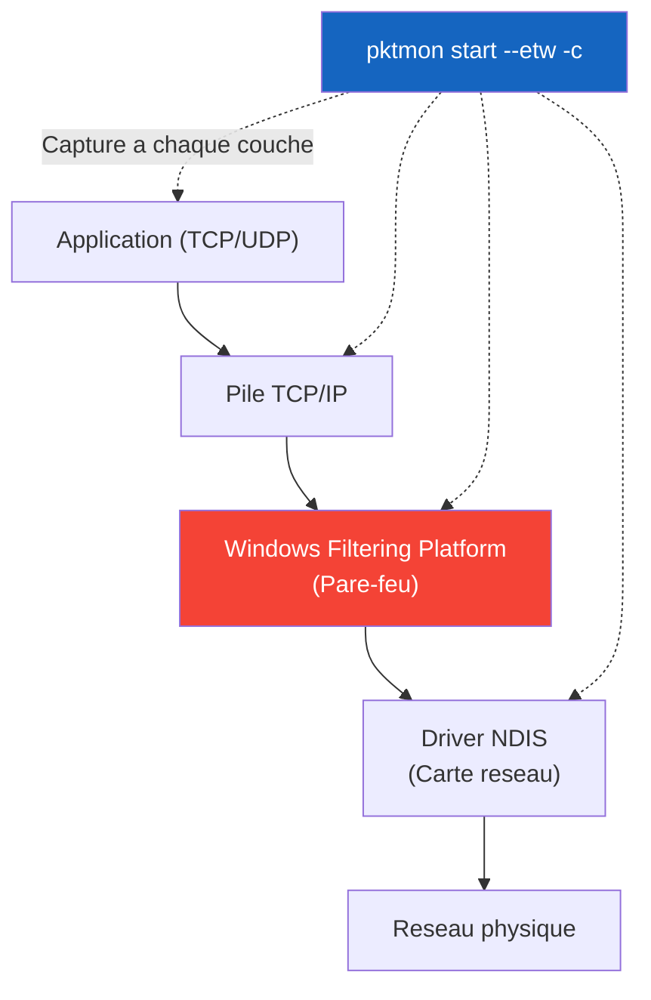

<!--
  Copyright 2026 Julien Bombled

  Licensed under the Apache License, Version 2.0 (the "License");
  you may not use this file except in compliance with the License.
  You may obtain a copy of the License at

      http://www.apache.org/licenses/LICENSE-2.0

  Unless required by applicable law or agreed to in writing, software
  distributed under the License is distributed on an "AS IS" BASIS,
  WITHOUT WARRANTIES OR CONDITIONS OF ANY KIND, either express or implied.
  See the License for the specific language governing permissions and
  limitations under the License.
-->
---
title: Analyse de trafic avec Pktmon
description: Utiliser Pktmon, le sniffer de paquets natif de Windows Server 2022, pour diagnostiquer les problemes reseau sans Wireshark.
tags:
  - reseau
  - depannage
  - pktmon
  - wireshark
---

# Analyse de trafic avec Pktmon

<span class="level-advanced">Avance</span> · Temps estime : 30 minutes

!!! example "Analogie"

    Pktmon est le **stethoscope du medecin reseau**. Quand un paquet reseau ne parvient pas a destination, c'est comme un colis postal qui se perd. Pktmon vous permet d'ausculter chaque etape du trajet — de l'application jusqu'a la carte reseau — pour trouver exactement ou le paquet est bloque ou abandonne. Et contrairement a Wireshark, il est deja dans la boite a outils du systeme, comme un stethoscope integre a la blouse.



## Pourquoi Pktmon ?

Vous avez un probleme reseau sur un serveur de production. Vous voulez voir si les paquets arrivent.
*   **Probleme :** Vous n'avez pas le droit d'installer Wireshark.
*   **Solution :** Utilisez **Pktmon** (Packet Monitor), integre nativement dans Windows Server 2019/2022 et Windows 10/11.

## Scenario : "Le Ping ne passe pas"

Vous essayez de pinguer `SRV-01` (10.0.0.20) depuis `DC-01` (10.0.0.10). Ca echoue. Est-ce le pare-feu ? Le routage ? Le paquet part-il ?

## Etape 1 : Definir un filtre

Pktmon capture TOUT par defaut. Il faut filtrer pour eviter de noyer le disque.

```powershell
# Supprimer les anciens filtres
pktmon filter remove

# Filtrer uniquement le trafic ICMP (Ping) ou le port 80
pktmon filter add -p 80
pktmon filter add -t icmp
```

## Etape 2 : Lancer la capture

On demarre l'enregistrement en temps reel.

```powershell
# Demarrer la capture sur toutes les interfaces
# --etw : Event Tracing for Windows (format natif)
# -l real-time : Voir les paquets defiler a l'ecran (Windows Server 2022 seulement)
pktmon start --etw -c
```

*Sur les versions plus anciennes de Windows, retirez l'option `-l real-time`.*

## Etape 3 : Reproduire le probleme

Lancez votre ping depuis une autre fenetre :
```powershell
ping 10.0.0.20
```

## Etape 4 : Arreter et convertir

```powershell
pktmon stop
```

Cela cree un fichier `PktMon.etl`. Ce format n'est pas lisible par les humains. Convertissons-le en texte (.txt) ou en format Wireshark (.pcapng).

```powershell
# Conversion en texte lisible
pktmon format PktMon.etl -o capture.txt

# Conversion pour Wireshark (Top !)
pktmon pcapng PktMon.etl -o capture.pcapng
```

## Analyse des resultats

Ouvrez `capture.txt`.

### Cas 1 : Paquet droppe par le Pare-feu
Vous verrez une ligne indiquant "Drop" avec une raison.
```text
Action: Drop
Reason: PolicyFrag
Component: WFP Native MAC Layer LightWeight Filter
```
*Signification : Le pare-feu Windows (WFP) a bloque le paquet.*

### Cas 2 : Paquet recu mais pas de reponse
Vous voyez le paquet "Echo Request" entrer, mais aucun "Echo Reply" sortir.
*Signification : Le serveur a recu la demande, mais l'application ou l'OS n'a pas repondu.*

## Nettoyage

N'oubliez jamais de supprimer les filtres et le fichier de capture.

```powershell
pktmon filter remove
Remove-Item PktMon.etl, capture.txt, capture.pcapng
```

!!! example "Scenario pratique"

    **Contexte :** Un flux applicatif entre SRV-APP-01 (10.0.1.10) et SRV-DB-01 (10.0.1.20)
    sur le port SQL Server 1433 semble etre abandonne quelque part dans la pile reseau. Les
    developpeurs constatent des timeouts de connexion. `Test-NetConnection SRV-DB-01 -Port 1433`
    echoue depuis SRV-APP-01 mais le ping reussit.

    **Symptomes :**

    - `Test-NetConnection SRV-DB-01 -Port 1433` : `TcpTestSucceeded: False`
    - `ping SRV-DB-01` reussit (connectivite L3 OK)
    - Le service SQL Server est bien en ecoute sur SRV-DB-01 (verifie localement)

    **Diagnostic :**

    ```powershell
    # On SRV-APP-01: set a filter for TCP port 1433 then start capture
    pktmon filter remove
    pktmon filter add -t tcp -p 1433
    pktmon start --etw -c
    ```

    Reproduire la connexion depuis une autre fenetre :

    ```powershell
    # Trigger a connection attempt in another window
    Test-NetConnection SRV-DB-01 -Port 1433
    ```

    Arreter la capture et convertir :

    ```powershell
    pktmon stop
    pktmon format PktMon.etl -o capture.txt
    ```

    Resultat (extrait de capture.txt) :

    ```text
    [Microsoft-Windows-PktMon]
    Direction : Tx
    ComponentId: 11
    ComponentName: WFP Native MAC Layer LightWeight Filter
    Action: Drop
    Reason: PolicyFrag
    SourceIP: 10.0.1.10
    DestIP: 10.0.1.20
    DestPort: 1433
    ```

    Les paquets sortants vers 10.0.1.20:1433 apparaissent au niveau de la couche IP mais
    sont abandonnes par le pare-feu Windows (WFP) avant l'emission. Une regle de pare-feu
    sortante bloque le trafic vers ce port.

    **Solution :**

    ```powershell
    # Create an outbound firewall rule allowing TCP to SRV-DB-01 on port 1433
    New-NetFirewallRule `
        -DisplayName "Allow-SQL-Outbound-SRV-DB-01" `
        -Direction Outbound `
        -Protocol TCP `
        -RemotePort 1433 `
        -RemoteAddress 10.0.1.20 `
        -Action Allow

    # Cleanup the capture files
    pktmon filter remove
    Remove-Item PktMon.etl, capture.txt -ErrorAction SilentlyContinue
    ```

    Apres creation de la regle, `Test-NetConnection SRV-DB-01 -Port 1433` retourne
    `TcpTestSucceeded: True` et les connexions SQL s'etablissent normalement.

!!! danger "Erreurs courantes"

    1. **Oublier de supprimer les filtres apres la capture.** Les filtres Pktmon persistent entre les redemarrages du service. Si vous ne lancez pas `pktmon filter remove` apres votre diagnostic, les prochaines captures seront filtrees de maniere inattendue. Toujours nettoyer apres usage.

    2. **Capturer sans filtre sur un serveur en production.** Sans filtre, Pktmon enregistre TOUS les paquets. Sur un serveur charge, le fichier `.etl` peut atteindre plusieurs Go en quelques secondes et saturer le disque. Toujours definir un filtre avec `pktmon filter add` avant de demarrer.

    3. **Analyser uniquement le fichier texte.** Le format texte (`pktmon format`) montre un resume, mais le format `.pcapng` (`pktmon pcapng`) ouvert dans Wireshark revele les en-tetes complets, le contenu des paquets et les retransmissions TCP. Toujours convertir en pcapng pour une analyse approfondie.

    4. **Confondre un drop WFP avec un probleme reseau distant.** Quand Pktmon montre `Action: Drop, Reason: PolicyFrag` au niveau WFP, le probleme est local (pare-feu Windows). Ne pas chercher la cause sur le serveur distant ou sur les equipements reseau intermediaires.

## Pour aller plus loin

- [Outils reseau](outils-reseau.md) pour les autres outils de diagnostic reseau natifs
- [Outils systeme](outils-systeme.md) pour le diagnostic systeme complementaire
- [Pare-feu Windows](../../reseau/pare-feu/wfas-concepts.md) pour comprendre les regles WFP qui bloquent les paquets
