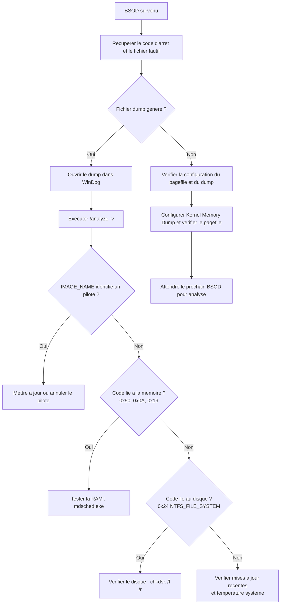

<!--
  Copyright 2026 Julien Bombled

  Licensed under the Apache License, Version 2.0 (the "License");
  you may not use this file except in compliance with the License.
  You may obtain a copy of the License at

      http://www.apache.org/licenses/LICENSE-2.0

  Unless required by applicable law or agreed to in writing, software
  distributed under the License is distributed on an "AS IS" BASIS,
  WITHOUT WARRANTIES OR CONDITIONS OF ANY KIND, either express or implied.
  See the License for the specific language governing permissions and
  limitations under the License.
-->

# Analyse des ecrans bleus (BSOD)

<span class="level-advanced">Avance</span> · Temps estime : 35 minutes

## Presentation

Un ecran bleu (BSOD - Blue Screen of Death) se produit lorsque Windows detecte une erreur critique dont il ne peut pas se remettre. Le systeme genere un fichier de vidage memoire (memory dump) avant de redemarrer, ce qui permet une analyse post-mortem.

!!! example "Analogie"

    Un ecran bleu est comparable a un **fusible qui saute** dans un tableau electrique. Le
    systeme detecte une anomalie si grave qu'il prefere tout couper plutot que de risquer des
    degats supplementaires (corruption de donnees). Le fichier dump est le **rapport du
    disjoncteur** : il enregistre exactement ce qui se passait au moment de la coupure.

## Arbre de decision : diagnostic d'un BSOD



## Anatomie d'un BSOD

L'ecran bleu affiche les informations suivantes :

| Element | Description | Exemple |
|---------|-------------|---------|
| **Emoticone** | Indicateur visuel du crash | `:(` |
| **Code d'arret** | Identifiant de l'erreur | `IRQL_NOT_LESS_OR_EQUAL` |
| **Code hexadecimal** | Valeur numerique du stop code | `0x0000000A` |
| **Fichier fautif** (parfois) | Module a l'origine du crash | `ntfs.sys`, `ndis.sys` |
| **QR Code** | Lien vers la documentation Microsoft | - |
| **Pourcentage** | Progression de la collecte du dump | `0% - 100%` |

## Codes d'arret courants

| Code | Nom | Cause probable |
|------|-----|----------------|
| `0x0000000A` | IRQL_NOT_LESS_OR_EQUAL | Pilote accedant une memoire invalide a un IRQL eleve |
| `0x0000001E` | KMODE_EXCEPTION_NOT_HANDLED | Exception en mode noyau non geree |
| `0x00000024` | NTFS_FILE_SYSTEM | Corruption du systeme de fichiers NTFS |
| `0x0000003B` | SYSTEM_SERVICE_EXCEPTION | Exception dans un service systeme |
| `0x00000050` | PAGE_FAULT_IN_NONPAGED_AREA | Reference a une page memoire invalide |
| `0x0000007E` | SYSTEM_THREAD_EXCEPTION_NOT_HANDLED | Exception non geree dans un thread systeme |
| `0x0000009F` | DRIVER_POWER_STATE_FAILURE | Pilote dans un etat d'alimentation incoherent |
| `0x000000BE` | ATTEMPTED_WRITE_TO_READONLY_MEMORY | Ecriture dans une zone memoire en lecture seule |
| `0x000000D1` | DRIVER_IRQL_NOT_LESS_OR_EQUAL | Pilote accedant une memoire paginee a un IRQL eleve |
| `0x000000EF` | CRITICAL_PROCESS_DIED | Un processus critique du systeme s'est arrete |
| `0x00000133` | DPC_WATCHDOG_VIOLATION | DPC (Deferred Procedure Call) trop long |
| `0x00000139` | KERNEL_SECURITY_CHECK_FAILURE | Corruption de la memoire noyau detectee |
| `0x0000019` | BAD_POOL_HEADER | Corruption de l'en-tete du pool memoire |
| `0xC000021A` | STATUS_SYSTEM_PROCESS_TERMINATED | Processus systeme critique termine (csrss, winlogon) |

## Configuration des memory dumps

### Types de vidage memoire

| Type | Taille | Contenu | Usage |
|------|--------|---------|-------|
| **Small Memory Dump** (minidump) | 256 Ko | Stop code, pilotes charges, contexte du thread | Diagnostic rapide |
| **Kernel Memory Dump** | Variable (1/3 RAM) | Memoire noyau uniquement | Recommande en production |
| **Complete Memory Dump** | = RAM + 1 Mo | Toute la memoire physique | Analyse approfondie |
| **Automatic Memory Dump** | = Kernel (defaut) | Comme Kernel, gestion auto du pagefile | Defaut Windows Server 2022 |
| **Active Memory Dump** | Variable | Memoire noyau + pages actives utilisateur | Hyper-V hosts, grande RAM |

### Configurer le type de dump

```powershell
# Check current dump configuration
Get-ItemProperty -Path "HKLM:\SYSTEM\CurrentControlSet\Control\CrashControl"

# Set to Kernel Memory Dump (recommended for servers)
Set-ItemProperty -Path "HKLM:\SYSTEM\CurrentControlSet\Control\CrashControl" `
    -Name "CrashDumpEnabled" -Value 2

# Set dump file location
Set-ItemProperty -Path "HKLM:\SYSTEM\CurrentControlSet\Control\CrashControl" `
    -Name "DumpFile" -Value "D:\MEMORY.DMP"

# Enable automatic restart after BSOD
Set-ItemProperty -Path "HKLM:\SYSTEM\CurrentControlSet\Control\CrashControl" `
    -Name "AutoReboot" -Value 1

# Write event to System log on BSOD
Set-ItemProperty -Path "HKLM:\SYSTEM\CurrentControlSet\Control\CrashControl" `
    -Name "LogEvent" -Value 1

# Overwrite existing dump file
Set-ItemProperty -Path "HKLM:\SYSTEM\CurrentControlSet\Control\CrashControl" `
    -Name "Overwrite" -Value 1
```

Resultat :

```text
# Get-ItemProperty CrashControl
CrashDumpEnabled  : 7
AutoReboot        : 1
DumpFile          : %SystemRoot%\MEMORY.DMP
LogEvent          : 1
MinidumpDir       : %SystemRoot%\Minidump
Overwrite         : 1
```

| Valeur CrashDumpEnabled | Type |
|--------------------------|------|
| `0` | Aucun dump |
| `1` | Complete Memory Dump |
| `2` | Kernel Memory Dump |
| `3` | Small Memory Dump (minidump) |
| `7` | Automatic Memory Dump (defaut) |

### Emplacement des fichiers

| Fichier | Emplacement par defaut |
|---------|----------------------|
| Full / Kernel dump | `%SystemRoot%\MEMORY.DMP` |
| Minidumps | `%SystemRoot%\Minidump\*.dmp` |

!!! tip "Bonne pratique"

    En production, configurez le dump en **Kernel Memory Dump** et verifiez que le fichier
    d'echange (pagefile) sur le disque systeme est au moins egal a la taille de la RAM + 1 Mo.
    Sans un pagefile suffisant, le dump ne sera pas genere.

## Analyse avec WinDbg

### Installation

WinDbg fait partie du **Windows SDK** ou est disponible via le **Microsoft Store** sous le nom **WinDbg Preview**.

```powershell
# Install WinDbg Preview from Microsoft Store (if available)
# Alternative: download from https://aka.ms/windbg/download

# Or install via winget
winget install Microsoft.WinDbg
```

### Configuration du serveur de symboles

Les symboles permettent a WinDbg de traduire les adresses memoire en noms de fonctions lisibles.

Dans WinDbg, configurer le chemin des symboles :

```
.sympath srv*C:\Symbols*https://msdl.microsoft.com/download/symbols
.reload
```

Ou definir la variable d'environnement :

```powershell
# Set symbol path environment variable
[Environment]::SetEnvironmentVariable(
    "_NT_SYMBOL_PATH",
    "srv*C:\Symbols*https://msdl.microsoft.com/download/symbols",
    "Machine"
)
```

### Analyse d'un dump

1. Ouvrir WinDbg
2. **File** > **Open Crash Dump** > selectionner `MEMORY.DMP` ou un fichier `.dmp`
3. Executer la commande d'analyse automatique :

```
!analyze -v
```

### Commandes WinDbg essentielles

| Commande | Description |
|----------|-------------|
| `!analyze -v` | Analyse automatique detaillee (premiere commande a executer) |
| `!thread` | Informations sur le thread en cours |
| `!process 0 0` | Liste de tous les processus |
| `lm` | Liste des modules charges |
| `lm vm <module>` | Details sur un module specifique |
| `!irp` | Affiche un IRP (I/O Request Packet) |
| `kb` | Stack trace du thread en cours |
| `.bugcheck` | Affiche le code d'arret et les parametres |
| `!poolused` | Utilisation du pool memoire |

### Lire le resultat de !analyze -v

Les elements cles a examiner dans la sortie de `!analyze -v` :

| Champ | Signification |
|-------|---------------|
| **BUGCHECK_CODE** | Code d'arret hexadecimal |
| **FAULTING_MODULE** | Module (pilote) a l'origine du crash |
| **DEFAULT_BUCKET_ID** | Classification automatique de la cause |
| **PROCESS_NAME** | Processus actif au moment du crash |
| **STACK_TEXT** | Pile d'appels - la ligne la plus basse est la plus proche de la cause |
| **IMAGE_NAME** | Fichier image (pilote) fautif |
| **MODULE_NAME** | Nom du module fautif |

## Analyse rapide sans WinDbg

### Verifier les Event Logs

```powershell
# Search for BSOD-related events in System log
Get-WinEvent -FilterHashtable @{
    LogName = 'System'
    ProviderName = 'Microsoft-Windows-WER-SystemErrorReporting'
} -MaxEvents 10 | Select-Object TimeCreated, Message

# Check BugCheck events
Get-WinEvent -FilterHashtable @{
    LogName = 'System'
    Id = 1001
    ProviderName = 'BugCheck'
} -ErrorAction SilentlyContinue | Select-Object TimeCreated, Message
```

### Lister les minidumps

```powershell
# List all minidump files
Get-ChildItem "$env:SystemRoot\Minidump" -ErrorAction SilentlyContinue |
    Select-Object Name, Length, LastWriteTime |
    Sort-Object LastWriteTime -Descending
```

Resultat :

```text
# BSOD-related events
TimeCreated           Message
-----------           -------
2026-02-18 03:22:15   The computer has rebooted from a bugcheck. The bugcheck was:
                      0x000000d1 (0x0000000000000038, 0x0000000000000002,
                      0x0000000000000000, 0xfffff80b1234abcd). A dump was saved in:
                      C:\Windows\MEMORY.DMP.

# Minidump files
Name                    Length LastWriteTime
----                    ------ -------------
021826-15234-01.dmp     262144 2026-02-18 03:22:18
021526-12456-01.dmp     262144 2026-02-15 11:45:33
020826-09872-01.dmp     262144 2026-02-08 22:10:47
```

## Causes courantes et solutions

### Pilotes defectueux

Cause la plus frequente de BSOD sur les serveurs.

```powershell
# List recently installed/updated drivers
Get-CimInstance Win32_PnPSignedDriver |
    Where-Object { $_.DriverDate -gt (Get-Date).AddDays(-30) } |
    Select-Object DeviceName, DriverVersion, DriverDate |
    Sort-Object DriverDate -Descending

# Check driver verifier status
verifier /querysettings
```

**Resolution :** mettre a jour ou annuler le pilote fautif identifie dans le dump.

### Memoire defectueuse

```powershell
# Schedule Windows Memory Diagnostic
mdsched.exe
```

**Resolution :** remplacer le module memoire defectueux.

### Corruption du disque

```powershell
# Check disk for errors
chkdsk C: /f /r /x

# Check SMART status
Get-PhysicalDisk | Select-Object FriendlyName, MediaType, HealthStatus, OperationalStatus
```

**Resolution :** reparer le systeme de fichiers ou remplacer le disque.

### Surchauffe

Verifier les temperatures dans le BIOS/UEFI ou avec des outils tiers. Les BSOD lies a la surchauffe sont souvent intermittents et surviennent sous charge.

### Mises a jour problematiques

```powershell
# List recently installed updates
Get-HotFix | Sort-Object InstalledOn -Descending | Select-Object -First 10

# Uninstall a problematic update
wusa /uninstall /kb:5012345 /quiet /norestart
```

## Prevenir les BSOD

| Action | Frequence |
|--------|-----------|
| Maintenir les pilotes a jour (source fabricant) | Mensuelle |
| Appliquer les mises a jour Windows | Mensuelle |
| Surveiller la sante des disques (SMART) | Hebdomadaire |
| Verifier l'integrite des fichiers systeme (SFC/DISM) | Mensuelle |
| Tester la memoire physique | Apres chaque incident |
| Configurer et verifier le memory dump | Initial + apres changement |

## Points cles a retenir

- Un BSOD genere un fichier de vidage memoire (dump) indispensable pour le diagnostic
- Le type **Kernel Memory Dump** est le meilleur compromis taille/informations pour les serveurs
- `!analyze -v` dans WinDbg est la commande principale pour analyser un dump
- Le champ **IMAGE_NAME** dans le resultat pointe vers le module (pilote) fautif
- Les causes les plus frequentes sont : pilotes defectueux, RAM defaillante, corruption disque
- Toujours verifier que le pagefile est suffisamment dimensionne pour permettre la generation du dump

!!! example "Scenario pratique"

    **Contexte :** Romain, administrateur systeme, decouvre que le serveur SRV-01 a redemarrage
    3 fois en une semaine avec un ecran bleu `DRIVER_IRQL_NOT_LESS_OR_EQUAL (0x000000D1)`.
    Chaque crash survient pendant les heures de bureau.

    **Diagnostic :**

    1. Romain verifie d'abord que les dumps sont bien generes :

    ```powershell
    Get-ChildItem "$env:SystemRoot\Minidump" | Sort-Object LastWriteTime -Descending
    ```
    3 fichiers minidump confirment les 3 crashes.

    2. Il ouvre le dernier dump dans WinDbg et execute `!analyze -v`
    3. Le resultat indique :

    ```text
    BUGCHECK_CODE: d1
    IMAGE_NAME: nvlddmkm.sys
    MODULE_NAME: nvlddmkm
    FAULTING_MODULE: fffff80b12340000 nvlddmkm
    DEFAULT_BUCKET_ID: GRAPHICS_DRIVER_TDR_FAULT
    ```

    4. `nvlddmkm.sys` est le pilote graphique NVIDIA. Romain verifie la version :

    ```powershell
    Get-CimInstance Win32_PnPSignedDriver |
        Where-Object { $_.DeviceName -like "*NVIDIA*" } |
        Select-Object DeviceName, DriverVersion, DriverDate
    ```
    Le pilote date de 2024 et n'est pas a jour.

    **Resolution :** Romain telecharge le dernier pilote NVIDIA depuis le site du fabricant du serveur (pas du site NVIDIA grand public), l'installe et surveille pendant une semaine. Plus aucun BSOD ne se produit.

!!! danger "Erreurs courantes"

    - **Ne pas configurer le memory dump** : sans fichier dump, aucune analyse post-mortem
      n'est possible. Verifiez que le type est au moins "Kernel Memory Dump" et que le
      pagefile est suffisamment dimensionne
    - **Telecharger les pilotes depuis le site grand public** : pour un serveur, toujours
      utiliser les pilotes certifies du fabricant du serveur (Dell, HPE, Lenovo), pas ceux
      du site du fabricant de la puce
    - **Ignorer les BSOD intermittents** : un BSOD qui ne se produit qu'une fois par semaine
      peut indiquer un probleme materiel (RAM, disque) en debut de defaillance. Agissez avant
      que la frequence n'augmente
    - **Reinstaller Windows au lieu d'analyser** : le dump contient la reponse. Prendre 30
      minutes pour l'analyser avec WinDbg est toujours plus rapide qu'une reinstallation complete
    - **Oublier de tester la RAM** : les erreurs memoire provoquent des BSOD aux codes varies.
      En cas de doute, lancez `mdsched.exe` pour un test complet de la memoire physique

## Pour aller plus loin

- [Methodologie de depannage](methodologie.md) pour une approche structuree
- [Outils systeme](outils-systeme.md) pour SFC, DISM et les outils de diagnostic
- [Moniteur de fiabilite](outils-systeme.md#moniteur-de-fiabilite-reliability-monitor) pour l'historique des incidents

