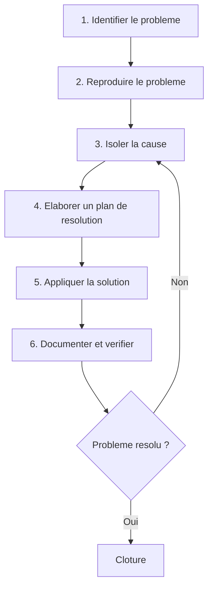
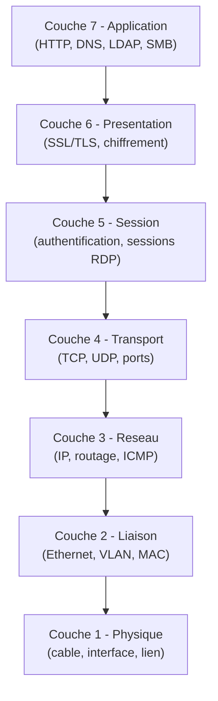

<!--
  Copyright 2026 Julien Bombled

  Licensed under the Apache License, Version 2.0 (the "License");
  you may not use this file except in compliance with the License.
  You may obtain a copy of the License at

      http://www.apache.org/licenses/LICENSE-2.0

  Unless required by applicable law or agreed to in writing, software
  distributed under the License is distributed on an "AS IS" BASIS,
  WITHOUT WARRANTIES OR CONDITIONS OF ANY KIND, either express or implied.
  See the License for the specific language governing permissions and
  limitations under the License.
-->
---
title: "Methodologie de depannage"
description: Adopter une approche structuree pour le depannage sur Windows Server 2022 - identifier, reproduire, isoler, resoudre et documenter.
tags:
  - supervision
  - depannage
  - debutant
---

# Methodologie de depannage

<span class="level-beginner">Debutant</span> · Temps estime : 25 minutes

## Presentation

Le depannage efficace repose sur une methode structuree, et non sur de l'intuition. Une approche methodique permet de resoudre les problemes plus rapidement, d'eviter les actions contre-productives et de capitaliser sur les incidents passes.

!!! example "Analogie"

    Le depannage methodique fonctionne comme un **medecin face a un patient**. Le medecin ne
    prescrit jamais un medicament au hasard : il pose des questions (symptomes), fait des examens
    (tests), elimine les hypotheses une par une (diagnostic differentiel) et ne traite qu'apres
    avoir identifie la cause. Redemarrer un serveur sans comprendre, c'est comme donner un
    antidouleur sans chercher l'origine de la douleur.

## Les 6 etapes du depannage



### Etape 1 : Identifier le probleme

Recueillir les informations initiales avant toute action technique :

| Question | Objectif |
|----------|----------|
| **Quoi ?** | Quel est le symptome exact ? (message d'erreur, comportement anormal) |
| **Qui ?** | Quels utilisateurs ou systemes sont affectes ? |
| **Quand ?** | Quand le probleme est-il apparu ? (date, heure precise) |
| **Ou ?** | Sur quel serveur, quel site, quel segment reseau ? |
| **Depuis quand ?** | Le probleme est-il intermittent ou permanent ? |
| **Qu'est-ce qui a change ?** | Mise a jour, modification de configuration, nouvel equipement ? |

!!! tip "Bonne pratique"

    Ne touchez a rien tant que vous n'avez pas compris le probleme. Commencez par observer
    et collecter des informations. Toute action prematuree peut masquer la cause reelle.

### Etape 2 : Reproduire le probleme

- Confirmer le symptome en le reproduisant vous-meme
- Si le probleme est intermittent, noter les conditions exactes de reproduction
- Verifier si le probleme affecte d'autres utilisateurs ou serveurs

### Etape 3 : Isoler la cause

Utiliser l'elimination methodique :

1. **Diviser pour regner** : tester chaque composant separement
2. **Un changement a la fois** : ne modifier qu'un seul parametre entre chaque test
3. **Du simple au complexe** : verifier d'abord les causes evidentes (cable, alimentation, espace disque)

### Etape 4 : Elaborer un plan de resolution

Avant d'appliquer une correction :

- Evaluer l'impact de la correction (redemarrage necessaire ? indisponibilite ?)
- Preparer un plan de retour arriere (rollback)
- Communiquer avec les utilisateurs concernes
- Planifier l'intervention dans une fenetre de maintenance si possible

### Etape 5 : Appliquer la solution

- Suivre le plan etabli
- Documenter chaque action effectuee
- Tester apres chaque modification

### Etape 6 : Documenter et verifier

- Confirmer que le probleme est resolu avec l'utilisateur
- Documenter la cause, la solution et les etapes suivies
- Mettre a jour la base de connaissances
- Surveiller pendant une periode de stabilisation

## Approche par couches (modele OSI)

Pour les problemes reseau, l'approche par couches du modele OSI structure le diagnostic de maniere logique.



### Strategie bottom-up (du bas vers le haut)

Recommandee quand la cause est inconnue. Commencer par la couche physique :

| Couche | Verification | Outil |
|--------|-------------|-------|
| 1 - Physique | Cable branche ? Lien actif ? LED allumee ? | Observation visuelle |
| 2 - Liaison | Adresse MAC correcte ? VLAN correct ? | `Get-NetAdapter`, `ipconfig /all` |
| 3 - Reseau | Adresse IP correcte ? Passerelle joignable ? | `ping`, `Test-NetConnection` |
| 4 - Transport | Port ouvert ? Service en ecoute ? | `Test-NetConnection -Port`, `netstat` |
| 5 - Session | Authentification OK ? Session etablie ? | Journaux de securite |
| 6/7 - Application | Service fonctionnel ? Reponse correcte ? | Journaux applicatifs, navigateur |

### Strategie top-down (du haut vers le bas)

Recommandee quand le symptome pointe clairement vers un service applicatif :

1. Verifier le service applicatif (IIS, DNS, DHCP)
2. Verifier la configuration du service
3. Verifier la connectivite reseau vers le service
4. Descendre vers les couches inferieures si necessaire

### Strategie divide-and-conquer

Commencer au milieu (couche 3 - reseau) et monter ou descendre selon le resultat :

```powershell
# Layer 3 test: Can we reach the target?
Test-NetConnection -ComputerName SRV-DC01

# If Layer 3 fails: go down (check Layer 2, Layer 1)
Get-NetAdapter | Select-Object Name, Status, LinkSpeed
Get-NetIPAddress -InterfaceAlias "Ethernet"

# If Layer 3 succeeds: go up (check Layer 4+)
Test-NetConnection -ComputerName SRV-DC01 -Port 389  # LDAP
Test-NetConnection -ComputerName SRV-DC01 -Port 53   # DNS
```

Resultat :

```text
# Test-NetConnection -ComputerName SRV-DC01
ComputerName     : SRV-DC01
RemoteAddress    : 10.0.0.10
InterfaceAlias   : Ethernet
SourceAddress    : 10.0.0.20
PingSucceeded    : True
PingReplyDetails (RTT) : 1 ms

# Get-NetAdapter
Name       Status    LinkSpeed
----       ------    ---------
Ethernet   Up        1 Gbps

# Test-NetConnection -ComputerName SRV-DC01 -Port 389
ComputerName     : SRV-DC01
RemotePort       : 389
TcpTestSucceeded : True
```

## Collecte d'informations initiale

### Script de diagnostic rapide

```powershell
# Quick system health check
Write-Output "=== System Information ==="
Get-ComputerInfo | Select-Object CsName, WindowsProductName, OsVersion,
    OsArchitecture, CsTotalPhysicalMemory

Write-Output "`n=== Uptime ==="
(Get-Date) - (Get-CimInstance Win32_OperatingSystem).LastBootUpTime

Write-Output "`n=== Disk Space ==="
Get-Volume | Where-Object { $_.DriveLetter } |
    Select-Object DriveLetter, FileSystemLabel,
    @{N='SizeGB';E={[math]::Round($_.Size/1GB,2)}},
    @{N='FreeGB';E={[math]::Round($_.SizeRemaining/1GB,2)}},
    @{N='FreePercent';E={[math]::Round(($_.SizeRemaining/$_.Size)*100,1)}}

Write-Output "`n=== Recent Critical/Error Events (last 24h) ==="
Get-WinEvent -FilterHashtable @{
    LogName='System','Application'
    Level=1,2
    StartTime=(Get-Date).AddDays(-1)
} -MaxEvents 10 -ErrorAction SilentlyContinue |
    Select-Object TimeCreated, LogName, Id, LevelDisplayName, Message

Write-Output "`n=== Stopped Services (that should be running) ==="
Get-Service | Where-Object { $_.StartType -eq 'Automatic' -and $_.Status -ne 'Running' } |
    Select-Object Name, DisplayName, Status

Write-Output "`n=== Network Configuration ==="
Get-NetIPConfiguration | Select-Object InterfaceAlias, IPv4Address,
    IPv4DefaultGateway, DNSServer
```

Resultat :

```text
=== System Information ===
CsName                : SRV-01
WindowsProductName    : Windows Server 2022 Standard
OsVersion             : 10.0.20348
OsArchitecture        : 64 bits
CsTotalPhysicalMemory : 17179869184

=== Uptime ===
Days              : 12
Hours             : 7
Minutes           : 43

=== Disk Space ===
DriveLetter FileSystemLabel SizeGB FreeGB FreePercent
----------- --------------- ------ ------ -----------
C           System          127.00  42.30        33.3
D           Data            500.00 312.50        62.5

=== Recent Critical/Error Events (last 24h) ===
TimeCreated           LogName     Id LevelDisplayName Message
-----------           -------     -- --------------- -------
2026-02-20 10:28:45   System    7034 Error           The DNS Client service terminated...
2026-02-20 08:15:22   Application 1000 Error          Faulting application name: w3wp.exe...

=== Stopped Services (that should be running) ===
Name        DisplayName                     Status
----        -----------                     ------
spooler     Print Spooler                   Stopped
BITS        Background Intelligent Transfer Stopped

=== Network Configuration ===
InterfaceAlias IPv4Address   IPv4DefaultGateway DNSServer
-------------- -----------   ------------------ ---------
Ethernet       10.0.0.20     10.0.0.1           10.0.0.10
```

## Erreurs courantes a eviter

!!! danger "Anti-patterns"

    - **Redemarrer sans comprendre** : un redemarrage peut resoudre temporairement le symptome
      mais masque la cause reelle
    - **Modifier plusieurs choses a la fois** : impossible de savoir quelle modification a resolu le probleme
    - **Ne pas documenter** : le meme probleme se reproduira et personne ne saura comment le resoudre
    - **Ignorer les journaux** : les Event Logs contiennent presque toujours des indices precieux
    - **Supposer au lieu de tester** : chaque hypothese doit etre validee par un test

## Matrice de decision

| Symptome | Premiere verification | Outil |
|----------|----------------------|-------|
| Serveur inaccessible | Connectivite reseau (ping) | `Test-NetConnection` |
| Service indisponible | Etat du service | `Get-Service` |
| Performances degradees | Ressources systeme | `resmon.exe`, `perfmon.msc` |
| Erreur d'authentification | Journaux de securite | `Get-WinEvent -LogName Security` |
| Espace disque insuffisant | Volumes et partitions | `Get-Volume` |
| Probleme DNS | Resolution de noms | `Resolve-DnsName`, `nslookup` |
| Probleme de GPO | Application des strategies | `gpresult /r` |

## Points cles a retenir

- Suivre les **6 etapes** : identifier, reproduire, isoler, planifier, resoudre, documenter
- L'approche par couches OSI structure le diagnostic reseau (bottom-up, top-down, divide-and-conquer)
- **Un seul changement a la fois** pour identifier la cause reelle
- Toujours collecter les informations avant d'agir : journaux, compteurs, configuration
- **Documenter chaque incident** : la capitalisation evite de repeter les memes erreurs
- Preparer un plan de retour arriere avant toute modification

!!! example "Scenario pratique"

    **Contexte :** Alexandre, administrateur junior, recoit un appel du service comptabilite :
    l'application de facturation hebergee sur SRV-WEB01 ne repond plus depuis 10 minutes.

    **Diagnostic (approche divide-and-conquer) :**

    1. Test couche 3 (reseau) depuis son poste :

    ```powershell
    Test-NetConnection -ComputerName SRV-WEB01
    ```
    Resultat : `PingSucceeded: True` -- le serveur est joignable.

    2. Test couche 4 (port applicatif) :

    ```powershell
    Test-NetConnection -ComputerName SRV-WEB01 -Port 443
    ```
    Resultat : `TcpTestSucceeded: False` -- le port HTTPS ne repond pas.

    3. Il se connecte a SRV-WEB01 et verifie le service IIS :

    ```powershell
    Get-Service W3SVC
    ```
    Resultat : `Status: Stopped` -- le service IIS est arrete.

    4. Il consulte les journaux pour comprendre pourquoi :

    ```powershell
    Get-WinEvent -FilterHashtable @{LogName='System'; Id=7034; StartTime=(Get-Date).AddHours(-1)}
    ```
    Resultat : le service W3SVC s'est arrete inopinement a cause d'un crash du pool d'applications.

    **Resolution :** Alexandre redemarre le service IIS (`Start-Service W3SVC`), verifie que l'application fonctionne, puis investigue le crash du pool dans les journaux applicatifs. Il documente l'incident avec la cause, les etapes suivies et la solution.

!!! danger "Erreurs courantes"

    - **Agir avant de comprendre** : modifier la configuration ou redemarrer des services sans
      avoir identifie la cause risque d'aggraver la situation ou de masquer les indices
    - **Ne pas documenter ses actions** : si vous avez teste 5 hypotheses, notez-les toutes.
      Sans documentation, vous risquez de tourner en rond
    - **Oublier la question "Qu'est-ce qui a change ?"** : dans 80% des cas, un incident
      est declenche par un changement recent (mise a jour, modification de GPO, nouvel equipement)
    - **Sauter les etapes simples** : verifier le cable reseau, l'espace disque ou l'etat d'un
      service avant de chercher un probleme complexe

## Pour aller plus loin

- [Outils reseau de depannage](outils-reseau.md) pour les commandes de diagnostic reseau
- [Outils systeme de depannage](outils-systeme.md) pour les outils de diagnostic Windows
- [Analyse des ecrans bleus](blue-screen.md) pour le diagnostic des BSOD

