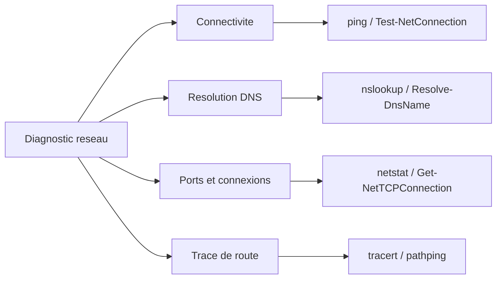

# Outils reseau de depannage

!!! info "Niveau : Intermediaire"

    Temps estime : 30 minutes

## Vue d'ensemble des outils



## ping et Test-NetConnection

### ping (ICMP)

L'outil de base pour tester la connectivite reseau. Envoie des paquets ICMP Echo Request et attend les Echo Reply.

```powershell
# Basic ping
ping SRV-DC01

# Continuous ping (stop with Ctrl+C)
ping -t SRV-DC01

# Ping with specific count and packet size
ping -n 10 -l 1472 SRV-DC01

# Ping with source IP specification
ping -S 192.168.10.10 192.168.20.1
```

| Parametre | Description |
|-----------|-------------|
| `-t` | Ping continu |
| `-n <count>` | Nombre de paquets |
| `-l <size>` | Taille du paquet en octets |
| `-w <timeout>` | Delai d'attente en ms |
| `-S <source>` | Adresse source (multihomed) |
| `-4` / `-6` | Forcer IPv4 / IPv6 |

!!! warning "Attention"

    Un echec de ping ne signifie pas necessairement que la machine est hors ligne.
    Le pare-feu Windows bloque les requetes ICMP par defaut sur le profil Public.
    Verifiez les regles de pare-feu avant de conclure.

### Test-NetConnection (PowerShell)

Remplacement moderne et plus riche de `ping`. Teste la connectivite ICMP et les ports TCP.

```powershell
# Basic connectivity test (ICMP + route)
Test-NetConnection -ComputerName SRV-DC01

# Test a specific TCP port
Test-NetConnection -ComputerName SRV-DC01 -Port 389

# Detailed output with route tracing
Test-NetConnection -ComputerName SRV-DC01 -TraceRoute

# Test common ports
Test-NetConnection -ComputerName SRV-DC01 -CommonTCPPort HTTP
Test-NetConnection -ComputerName SRV-DC01 -CommonTCPPort RDP
Test-NetConnection -ComputerName SRV-DC01 -CommonTCPPort SMB

# Quick test for multiple servers and ports
$servers = @("SRV-DC01", "SRV-FILE01", "SRV-WEB01")
$ports = @(53, 80, 389, 445, 3389)

foreach ($server in $servers) {
    foreach ($port in $ports) {
        $result = Test-NetConnection -ComputerName $server -Port $port -WarningAction SilentlyContinue
        [PSCustomObject]@{
            Server = $server
            Port   = $port
            Status = if ($result.TcpTestSucceeded) { "Open" } else { "Closed" }
        }
    }
}
```

## tracert et pathping

### tracert (Trace Route)

Affiche le chemin reseau entre la source et la destination, hop par hop.

```powershell
# Standard trace route
tracert SRV-DC01

# Without DNS resolution (faster)
tracert -d 192.168.20.1

# Limit maximum hops
tracert -h 15 SRV-DC01

# Force IPv4
tracert -4 SRV-DC01
```

Chaque ligne affiche :

- Le numero du hop
- Trois mesures de latence (en ms)
- L'adresse IP et/ou le nom DNS du routeur

!!! tip "Interpretation"

    - `* * * Request timed out` : le routeur ne repond pas a l'ICMP (filtre) ou le paquet est perdu
    - Une augmentation brutale de latence entre deux hops indique un goulot d'etranglement a ce niveau
    - Si le dernier hop ne repond pas mais que les precedents oui, le pare-feu de la destination bloque probablement l'ICMP

### pathping

Combine `tracert` et `ping` : trace la route puis mesure la perte de paquets sur chaque hop pendant 25 secondes par defaut.

```powershell
# Standard pathping
pathping SRV-DC01

# Without DNS resolution
pathping -n 192.168.20.1

# Custom period (number of pings per hop)
pathping -q 50 SRV-DC01
```

Le rapport final affiche pour chaque hop :

- **RTT** : temps aller-retour
- **Perdu/Envoye** : ratio de perte noeud par noeud et lien par lien

!!! tip "Quand utiliser pathping"

    `pathping` est l'outil ideal pour diagnostiquer une perte de paquets intermittente
    ou des micro-coupures. Il prend plus de temps que `tracert` mais donne des resultats
    beaucoup plus fiables.

## nslookup et Resolve-DnsName

### nslookup

Outil classique pour interroger les serveurs DNS.

```powershell
# Simple forward lookup
nslookup SRV-DC01.winopslab.local

# Reverse lookup
nslookup 192.168.10.10

# Query a specific DNS server
nslookup SRV-DC01.winopslab.local 192.168.10.10

# Query specific record types
nslookup -type=MX winopslab.local
nslookup -type=SRV _ldap._tcp.winopslab.local
nslookup -type=NS winopslab.local
nslookup -type=SOA winopslab.local
```

### Resolve-DnsName (PowerShell)

Alternative moderne a `nslookup`, avec un format de sortie objet.

```powershell
# Forward lookup
Resolve-DnsName -Name SRV-DC01.winopslab.local

# Specific record type
Resolve-DnsName -Name winopslab.local -Type MX
Resolve-DnsName -Name _ldap._tcp.winopslab.local -Type SRV

# Query a specific DNS server
Resolve-DnsName -Name SRV-DC01 -Server 192.168.10.10

# Force TCP (useful for large responses)
Resolve-DnsName -Name winopslab.local -Type ANY -DnssecOk -TcpOnly

# Check if DNS is resolving correctly for all DCs
Resolve-DnsName -Name _ldap._tcp.dc._msdcs.winopslab.local -Type SRV |
    Select-Object NameTarget, Port, Priority, Weight
```

## netstat et Get-NetTCPConnection

### netstat

Affiche les connexions reseau actives, les ports en ecoute et les statistiques reseau.

```powershell
# All connections with process name
netstat -anob

# Active connections only
netstat -an | findstr ESTABLISHED

# Listening ports only
netstat -an | findstr LISTENING

# Statistics by protocol
netstat -s

# Ethernet statistics
netstat -e
```

| Parametre | Description |
|-----------|-------------|
| `-a` | Toutes les connexions et ports en ecoute |
| `-n` | Adresses et ports en format numerique |
| `-o` | Affiche le PID du processus |
| `-b` | Affiche le nom de l'executable (necessite elevation) |
| `-s` | Statistiques par protocole |
| `-r` | Table de routage |

### Get-NetTCPConnection (PowerShell)

```powershell
# All TCP connections
Get-NetTCPConnection | Select-Object LocalAddress, LocalPort,
    RemoteAddress, RemotePort, State, OwningProcess

# Listening ports with process names
Get-NetTCPConnection -State Listen |
    Select-Object LocalPort,
    @{N='Process';E={(Get-Process -Id $_.OwningProcess).ProcessName}} |
    Sort-Object LocalPort

# Established connections to a specific server
Get-NetTCPConnection -State Established |
    Where-Object { $_.RemoteAddress -eq "192.168.10.10" }

# Find which process uses a specific port
Get-NetTCPConnection -LocalPort 443 |
    Select-Object LocalPort, RemoteAddress, State,
    @{N='Process';E={(Get-Process -Id $_.OwningProcess).ProcessName}}
```

### Get-NetUDPEndpoint (pour UDP)

```powershell
# List all UDP listening ports
Get-NetUDPEndpoint | Select-Object LocalAddress, LocalPort,
    @{N='Process';E={(Get-Process -Id $_.OwningProcess).ProcessName}} |
    Sort-Object LocalPort
```

## PortQry

Outil Microsoft gratuit pour tester la disponibilite des ports (TCP et UDP). Particulierement utile pour les ports UDP que `Test-NetConnection` ne teste pas.

```powershell
# Test a single TCP port
portqry -n SRV-DC01 -e 389 -p tcp

# Test a single UDP port
portqry -n SRV-DC01 -e 53 -p udp

# Test a range of ports
portqry -n SRV-DC01 -r 1:1024 -p tcp

# Test common AD ports
portqry -n SRV-DC01 -o 53,88,135,389,445,636,3268 -p tcp
```

| Resultat | Signification |
|----------|---------------|
| **LISTENING** | Le port accepte les connexions |
| **NOT LISTENING** | Le port est ferme |
| **FILTERED** | Le port est filtre par un pare-feu (pas de reponse) |

## Autres outils utiles

### ipconfig

```powershell
# Full network configuration
ipconfig /all

# Flush DNS cache
ipconfig /flushdns

# Display DNS cache
ipconfig /displaydns

# Release and renew DHCP lease
ipconfig /release
ipconfig /renew
```

### arp

```powershell
# Display ARP cache
arp -a

# Clear ARP cache
arp -d *

# PowerShell equivalent
Get-NetNeighbor | Where-Object { $_.State -ne "Unreachable" }
```

### route

```powershell
# Display routing table
route print

# PowerShell equivalent
Get-NetRoute | Select-Object DestinationPrefix, NextHop, InterfaceAlias, RouteMetric
```

## Tableau recapitulatif

| Outil | Couche OSI | Usage principal | Alternative PowerShell |
|-------|-----------|-----------------|----------------------|
| `ping` | 3 (Reseau) | Tester la connectivite ICMP | `Test-NetConnection` |
| `tracert` | 3 (Reseau) | Tracer le chemin reseau | `Test-NetConnection -TraceRoute` |
| `pathping` | 3 (Reseau) | Mesurer la perte de paquets par hop | - |
| `nslookup` | 7 (Application) | Interroger le DNS | `Resolve-DnsName` |
| `netstat` | 4 (Transport) | Connexions et ports actifs | `Get-NetTCPConnection` |
| `PortQry` | 4 (Transport) | Tester des ports TCP/UDP | `Test-NetConnection -Port` (TCP seulement) |
| `ipconfig` | 3 (Reseau) | Configuration IP | `Get-NetIPConfiguration` |
| `arp` | 2 (Liaison) | Table ARP | `Get-NetNeighbor` |
| `route` | 3 (Reseau) | Table de routage | `Get-NetRoute` |

## Points cles a retenir

- `Test-NetConnection` est l'outil PowerShell polyvalent : ICMP, test de port TCP et traceroute
- `pathping` est superieur a `tracert` pour diagnostiquer les pertes de paquets intermittentes
- `Resolve-DnsName` remplace avantageusement `nslookup` avec un format objet exploitable
- `Get-NetTCPConnection` offre une vue detaillee des connexions avec le processus proprietaire
- `PortQry` reste indispensable pour tester les ports UDP
- Toujours commencer par les tests simples (ping, DNS) avant les tests complexes

## Pour aller plus loin

- [Methodologie de depannage](methodologie.md) pour une approche structuree
- [Outils systeme de depannage](outils-systeme.md) pour les outils de diagnostic Windows
- [Configuration des interfaces reseau](../../reseau/tcpip/configuration-interfaces.md)
