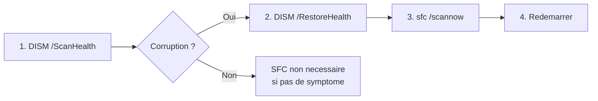

# Outils systeme de depannage

<span class="level-intermediate">Intermediaire</span> · Temps estime : 30 minutes

## Vue d'ensemble

Windows Server 2022 integre de nombreux outils natifs pour diagnostiquer les problemes systeme. Chaque outil a son domaine de predilection.


!!! example "Analogie"

    Les outils systeme de depannage sont comme la **boite a outils d'un plombier**. Chaque outil
    a un usage precis : la cle a molette (Gestionnaire des taches) pour les interventions rapides,
    le manometre (SFC/DISM) pour verifier la pression interne, et le carnet de maintenance
    (Moniteur de fiabilite) pour consulter l'historique des reparations.

## Gestionnaire des taches (Task Manager)

Le Gestionnaire des taches (`taskmgr.exe`) offre une vue instantanee de l'activite du systeme.

### Acces

- ++ctrl+shift+escape++ : acces direct
- ++ctrl+alt+delete++ > **Gestionnaire des taches**
- Clic droit sur la barre des taches > **Gestionnaire des taches**

### Onglets principaux

| Onglet | Contenu |
|--------|---------|
| **Processus** | Processus actifs tries par utilisation CPU, memoire, disque, reseau |
| **Performance** | Graphiques en temps reel (CPU, memoire, disque, reseau, GPU) |
| **Utilisateurs** | Processus par session utilisateur |
| **Details** | Vue detaillee avec PID, etat, priorite |
| **Services** | Etat des services Windows |

### Actions utiles

```powershell
# Get top 10 CPU-consuming processes
Get-Process | Sort-Object CPU -Descending | Select-Object -First 10 Name, Id, CPU,
    @{N='MemoryMB';E={[math]::Round($_.WorkingSet64/1MB,2)}}

# Get top 10 memory-consuming processes
Get-Process | Sort-Object WorkingSet64 -Descending | Select-Object -First 10 Name, Id,
    @{N='MemoryMB';E={[math]::Round($_.WorkingSet64/1MB,2)}}

# Kill a process by PID
Stop-Process -Id 1234 -Force

# Kill a process by name
Stop-Process -Name "notepad" -Force
```

Resultat :

```text
# Top 10 CPU-consuming processes
Name                Id      CPU MemoryMB
----                --      --- --------
w3wp              4872 1523.45   512.30
sqlservr          2108  987.23  2048.75
svchost           1024  245.67   128.40
lsass              812  112.34    98.20
csrss              456   89.12    42.10
WmiPrvSE          3256   78.45    85.60
dns               1580   56.78   156.30
dfsrs             2340   45.23    234.50
ismserv           3012   34.56    67.80
spoolsv           1876   23.45    45.20
```

!!! tip "Performance > Details"

    L'onglet **Details** permet de modifier la **priorite** d'un processus (clic droit > Definir la priorite)
    et l'**affinite CPU** (clic droit > Definir l'affinite). Utile pour limiter un processus
    gourmand a certains coeurs.

## msconfig (Configuration du systeme)

`msconfig` permet de modifier les options de demarrage du systeme pour le diagnostic.

```powershell
# Launch System Configuration
msconfig
```

### Onglets

| Onglet | Usage |
|--------|-------|
| **General** | Type de demarrage : Normal, Diagnostic, Selectif |
| **Demarrage** | Redirection vers le Gestionnaire des taches (Windows 10+) |
| **Services** | Activer/desactiver des services au demarrage |
| **Demarrage du systeme** | Options de demarrage avancees (mode sans echec) |
| **Outils** | Liens rapides vers d'autres outils de diagnostic |

### Demarrage en mode diagnostic

Le **demarrage diagnostic** charge uniquement les services et pilotes essentiels de Windows, sans les services tiers :

1. Lancer `msconfig`
2. Onglet **General** > cocher **Demarrage en mode diagnostic**
3. Redemarrer le serveur
4. Tester si le probleme persiste
5. Si le probleme disparait, reactiver les services un par un pour identifier le coupable

!!! warning "Attention"

    Ne pas utiliser le demarrage diagnostic sur un controleur de domaine en production.
    Les services AD DS, DNS et DHCP seront desactives, ce qui impactera tous les clients.

### Demarrage selectif

Permet de choisir finement quels composants charger :

- **Charger les services systeme** : services Windows de base
- **Charger les elements de demarrage** : applications au demarrage
- **Utiliser la configuration de demarrage d'origine** : restaurer la config par defaut

## msinfo32 (Informations systeme)

`msinfo32` fournit un inventaire complet du materiel et des logiciels du systeme.

```powershell
# Launch System Information
msinfo32

# Export system information to a text file
msinfo32 /nfo "C:\Diag\sysinfo.nfo"

# Export to text format
msinfo32 /report "C:\Diag\sysinfo.txt"
```

### Sections principales

| Section | Contenu |
|---------|---------|
| **Resume systeme** | OS, processeur, BIOS, memoire, carte mere |
| **Ressources materielles** | IRQ, DMA, E/S, conflits |
| **Composants** | Affichage, son, reseau, stockage, USB |
| **Environnement logiciel** | Pilotes, services, variables d'environnement, programmes |

### PowerShell equivalent

```powershell
# Comprehensive system information
Get-ComputerInfo | Select-Object CsName, WindowsProductName, OsVersion,
    OsArchitecture, CsTotalPhysicalMemory, CsProcessors, BiosBIOSVersion

# BIOS information
Get-CimInstance Win32_BIOS

# Processor details
Get-CimInstance Win32_Processor | Select-Object Name, NumberOfCores,
    NumberOfLogicalProcessors, MaxClockSpeed

# Installed drivers
Get-CimInstance Win32_PnPSignedDriver |
    Where-Object { $_.DriverVersion } |
    Select-Object DeviceName, DriverVersion, DriverDate |
    Sort-Object DeviceName
```

Resultat :

```text
# Get-ComputerInfo
CsName                : SRV-01
WindowsProductName    : Windows Server 2022 Standard
OsVersion             : 10.0.20348
OsArchitecture        : 64 bits
CsTotalPhysicalMemory : 17179869184

# Get-CimInstance Win32_Processor
Name                                NumberOfCores NumberOfLogicalProcessors MaxClockSpeed
----                                ------------- ------------------------ -------------
Intel(R) Xeon(R) Silver 4214R CPU            4                        8          2400
```

## SFC (System File Checker)

SFC verifie et repare les fichiers systeme proteges de Windows.

```powershell
# Scan and repair system files
sfc /scannow

# Scan only (no repair)
sfc /verifyonly

# Scan a specific file
sfc /scanfile=C:\Windows\System32\kernel32.dll

# Scan offline Windows installation (from WinPE/recovery)
sfc /scannow /offbootdir=D:\ /offwindir=D:\Windows
```

### Resultats possibles

| Message | Signification |
|---------|---------------|
| **No integrity violations found** | Aucun fichier corrompu detecte |
| **Successfully repaired** | Fichiers corrompus detectes et repares |
| **Found corrupt files but unable to fix** | Fichiers corrompus, reparation impossible (utiliser DISM) |

!!! tip "Journal SFC"

    Le resultat detaille se trouve dans `C:\Windows\Logs\CBS\CBS.log`.
    Filtrer les lignes contenant `[SR]` pour voir uniquement les resultats SFC.

```powershell
# Filter SFC results from CBS log
Select-String -Path "C:\Windows\Logs\CBS\CBS.log" -Pattern "\[SR\]" |
    Select-Object -Last 50
```

Resultat :

```text
# sfc /scannow
Beginning system scan.  This process will take some time.
Beginning verification phase of system scan.
Verification 100% complete.
Windows Resource Protection found corrupt files and successfully repaired them.
For online repairs, details are included in the CBS log file located at
C:\Windows\Logs\CBS\CBS.log.

# Select-String CBS.log
2026-02-20 14:22:10, Info   [SR] Verifying 100 components
2026-02-20 14:22:10, Info   [SR] Beginning Verify and Repair transaction
2026-02-20 14:22:35, Info   [SR] Repairing corrupted file [ml:248] C:\Windows\System32\drivers\ntfs.sys
2026-02-20 14:22:36, Info   [SR] Repair complete
```

## DISM (Deployment Image Servicing and Management)

DISM travaille au niveau de l'image Windows (WIM) et peut reparer le magasin de composants, prerequis pour que SFC fonctionne.

```powershell
# Check component store health
DISM /Online /Cleanup-Image /CheckHealth

# Scan component store for corruption
DISM /Online /Cleanup-Image /ScanHealth

# Repair component store (downloads repairs from Windows Update)
DISM /Online /Cleanup-Image /RestoreHealth

# Repair using a local source (ISO mounted as D:)
DISM /Online /Cleanup-Image /RestoreHealth /Source:D:\Sources\install.wim

# Clean up old component versions (reduce disk usage)
DISM /Online /Cleanup-Image /StartComponentCleanup

# List installed roles and features
DISM /Online /Get-Features | findstr "State"
```

### Ordre d'utilisation



!!! warning "Ordre important"

    Toujours executer **DISM /RestoreHealth** avant **sfc /scannow** si SFC a echoue.
    DISM repare le magasin de composants, ce qui permet ensuite a SFC de restaurer
    les fichiers corrompus a partir de ce magasin repare.

## Moniteur de fiabilite (Reliability Monitor)

Le Moniteur de fiabilite fournit un historique des evenements critiques sous forme de chronologie.

```powershell
# Launch Reliability Monitor
perfmon /rel
```

### Ce qu'il affiche

| Categorie | Evenements suivis |
|-----------|------------------|
| **Defaillances d'applications** | Plantages d'applications, arrets inattendus |
| **Defaillances de Windows** | BSOD, arrets inattendus du systeme |
| **Defaillances diverses** | Pilotes, services |
| **Avertissements** | Evenements non critiques mais significatifs |
| **Informations** | Installations, mises a jour, desinstallations |

L'indice de stabilite (de 1 a 10) donne une vue synthetique de la sante du systeme sur les dernieres semaines.

### PowerShell equivalent

```powershell
# Query reliability data
Get-CimInstance Win32_ReliabilityRecords |
    Where-Object { $_.EventIdentifier -ne 0 } |
    Select-Object -First 20 TimeGenerated, SourceName, EventIdentifier, Message |
    Format-Table -AutoSize

# Check system stability index
Get-CimInstance Win32_ReliabilityStabilityMetrics |
    Select-Object -First 7 TimeGenerated, SystemStabilityIndex
```

Resultat :

```text
# Win32_ReliabilityStabilityMetrics
TimeGenerated          SystemStabilityIndex
-------------          --------------------
2026-02-20 00:00:00    7.23
2026-02-19 00:00:00    7.45
2026-02-18 00:00:00    8.12
2026-02-17 00:00:00    8.56
2026-02-16 00:00:00    9.01
2026-02-15 00:00:00    9.34
2026-02-14 00:00:00    9.78
```

## Autres outils complementaires

### Windows Memory Diagnostic

```powershell
# Schedule memory diagnostic (requires reboot)
mdsched.exe
```

Redemarre le serveur et effectue un test de la memoire physique. Le resultat est affiche dans les Event Logs (source : MemoryDiagnostics-Results).

### Driver Verifier

```powershell
# Launch Driver Verifier Manager
verifier

# Enable standard verification on all unsigned drivers
verifier /standard /all

# Check current status
verifier /querysettings

# Disable Driver Verifier
verifier /reset
```

!!! danger "Attention"

    Driver Verifier peut provoquer des BSOD si un pilote defectueux est detecte.
    Ne l'utilisez qu'en environnement de test ou lorsque vous soupconnez
    un probleme de pilote specifique.

### Informations de diagnostic PowerShell

```powershell
# Check Windows Update history
Get-HotFix | Sort-Object InstalledOn -Descending | Select-Object -First 10

# Check last boot time
(Get-CimInstance Win32_OperatingSystem).LastBootUpTime

# Verify system files integrity status
Get-WindowsUpdateLog  # Generates readable WindowsUpdate.log on desktop
```

## Points cles a retenir

- Le **Gestionnaire des taches** est le premier reflexe pour identifier un processus problematique
- **msconfig** permet un demarrage diagnostic pour isoler les problemes de services tiers
- **msinfo32** fournit un inventaire complet du systeme, utile pour le support
- **SFC** repare les fichiers systeme corrompus ; **DISM** repare le magasin de composants
- Toujours executer DISM avant SFC si SFC echoue a reparer
- Le **Moniteur de fiabilite** offre une chronologie visuelle des incidents sur plusieurs semaines

!!! example "Scenario pratique"

    **Contexte :** Nathalie, administratrice systeme, constate que le serveur SRV-01 affiche des
    erreurs applicatives aleatoires depuis l'installation d'une mise a jour Windows la semaine
    precedente. Certaines DLL semblent corrompues.

    **Diagnostic :**

    1. Nathalie verifie d'abord le Moniteur de fiabilite pour voir la chronologie :

    ```powershell
    perfmon /rel
    ```
    L'indice de stabilite est passe de 9.5 a 6.2 depuis le jour de la mise a jour.

    2. Elle lance DISM pour verifier le magasin de composants :

    ```powershell
    DISM /Online /Cleanup-Image /ScanHealth
    ```
    Resultat : `Component Store corruption detected.`

    3. Elle repare le magasin de composants :

    ```powershell
    DISM /Online /Cleanup-Image /RestoreHealth
    ```

    4. Puis elle lance SFC pour reparer les fichiers systeme :

    ```powershell
    sfc /scannow
    ```
    Resultat : 3 fichiers corrompus detectes et repares avec succes.

    5. Apres redemarrage, les erreurs disparaissent et l'indice de stabilite remonte progressivement.

    **Resolution :** L'enchainement DISM puis SFC a corrige les fichiers corrompus. Nathalie documente l'incident et prevoit de surveiller les prochaines mises a jour plus attentivement.

!!! danger "Erreurs courantes"

    - **Lancer SFC avant DISM** : si le magasin de composants est corrompu, SFC ne peut pas
      reparer car il n'a pas de source saine. Toujours faire DISM /RestoreHealth d'abord
    - **Utiliser msconfig en production sur un DC** : le demarrage diagnostic desactive les
      services AD DS, DNS et DHCP, ce qui impacte tout le domaine
    - **Ignorer le Moniteur de fiabilite** : cet outil offre une vue chronologique claire
      qui permet de correler un incident avec un evenement (installation, mise a jour, crash)
    - **Tuer un processus systeme sans comprendre** : arreter `csrss.exe` ou `lsass.exe`
      provoque un ecran bleu immediat. Verifiez toujours la nature du processus avant de l'arreter

## Pour aller plus loin

- [Methodologie de depannage](methodologie.md) pour une approche structuree
- [Outils reseau de depannage](outils-reseau.md) pour le diagnostic reseau
- [Analyse des ecrans bleus](blue-screen.md) pour le diagnostic avance des BSOD
